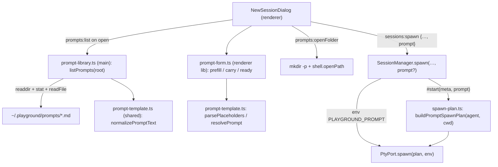

# Agent Prompts Design

**Spec**: `.specs/features/agent-prompts/spec.md`
**Context**: `.specs/features/agent-prompts/context.md`
**Status**: Approved (re-checked after pty-host merged)

**Constraints honoured:** AD-024 (the renderer never reads the filesystem; prompts are listed and
read in main). AD-019/AD-051 (the app already passes per-session env vars to the PTY; the prompt
rides the same channel). AD-007 does not apply (it governs the headless runner, not the PTY).
Confirmed lessons L-005 (keep real-fs tests few and fast) and L-009 (pin spec-derived constants with
literals) apply. Memory: fixtures under `os.tmpdir()` clean up with async `rm`, never `rmSync`
(the profile path has `á`).

**Built on `pty-host` (PR #157, merged 2026-10-02, AD-053):** node-pty runs in a `utilityProcess`;
`PtyPort` is an interface served by `PtyHostClient` (`spawn(plan, env?): Promise<PtyHandle>`), and
`SessionManager.spawn`/`respawn`/`duplicate`/`#start` are `async`. The env a session passes reaches
the host as `buildPtyEnv({...process.env, ...env})` (`src/main/terminal-env.ts:20`) over a
`MessagePort` (structured clone, so a multi-line value survives unchanged) and node-pty's env block.
A failed spawn logs `file`/`args`/`cwd` only (PTYH spec), so the prompt carried in env is never
logged. This design was re-checked against `main` at `6d96ae4`; nothing in its approach changed.

---

## Empirical findings (2026-10-02, zero-token probes, kept out of the tree)

Target: an argv-echo script; Claude Code 2.1.287 (`claude.exe`, native), pwsh 7.6.6
(`$PSNativeCommandArgumentPassing = Windows`). Prompt under test:
`linha 1: it's $HOME & 100% "done" `tick` ^caret |pipe <lt> >gt (p) ;semi #hash @at {b} ação`
+ `\n` + `linha 2 %PATH% !bang!`.

| Hosting | Result |
| ------- | ------ |
| pwsh, prompt read from an env var (`$p = $env:PLAYGROUND_PROMPT; … & node echo.js $p`) → `.exe` | **PASS**: one argv, byte-identical, newline included |
| pwsh, prompt as a single-quoted literal inside `-Command` → `.exe` | PASS |
| pwsh, env var → `.cmd` shim | **FAIL**: truncated at the newline, `"` removed (cmd batch rules) |
| `cmd /V:ON /C … "!VAR!"` → `.exe` | not usable: a `"` in the value ends the quoted argument; `%VAR%` stops at a newline |
| `claude "- revise isto" --zz-unknown` | `error: unknown option '- revise isto'`: a prompt starting with `-` is parsed as an option |
| `claude --settings x.json -- "- item"` | parse succeeds (fails later on the missing settings file): `--` ends options, and flags before it still apply |
| pwsh `& node echo.js --flag v -- $p` | `--` is forwarded to the native command unchanged, both bare and quoted |
| `Remove-Item Env:PLAYGROUND_PROMPT` before the call | the agent's child processes see the variable **unset** |

Consequences for the spec, applied in this commit:
1. **APR-24** holds for agents whose command resolves to an executable. A `.cmd`/`.bat` shim (e.g.
   `opencode` here) re-parses its arguments with batch rules, and no hosting fixes that. A new
   Out-of-Scope row records it.
2. **The prompt follows `--`** (`command args -- <prompt>`), so a template that starts with a
   Markdown list item still works. The "end `args` with a flag" assumption is withdrawn: an agent
   whose CLI takes no positional prompt after `--` is not supported in v1.
3. **A launch with a prompt is hosted in `pwsh` whatever the default shell**, because cmd cannot
   carry the text. The 8000-character cap stays, now justified by the 32,767-character
   `CreateProcess` limit that pwsh's command line to the agent must fit in.
4. The dialog's existing button reads **Spawn**, not "Spawn agent"; the spec now names it so.

---

## Approaches considered

| | Approach | Verdict |
| - | -------- | ------- |
| **A** | **Env var + pwsh host.** The PTY gets `PLAYGROUND_PROMPT=<text>`; the pwsh `-Command` line moves it into a local, removes the variable, then calls `& <command> <args> -- $p`. | **Chosen.** The prompt never enters a command line the app has to quote, so no quoting rule can corrupt it; the measured PASS above. |
| B | Quote the prompt into the `-Command` text with `quotePwsh` | Works (PASS) but puts up to 8000 characters through two quoting layers (node-pty's command line, then pwsh's parser), and every future quoting change risks the prompt. |
| C | Write the prompt to a temp file; `& claude -- (Get-Content -Raw $f)` | Adds a file lifecycle (delete when?) and a disk write of possibly sensitive text, for no gain over A. |

---

## Architecture Overview



The renderer resolves the prompt and sends the **resolved text**. That is what makes APR-35 hold:
main never re-reads the file between preview and spawn. Main re-checks the text before spawning.

---

## Code Reuse Analysis

### Existing Components to Leverage

| Component | Location | How to Use |
| --------- | -------- | ---------- |
| Workflows folder convention | `src/main/index.ts:747`, `src/main/workflow-loader.ts:56` (`discoverWorkflows`) | Same root (`~/.playground`), same "missing folder = empty list" and "broken entry listed with error" semantics |
| `buildSpawnPlan` quoting | `src/main/spawn-plan.ts` (`quotePwsh`) | `buildPromptSpawnPlan` reuses `quotePwsh` for `command`/`args`; the prompt itself is never quoted |
| Hook `--settings` injection | `session-manager.ts` `#withHookSettings` | Applied to the agent **before** the prompt plan, so `--settings` precedes `--` (APR-31) |
| Per-session env channel | `session-manager.ts` `#start` → `port.spawn(plan, env)` | Adds `PLAYGROUND_PROMPT` beside the activity token / task URL |
| `taskIdFromBranch`-derived `LevelOption.taskId` | `src/renderer/src/lib/session-levels.ts:6` | Pre-fills `taskId` under "From branch" (APR-20) |
| Pinned task titles | `NewSessionDialog.tsx:89` (`tasks.find(...).details?.title`) | Pre-fills `taskTitle` |
| Dialog chassis and classes | `NewSessionDialog.tsx`, `StartWorkDialog.css`, `NewSessionDialog.css` | Step 2 reuses `dialog-field-label`, `dialog-input`, `dialog-path-preview`, `dialog-btn-ghost/primary` |
| Typed IPC | `src/shared/ipc-contract.ts`, `handle()` in `index.ts` | Two new channels, one extended request |

### Integration Points

| System | Integration Method |
| ------ | ------------------ |
| IPC | New `prompts:list`, `prompts:openFolder`; `sessions:spawn` request gains `prompt?: string` |
| Config | None. Nothing about prompts is persisted (APR-34) |
| PTY host (`feature/pty-host`) | Unaffected contract: `PtyPort.spawn(plan, env)` |

---

## Components

### `prompt-template.ts` (shared, pure)

- **Purpose**: Parse, resolve and normalise prompt text. Used by main (normalise, bound check) and
  the renderer (parse, resolve, preview).
- **Location**: `src/shared/prompt-template.ts` (+ `.test.ts`)
- **Interfaces**:
  - `PLACEHOLDER = /\{\{([A-Za-z][A-Za-z0-9_]*)\}\}/g`
  - `CONTEXT_PLACEHOLDERS = ['taskId', 'taskTitle', 'branch', 'worktree'] as const`
  - `PROMPT_MAX_CHARS = 8000`, `PROMPT_FILE_MAX_BYTES = 16 * 1024`
  - `parsePlaceholders(template: string): string[]`: distinct names, first-appearance order (APR-12/13/16)
  - `resolvePrompt(template: string, values: Record<string, string>): string`: one `replace` pass with the global regex and a replacer function, so inserted values are never rescanned (APR-14/15)
  - `normalizePromptText(raw: string): string`: strip a leading ``, `\r\n` → `\n`, `trim()` (APR-04)
- **Dependencies**: none
- **Reuses**: nothing; new seam

### `prompt-library.ts` (main)

- **Purpose**: List the prompt files and make the folder exist on request.
- **Location**: `src/main/prompt-library.ts` (+ `.test.ts` over a real temp dir)
- **Interfaces**:
  - `listPrompts(root: string): Promise<PromptEntry[]>`: `readdir(root, { withFileTypes: true })`; `ENOENT` → `[]` (APR-05); keep `isFile()` entries matching `/\.md$/i` (APR-01/02); per file `stat` → over `PROMPT_FILE_MAX_BYTES` → broken `larger than 16 KiB`; `readFile(…, 'utf8')` failure → broken `unreadable: <message>`; normalised empty → broken `empty` (APR-06); sorted by `name.localeCompare(other, undefined, { sensitivity: 'base' })` (APR-03)
  - `ensurePromptsFolder(root: string): Promise<void>`: `mkdir(root, { recursive: true })`
- **Dependencies**: `node:fs/promises`; `normalizePromptText`
- **Reuses**: the workflow discovery semantics

### `buildPromptSpawnPlan` (main, pure)

- **Purpose**: The pwsh launch that hands the env-carried prompt to the agent after `--`.
- **Location**: `src/main/spawn-plan.ts` (+ cases in `spawn-plan.test.ts`)
- **Interfaces**:
  - `PROMPT_ENV = 'PLAYGROUND_PROMPT'`
  - `buildPromptSpawnPlan(agent: AgentDef, cwd: string): SpawnPlan`: always `pwsh.exe`, args `['-NoExit', '-Command', autoCommand]` where
    `autoCommand = "$p = $env:PLAYGROUND_PROMPT; Remove-Item Env:PLAYGROUND_PROMPT; & <quotePwsh(command)> <args…> -- $p"`.
    The call operator `&` is always used here, so the command token's quoting never changes its meaning.
- **Dependencies**: `quotePwsh` (module-private today; stays private, same file)
- **Reuses**: the `-NoExit` keep-shell-live convention (APR-32)

### `SessionManager` changes

- **Location**: `src/main/session-manager.ts`
- **Interfaces**:
  - `async spawn(agentName, cwd, adhocCommand?, task?, prompt?: string): Promise<SessionView>`. With a prompt: throw if `adhocCommand` is set, if the prompt is empty after `trim()`, or if it is longer than `PROMPT_MAX_CHARS`. It rejects before `#start`, so nothing is persisted (as PTYH-14 already guarantees for a failed spawn).
  - `async #start(meta, prompt?: string)`: when `prompt` is set, the plan is `buildPromptSpawnPlan(hooked agent, cwd)` and the env gains `[PROMPT_ENV]: prompt`. Otherwise it behaves as today.
  - `respawn`/`duplicate` call `#start(meta)` with no prompt, so APR-33 holds by construction. `PersistedSession` is unchanged (APR-34).
- **Reuses**: `#resolve`, `#hookable`, `#withHookSettings`

### IPC + main wiring

- **Location**: `src/shared/ipc-contract.ts`, `src/main/index.ts`, preload typing as for other channels
- `'prompts:list': { req: void; res: PromptEntry[] }` → `listPrompts(promptsRoot)`
- `'prompts:openFolder': { req: void; res: void }` → `ensurePromptsFolder` then `shell.openPath(promptsRoot)` (APR-08)
- `'sessions:spawn'` req adds `prompt?: string`, passed through
- `promptsRoot = join(homedir(), '.playground', 'prompts')`, next to `workflowsRoot`

### `prompt-form.ts` (renderer lib, pure)

- **Purpose**: The variables form's state rules, kept out of the component so they are testable.
- **Location**: `src/renderer/src/lib/prompt-form.ts` (+ `.test.ts`)
- **Interfaces**:
  - `interface PromptContext { taskId: number | null; taskTitle: string | null; branch: string | null; worktree: string }`
  - `prefillValues(names: string[], ctx: PromptContext): Record<string, string>`: the context names from `ctx` (`String(taskId)`, title, branch, worktree), `''` when unknown, `''` for any other name (APR-19..22)
  - `carryValues(prev: Record<string, string>, names: string[], ctx: PromptContext): Record<string, string>`: keep `prev[name]` for shared names, prefill the rest, drop the others (APR-27/28)
  - `formBlockers(values, names, resolved): { emptyFields: string[]; tooLong: number | null }`: Spawn is enabled iff both are empty/null (APR-23/26)
  - `promptContext(task, option | null, cwd, tasks)`: `taskId` = hand-picked task id, else the selected chip's `taskId`; `taskTitle` = the hand-picked title, else the pin's cached title; `branch` = the chip's `branch` (null for workspace level or a detached folder); `worktree` = `cwd`

### `NewSessionDialog` changes

- **Location**: `src/renderer/src/components/NewSessionDialog.tsx` / `.css`
- **State**: `prompts: PromptEntry[]` (loaded once on mount via `prompts:list`), `promptName: string | null` (`null` = None), `step: 1 | 2`, `values: Record<string, string>`.
- **Step 1**: a **Prompt** field after **Task**, shown only for registry agents (APR-09/10). It holds a wrap of chips: **None**, then one per prompt. Broken prompts are disabled chips with the reason in faint text (APR-06/07). An **Open prompts folder** text button sits at the label's right and reloads the list when the window regains focus. The primary button reads **Next** when the chosen prompt has placeholders, otherwise **Spawn** (APR-17/29). With **None** selected the dialog is exactly today's (APR-11).
- **Step 2**: a header line `Prompt · <name>`, then one row per placeholder: a mono `{{name}}` label and a single-line `dialog-input` (`autoFocus` on the first empty field). A line break in input is impossible because `<input>` drops it (APR-18). Below is a **Will run** card: the `command args --` line, then the resolved prompt in a `pre-wrap` mono block (`max-height: 180px`, scrolls), updated live (APR-25). Under it sits the over-length notice (APR-26). The footer has **Back** (ghost), **Cancel** and **Spawn**.
- **Spawn** sends `onSpawn(agent.name, cwd, undefined, link, resolved)`. `App.tsx`'s `spawnSession` passes `prompt` through to the IPC call.

---

## Data Models

```typescript
/** A discovered prompt file (`prompts:list`). */
export type PromptEntry =
  | { name: string; template: string }
  | { name: string; error: string } // 'empty' | 'larger than 16 KiB' | `unreadable: ${message}`
```

No persisted model changes.

---

## Error Handling Strategy

| Error Scenario | Handling | User Impact |
| -------------- | -------- | ----------- |
| Folder missing | `listPrompts` → `[]` | Prompt field shows only None |
| File unreadable / empty / > 16 KiB | Listed as broken | Disabled chip with the reason |
| `prompts:list` IPC rejects (unexpected) | Caught, logged; `prompts = []` | Same as missing folder; spawning without a prompt still works |
| Resolved prompt > 8000 chars | Spawn disabled in renderer; main throws as a backstop | Notice in step 2; never reaches a spawn |
| `pwsh.exe` missing (default shell `cmd`, prompt chosen) | `port.spawn` throws → existing spawn-failure toast; nothing persisted | Toast with the spawn error |
| Agent is a `.cmd`/`.bat` shim | Not detected; documented limitation | Prompt may arrive truncated (README states it) |

---

## Risks & Concerns

| Concern | Location (file:line) | Impact | Mitigation |
| ------- | -------------------- | ------ | ---------- |
| `SessionManager.spawn` grows a 5th positional param | `src/main/session-manager.ts:145` | Readability | Matches the file's existing idiom and the IPC handler's destructuring (`index.ts:699`); an options object is a refactor outside this feature. |
| A prompt starting with `-` would be taken as an option | measured above | Spawn fails with `unknown option` | `--` before the prompt (APR-30, amended) |
| Batch-shim agents re-parse the prompt | measured above (`opencode.cmd`) | Truncated or altered prompt | Out of Scope row + README note; not silently "fixed" |
| Prompt text visible in the process environment until pwsh removes it | `buildPromptSpawnPlan` | The agent's children never see it; the pwsh process does, briefly | `Remove-Item Env:PLAYGROUND_PROMPT` runs before the agent starts (measured) |
| Real-fs tests for `listPrompts` under a non-ASCII temp path | memory `rmsync-noop-nonascii-paths` | Leaked fixtures | Async `rm(dir, { recursive: true, force: true })` in `afterEach` |
| The renderer has no component tests | convention (AD-004) | Dialog wiring is hand-verified only | All decision logic lives in `prompt-form.ts` / `prompt-template.ts` with unit tests; the dialog only binds it |

---

## Tech Decisions

| Decision | Choice | Rationale |
| -------- | ------ | --------- |
| Prompt transport | Env var `PLAYGROUND_PROMPT`, consumed and removed by the pwsh line | Approach A above; no quoting layer touches the text |
| Host shell for prompt launches | Always `pwsh` | cmd cannot carry newlines or `"` in one argument (measured) |
| Who resolves the prompt | The renderer, from the text it previewed | APR-35 by construction; main only bounds-checks |
| When prompts are listed | On dialog mount, and again on window focus after **Open prompts folder** | On-demand discovery like workflows, without a watcher |
| Placement of the Prompt field | After Task, before Will run | It describes what the session will do; Agent and directory stay first as in the handoff |
