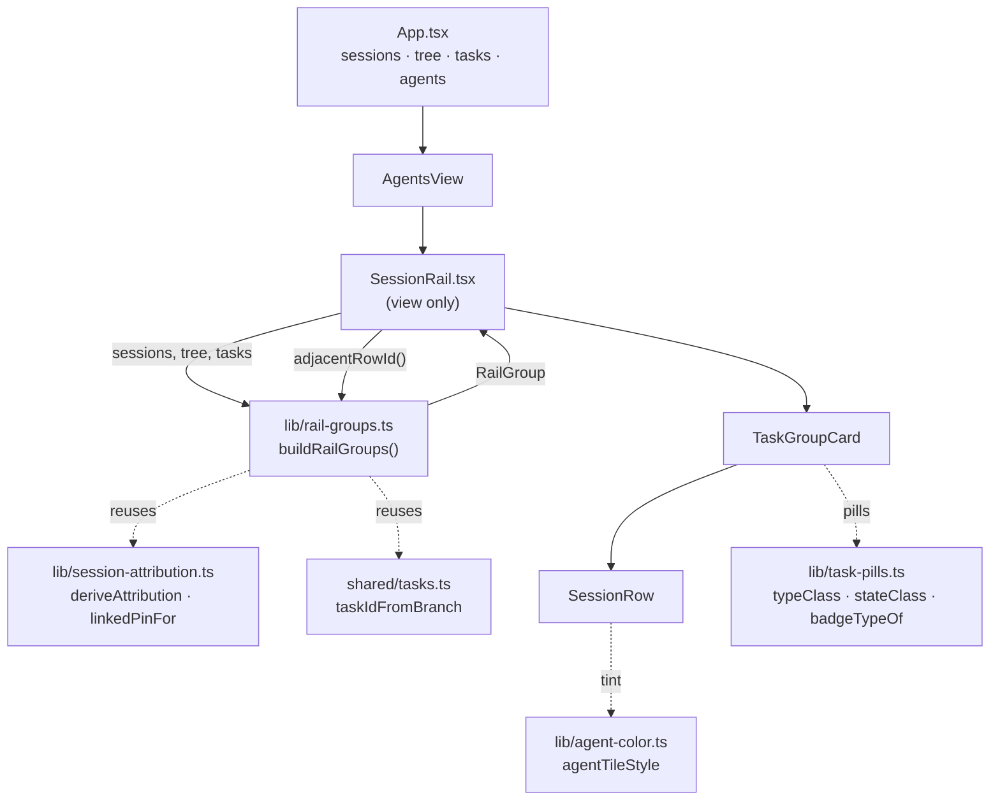

# Agents Rail v2 Design

**Spec**: `.specs/features/agents-rail-v2/spec.md`
**Design source of truth**: `design/handoff/DESIGN_HANDOFF_AGENTS_RAIL_V2.md`
**Base**: `feature/agents-rail-v2` @ `83e67ce`
**Status**: Draft

---

## Architecture Overview

One pure module owns every decision; the component owns only markup, CSS and
focus. `SessionRail` stops deriving anything — it renders a `RailGroup[]` and
forwards clicks.



**The seam rule:** if a behaviour is named by an acceptance criterion, it is
decided in `rail-groups.ts` and asserted in `rail-groups.test.ts`. The component
may not re-derive a label, a status, a tooltip, an aria-label or a traversal
order — otherwise the AC moves behind the untested boundary, which is the exact
failure the spec's Assumption #4 exists to prevent.

---

## Approach Options

| Approach | Verdict |
| -------- | ------- |
| **A. Pure module + rewritten `SessionRail`** — `buildRailGroups()` returns a fully-resolved view model; the component is declarative | **Chosen.** Puts all 28 ACs except pure CSS behind `npm test`, and matches the repo's newest precedent (`terminal-keys.ts` + 320 lines of tests, `workspace-collapse.ts`, both merged this month) |
| **B. A `useRailGroups` React hook** | Rejected. Identical logic, but hooks are unrenderable in this repo (no jsdom, no testing-library), so the whole AC surface would sit behind the untested boundary — directly against the approved Assumption #4. `useMemo` is not worth it: the rail is tens of rows, and `App.tsx` already re-renders on every session tick |
| **C. Keep `SessionCard`, wrap it in group containers** | Rejected. The handoff removes the card's branch line, preview, session title, 30×30 tile and text buttons — nearly everything it renders. "Shrinking" it is a rewrite that also inherits the old CSS, and it still does not produce the §4.4 row |

---

## Code Reuse Analysis

### Existing Components to Leverage

| Component | Location | How to Use |
| --------- | -------- | ---------- |
| `deriveAttribution` | `src/renderer/src/lib/session-attribution.ts:23` | Import verbatim — already resolves `cwd → {branch, taskId, detached}`. The grouping rules in handoff §2.2 are exactly this function |
| `linkedPinFor` | `src/renderer/src/lib/session-attribution.ts:35` | Import verbatim — first-match-wins pin lookup, already mirrors `App.tsx`'s cross-org collision rule |
| `taskIdFromBranch` | `src/shared/tasks.ts:53` | Reached through `deriveAttribution`, never called directly. **Note:** as of PR #81 it scans only the branch's **last** path segment, so fixtures must use realistic nested branches (`user/otavio/24173-slug`) |
| `typeClass` / `stateClass` / `badgeTypeOf` | `src/renderer/src/lib/task-pills.ts` | Group header pills. Supersedes the handoff's stale `Bug → --red` parenthetical (spec Assumptions) |
| `agentTileStyle` | `src/renderer/src/lib/agent-color.ts:20` | Row tile tint. Handles the unknown-agent fallback (RAIL-27) by returning `undefined`, so the CSS base tile shows through |
| `.task-pill` base | `src/renderer/src/styles/global.css` | Pills are already centralized; the group header reuses the class and only overrides size |
| `@keyframes pulse` | `src/renderer/src/components/RunDetail.css:14`, `WorkflowsView.css:21` | The running dot's pulse. **Already duplicated twice** — see Risks |
| `Icon` glyphs | `src/renderer/src/components/Icon.tsx` | `git-fork` (orphan header), `stop-square`, `refresh`, `trash` all exist; no new glyph needed |
| Rail header / warning / empty CSS | `src/renderer/src/components/SessionRail.css:1-95` | Kept byte-for-byte — handoff §3 says unchanged |

### Integration Points

| System | Integration Method |
| ------ | ------------------ |
| `AgentsView.tsx` | **No prop change.** `SessionRail`'s existing props (`sessions`, `tree`, `agents`, `tasks`, `selectedId`, `onSelect`, `onStop`, `onRespawn`, `onRemove`, `onNew`) are exactly what v2 needs. The call site is untouched |
| `SessionView` / `AppConfig` | **No schema change.** Grouping is derived per handoff §2 |
| CDP smoke scripts | Three existing assertions target rail internals this change removes — repaired, not deleted (see Risks) |

---

## Components

### `rail-groups` (new)

- **Purpose**: Turn `(sessions, tree, tasks)` into the rail's complete view model — groups, rows, labels, statuses, tooltips, aria-labels and traversal order.
- **Location**: `src/renderer/src/lib/rail-groups.ts`
- **Interfaces**:
  - `buildRailGroups(sessions: SessionView[], tree: WorkspaceNode[], tasks: PinnedTaskView[]): RailGroup[]` — RAIL-01..15, 19, 20, 25, 28
  - `statusClass(status: RowStatus): string` — `'path missing' → 'missing'`; mirrors `task-pills.ts`'s class-returning convention
  - `flatRows(groups: RailGroup[]): RailRow[]` — visual order, the keyboard traversal order
  - `adjacentRowId(groups: RailGroup[], fromId: string, delta: 1 | -1): string | null` — RAIL-21/22; clamps at both ends, returns `null` when `fromId` is unknown
- **Dependencies**: `session-attribution.ts`, shared types only. No React import — it must stay callable from a plain `.test.ts`.
- **Reuses**: `deriveAttribution`, `linkedPinFor`

**Build algorithm** (handoff §2, stable by construction):

1. Walk `sessions` in persisted order; never sort.
2. `deriveAttribution(tree, session.cwd)` → `{branch, taskId, detached}`.
3. Key = `task:<taskId>` when `taskId !== null`, else `session:<id>` (RAIL-02, RAIL-06).
4. First key occurrence creates the group and fixes its header data from *that* session's worktree (RAIL-03, RAIL-04); later sessions only append rows.
5. After the walk, resolve each group's rows: ordinal-suffix any agent name appearing ≥2 times in that group (RAIL-13), compute status, tooltip and actions per row.

Because step 1 is an in-order walk and nothing re-sorts, a status change cannot
reorder anything (RAIL-05) — the property is structural, not defended by a
comparator.

### `SessionRail` (rewrite)

- **Purpose**: Render the group list and own focus.
- **Location**: `src/renderer/src/components/SessionRail.tsx`
- **Interfaces**: props unchanged.
- **Structure**: `<aside>` → header (kept) → warning (kept) → `<div className="session-rail-list" role="listbox" aria-label="Agent sessions">` → `TaskGroupCard[]`.
- **Focus model**: roving `tabIndex`. One `focusedId` state (seeded from `selectedId`, falling back to the first row) plus a `Map<string, HTMLButtonElement>` ref. `ArrowUp`/`ArrowDown` call `adjacentRowId` then `.focus()`; `Enter`/`Space` call `onSelect`. Focus moves, selection does not follow (spec Assumption) — arrowing does not remount `TerminalPane`.

### `TaskGroupCard` (new, same file)

- **Purpose**: One group card — header variant plus its rows.
- **Renders**: `role="group"` + `aria-label` from the model. Three header variants, chosen on `kind` and `details`: task-with-details (type pill · `#id` · state pill · 2-line title), task-without-details (`#id` · branch), orphan (fork glyph · label · note). Accent border when any row is selected (RAIL-18).

### `SessionRow` (new, same file)

- **Purpose**: One session — tile, label, status, dot, actions.
- **Renders**: `<button role="option" aria-selected>` containing the 22×22 tinted tile, label, short status, dot, and the model's `actions` as 24×24 icon buttons with `aria-label`s. Every action handler calls `stopPropagation()` (RAIL-17).

### `smoke-rail-v2` (new)

- **Purpose**: Cover what unit tests structurally cannot — real DOM structure, click-to-select, action isolation, arrow-key traversal.
- **Location**: `scripts/smoke-rail-v2.mjs`
- **Reuses**: the CDP driver shape of `scripts/smoke-agent-config.mjs` (`pageTarget`, `evaluate`, `check`).

---

## Data Models

```typescript
export type RowStatus = 'running' | 'stopped' | 'path missing'
export type RowAction = 'stop' | 'respawn' | 'remove'
export type OrphanReason = 'missing' | 'detached' | 'untagged'

export interface RailRow {
  /** session.id — selection key and focus-map key. */
  id: string
  session: SessionView
  /** Agent name, ordinal-suffixed when ambiguous inside the group (RAIL-13). */
  label: string
  status: RowStatus
  /** `<session.title> · <branch>`, cwd substituted when detached (RAIL-15). */
  tooltip: string
  /** In render order (RAIL-16). */
  actions: RowAction[]
}

interface RailGroupBase {
  /** `task:<id>` or `session:<id>` — the React key. */
  key: string
  rows: RailRow[]
  /** role="group" aria-label (RAIL-19). */
  ariaLabel: string
}

export interface TaskGroup extends RailGroupBase {
  kind: 'task'
  taskId: number
  /** From the group's FIRST session's worktree; also the header title attr. */
  branch: string
  /** Null when the id is unpinned or details have not resolved (RAIL-08). */
  details: WorkItemDetails | null
}

export interface OrphanGroup extends RailGroupBase {
  kind: 'orphan'
  reason: OrphanReason
  /** Branch, or the cwd folder leaf when detached (RAIL-09..11). */
  label: string
  /** `detached · <folder>` | `untagged worktree` | `worktree path missing`. */
  note: string
}

export type RailGroup = TaskGroup | OrphanGroup
```

`RowStatus` is a closed union deliberately sized to grow: adding `'shell'` later
(the out-of-scope `agentLive` work) is one member plus one `statusClass` case,
with every call site already exhaustive.

---

## Error Handling Strategy

| Scenario | Handling | User Impact |
| -------- | -------- | ----------- |
| Task ID resolves, pin absent or details unfetched | `details: null` → header variant B (`#id` + branch) | Sees the id and branch; pills appear when the fetch lands |
| Session `cwd` matches no worktree | Orphan group, reason `detached` | Single row under `detached · <folder>` |
| Worktree resolves, branch carries no id | Orphan group, reason `untagged` | Single row under `untagged worktree` |
| `pathMissing` and no task | Orphan group, reason `missing` — outranks `detached`/`untagged` | Red note, Remove-only row |
| `pathMissing` **and** a task resolves | Stays in its task group; row status `path missing` | Red row status inside the normal group |
| `running` **and** `pathMissing` | `running` wins label and actions | Row reads `running`, offers Stop — as today |
| Agent name not in registry and not `Ad-hoc` | `agentTileStyle` returns `undefined`; CSS base tile applies | Default accent tile, never a broken one (RAIL-27) |
| `adjacentRowId` called with an unknown id (row removed under the keyboard) | Returns `null`; the handler no-ops | Focus stays put instead of throwing |
| `sessions` empty | `buildRailGroups` returns `[]`; existing empty state renders | `No sessions yet.` (RAIL-25) |

---

## Risks & Concerns

| Concern | Location | Impact | Mitigation |
| ------- | -------- | ------ | ---------- |
| **Three CDP smoke assertions target rail internals this change removes.** `.session-card-preview` count, `.session-card-tile` inline tint, `.session-card` count | `scripts/smoke-agent-config.mjs:239,251`, `scripts/smoke-agents.mjs:198` | The project's only end-to-end rail checks silently break; a future run reads as a regression in *this* feature's work | Dedicated task retargets all three to the v2 classes. The preview check is **retired, not repointed** — see the next row |
| **Removing the rail preview retires a verified AC of another feature.** AGCF-08 AC-2 ("a stopped card SHALL show up to 2 trailing lines") is contradicted by RAIL-12 | `.specs/features/agent-config/spec.md` (P3 story), `SessionRail.tsx:112` | A prior feature's spec would silently start describing behaviour that no longer exists | Record **AD-018** in `.specs/STATE.md` superseding AGCF-08 **AC-2 only**. AGCF-08 ACs 1/3/4 are `SessionManager` facts, still true and still unit-tested in `session-manager.test.ts:332-353`; `lastOutput` stays on `SessionView` and is out of scope to remove |
| **`@keyframes pulse` is already duplicated** in two component stylesheets; the rail would make three | `RunDetail.css:14`, `WorkflowsView.css:21` | Triplicated animation definition | Define the rail's copy locally to match the existing (already-duplicated) convention rather than expanding this feature's scope into a global-CSS refactor. Flagged as a standalone cleanup, not done here |
| **`SessionRail.tsx` has no unit tests and will still have none.** The component keeps the focus model, DOM and CSS | `src/renderer/src/components/SessionRail.tsx` | Focus bugs and markup regressions are invisible to `npm test` | Deliberate, per `.specs/codebase/TESTING.md` and spec Assumption #4. Bounded by keeping *zero* decisions in the component; `smoke-rail-v2.mjs` plus a two-theme visual pass cover the rest. The Verifier's mutation sensor targets `rail-groups.ts` where the logic actually lives |
| **`opencode` and `Ad-hoc` both render `--amber`** at 22×22 | `agent-color.ts:14`, `shared/agents.ts` (PR #85) | Two agent kinds indistinguishable by tint in the smaller tile | Pre-existing and shared with the terminal header/detail tile — out of scope to resolve. The two-theme visual pass must explicitly report how it reads at 22×22 |
| **`stripAnsi` loses its only caller** when the preview goes | `lib/ansi.ts:12`, `SessionRail.tsx:7,112` | Dead module; lint does not flag unused exports, so it rots quietly | Leave `ansi.ts` in place (cheap, and the terminal work may want it) but drop the import. Noted here so a future audit knows it is knowingly orphaned, not overlooked |

---

## Tech Decisions

| Decision | Choice | Rationale |
| -------- | ------ | --------- |
| What `buildRailGroups` returns | A **fully-resolved view model** (labels, statuses, tooltips, aria-labels, action lists), not just structure | Every one of those is named by an AC. Returning structure only would push half the ACs into the untested component |
| Does the module need `agents`? | **No** — signature is `(sessions, tree, tasks)` | `AgentDef.name === session.agent`, so the display name is already on the session. Colour stays in the view via `agentTileStyle`, keeping the module React- and style-free |
| Status representation | Module returns the human `RowStatus` string plus a `statusClass()` mapper | Mirrors `task-pills.ts` exactly (`typeClass`/`stateClass` return class names); the label is then the single source for both text and colour |
| Keyboard mechanism | **Roving `tabIndex` + real DOM focus**, not `aria-activedescendant` | `role="option"` with real focus is the pattern that works with `<button>` rows; the index math lives in `adjacentRowId` so RAIL-21/22 are unit-testable |
| Arrow keys at the list ends | **Clamp**, no wrap | Spec Assumption; a wrap would jump the scroll viewport end-to-end on one keypress |
| CSS strategy | **Rewrite the card/row rules in `SessionRail.css`; keep the rail, header, new button, warning and empty-state rules.** The scroll body (`.session-rail-list`) takes handoff §3's `padding: 11px 12px 16px` / `gap: 9px` | Handoff §3 marks only *"header + concurrency warning"* unchanged, and re-specs the scroll body on the next line. **Corrected after T5:** an earlier revision of this row said "keep lines 1-95", which over-froze `.session-rail-list` and contradicted §3. The handoff's own `← gap unchanged` annotation is mistaken (v1 was `gap: 10px`), which is what made the conflict easy to miss |
| `role="group"` inside `role="listbox"` | Valid ARIA 1.2 nesting (`listbox` → `group` → `option`) | Lets the task header carry `aria-label` without breaking option semantics, which is what handoff §6 asks for |

> **Project-level:** AD-018 (AGCF-08 AC-2 superseded) is appended to
> `.specs/STATE.md` as part of this feature — see Risks.
> **Numbering note:** `origin/main` already carries an `AD-017`
> (`dev-alias-setting`, 2026-09-10). The stashed reconciler work on
> `docs/state-v1-release-note` also claims `AD-017` (2026-09-04); that copy
> needs renumbering when it lands, independently of this feature.

---

## Requirement Coverage

| Requirement | Where it is decided | How it is gated |
| ----------- | ------------------- | --------------- |
| RAIL-01..15, 19, 20, 25, 28 | `buildRailGroups` | `rail-groups.test.ts` |
| RAIL-21, 22 | `adjacentRowId` / `flatRows` | `rail-groups.test.ts` |
| RAIL-16 | `RailRow.actions` (module) + button render (view) | `rail-groups.test.ts` + smoke |
| RAIL-17, 18, 23 | `SessionRail` handlers | `smoke-rail-v2.mjs` |
| RAIL-24 | `SessionRow` markup | `smoke-rail-v2.mjs` |
| RAIL-26, 27 | CSS clamp / `agentTileStyle` fallback | Visual pass (both themes) |
