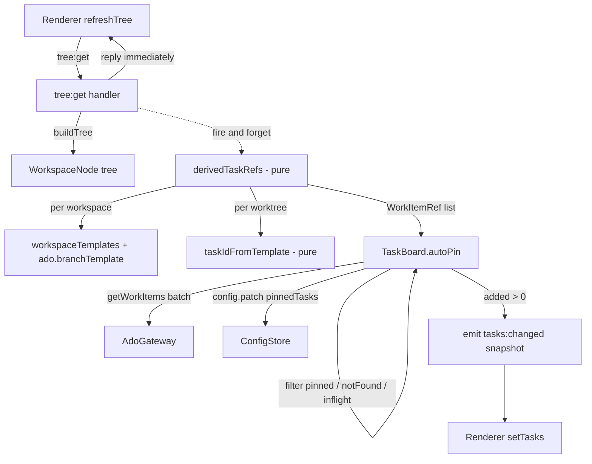

# Auto-Pin Tasks from Worktrees Design

**Spec**: `.specs/features/auto-pin-from-worktrees/spec.md`
**Status**: Draft

---

## Approaches considered

1. **Main-side, after `tree:get` (chosen).** The `tree:get` handler returns the tree as it does today, then starts an auto-pin pass in the background. When the pass pins something, main pushes `tasks:changed` with the new snapshot. The trigger ("every tree refresh") and the per-workspace template read (`workspaceTemplates`, which runs in main) sit in the same place, the tree reply is never delayed by ADO, and the renderer only subscribes.
2. **Renderer-driven.** After each `refreshTree`, the renderer calls a new `tasks:auto-pin` channel with the tree. Rejected: the renderer would need to fetch every workspace's templates and orchestrate an ADO call per refresh, and every future `tree:get` caller would have to remember to do the same.
3. **Inside `TaskBoard.refresh()`.** Rejected: `tasks:refresh` runs on focus and on the refresh button, but not after a worktree is created or on startup. It would also need the tree, which `TaskBoard` does not have.

---

## Architecture Overview



The split between `derivedTaskRefs` (which tasks the tree implies) and `TaskBoard.autoPin` (reconcile with the pinned set) follows the planned direction: once manual pins are retired, `derivedTaskRefs` becomes the whole task list, and removal when a worktree disappears is a diff against its output.

---

## Code Reuse Analysis

### Existing Components to Leverage

| Component | Location | How to Use |
| --------- | -------- | ---------- |
| `branchNameFor`, `DEFAULT_BRANCH_TEMPLATE` | `src/shared/tasks.ts` | The matcher mirrors its placeholder set; round-trip tests render with it |
| `workspaceTemplates` | `src/main/workspace-config.ts` | Per-workspace `branchTemplate` override (null → global) |
| `TaskBoard` (`withBadgeType`, `list`, `sameRef`) | `src/main/task-board.ts` | `autoPin` lives next to `pin` and reuses badge enrichment and the snapshot shape |
| `refKey`, `WorkItemRef` | `src/main/ado-gateway.ts` | Dedup keys, and the notFound and inflight sets |
| `stubSource` + temp `ConfigStore` | `src/main/task-board.test.ts` | Test harness for `autoPin` |
| `emitToWindow` + `IpcEvents` | `src/main/index.ts:381`, `src/shared/ipc-contract.ts:214` | New `tasks:changed` event, same shape as `time:changed` |
| `api.on` subscription | `src/renderer/src/lib/use-time.ts:30` | Renderer listener pattern |
| ConfigStore section merge | `src/main/config-store.ts:53` | An older config without `autoPinFromWorktrees` gets the default `true` for free |

### Integration Points

| System | Integration Method |
| ------ | ------------------ |
| `tree:get` IPC | Handler wraps `buildTree` and schedules `autoPinFromTree(tree)` without awaiting it |
| Global config | `ado.autoPinFromWorktrees: boolean` (default `true`); `pinnedTasks` gets the appended refs |
| Renderer tasks state | `App.tsx` subscribes to `tasks:changed` → `setTasks(snapshot)` |

---

## Components

### `taskIdFromTemplate` (pure matcher)

- **Purpose**: Returns the `{id}` a branch carries when it matches a branch template, else `null`.
- **Location**: `src/shared/tasks.ts`
- **Interfaces**:
  - `taskIdFromTemplate(template: string | null, branch: string): number | null`
  - `compileBranchTemplate(template: string | null): RegExp | null` (internal; `null` when the template has no `{id}`)
- **Compilation rules** (spec Assumptions):
  - blank or null template → `DEFAULT_BRANCH_TEMPLATE`
  - split on `/`; each segment is compiled on its own, then joined with `/`
  - inside a segment: `{id}` → `(\d+)`; `{usId}` → `\d+`; `{type}` → `(?:feature|bugfix)`; `{slug}`, `{usSlug}`, `{dev}` → `[^/]*`; any other `{x}` and all literal text → escaped literal
  - a segment containing no `{id}` and nothing but those placeholders and `-` is optional: compiled as `(?:<seg>/)?`, so it may be absent together with its separator
  - regex is `^…$` with the `i` flag
  - a template with more than one `{id}` uses the first capture
  - result: `Number(capture)`; `0` → `null`
- **Why `[^/]*` for `{slug}` is safe**: segments are anchored and literal separators like `-` are escaped, so `{id}-{slug}` means digits, a literal `-`, then the rest of the segment. When `{slug}` is empty, `branchNameFor` trims the dangling `-`, so the segment `{id}-{slug}` also has to accept a bare `4821`: the literal `-` directly next to an adjacent wildcard placeholder is made optional (`-?`), which reproduces the per-segment edge trim.
- **Dependencies**: none
- **Reuses**: placeholder vocabulary of `branchNameFor`

### `derivedTaskRefs` (pure derivation)

- **Purpose**: Maps a tree to the unique `WorkItemRef`s its worktrees' branches imply.
- **Location**: `src/main/worktree-tasks.ts` (new)
- **Interfaces**:
  - `derivedTaskRefs(tree: WorkspaceNode[], templateFor: (workspacePath: string) => string | null, defaults: { defaultOrg: string | null; defaultProject: string | null }): WorkItemRef[]`
- **Behavior**: returns `[]` when either default is unset. Otherwise, for every workspace → repo → worktree, runs `taskIdFromTemplate(templateFor(ws.path), wt.branch)`, builds the ref with `url`, and dedupes by `refKey`, keeping first-seen order.
- **Dependencies**: `taskIdFromTemplate`, `refKey`
- **Reuses**: `makeRef` URL shape from `task-board.ts` (exported for reuse rather than duplicated)

### `TaskBoard.autoPin`

- **Purpose**: Pins the derived refs that are not yet pinned, after validating them in ADO.
- **Location**: `src/main/task-board.ts` (modify)
- **Interfaces**:
  - `autoPin(refs: PinnedTask[]): Promise<{ added: number; snapshot: TasksSnapshot }>`
- **Behavior**:
  1. `config.ado.autoPinFromWorktrees === false` → `{ added: 0 }`, no fetch
  2. candidates = refs not already pinned, not in the session `notFound` set, and not in the `inflight` set; none left → `{ added: 0 }`, no fetch
  3. add candidates to `inflight`; a single batch `getWorkItems(candidates)`; `inflight` is cleared in `finally`
  4. `!ok` → `auth = 'failed'`, nothing persisted
  5. `ok` → `auth = 'ok'`, `lastSyncAt = now`; a ref without details goes into `notFound`; a found ref is enriched via `withBadgeType` and cached
  6. **re-read `pinnedTasks` right before `patch`**, append the found refs not pinned meanwhile, and patch
- **Dependencies**: `ConfigStore`, `WorkItemSource`
- **Reuses**: `withBadgeType`, `sameRef`, `list`

### `tasks:changed` wiring

- **Purpose**: Runs a pass after every tree build and pushes the snapshot when it changed.
- **Location**: `src/main/index.ts` (modify), `src/shared/ipc-contract.ts` (event type), `src/renderer/src/App.tsx` (subscription)
- **Interfaces**:
  - `IpcEvents['tasks:changed']: { snapshot: TasksSnapshot }`
  - in main: `handle('tree:get', async () => { const tree = await buildTree(registry); void autoPinFromTree(tree); return tree })`
  - `autoPinFromTree` = `derivedTaskRefs(tree, (p) => workspaceTemplates(p).branchTemplate ?? config.ado.branchTemplate, config.ado)` → `taskBoard.autoPin` → `added > 0 ? emit('tasks:changed', { snapshot }) : noop`; errors are logged and never thrown
- **Dependencies**: all of the above

---

## Data Models

```typescript
// src/shared/config.ts — AppConfig.ado gains:
autoPinFromWorktrees: boolean // DEFAULT_CONFIG: true

// src/shared/ipc-contract.ts — IpcEvents gains:
'tasks:changed': { snapshot: TasksSnapshot }
```

No change to `PinnedTask`: an auto-pin is indistinguishable from a manual pin (spec §Decisions).

---

## Error Handling Strategy

| Error Scenario | Handling | User Impact |
| -------------- | -------- | ----------- |
| `defaultOrg`/`defaultProject` unset | `derivedTaskRefs` returns `[]` | Nothing happens |
| ADO auth failure | `auth = 'failed'`, nothing persisted, retried next refresh | Existing "run `az login`" prompt |
| Work item not found | Added to session `notFound`; never fetched again this session | No card |
| Malformed `.app/config.json` | `workspaceTemplates` returns null → global template | Global template applies |
| `getWorkItems` throws unexpectedly | `autoPinFromTree` catches and logs; `inflight` cleared in `finally` | Nothing happens; next refresh retries |
| Overlapping passes (focus + manual refresh) | `inflight` set skips refs already being fetched | No duplicate pins |

---

## Risks & Concerns

| Concern | Location (file:line) | Impact | Mitigation |
| ------- | -------------------- | ------ | ---------- |
| `pin()` reads `pinnedTasks` before `await` and patches with that stale array | `src/main/task-board.ts:140-161` | A manual pin racing with an auto-pin pass (both happen on window focus) would overwrite the other's append, losing a pin | T4 re-reads `pinnedTasks` just before patching in both `pin` and `autoPin`, with a test that interleaves them |
| `tree:get` fires often (every focus) | `src/main/index.ts:284` | One ADO call per refresh would be wasteful | Candidates that are already pinned or not found skip the fetch, so the steady state makes zero ADO calls |
| Existing tests use `rmSync` on `os.tmpdir()` fixtures, which no-ops on this machine's non-ASCII profile path | `src/main/task-board.test.ts:1` | Leaked temp dirs; not a test failure | New tests clean up with async `rm` |
| `{slug}` edge trim in `branchNameFor` makes the matcher's literal-`-` handling subtle | `src/shared/tasks.ts:39` | A branch rendered from an empty slug would not match | Round-trip test (APIN-04) renders with empty and non-empty titles |

---

## Tech Decisions

| Decision | Choice | Rationale |
| -------- | ------ | --------- |
| Where auto-pin runs | Main, background after `tree:get` | Single trigger point for every refresh; templates are read in main; the tree reply is never blocked |
| Matcher vs heuristic | New strict `taskIdFromTemplate`; `taskIdFromBranch` untouched | Spec §Out of Scope; the strict matcher is the only path that fetches unpinned IDs |
| Fetch batching | One `getWorkItems` per pass for all candidates | The gateway already groups by org/project |
| Not-found memory | Session-only `Set<refKey>` in `TaskBoard` | Spec assumption; restart clears it |

**Project-level decision → STATE.md:** AD-049, "IDs derived from a branch that strictly matches the effective branch template may be fetched from ADO and pinned automatically; the heuristic `taskIdFromBranch` never triggers a fetch." This reverses start-work §Out of Scope ("no speculative ADO fetches") for the template path only.
