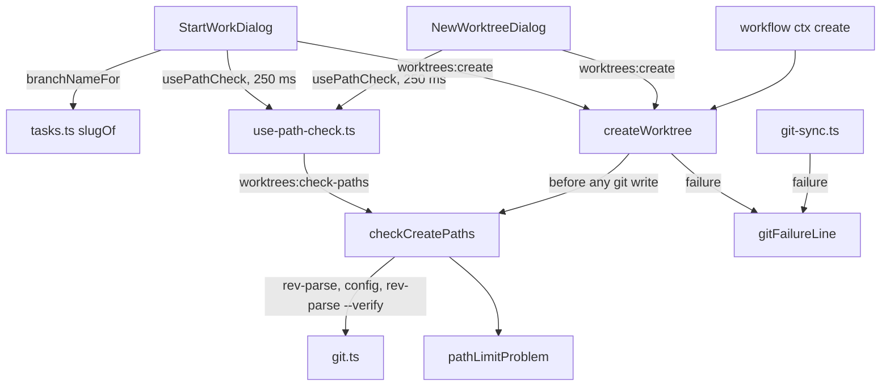

# Branch Slug Short Design

**Spec**: `.specs/features/branch-slug-short/spec.md`
**Status**: Approved (owner, 2026-10-01)

Line numbers below were read on `feature/branch-slug-short` at `60ff148` (= `origin/main`).

---

## Architecture Overview

Three independent changes, joined only by the dialogs that show their results:

1. **Slug rule** in `src/shared/tasks.ts`: `slugOf` gains three steps (drop fillers, collapse
   repeats, cap at 40). `branchNameFor` and everything that reads a branch back are unchanged.
2. **Error line** in `src/main/git.ts`: `gitFailureLine` prefers git's first `fatal:`/`error:` line.
   `git-sync.ts`'s private `errorLine`, which already does this for sync operations, is removed, so
   one rule serves every caller.
3. **Path check** in a new `src/main/path-limits.ts`: a pure function computes the paths a create
   writes and returns the first limit passed; a reader feeds it the common git dir, the effective
   `core.longpaths` and whether the branch already exists. `createWorktree` calls it before any git
   write, and a new `worktrees:check-paths` channel lets the dialogs ask as the name changes.



---

## Measurements

Planning probe, 2026-10-01: git 2.55.0.windows.4, Windows 11, NTFS, throwaway repositories under a
short base folder, repository-local `core.longpaths=false` unless noted. Each row is the boundary
between the last length git accepted and the first it refused, found by growing the branch one
character at a time. T1 repeats these on the Execute machine before any fix (stop rule there).

| # | Shape | Last created | First refused | Git's stderr at the first refused | Execute machine |
| - | ----- | ------------ | ------------- | --------------------------------- | --------------- |
| M1 | `{repo}-{id}` folder, long last segment (`user/dev/1-x/2-bbb…`) | ref path 259 | ref path 260 | `Preparing worktree (new branch '…')`, then `fatal: cannot lock ref '…': Unable to create '…/2-bbb….lock': Filename too long` | Matches: ref path 259 created, 260 refused (scanned 255–264); same two stderr lines |
| M2 | `{repo}-{id}` folder, two-letter last segment (`user/ddd…/ab`) | reflog folder 247 (ref path 250) | reflog folder 248 (ref path 251) | `Preparing worktree …`, then `fatal: cannot update the ref '…': unable to create directory for '.git/logs/refs/heads/user/ddd…': No such file or directory` | Matches: reflog folder 247 (ref path 250) created, 248 (ref path 251) refused (scanned 243–252); same two stderr lines |
| M3 | `{repo}-{branch}`, repository folder `r` | worktree folder 215 (ref path 236) | worktree folder 216 (ref path 237) | `Preparing worktree …`, then `fatal: '$GIT_DIR' too big` | Matches: worktree folder 215 (ref path 236) created, 216 (ref path 237) refused (scanned 212–221); same two stderr lines |
| M4 | `{repo}-{branch}`, a 21-character repository folder | worktree's git folder 247 (worktree folder 205) | worktree's git folder 248 (worktree folder 206) | `Preparing worktree …`, then `.git/worktrees/<name>/refs: Filename too long`, **no `fatal:` prefix** | Matches: git folder 247 (worktree folder 205) created, 248 (worktree folder 206) refused (scanned 244–253); same two stderr lines, no prefix on the second |
| M4L | M4 with `core.longpaths=true` | — | — | — | Lifted: every length scanned, git folder 244–253 (worktree folder 202–211), created |
| M5 | M1 and M2 with `core.longpaths=true` | ref paths past 300 | only when one path component passes 255 characters | not this feature's limit | Matches: M1 shape ref path 259, 260, 270 and 300 created, 320 refused (last segment of 268 characters; `fatal: cannot lock ref '…': Unable to create '….lock': Invalid argument`); M2 shape reflog folder 247, 248, 260 and 300 created |
| M6 | M3 with `core.longpaths=true` | worktree folder 215 | worktree folder 222 (step of 7) | `fatal: '$GIT_DIR' too big`: `core.longpaths` does not lift it | Matches at a step of 1: worktree folder 215 created, 216 refused (scanned 212–224); `fatal: '$GIT_DIR' too big` |

**Execute machine** (T1, 2026-10-03): git 2.55.0.windows.4, Windows 11 Pro, NTFS; throwaway
repositories under the base folder `D:\bss-probe` (deleted afterwards), one fresh repository per
attempt, `core.longpaths` and `core.autocrlf` pinned in each repository's own config, no
`core.longpaths` in the system or global config. Lengths are the measured paths, computed from
`git rev-parse --path-format=absolute --git-common-dir`.

Two more readings T5 and T9 rely on, same machine:

- **Collision** (T5): a repository with a branch `user`, then `git worktree add <folder> -b user/x
  main`, exits 255 with `Preparing worktree (new branch 'user/x')`, then
  `fatal: cannot lock ref 'refs/heads/user/x': 'refs/heads/user' exists; cannot create
  'refs/heads/user/x'`.
- **Existing long branch, `core.longpaths=false`** (T9's Reuse test): a branch with a ref path of
  270, made with `git -c core.longpaths=true branch` and packed with `git -c core.longpaths=true
  pack-refs --all` (no loose ref left), does **not** resolve: `git rev-parse --verify --quiet
  refs/heads/<branch>` exits 1 (0 with `-c core.longpaths=true`), and `git worktree add <folder>
  <branch>` exits 128 with `fatal: invalid reference: <branch>` and leaves no folder. The loose
  (unpacked) branch behaves the same, and `git branch --list` prints `warning: ignoring broken ref`
  for it. At a ref path of 259 both forms resolve and the checkout succeeds. So, with
  `core.longpaths=false`, the plain `rev-parse --verify` read that `branchExists` and the path check
  use reports such a branch as absent.
- **Non-boolean `core.longpaths`** (T8, BSLG-39): with `core.longpaths maybe` in the repository's own
  config, git for Windows refuses every command the check and the create run, not only the boolean
  read (only a bare `rev-parse --git-common-dir`, which loads no config, still answers):
  `git rev-parse --path-format=absolute --git-common-dir`, `git config --type=bool --get
  core.longpaths`, `git config --unset core.longpaths` and `git worktree add <folder> -b x main` all
  exit 128 with `fatal: bad boolean config value 'maybe' for 'core.longpaths'`, and the add leaves
  no folder. So the check cannot read the common git dir and reports nothing (BSLG-41), and the
  create returns that `fatal:` line. No value is expected that git runs with but `--type=bool` refuses,
  since both reads go through git's boolean parser (inferred from the error text, not measured).
- **Reuse of an existing M2-shaped branch, `core.longpaths=false`** (T9, BSLG-37): branches made
  with `git -c core.longpaths=true branch` at reflog folders 247, 248 and 252 (ref paths 250, 251,
  255), then `git worktree add <short folder> <branch>`: exit 0 each time, with
  `Preparing worktree (checking out '…')` on stderr, and the new worktree's `HEAD` is the branch.
  Checking out writes no ref and no branch reflog, so git accepts what the path check skips.
- **Common git dir form**: in a temp repository reached through an 8.3 short name,
  `rev-parse --path-format=absolute --git-common-dir` returns the long form with `/`, the same
  path `realpathSync.native` gives (8.3 risk row).

Reading of the rows:

- **M1** is the issue's case and its formula: ref path 259 passes, 260 is refused (BSLG-17, BSLG-35).
- **M2**: git makes the reflog's folder `logs/refs/heads/<the branch's folders>` too, 5 characters
  longer than the ref's own folder, and Windows refuses a folder path of 248 or more. With a short
  last segment this binds before the ref path (BSLG-18, BSLG-36). The issue's own error
  ("unable to create directory for .git/refs/heads/…") is this folder limit on the ref's folder.
- **M3**: git refuses a `$GIT_DIR` longer than 220 characters; `worktree add` hands the child
  `<worktree folder>\.git`, so a folder of 216 or more fails, with or without `core.longpaths`
  (M6; BSLG-27). The 220 matches git's `PATH_MAX - 40` guard in `setup.c` with Windows' `PATH_MAX`
  of 260; that source reading is from memory and uncertain, the measurement is the evidence.
- **M4**: the worktree's admin folder `.git\worktrees\<folder name>\refs` meets the 248 folder limit
  when the repository name is long (BSLG-28). Its error line has no prefix, so BSLG-12 cannot surface
  it: the check is the only way the user learns why.
- M2's message and the P2 rows were confirmed by the owner on 2026-10-01 (spec Assumptions).

M4 with `core.longpaths=true` was not measured at planning; T1 measured it (row M4L): lifted, like
M1 and M2.

---

## Code Reuse Analysis

### Existing Components to Leverage

| Component | Location | How to Use |
| --------- | -------- | ---------- |
| `slugOf`, `branchNameFor` | `src/shared/tasks.ts:10-43` | `slugOf` gains the three steps; `branchNameFor` calls it unchanged for `{slug}` and `{usSlug}` |
| `taskIdFromBranch`, `taskIdFromTemplate` | `src/shared/tasks.ts:53-59`, `:74+` | Unchanged; the round-trip test (APIN-04, `tasks.test.ts:231-262`) gains long and filler-only titles (L-091) |
| `gitFailureLine` | `src/main/git.ts:44-50` | Gains the `fatal:`/`error:` preference; every caller benefits unchanged |
| `errorLine` | `src/main/git-sync.ts:76-87` | Removed; its rule moves into `gitFailureLine`, its SPEC_DEVIATION comment goes with it |
| `GitRunner` | `src/main/git.ts:42` | The path check's injected runner; tests pass the real `git` |
| `worktreeNameFor`, `worktreePathFor` | `src/shared/worktrees.ts:28-50` | The path check computes the folder the create will use, exactly as the dialog previews it |
| `branchExists`-style probe | `src/main/worktree-manager.ts:152-160` | Same `rev-parse --verify --quiet refs/heads/<branch>` read, in the path check |
| `removeWorktree`'s injected deps | `src/main/worktree-manager.ts:255-287` | Pattern for `createWorktree`'s new optional last `deps` argument |
| Real-temp-dir git tests | `src/main/worktree-manager.test.ts:427-498` | The create tests' `beforeEach`; each new test pins `core.longpaths` in the repository's own config (L-026) |
| Stale-guarded effect | `StartWorkDialog.tsx:79-102` | The `stale` flag pattern for the hook's answer |
| Seeded smoke with `--seed` / `--clean`, `SMOKE_CONFIG`, `SMOKE_ONLY` | `scripts/smoke-files-diff.mjs:1-45` | The modes the Start Work smoke gains |

### Integration Points

| System | Integration Method |
| ------ | ------------------ |
| IPC | One new invoke channel, `worktrees:check-paths`, typed in `ipc-contract.ts` beside `worktrees:create` |
| Workflow engine | Creates through `createWorktreeWithHook` (`index.ts:338-347, 710`), so the check reaches it with no change |
| Git config | Read only: `git config --type=bool --get core.longpaths` in the repository; never written (BSLG-26) |

---

## Components

### `slugOf` (modified, `src/shared/tasks.ts`)

- **Purpose**: Turn a title into a concise slug.
- **Interfaces** (all module-private; tests go through `branchNameFor`):
  - `FILLER_WORDS: ReadonlySet<string>` — the issue's 28 words plus `via` (owner, 2026-10-03).
  - `SLUG_MAX_LENGTH = 40`.
  - `slugOf(title: string): string` — transliterate and lowercase as today, split on runs of
    non-`[a-z0-9]`, drop empty words; keep the words not in `FILLER_WORDS`, or all words when that
    keeps none; drop a word equal to the one kept before it; then join with `-` word by word while
    the result stays at most 40; when even the first word is longer, take its first 40 characters.
- **Dependencies**: none.
- **Reuses**: today's transliteration (`:11-14`).

The empty title still gives `''`, and `branchNameFor`'s per-segment trim (`:39-42`) handles it as
today (BSLG-31).

### `gitFailureLine` (modified, `src/main/git.ts`)

- `gitFailureLine(err: unknown): string` — split stderr on `\r?\n`; the first line whose trimmed
  text matches `/^(fatal|error):/`, trimmed; else the first non-empty line, trimmed; else the
  message's first line or `String(err)`, as today.
- `git-sync.ts`: `errorLine` and its comment are deleted; `runGitOp`'s catch uses `gitFailureLine`.
  The `no upstream configured` probe (`:216`) reads a `fatal:` line either way.
- `GitError` (`worktree-manager.ts:14-20`): its detail becomes `gitFailureLine(cause)`.

### `path-limits.ts` (new, `src/main/path-limits.ts`)

- **Purpose**: Say whether a create would pass a Windows or git path limit, before git runs.
- **Interfaces**:
  - `WINDOWS_MAX_FILE_PATH = 259`, `WINDOWS_MAX_FOLDER_PATH = 247`, `GIT_MAX_WORKTREE_FOLDER = 215`
    (exported so the tests pin them with literals, L-019).
  - `pathLimitProblem(input: PathLimitInput): string | null` — pure. Normalises every path to `\`
    without a trailing separator, then checks in the AC 29 order and returns the first message, or
    null:
    1. `writesRef && !longPaths`: ref path `${commonDir}\refs\heads\${branch with \}.lock` > 259 → BSLG-17 message.
    2. `writesRef && !longPaths && branch has '/'`: reflog folder `${commonDir}\logs\refs\heads\${dirs}` > 247 → BSLG-18 message.
    3. Always: `worktreePath` > 215 → BSLG-27 message.
    4. `!longPaths`: `${commonDir}\worktrees\${basename(worktreePath)}\refs` > 247 → BSLG-28 message.
  - `checkCreatePaths(req: PathCheckRequest, deps?: PathCheckDeps): Promise<string | null>` —
    `deps.platform !== 'win32'` → null with no git call (BSLG-22). Reads, in the repository:
    `git rev-parse --path-format=absolute --git-common-dir` (failure → null, BSLG-41);
    `git config --type=bool --get core.longpaths` (`true` → on; unset or false → off, BSLG-40;
    a non-boolean value makes git refuse every command the check runs, so the first read already fails and the
    check returns null, BSLG-39); `git rev-parse --verify --quiet refs/heads/<branch>`.
    `writesRef` is true only when the create writes a local ref: the branch does not exist for
    git, or it exists and the create is a Recreate from a base. An existing branch checked out
    with no base, with Reuse, or with a base and no `onExisting` yet (the dialog's ask, before
    the conflict prompt) writes no ref and is skipped (BSLG-37). Then `pathLimitProblem` with
    `worktreePathFor(repoPath, branch, worktreeTemplate)`.
- **Dependencies**: `git.ts`, `shared/worktrees.ts`.
- **Reuses**: the `branchExists` read; `GitRunner`.

Rules 3 and 4 are the P2 story; T7 adds them, and dropping P2 removes T7 only.

### `createWorktree` (modified, `src/main/worktree-manager.ts:70-108`)

- New optional last argument `deps: CreateWorktreeDeps = realCreateDeps` (`{ platform, git }`).
- After the empty-name and target-exists guards (no git, no write), before `branchExists` and the
  existing-branch fork: `const problem = await checkCreatePaths({ repoPath, branch, baseBranch,
  worktreeTemplate, onExisting }, deps)`; a problem returns `{ ok: false, error: problem }`. That
  is before the base refresh, before Recreate's `branch -D` and before `worktree add` (BSLG-25,
  BSLG-38).
- `withPostCreateHook` and the IPC handler call it with five or six arguments, so production gets
  the real deps.

### IPC and wiring

- `src/shared/ipc-contract.ts`: `'worktrees:check-paths': { req: { repoPath: string; branch:
  string; baseBranch?: string; worktreeTemplate?: string }; res: { problem: string | null } }`.
- `src/main/index.ts`, beside `worktrees:create`: `handle('worktrees:check-paths', (req) =>
  checkCreatePaths(req).then((problem) => ({ problem })))`.

### Renderer

- `src/renderer/src/lib/path-check.ts` (new, pure): `PATH_CHECK_DELAY_MS = 250`;
  `pathCheckKey(req: PathCheckRequest): string` (the four values, `baseBranch` and
  `worktreeTemplate` absent and empty alike); `problemFor(answer: { key: string; problem: string |
  null } | null, key: string): string | null` — the answer's problem only when its key is the
  current one (BSLG-42).
- `src/renderer/src/lib/use-path-check.ts` (new hook): `usePathCheck(req: PathCheckRequest | null):
  string | null`. Null request (no repo, blank branch) → null. On a key change, a 250 ms timer
  invokes the channel and stores `{ key, problem }` from the promise callback (no `setState` in the
  effect body, L-035); the cleanup clears the timer and marks the call stale. A rejected invoke
  stores no answer.
- `StartWorkDialog.tsx`, `NewWorktreeDialog.tsx`: call the hook with `{ repoPath, branch,
  baseBranch: baseBranch.trim() || undefined, worktreeTemplate: effectiveWorktreeTemplate }`;
  `canCreate` gains `&& pathProblem === null`; under the path preview,
  `<div className="dialog-error dialog-path-limit"><Icon name="alert" size={13} /> {pathProblem}</div>`
  while there is one. No new CSS: the line reuses `.dialog-error`.

### Smoke (`scripts/smoke-start-work.mjs`)

- `--seed` (app not running) writes under `SMOKE_BASE` two workspaces and a `SMOKE_CONFIG`:
  - `bss-ids/` with `.app/config.json` `worktreeTemplate: "{repo}-{id}"`, holding `api`
    (`core.longpaths=false` and a branch named `team`; not `user`, which would block every branch the nested template makes) and `web` (`core.longpaths=true`);
  - `bss-default/` with no override (global default `{repo}-{branch}`), holding `app`
    (`core.longpaths=true`);
  - the config registers both, with `ado.branchTemplate` `user/{dev}/{usId}-{usSlug}/{id}-{slug}`
    and the developer alias `dev`, and no pins. Names are fictional; every git call pins
    `core.autocrlf` and `core.longpaths` in the repository's own config.
- `--clean` removes the seed. The legacy STWK checks keep needing `SMOKE_TASK_URL`; their config
  path becomes `SMOKE_CONFIG` when set.
- `SMOKE_ONLY=longpath`: checks 1–7, no Azure DevOps. `SMOKE_ONLY=slug`: checks 8–9, optional:
  with `SMOKE_LONG_TASK_URL` set (and `az login`) they run; without it the section prints a skip
  notice and counts as neither pass nor fail. No `SMOKE_ONLY`: everything; without
  `SMOKE_LONG_TASK_URL` it runs everything else and skips checks 8–9 with the same notice. The URL
  is never written into the repository. The slug rule's proof is its unit tests (T2), not this
  section.
- The smoke computes each typed name's length from the repository's common git dir it reads with
  `git rev-parse`, so the checks hit their boundary on any base folder (L-050).

---

## Data Models

```typescript
// src/main/path-limits.ts
export interface PathLimitInput {
  /** Absolute common git dir, either separator. */
  commonDir: string
  branch: string
  /** The folder the create will make (`worktreePathFor`). */
  worktreePath: string
  /** The repository's effective core.longpaths, read as a boolean. */
  longPaths: boolean
  /** False when the create checks out an existing local branch as it is. */
  writesRef: boolean
}

// src/shared/worktrees.ts (shared by main and the renderer)
export interface PathCheckRequest {
  repoPath: string
  branch: string
  baseBranch?: string
  worktreeTemplate?: string
  /** Create only; the dialog's ask never sends it. */
  onExisting?: 'reuse' | 'recreate'
}
```

---

## Error Handling Strategy

| Error Scenario | Handling | User Impact |
| -------------- | -------- | ----------- |
| A limit is passed | `pathLimitProblem` message | Dialog line under the preview, `Create worktree` disabled; a direct `worktrees:create` returns the same text |
| The path check's git read fails | `checkCreatePaths` returns null | No message; the create goes on and git's own `fatal:` line shows (BSLG-41) |
| `core.longpaths` holds a non-boolean | Git refuses every command the check and the create run, so the check's first read fails → null | No message; the create returns git's `fatal: bad boolean config value …` line (BSLG-39) |
| `worktrees:check-paths` invoke rejects | The hook stores no answer | No message; Create follows the other gates |
| `git worktree add` fails for another reason | `gitFailureLine` | The dialog shows git's `fatal:`/`error:` line (BSLG-14) |
| A failure line with no prefix (M4) | `gitFailureLine` falls back to the first line | The check refuses it first under P2; without P2 the user sees `Preparing worktree …` |

---

## Risks & Concerns

| Concern | Location (file:line) | Impact | Mitigation |
| ------- | -------------------- | ------ | ---------- |
| Limits read partly from git's source, from memory | `setup.c` `PATH_MAX - 40` (M3) | A wrong constant refuses names git accepts, or lets a failing one through | T1 measures every boundary on the Execute machine; a different number stops the plan before any fix |
| Existing test expectations change | `src/shared/tasks.test.ts:27-28, 48, 86` | `configuracao-de-ambiente` becomes `configuracao-ambiente`, `crash-on-save` becomes `crash-save` | Spec-mandated: T2 updates exactly those three expected values and names them in its commit body; no other assertion changes |
| `gitFailureLine` changes for every caller | every call site (`grep -rn gitFailureLine src/main`) | A caller that matched the first line could change behaviour | Only `git-sync.ts:216` matches on the text, and it matches a `fatal:` line; `file-discard`'s kept reason (FDSC-21, "git's first error line") reads better. The full suite is the gate |
| Real-git tests near the timeout | `vitest.config.ts:12-13`, L-005 | New real-git tests push a suite over 30 s | T1 records the slowest worktree-manager test; new tests reuse one repository per `describe` block |
| CI's system git config | `.github/workflows/ci.yml:21` (`windows-latest`) | A runner with `core.longpaths=true` system-wide would pass a refusal test vacuously | Every test pins `core.longpaths` in the repository's own config (L-026); BSLG-40 tests that the repository value wins |
| Worktree id suffix | git names the admin folder `<name>1`, `<name>2` when `<name>` is taken | Rule 4 is off by one or two characters | Accepted: the folder name is new by construction (`Target path already exists` guard); a stale admin folder is git's own state |
| 8.3 short paths | a temp folder reached through an 8.3 name such as `RUNNER~1` | `rev-parse` may answer the long form, so the computed length differs from what Windows counts | `--path-format=absolute` returns git's view, which is what git uses to create the file; tests use `realpathSync.native`, as the existing ones do |
| Smoke needs Azure DevOps for the long title | `scripts/smoke-start-work.mjs:16-22` | Checks 8–9 cannot run offline | They are optional: without `SMOKE_LONG_TASK_URL` they are skipped with a printed notice, neither pass nor fail; checks 1–7 run with no network, and the slug rule rests on T2's unit tests. The URL is an environment value, never written to the repository |
| Renderer components have no unit tests (AD-004) | dialogs | The Create gate could regress silently | The key-matching decision lives in `path-check.ts` (unit); smoke checks 1 and 2 drive the New worktree dialog, and check 9 drives Start Work when `SMOKE_LONG_TASK_URL` is set |

---

## Tech Decisions (only non-obvious ones)

| Decision | Choice | Rationale |
| -------- | ------ | --------- |
| Where the check lives | Main, one function used by the IPC ask and by `createWorktree` | One rule for the dialog, a direct create and the workflow engine; main has the git dir and the config |
| When the ref rules apply | Only when the create writes a new local ref | Checking out an existing branch writes no ref (BSLG-37) |
| Several limits passed | First in a fixed order, one message | One line in the dialog; the ref path first because it is the issue's case |
| Error preference | In `gitFailureLine` itself, not a second helper | The issue asks for every failure; `git-sync`'s extractor was the same rule kept local by a SPEC_DEVIATION |
| Debounced ask, not blocking | Create stays enabled while an answer is pending | The create re-checks in main, so a fast click is refused with the same text |

### AD-055 (recorded at T16; the text in `.specs/STATE.md` carries the owner's amendments of 2026-10-03)

**Every git failure the app shows comes from `gitFailureLine`, which returns git's first stderr
line starting with `fatal:` or `error:`, else its first non-empty line; and on Windows a worktree
create refuses, before any git write, a name whose ref path (259), reflog folder (247), worktree
folder (215) or worktree git folder (247) passes its limit, unless the repository's effective
`core.longpaths` lifts that limit. The app never sets `core.longpaths`.** The rule is
`pathLimitProblem` in `src/main/path-limits.ts`; `worktrees:check-paths` lets the dialogs ask as the
name changes, and `createWorktree` runs the same check. **Amends** AD-023 (`gitFailureLine`'s rule)
and the `status-bar` error-reporting row (`git-sync.ts`'s `errorLine` is gone). Spec / design /
tasks: `.specs/features/branch-slug-short/` (BSLG-01..44). Rationale: issue #145; a long nested
branch failed with `Preparing worktree …` as its only visible reason. The limits are measured
(design.md, Measurements), not read from documentation.
