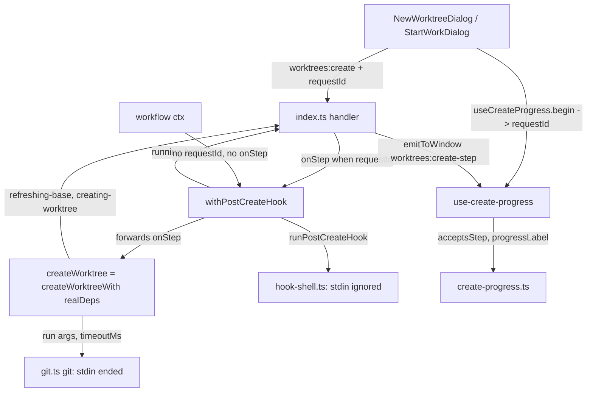

# Create Timeouts Design

**Spec**: `.specs/features/create-timeouts/spec.md`
**Status**: Approved (owner, 2026-10-01)

Line numbers below were read on `feature/create-timeouts` at `60ff148` (= `origin/main`). #145 lands
first on the same files; they will shift after the rebase.

---

## Architecture Overview

The create stays one hook-wrapped function (WPC-10, AD-013) called by the IPC handler and by the
workflow ctx. Three things change inside it, and one thing is added around it.

- **Bounded calls.** The create receives its git runner and its two limits as dependencies, so the
  refresh calls and every `git worktree add` pass `timeoutMs` to the runner, and a test can inject
  a runner that never settles on its own and limits of a few milliseconds. `isTimeout` turns a kill
  into the step's own text.
- **No input.** `git()` ends its child's stdin as the process starts; `runHookShell` spawns with
  stdin ignored. Every caller of `git.ts` gets this (AD-023: one runner for the whole app).
- **Steps.** The create takes an optional `onStep` callback. `createWorktree` reports
  `refreshing-base` and `creating-worktree`; the hook decorator reports `running-hook`. The IPC
  handler builds the callback only when the request carries a `requestId`, and it pushes
  `worktrees:create-step` to the window.
- **Dialogs.** A renderer hook owns the request id and the last step; both dialogs render the
  progress line from it and refuse to close while busy.



### Approaches considered

| Approach | Verdict |
| -------- | ------- |
| **A. Callback threaded through the create, event keyed by request id** | **Chosen.** The create keeps one call and one result; the decorator stays the only way to the hook; the workflow ctx passes nothing and is unchanged |
| B. Main keeps per-request state; the dialog polls a `worktrees:create-status` channel | Rejected: a second channel and a polling timer for what one push says |
| C. The renderer drives the steps through separate IPC calls (refresh, add, hook) | Rejected: breaks WPC-10, since a caller could then skip the hook, and moves WBR-02's blocking rule into two dialogs |

For stdin, the alternative to ending the pipe was rewriting `git()` on `spawn` with `stdio:
['ignore', …]`. Rejected: it reimplements `execFile`'s timeout kill, buffer ceiling and error shape
(`killed`, `stderr`), which `isTimeout`, `gitFailureLine` and every caller depend on. Measured
2026-10-01: `execFile` ignores a `stdio` option, and `child.stdin.end()` on the promisified call's
`child` makes `git hash-object --stdin` return the empty-blob id at once.

---

## Code Reuse Analysis

### Existing Components to Leverage

| Component | Location | How to Use |
| --------- | -------- | ---------- |
| `git()`, `isTimeout`, `gitFailureLine` | `src/main/git.ts:15-35, 45-55` | The runner already maps `timeoutMs` to `execFile`'s kill; `isTimeout` reads `killed` |
| `GitRunner` | `src/main/git.ts:42` | Gains an optional third `opts` argument; existing two-argument fakes stay assignable |
| `runGitOp`'s timeout shape | `src/main/git-sync.ts:22-74` | Prior art for "pass `timeoutMs`, branch on `isTimeout`, return a readable text" |
| `refreshBaseFromRemote`, `addWorktree`, `resolveExistingBranch` | `src/main/worktree-manager.ts:110-233` | Take the injected deps; `addWorktree` is already the one place `worktree add` is issued |
| `withPostCreateHook` | `src/main/post-create-hook.ts:117-140` | Forwards the new seventh argument and reports `running-hook` right before `runPostCreateHook` |
| `runHookShell` | `src/main/hook-shell.ts:42-78` | One spawn option added; the settle logic is untouched |
| `emit` / `emitToWindow` | `src/main/ipc.ts:28-34`, `src/main/index.ts:436-438` | Pushes the step; a no-op when the window is gone. `tree:get` (`:330`) already calls it from a handler |
| `api.on` | `src/renderer/src/lib/api.ts`, `RendererApi.on` | The dialogs' hook subscribes through it and unsubscribes on unmount |
| Sync popover status line | `src/renderer/src/components/SyncPopover.tsx:157-163`, `SyncPopover.css:87-102` | Pattern for the progress line: `role="status"`, the `loader` icon spinning, reduced-motion off |
| `BranchExistsChoice` | `src/renderer/src/components/BranchExistsChoice.tsx:40` | Already disables its Cancel while busy; the footer Cancel follows it |
| Real-git test setup | `src/main/worktree-manager.test.ts:621-665` (bare remote + clone) | The fixture's remote and the fake-runner tests sit beside the WBR block |
| `*.fixture.ts` convention | `src/main/activity-sequences.fixture.ts` | Home of the waiting-remote fixture and its own test |

### Integration Points

| System | Integration Method |
| ------ | ------------------ |
| IPC | `worktrees:create` req gains `requestId?: string`; new push event `worktrees:create-step: { requestId, step }` in `IpcEvents` |
| Workflow ctx | `CtxDeps.worktree.create` keeps its six parameters; the seven-parameter create is assignable to it, so `workflow-ctx.ts` does not change |
| Git credential helpers | Untouched; the timeout bounds whatever they do. Killing git does not close a helper's window |

---

## Components

### `git.ts` (modified)

- **Purpose**: Give every git process an ended stdin; let a runner carry options.
- **Location**: `src/main/git.ts`
- **Interfaces**:
  - `git(cwd, args, opts?)` — unchanged signature. The promise from `promisify(execFile)` exposes
    `child`; `child.stdin?.end()` runs before the promise is returned (CRTO-06).
  - `type GitRunner = (cwd: string, args: string[], opts?: { timeoutMs?: number }) => Promise<{ stdout: string }>`
- **Reuses**: the existing `execFile` options. The doc comment's guarantee list gains "stdin ended".

### `hook-shell.ts` (modified)

- **Location**: `src/main/hook-shell.ts:44-51`
- `spawn(cmd, { …, stdio: ['ignore', 'pipe', 'pipe'] })` (CRTO-07). `child.stdout` and
  `child.stderr` stay pipes, so the capture and the settle rules are unchanged.

### `worktree-manager.ts` create path (modified)

- **Location**: `src/main/worktree-manager.ts:52-253`
- **Interfaces**:
  - `export const REFRESH_TIMEOUT_MS = 60_000` and `export const CHECKOUT_TIMEOUT_MS = 600_000`.
  - `export interface CreateWorktreeDeps { run: GitRunner; refreshTimeoutMs: number; checkoutTimeoutMs: number }`
  - `export function createWorktreeWith(deps: CreateWorktreeDeps): (repoPath, branch, baseBranch?, worktreeTemplate?, updateBase?, onExisting?, onStep?: (step: CreateStep) => void) => Promise<CreateWorktreeResult>`
  - `export const createWorktree = createWorktreeWith({ run: git, refreshTimeoutMs: REFRESH_TIMEOUT_MS, checkoutTimeoutMs: CHECKOUT_TIMEOUT_MS })` — every existing caller and test keeps calling `createWorktree`.
- **Behaviour**:
  - The private helpers on the create path (`branchExists`, `resolveExistingBranch`,
    `addWorktree`, `refreshBaseFromRemote`, `worktreeHosting`) take a context `{ deps, onStep }`
    and call `deps.run` instead of `git`. `listWorktrees`, `removeWorktree` and the status
    readers keep calling `git` directly.
  - `refreshBaseFromRemote` reports `refreshing-base` on entry, then passes
    `{ timeoutMs: deps.refreshTimeoutMs }` to the fetch and to whichever fast-forward runs. The
    upstream `rev-parse` and the `worktree list` lookup get no timeout.
  - `addWorktree` reports `creating-worktree` on entry and passes
    `{ timeoutMs: deps.checkoutTimeoutMs }`.
  - Each create calls `refreshBaseFromRemote` at most once and `addWorktree` at most once, so
    CRTO-15 holds by construction; a guard or conflict that returns early reports nothing after it
    (CRTO-14).
  - On a rejection, `isTimeout(err)` comes first: fetch → `fetchTimeoutText(upstream, ms)`;
    fast-forward → `fastForwardTimeoutText(base, upstream, ms)`; checkout →
    `checkoutTimeoutText(target, ms)`. Otherwise the existing `gitFailureLine` / `ffFailureLine`.
  - `limitText(ms)`: `${ms / 60000} min` when `ms` is a whole number of minutes, else
    `${ms / 1000} s`. With the real constants the texts read `60 s` and `10 min`.

### `post-create-hook.ts` (modified)

- **Location**: `src/main/post-create-hook.ts:83-140`
- `CreateWorktreeFn` gains `onStep?: (step: CreateStep) => void` as its seventh parameter.
- `withPostCreateHook` forwards all seven arguments to `create`; when the create produced a path
  and `readCommand` returned a command, it calls `onStep?.('running-hook')` right before
  `runPostCreateHook` (CRTO-13).

### IPC and wiring

- **Location**: `src/shared/ipc-contract.ts:75-89, 245-292`, `src/main/index.ts:344-348`
- `worktrees:create` req: `requestId?: string` — "Pushes `worktrees:create-step` for this id while
  the create runs; absent = no steps".
- `IpcEvents['worktrees:create-step']: { requestId: string; step: CreateStep }`.
- Handler: `const onStep = requestId === undefined ? undefined : (step) => emitToWindow('worktrees:create-step', { requestId, step })`,
  passed as the seventh argument (CRTO-11, CRTO-18). `emitToWindow` is defined later in the same
  synchronous `whenReady` block and is only read when a create runs, like `tree:get`'s use.

### Renderer pure seam — `create-progress.ts` (new)

- **Location**: `src/renderer/src/lib/create-progress.ts`
- `STEP_LABELS: Record<CreateStep, string>` — the three literals of CRTO-16.
- `PREPARING_LABEL = 'Preparing…'`.
- `progressLabel(step: CreateStep | null): string` — `PREPARING_LABEL` for null, else the label.
- `acceptsStep(current: string | null, event: { requestId: string }): boolean` — true only when
  `current` is not null and equals `event.requestId` (CRTO-16, CRTO-17).
- `BUSY_CANCEL_TITLE = 'Wait for the create to finish'` (CRTO-20).

### Renderer hook — `use-create-progress.ts` (new)

- **Location**: `src/renderer/src/lib/use-create-progress.ts`
- `useCreateProgress(): { label: string | null; begin(): string; end(): void }`
  - `begin()` makes `crypto.randomUUID()`, stores it in a ref and clears the step; returns the id
    for the request.
  - One `api.on('worktrees:create-step', …)` subscription for the dialog's life; it stores the
    step only when `acceptsStep(ref.current, event)`.
  - `end()` clears the ref and the step; `label` is null while no request is in flight, else
    `progressLabel(step)`.

### Dialogs (modified)

- **Location**: `src/renderer/src/components/NewWorktreeDialog.tsx`, `StartWorkDialog.tsx`, shared
  CSS in `NewWorktreeDialog.css`
- `submit` calls `begin()` and sends its id as `requestId`; every settle path (`then` and `catch`)
  calls `end()`. The success path that calls `onCreated` calls `end()` first.
- The body shows `<div className="dialog-progress" role="status">` with the spinning `loader` icon
  and `label` while `label !== null`, in the slot above `dialog-error`.
- Backdrop: `busy ? undefined : hookFailure ? continue : onClose` (CRTO-19, CRTO-21).
- Footer Cancel: `disabled={busy}` and `title={busy ? BUSY_CANCEL_TITLE : undefined}` (CRTO-20).
- CSS: `.dialog-progress` and its spinner, after `.dialog-error`, with the reduced-motion rule.

---

## Data Models

```typescript
// src/shared/worktrees.ts
/** A step of a worktree create, pushed while it runs (CRTO-11). */
export type CreateStep = 'refreshing-base' | 'creating-worktree' | 'running-hook'

// src/shared/ipc-contract.ts — IpcEvents
  /** The step a `worktrees:create` call with this `requestId` has reached (CRTO-11). */
  'worktrees:create-step': { requestId: string; step: CreateStep }
```

Nothing is persisted. `CreateWorktreeResult` does not change: a timeout is an `ok: false` with an
`error`, like every other failure.

---

## Error Handling Strategy

| Error Scenario | Handling | User Impact |
| -------------- | -------- | ----------- |
| Base fetch outlives 60 s | Runner kills git; `isTimeout` → fetch text; no `worktree add` | Inline error: `Fetching origin/main timed out after 60 s. Retry, or uncheck …` |
| Fast-forward outlives 60 s | Same, fast-forward text | Inline error naming the base and its upstream |
| Refresh times out on recreate | Refresh runs before `branch -D`, so the branch is untouched (EXB-D8) | Same inline error; the branch is still there |
| Checkout outlives 10 min | Runner kills git; checkout text with the target; the decorator skips the hook (`ok: false`) | Inline error naming the folder to remove |
| Fetch fails before its limit | Unchanged `gitFailureLine` (WBR-02) | Git's own line |
| Hook reads stdin | Reads end of input; its exit code decides | No wait; the advisory only when it exits non-zero (WPC-13) |
| Window closed mid-create | `emitToWindow` does nothing; the create settles | None |
| Step for another request, or after settle | `acceptsStep` false | Ignored |

---

## Risks & Concerns

| Concern | Location (file:line) | Impact | Mitigation |
| ------- | -------------------- | ------ | ---------- |
| An existing test depends on open stdin | `src/main/git.test.ts:33-38` | `hash-object --stdin` returns at once once stdin is ended, so the `isTimeout` test stops timing out | T2 moves its blocker to a sleeping git alias (`-c alias.wait=!sleep 5 wait`) with the same assertion, and adds a test that `hash-object --stdin` now returns the empty-blob id |
| The forward-verbatim test pins six arguments | `src/main/post-create-hook.test.ts:292-306` | Forwarding a seventh argument makes `args[0]` seven long, and `toEqual` fails on a trailing `undefined` (measured) | T8 passes a step callback in that test and asserts all seven arguments are forwarded, which extends the assertion |
| Killing git does not kill its children | `git.ts:22-34` (`execFile` kill), Windows | A credential manager window may stay open after the fetch timed out; a killed `worktree add` may leave its checkout child running, which can still finish the folder | Out of Scope (same limitation as the hook); the checkout text says part of the worktree may remain and names its path |
| Orphaned helper holds a test's temp folder | Waiting-remote fixture (T1) | On Windows a live process's cwd blocks `rmSync`, failing `afterEach` with `EPERM` | The fixture's helper leaves the repo folder before it waits (`cd /`) and ends on its own within 30 s |
| Real-process tests near the per-test timeout | `vitest.config.ts:10-11` (30 s), L-005 | The new fixture tests wait on purpose and add load | Fixture limits of 2 s and 3 s; the fake-runner tests settle at once; T1 records the suite's slowest tests before and after |
| The create's helpers grow a context argument | `src/main/worktree-manager.ts:110-244` | Wide but mechanical diff on a file #145 also edits | Helpers keep their names and order; only the parameter and the `git` → `deps.run` calls change; the rebase onto #145 happens before Execute |
| Renderer components have no unit tests (AD-004 convention) | `src/renderer/src/components/*` | Label and filtering decisions could regress unseen | The decisions live in `create-progress.ts`, unit-tested; the dialogs only render; two smoke checks cover them in the running app |
| `smoke-start-work.mjs` needs Azure DevOps | `scripts/smoke-start-work.mjs:16-32` | The Start Work check cannot run offline, and it reads `%APPDATA%` for the config | The same checks run in `smoke-create.mjs`, which needs no Azure DevOps; T15 adds a `SMOKE_CONFIG` override so the run can use a throwaway `--user-data-dir` |
| #145 conflicts | `git.ts`, `worktree-manager.ts` (create guards), both dialogs, `worktree-manager.test.ts`, `smoke-start-work.mjs` | Rebase conflicts | New tests go in a new `describe` after the WBR block; dialog changes sit around `submit`, the backdrop, the footer and one new body line, away from `canCreate` and the branch field |

---

## Tech Decisions (only non-obvious ones)

| Decision | Choice | Rationale |
| -------- | ------ | --------- |
| How limits reach the create | `createWorktreeWith(deps)` factory; `createWorktree` is its real instance | Tests inject a runner and limits of milliseconds without an eighth positional parameter; callers keep `createWorktree` |
| Per-call or per-refresh limit | Per call (fetch, then fast-forward) | `execFile`'s timeout is per process; a shared deadline would need a clock the runner does not have |
| Where `onStep` lives | Seventh positional parameter of the create | Matches the existing positional create signature; the workflow ctx's six-parameter type still accepts it |
| Who reports `running-hook` | The decorator | Only it knows a command is declared |
| Busy dialog | Stays open (spec Assumptions, owner confirmed 2026-10-01) | No new notice channel; every step is bounded |
| Git stdin | End the pipe, keep `execFile` | Measured equivalent EOF; keeps the runner's error shape |

### AD-TBD (number chosen at Execute; main holds up to AD-051)

**No process the app starts for git or for a repo's post-create command has keyboard input, and
every network or checkout step of a worktree create has a timeout.** `git()` ends its child's
stdin as the process starts (`execFile` ignores a `stdio` option); `runHookShell` spawns with
stdin ignored. `createWorktree` bounds the base fetch and the fast-forward at 60 s each and every
`git worktree add` at 10 min; a timeout ends the create with a text naming the step, and on the
refresh it blocks like any refresh failure (WBR-02). While a dialog create runs, main pushes its
step on `worktrees:create-step`, keyed by the request id the dialog sent, and the dialog cannot be
closed. **Amends AD-023** (the runner's guarantees gain "stdin ended") and **AD-013** (the hook runs
with stdin ignored); **amends** the `worktree-base-refresh` Out of Scope row "No interactive
credential handling" (a helper that waits is now bounded by the fetch timeout). Spec / design /
tasks: `.specs/features/create-timeouts/` (CRTO-01..21).
