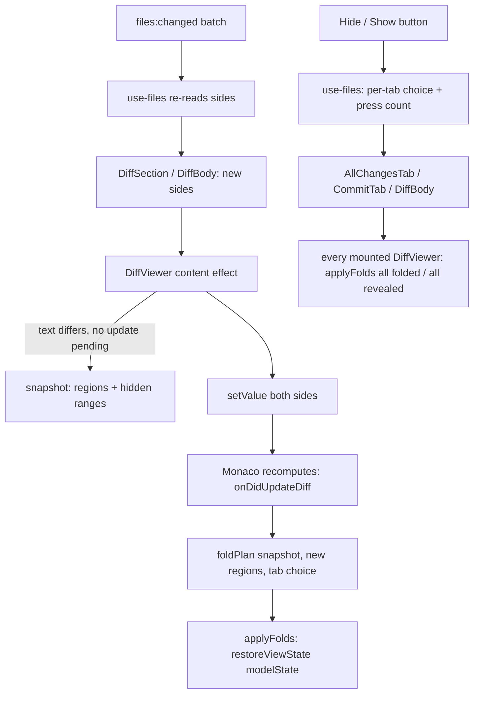

# Diff Fold Refresh Design

**Spec**: `.specs/features/diff-fold-refresh/spec.md`
**Status**: Draft (planned 2026-09-26; T1's measurement can send it back to the owner)

---

## The cause, as read in the code (to be measured by T1)

`DiffViewer` builds its editor once per mount (`DiffViewer.tsx:127-224`, deps `[renderable]`) and feeds
each new text with `models.original.setValue(...)` / `models.modified.setValue(...)`
(`DiffViewer.tsx:226-238`). `setValue` wipes every decoration of the model. Monaco carries the fold
state from one diff to the next through decorations: `updateUnchangedRegions`
(`node_modules/monaco-editor/esm/vs/editor/browser/widget/diffEditor/diffEditorViewModel.js:126-169`)
looks the previous regions up with `getDecorationRange(id)` (`:132-137`), gets `null` for every one,
so `hiddenRegions` is empty (`:148`), `LineRangeMapping.inverse` of nothing is the whole file (`:150`),
and every new region intersects "visible" and runs `showAll` (`setVisibleRanges`, `:399-408`). The
section expands on the first refresh that changes the text and stays expanded on every later one.

Two consequences for the fix:

1. **Replacing `setValue` with an edit does not meet the owner's rule.** Even with the decorations
   intact, Monaco's own transfer keeps *lines* visible that were visible: a region formed from lines
   that were a change or its context before (a change undone, a hunk that shrank) comes back revealed
   in whole or in part. The owner wants such a region folded (FOLD-04). A prefix/suffix edit would also
   collapse the decorations of every region between two changes written in one batch.
2. **So the app owns the fold state across a refresh.** It records which regions were revealed before
   the new text goes in, and applies its own plan once Monaco has recomputed the diff.

## Architecture Overview

## Code Reuse Analysis

| Component | Location | How to use |
| --------- | -------- | ---------- |
| The region rule Monaco uses | `diffEditorViewModel.js:347-375` (`UnchangedRegion.fromDiffs`), `rangeMapping.js:17-34` (`inverse`) | Mirrored as a pure function over `getLineChanges()`, so the app knows each region's left and right lines |
| `getLineChanges()` | `diffEditorWidget.js:340-346`, conversion `:543-575` | Public API; an insertion has `originalEndLineNumber` 0 and a deletion `modifiedEndLineNumber` 0, which the pure function reverses into empty line ranges |
| `saveViewState().modelState` | `diffEditorWidget.js:270-278` → `serializeState` (`diffEditorViewModel.js:263-268`) | Reads each region's hidden right-side range as `{ collapsedRegions: [{ range: [start, endExclusive] }] }` |
| `restoreViewState({ original, modified, modelState })` | `diffEditorWidget.js:279-289` → `restoreSerializedState` (`diffEditorViewModel.js:269-285`) | Writes the plan. Each region takes the first listed range it intersects or touches, clamped by `setState`. `original` and `modified` are passed as `{}`: truthy, so the call proceeds, and without `cursorState` the inner editors restore nothing (`codeEditorWidget.js:742-762`), so no cursor event reveals a line |
| `onDidUpdateDiff` | `DiffViewer.tsx:177-193` | The point where the new regions exist; the plan is applied there, synchronously, before the next paint |
| Per-worktree Files state | `use-files.ts:85-102` (`WorktreeFiles`), `patchFiles` `:238-246` | Holds the per-tab choice, next to the tabs |
| Close rules | `use-files.ts:687-735` (`closeTab`, `closeTabs`) | Drop the choice of every tab they close |
| Header buttons | `AllChangesTab.tsx:300-320`, `.all-changes-toggle` | The two new buttons reuse the class |
| Diff toolbar | `FileTabs.tsx:350-406`, `.file-tabs-toggle` | The single diff tab's buttons sit with Open file, shown only when `diffTab` is set |

## Components

### Region rules (`src/renderer/src/lib/diff-view.ts`)

- **Purpose**: know the unchanged regions and their fold states without Monaco, so every decision is unit-tested.
- **Interfaces**:
  - `UNCHANGED_REGIONS = { contextLineCount: 3, minimumLineCount: 3, revealLineCount: 20 }`, which `DiffViewer` passes to `hideUnchangedRegions` so the rule and the editor cannot drift (FOLD-10).
  - `unchangedRegions(changes: LineChangeLike[], originalLines: number, modifiedLines: number): Region[]`, where `Region = { original: LineSpan; modified: LineSpan }` and `LineSpan = { start: number; end: number }` (end exclusive). Mirrors `fromDiffs` with the constants above.
  - `hiddenRangesOf(modelState: unknown): LineSpan[] | null`: `null` when the shape is not `{ collapsedRegions: [{ range: [number, number] }] }` (FOLD-25).
  - `regionStates(regions: Region[], hidden: LineSpan[]): RegionState[]`, with `RegionState = { region: Region; revealedTop: number; revealedBottom: number }`: folded is `0/0`, revealed is `top + bottom = length`.
  - `foldPlan(previous: RegionState[] | null, next: Region[], choice: 'hide' | 'show' | null, leftChanged: boolean): LineSpan[]`: the ranges to hand to `restoreViewState`. A revealed region gets the empty span at its start; a folded one its whole right side; a partial one `[start + top, end - bottom)`. Matching is by left-side overlap (FOLD-02, 03, 05, 06); `leftChanged` or `previous === null` means every region takes `choice` or folded (FOLD-07, 26); `choice === 'show'` makes unmatched regions revealed (FOLD-15).
  - `choicePlan(next: Region[], choice: 'hide' | 'show'): LineSpan[]`: every region folded, or every region revealed (FOLD-12, 13, 14).
- **Reuses**: nothing but the line-range arithmetic; no Monaco import, so it stays pure.

### Tab choice rules (`src/renderer/src/lib/files-view.ts`)

- **Purpose**: the per-tab memory of the last button, as pure functions over a record keyed by tab key.
- **Interfaces**:
  - `type UnchangedChoice = { mode: 'hide' | 'show'; press: number }`; `type UnchangedChoices = Record<string, UnchangedChoice>`.
  - `pressUnchanged(choices, key, mode): UnchangedChoices`: sets `mode`, increments `press` (a second press of the same button re-applies it, FOLD-12).
  - `keepUnchanged(choices, liveKeys): UnchangedChoices`: drops the choices of closed tabs (FOLD-21); All changes' key `ALL_CHANGES_KEY` is always live.

### `DiffViewer` (`src/renderer/src/components/DiffViewer.tsx`)

- **Purpose**: carry folds across a content refresh; apply a choice on press and on mount.
- **Interfaces**: new optional prop `unchanged?: UnchangedChoice | null`.
- **Behaviour**:
  - Content effect: when either side's text differs and no update is pending, snapshot `regionStates(unchangedRegions(getLineChanges(), ...), hiddenRangesOf(saveViewState()?.modelState))` and the left text; mark the update pending; `setValue` as today; restore `scrollTop` as today. A second change before the recompute keeps the first snapshot (FOLD-08).
  - `onDidUpdateDiff`: if an update is pending, clear it, compute the new regions and `applyFolds(foldPlan(snapshot, next, choice, leftChanged))`. On the first diff of a mount, apply `choicePlan` when a choice exists (FOLD-14, 23).
  - Choice effect on `unchanged.press`: apply `choicePlan` to the current regions (FOLD-12, 13).
  - `applyFolds(editor, spans)`: the only place that writes Monaco's internal shape: `restoreViewState({ original: {}, modified: {}, modelState: { collapsedRegions: spans.map((s) => ({ range: [s.start, s.end] })) } } as IDiffEditorViewState)`.
  - If `hiddenRangesOf` answers `null`, no snapshot is taken and the update runs as today (FOLD-25).

### State and buttons

- `use-files.ts`: `WorktreeFiles.unchanged: UnchangedChoices`; `UseFiles.unchangedFor(key)` and `UseFiles.pressUnchanged(key, mode)`; `closeTab`/`closeTabs` run `keepUnchanged` over the surviving keys. Nothing reaches `onPersist` (FOLD-22).
- `AllChangesTab.tsx`: props `unchanged` and `onUnchanged(mode)`; the two buttons after Collapse all; passes `unchanged` to every `DiffSection`, which passes it to `DiffViewer`.
- `CommitTab.tsx`: passes both props through to its `AllChangesTab` (FOLD-17).
- `FileTabs.tsx`: wires All changes (`ALL_CHANGES_KEY`), commit tabs and diff tabs (their `tabKeyOf`) to `files.unchangedFor` / `files.pressUnchanged`; the diff toolbar shows the two buttons while `diffTab` is set (FOLD-18).

## Error Handling Strategy

| Error scenario | Handling | User impact |
| -------------- | -------- | ----------- |
| `modelState` not in the expected shape (a Monaco upgrade) | `hiddenRangesOf` returns `null`; no snapshot, no plan | The refresh behaves as today; the smoke's FOLD checks fail on the upgrade branch |
| The editor disposed while an update is pending | The disposer drops the pending snapshot with the listeners | None |
| A side becomes unreadable mid-write (placeholder) | `renderable` flips, the editor is rebuilt on return (`DiffViewer.tsx:224`) | Folded again on return, or per the tab's choice |

## Risks & Concerns

| Concern | Location (file:line) | Impact | Mitigation |
| ------- | -------------------- | ------ | ---------- |
| Monaco's serialized fold state is internal (`modelState: unknown` in `editor.api.d.ts:2652-2656`) | `diffEditorViewModel.js:263-285` | An upgrade can change the shape silently | `monaco-editor` is pinned exactly (`"0.56.0"` in `package.json`); `hiddenRangesOf` validates the shape and degrades to today's behaviour; one adapter (`applyFolds`) writes it; the smoke's FOLD checks fail on a changed shape. Recorded as AD-046 below |
| The mirrored region rule can drift from Monaco's | `diffEditorViewModel.js:347-375` | Plans would target the wrong lines | One constant object feeds both the editor options and the rule; unit fixtures follow Monaco's rule line by line; T1 and T11 assert exact strip counts in the running app, which only match if the rule matches |
| `restoreSerializedState` matches by intersect-or-touch (`lineRange.js:103-110` returns an empty range when two ranges touch) | `diffEditorViewModel.js:277-281` | A span could land on a neighbouring region | Regions are separated by at least one change and its context, so a span inside one region never touches another; a unit test pins that the plan's spans stay inside their region |
| Restoring cursor state would reveal the cursor's line (`hideUnchangedRegionsFeature.js:65-88`) | `codeEditorWidget.js:742-762` | Line 1's region would open on every refresh | `applyFolds` passes `{}` for both inner states, so no cursor is restored |
| The smoke's seed has no file long enough to fold | `scripts/smoke-files-diff.mjs:26-38` | No FOLD check could observe a strip | T1 seeds `fold/long.ts` and `fold/other.ts`, committed unchanged on main so every earlier section is unaffected |
| `DiffViewer` has no unit tests; `AllChangesTab.tsx` neither (STATE.md notes it) | `src/renderer/src/components/` | The wiring is only proven by the smoke | Every decision is a pure function in `diff-view.ts` / `files-view.ts` (L-018); components only pass answers |

## Tech Decisions

| Decision | Choice | Rationale |
| -------- | ------ | --------- |
| Which issue candidate | Save and restore the fold state around `setValue`, with an app-computed plan | An edit instead of `setValue` keeps Monaco's line-wise transfer, which reveals new regions built from formerly visible lines (FOLD-04) and loses regions between two changes of one batch |
| One write path for folds | `restoreViewState` with `modelState` for refresh, press and mount | One internal surface instead of two; `collapseAllUnchangedRegions` / `showAllUnchangedRegions` (`diffEditorWidget.js:499-518`) exist at runtime but are untyped too, and cannot express a per-region plan |
| Where the choice lives | `use-files`, per worktree, keyed by tab key | The issue puts it in the Files view state; `AllChangesTab` and `DiffBody` unmount on every tab switch (`FileTabs.tsx:128-130`), so component state would forget it |
| Region identity | Left-side line overlap | The left side is the committed version, which the agent's writes do not move; right-side numbers shift with every insertion above |

> **AD-046: the diff viewer owns its fold state across a refresh.** It
> computes the unchanged regions from `getLineChanges()` with Monaco's own rule and the shared
> `UNCHANGED_REGIONS` constants, and writes folds only through `restoreViewState`'s `modelState`,
> an internal shape of the pinned `monaco-editor` 0.56.0, validated on read. Any Monaco upgrade re-runs
> the Files diff smoke's FOLD checks before merging.
