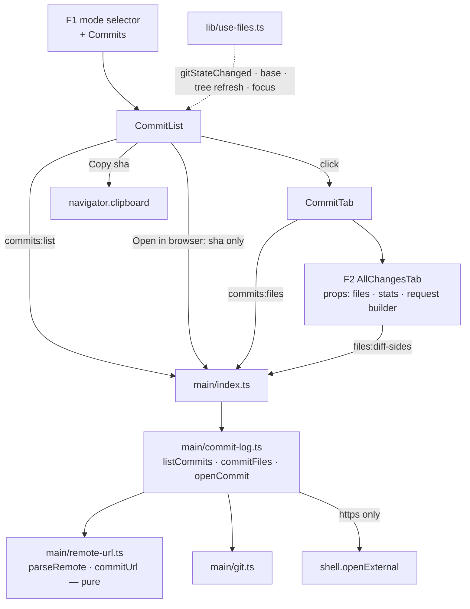

# Files Direction — Commits (F3) Design

**Spec**: `.specs/features/files-commits/spec.md`
**Status**: Draft
**Stacked on**: `feature/files-diff` (F2) — the commit tab is F2's `AllChangesTab`, and every diff side goes through F2's `readDiffSides`

---

## Architecture Overview

F3 adds one main module that reads the log, one pure module that understands remote URLs, and a
commit list in F1's left column. A commit opens in a tab that mounts F2's `AllChangesTab` with that
commit's files. **The renderer never holds a URL**: it sends a sha, and main builds, checks and opens
the page.



**Decisions** (owner-confirmed at Design):

| Axis | Choice | Rejected |
| ---- | ------ | -------- |
| D1 Not-pushed freshness after a push | Recompute when the status bar finishes an operation — it already calls `onRefreshTree` on success, so the Files hook follows the tree's identity — and on window focus with the same 5 s debounce `App.tsx:165` uses. **Added FCMT-32** | Watching `refs/remotes/<remote>/<branch>` and `packed-refs` (the latter changes for unrelated reasons); accepting stale markers until the next commit |
| D2 Reusing the stack | F2's `AllChangesTab` takes its data through props — **F2's design and T16 amended now**, before F2 is executed | A refactor task in F3 against already-verified F2 code |

Decided without a question (technical, no product consequence):

| Decision | Choice | Why |
| -------- | ------ | --- |
| Where the URL is built | Main, from a sha | FCMT-28. Also avoids the template's `setWindowOpenHandler` (Risks) |
| Paging | Cursor, not offset: the next page starts at the last listed commit's first parent | If `HEAD` moves between pages, `--skip` duplicates or drops rows; a cursor cannot |
| Merge and root diffs | Always pass `<sha>^1 <sha>`, and `--root <sha>` for a root commit | **Measured**: `git diff-tree -r <merge>` on this repo's merge `7cef47a` prints **0** lines, `git diff-tree -r <merge>^1 <merge>` prints **24**. Without the explicit parent every merge would read "no changes" |
| Copy | `navigator.clipboard.writeText` | Already the app's copy path (`HoursView.tsx:148`, `TerminalPane.tsx:280`) |

---

## Code Reuse Analysis

| Component | Location | How to use |
| --------- | -------- | ---------- |
| `AllChangesTab` (props-driven, as amended) | F2 | The whole commit tab body (FCMT-19) |
| `readDiffSides` + `DiffRef` | F2 `file-diff.ts` | Each file's sides: `{ rev: parent }` → `{ rev: sha }` — **no change to F2's main code** |
| `parseNumstat` | F2 `file-diff.ts` | A commit's per-file counts (`diff-tree --numstat -z`, same format) |
| `parseNameStatus` | F1 `file-tree.ts` | A commit's changed files (`diff-tree --name-status -z`, same format) |
| Merge base, base picker, no-`origin/HEAD` prompt | F1 | Shared with diff-to-origin (FCMT-06/07) |
| `ui.files` per-worktree mode map | F1 `config.ts` | `commits` becomes a fourth persisted mode (FCMT-11) |
| `gitStateChanged` from `FileWatcher` | F1 | New commit / amend / reset / rebase (FCMT-29) |
| `relativeTime`, with the `d ago` tier status-bar T10 adds | `relative-time.ts` | Row dates (FCMT-03) |
| `WorktreeNode.changes` | tree snapshot | The uncommitted row's N (FCMT-14), no call |
| `git.ts` | status-bar | Every git call |
| `tabKeyOf` / `tabsAfterClose` | F2 / F1 | Extended for commit tabs |

---

## Components

### Main process

#### `src/main/commit-log.ts` (new)

- `listCommits(worktreePath, base, cursor?): Promise<CommitPage>` — `git log --first-parent -n 101 --format=<fields> <start> ^<mergeBase>`, where `<start>` is `HEAD` or `<cursor>^1`; the 101st row only sets `hasMore` (FCMT-02, 08, 09). Fields: `%H %h %an %ct %P %s %B`, separated by `%x1f`, records by `%x1e`
- `parseLog(stdout): CommitRow[]` — **pure**; `%P` with more than one parent marks a merge (FCMT-05); an empty subject becomes `(no subject)` (edge case)
- Not-pushed set: `git rev-list @{upstream}..HEAD`; a failing `@{upstream}` means no upstream, and every row is not pushed (FCMT-12/13)
- `browse`: the provider of the branch's upstream remote, or null — `git config branch.<branch>.remote`, then `git remote get-url <remote>`, then `parseRemote` (FCMT-23, 26)
- `commitFiles(worktreePath, sha): Promise<CommitDetail>` — parent from `git rev-parse <sha>^1` (fails → root); `git diff-tree -r -M -z --name-status <parent> <sha>` or `--root <sha>`, and the same with `--numstat` (FCMT-16, 17, 18)
- `openCommit(worktreePath, sha): Promise<LaunchResult>` — resolves the upstream remote as above, checks `git merge-base --is-ancestor <sha> @{upstream}`, builds the URL with `commitUrl`, **asserts it starts with `https://`**, then `shell.openExternal` (FCMT-24, 25, 28)

#### `src/main/remote-url.ts` (new — pure, unit-tested; F4 / F5 reuse it)

- `parseRemote(url: string): RemoteRef | null`
  - GitHub: `https://github.com/<owner>/<repo>(.git)`, `git@github.com:<owner>/<repo>(.git)`, `ssh://git@github.com/<owner>/<repo>(.git)`
  - Azure DevOps: `https://[<user>@]dev.azure.com/<org>/<project>/_git/<repo>`, `git@ssh.dev.azure.com:v3/<org>/<project>/<repo>`, `https://<org>.visualstudio.com/[DefaultCollection/]<project>/_git/<repo>`
  - Anything else → null (FCMT-26, 27)
  - Userinfo is discarded, so a `https://user:token@…` remote never leaks its credential (edge case); each path segment is decoded, so a project named with spaces round-trips
- `commitUrl(ref: RemoteRef, sha: string): string` — `https://github.com/<owner>/<repo>/commit/<sha>` or `https://dev.azure.com/<org>/<project>/_git/<repo>/commit/<sha>`, every segment re-encoded

#### IPC

| Channel | Req | Res | ACs |
| ------- | --- | --- | --- |
| `commits:list` | `{ worktreePath, base, cursor? }` | `CommitPage` | 02–10, 12, 13, 23, 26 |
| `commits:files` | `{ worktreePath, sha }` | `CommitDetail` | 16–18 |
| `commits:open` | `{ worktreePath, sha }` | `LaunchResult` | 24, 25, 28 |

### Renderer

#### `src/renderer/src/lib/commit-view.ts` (new — pure, unit-tested)

- `commitDiffRequest(sha, parent, changed): DiffRequest` — `{ rev: parent }` → `{ rev: sha }`; root → original null; added / deleted / renamed as F2 (FCMT-17, 18)
- `commitTabTitle(row)` — `abc1234 · subject`; `(no subject)` fallback (FCMT-16)
- `mergePages(current, next)` — appends, dropping any sha already present (cursor paging makes this defensive only)
- `uncommittedRowLabel(n)` — `Uncommitted changes (N)`; null when N is 0 (FCMT-14)
- `browseState(row, page)` — `hidden` (no upstream or unknown host) · `disabled` (not pushed) · `enabled` (FCMT-23, 25, 26)

#### `src/renderer/src/components/CommitList.tsx` (new)

- Base picker (F1's), the uncommitted row, commit rows (short sha, subject, author, relative date, merge badge, not-pushed marker, full message in `title`), **Copy sha** (full sha) and **Open in browser** per `browseState`, **Load more**, empty and error states (FCMT-02..10, 12..15, 21..26)

#### `src/renderer/src/components/CommitTab.tsx` (new)

- Fetches `commits:files` once, then mounts F2's `AllChangesTab` with the commit's files, stats and `commitDiffRequest` bound to its sha and parent (FCMT-16..19); an error — e.g. an object removed by `gc` — renders git's line (edge case)

#### Modified

| File | Change | ACs |
| ---- | ------ | --- |
| `shared/files.ts` | `FilesMode` gains `'commits'`; `CommitRow`, `CommitPage`, `CommitDetail`, `RemoteRef` | 01, 11 |
| `lib/diff-view.ts` (F2) | `tabKeyOf` knows `commit:<sha>` | 20 |
| `lib/use-files.ts` | Commit pages per worktree in memory; commit tabs; refresh on `gitStateChanged`, base change, tree identity change and debounced focus | 11, 20, 29–32 |
| `components/FileTree.tsx` | Fourth option in the selector; renders `CommitList` in Commits mode | 01 |
| `components/FileTabs.tsx` | Renders commit tabs, closable | 20 |

---

## Data Models

```typescript
// src/shared/files.ts (additions)
export type FilesMode = 'full' | 'since-base' | 'uncommitted' | 'commits'

export interface CommitRow {
  sha: string
  shortSha: string
  subject: string
  /** Full message, for the row's tooltip (FCMT-04). */
  message: string
  author: string
  /** Commit date, epoch ms. */
  at: number
  isMerge: boolean
  pushed: boolean
}

export interface CommitPage {
  commits: CommitRow[]
  hasMore: boolean
  /** Cursor for Load more: the last row's sha. */
  cursor: string | null
  /** e.g. 'fork/feature/x'; null when the branch has no upstream (FCMT-13). */
  upstream: string | null
  /** Provider of the upstream remote; null hides Open in browser (FCMT-26). */
  browse: 'github' | 'azure-devops' | null
  error?: string
}

export interface CommitDetail {
  /** First parent; null for a root commit (FCMT-18). */
  parent: string | null
  files: ChangedPath[]
  stats: FileStat[]
  error?: string
}

export type RemoteRef =
  | { provider: 'github'; owner: string; repo: string }
  | { provider: 'azure-devops'; org: string; project: string; repo: string }
```

---

## Error Handling Strategy

| Scenario | Handling | User sees |
| -------- | -------- | --------- |
| No `origin/HEAD`, no base chosen | Same as F1 | Base prompt, empty list (FCMT-07) |
| `git log` fails | `CommitPage.error` | Git's line in place of the list |
| No upstream | `upstream: null`; every row not pushed; `browse: null` | Markers everywhere, no browser button (FCMT-13, 26) |
| Unknown host | `parseRemote` → null | No browser button (FCMT-26) |
| Open on a commit not reachable from upstream | `--is-ancestor` fails → `{ ok: false }` before any URL is built | Button already disabled; a race returns the existing toast |
| Commit object missing | `commitFiles` → `error` | Git's line in the tab (edge case) |
| Built URL not `https://` | Refused in main | Toast; nothing opened (FCMT-28) |

---

## Risks & Concerns

| Concern | Location | Impact | Mitigation |
| ------- | -------- | ------ | ---------- |
| **The template forwards any renderer-opened URL to the OS** | `src/main/index.ts:194` — `setWindowOpenHandler` → `shell.openExternal(details.url)`, unvalidated | Any `window.open` or `target=_blank` link reaches the OS shell verbatim. Pre-existing, not introduced by F3 | F3 never goes through it: the renderer sends a sha over `commits:open`. **Recommended follow-up outside this epic**: restrict that handler to `https:` |
| `diff-tree` on a merge with one argument is empty | verified on `7cef47a` | Every merge would read "no changes" | Explicit `<sha>^1 <sha>`; a merge commit is a unit-test fixture |
| Not-pushed markers after a push | `refs/remotes/…`, loose or packed | Stale markers right after the app's own push | D1 / FCMT-32 |
| `branch.<name>.remote` absent although `@{upstream}` resolves (a remote-less tracking setup) | `commit-log.ts` | Browser button resolves no remote | Treated as no upstream for browsing only (`browse: null`); markers still use `@{upstream}` |
| Detached `HEAD` | `commit-log.ts` | No branch config to read | List works from `HEAD`; `browse: null` (edge case) |
| ADO URL variants beyond the three recognized | `remote-url.ts` | A valid ADO remote not recognized → no button | Degrades to hidden, never to a wrong URL; the parser is table-tested and trivially extended |
| `App.tsx` focus handler refreshes only tasks | `App.tsx:167` | Relying on "the tree refreshes on focus" would be wrong | The Files hook registers its own debounced focus listener (D1) |

---

## Test Strategy

| Layer | Test type | What it proves |
| ----- | --------- | -------------- |
| `parseRemote`, `commitUrl` | unit (pure, table) | Every recognized form, credential stripping, encoded project names, unknown hosts → null, output always `https://` |
| `parseLog` | unit (pure) | Fields with separators in the body, merges, empty subject |
| `commit-log.ts` against a temp repo with a bare remote | unit (real git) | First-parent listing across a merged branch, cursor paging with 101 rows, not-pushed set with and without upstream, merge and root `commitFiles`, `openCommit` refusing an unpushed sha before building a URL |
| `commit-view.ts` | unit (pure) | Diff requests incl. root, tab title, page merge, uncommitted label, browse state |
| `CommitList`, `CommitTab`, hook and selector changes | none — hand-verified + CDP smoke | Per `TESTING.md` |

`openCommit`'s final `shell.openExternal` is the thin shell; the URL it receives is fully unit-tested before that line.

---

## Requirement Coverage

| Component | ACs |
| --------- | --- |
| `commit-log.ts` | 02, 05, 08, 09, 12, 13, 16, 17, 18, 23, 24, 25, 26, 28 |
| `remote-url.ts` | 23, 26, 27, 28 |
| `commit-view.ts` | 14, 16, 17, 18, 23, 25, 26 |
| `CommitList.tsx` | 02–10, 12–15, 21–26 |
| `CommitTab.tsx` | 16–19 |
| `use-files.ts` | 11, 20, 29, 30, 31, 32 |
| `FileTree.tsx` | 01 |
| `FileTabs.tsx` / `diff-view.ts` | 20 |
| `shared/files.ts` | 01, 11 |

Every one of FCMT-01..32 appears at least once.
