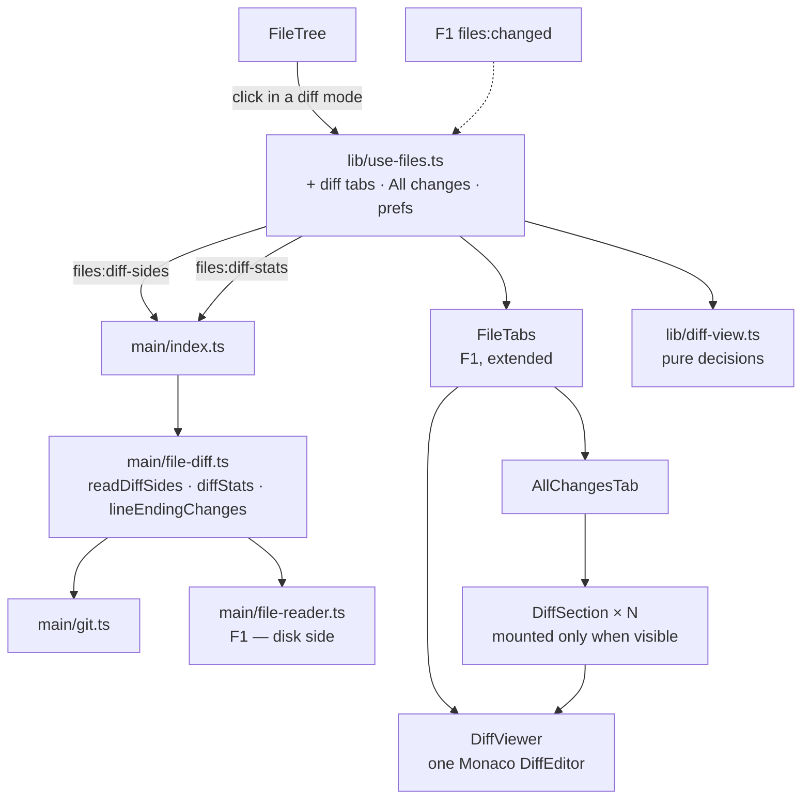

# Files Direction — Diffs (F2) Design

**Spec**: `.specs/features/files-diff/spec.md`
**Status**: Draft
**Stacked on**: `feature/files-explore` (F1) — extends its view, tab model, watcher, reader and Monaco setup

---

## Architecture Overview

Main produces **both sides of a diff as plain data** — content per side, plus which lines changed
line ending — and the per-file added/removed counts. The renderer shows them in Monaco's
`DiffEditor`: one editor per diff tab, and one per *visible* section of the All changes tab.



**Chosen approaches** (owner-confirmed):

| Axis | Choice | Rejected |
| ---- | ------ | -------- |
| D1 All changes | One `DiffEditor` per section, mounted by `IntersectionObserver` when the section is expanded and near the viewport, sized to its content so the page has a single scroll, capped at 12 live editors with the farthest unmounted first; the last measured height is kept so unmounting never moves the scroll | One synthetic concatenated document in a single editor — line numbers stop being the file's, collapsing a section becomes view-zone surgery, and a binary file in the middle has no place |
| D2 Line endings | Main compares the raw bytes of both sides and returns the modified-side lines whose terminator changed; the viewer shows a strip (`CRLF → LF on 12 lines`) and a glyph-margin marker per line | A strip only (says *that*, not *where*); accepting Monaco's normalization (a whole-file flip would read "no changes") |
| D3 Whitespace | Monaco's `ignoreTrimWhitespace` plus hiding D2's strip and markers; FDIF-16 reworded to match | A hand-computed diff ignoring all whitespace — it abandons Monaco's diff and its word-level highlighting |

---

## Code Reuse Analysis

| Component | Location | How to use |
| --------- | -------- | ---------- |
| `monaco-setup.ts` | F1 T13 | Same Monaco instance and worker; `createDiffEditor` comes from the `editor.api` import F1 already makes. **No new worker**: Monaco computes diffs in the base `editor.worker` |
| `readForView` / `isBinary` / 1 MB cap | F1 `file-reader.ts` | The disk side of an uncommitted diff |
| `FileContent` union | F1 `shared/files.ts` | Each side's content type, extended with `absent` |
| `ChangedPath` (with `oldPath`) | F1 `shared/files.ts` | Which file, which status, where a rename came from |
| `changedSince` / merge base | F1 `file-tree.ts` | The base side's revision |
| `FileWatcher` + `files:changed` | F1 `file-watcher.ts` | Live uncommitted diffs; `gitStateChanged` refreshes everything else |
| `FileTabs`, `tabsAfterClose`, `launcherTarget` | F1 | Extended to diff tabs and the fixed All changes tab |
| `FilePlaceholder` | F1 | Binary / too large per side (FDIF-06, FDIF-23) |
| `git.ts` | status-bar T1 | `git cat-file -s`, `git show`, `git diff --numstat -z` |
| Flat `ui.*` preferences | `config.ts` | `diffLayout`, `diffIgnoreWhitespace` |

---

## Components

### Main process

#### `src/main/file-diff.ts` (new)

- **Purpose**: Produce the two sides of one diff, and the change counts for a mode.
- **Interfaces**:
  - `readDiffSides(worktreePath: string, req: DiffRequest): Promise<DiffSides>` — each side is a `DiffRef`: a revision (`{ rev, path }`) or the disk (`{ disk: true, path }`). Revisions are read with `git cat-file -s <rev>:<path>` **first**, so a blob above 1 MB is never read (FDIF-06), then `git show <rev>:<path>`. A side the status says does not exist is `absent` (FDIF-03/04). A rename reads the original from `oldPath` (FDIF-05)
  - `lineEndingChanges(originalRaw: Buffer, modifiedRaw: Buffer, lineMap): number[]` — **pure**. Returns the modified-side line numbers whose terminator differs from the matching original line; a whole-file flip returns every line
  - `diffStats(worktreePath: string, mode: FilesMode, base?: string): Promise<FileStat[]>` — `git diff --numstat -z <mergeBase> HEAD` for diff-to-origin, `git diff --numstat -z HEAD` for uncommitted, **plus a line count of each untracked file**, which numstat does not report
  - `parseNumstat(stdout: string): FileStat[]` — **pure**; `-\t-` means binary
- **Generic on purpose**: `DiffRef` is revision-or-disk, so F3's commit diff is `readDiffSides(p, { original: { rev: 'abc^' }, modified: { rev: 'abc' } })` with no change here
- **Failure posture**: never throws; a failed side is `{ kind: 'error', message: gitFailureLine(err) }`

#### IPC

| Channel | Req | Res | ACs |
| ------- | --- | --- | --- |
| `files:diff-sides` | `{ worktreePath, request: DiffRequest }` | `DiffSides` | 01–07, 15, 30–32 |
| `files:diff-stats` | `{ worktreePath, mode, base? }` | `FileStat[]` | 19, 20, 24 |

### Renderer

#### `src/renderer/src/lib/diff-view.ts` (new — pure, unit-tested)

- `diffRequestFor(mode, changed: ChangedPath, mergeBase): DiffRequest` — the reference table of FDIF-01..05 in one function: which revision or disk on each side, which side is absent, where a rename reads from
- `tabKeyOf(tab): string` and `isSameTab(a, b)` — diff tabs keyed by (mode, path), distinct from file tabs (FDIF-08)
- `tabsWithAllChanges(tabs, mode)` — inserts the fixed first tab in diff modes and removes it in full-folder mode (FDIF-17/18)
- `tabsAfterClose` (F1) extended: the All changes tab is never closable
- `initialExpansion(files: FileStat[]): Set<string>` — the first 10 in tree order (FDIF-21)
- `totals(files: FileStat[]): { files; added; removed }` — the stack header (FDIF-20)
- `nextChangeTarget(position, sections): Target` — within a file, or across to the next section's first change (FDIF-25/26)
- `eolStripText(lines: number[], from: Eol, to: Eol): string` — `CRLF → LF on 12 lines` (FDIF-15)
- `mountPlan(visible: string[], mounted: string[], cap = 12): { mount; unmount }` — which sections to mount and which to drop, farthest first (FDIF-22, D1)

#### `src/renderer/src/components/DiffViewer.tsx` (new)

- One Monaco `DiffEditor`, both sides read-only (`readOnly`, `originalEditable: false`, FDIF-07); `renderSideBySide` from the layout preference (FDIF-11/12); `ignoreTrimWhitespace` from the whitespace preference (FDIF-16); `hideUnchangedRegions` enabled with a small context (FDIF-13/14)
- The EOL strip above the editor and glyph-margin decorations on the listed lines, both hidden while whitespace is ignored (FDIF-15/16)
- `fitContent` mode for sections: height follows the larger of the two inner editors' content height, re-measured on `onDidContentSizeChange` — which also fires when the user unfolds a region
- Next / previous change through the diff editor's own navigation; **"identical" message** when the editor reports no line changes (edge cases)
- On a content refresh, the modified model's value is replaced and the scroll position restored (FDIF-30)

#### `src/renderer/src/components/AllChangesTab.tsx` + `DiffSection.tsx` (new)

- **Data-driven through props, not tied to the Files mode** — it receives the file list, the `FileStat[]` and a `(changed) => DiffRequest` builder. **[amended at F3 Design]** F3's commit tab mounts this same component with a commit's files and a `sha^1 → sha` builder; wiring it to the mode here would force a refactor of verified code there
- The stack header with totals (FDIF-20); one `DiffSection` per `FileStat`, in tree order (FDIF-19); empty state (FDIF-24)
- `DiffSection` renders its header always, and its `DiffViewer` only when `mountPlan` says so; while unmounted it holds its last measured height (D1)
- Binary sections show `FilePlaceholder` in place of an editor (FDIF-23)

#### Modified (F1 files)

| File | Change | ACs |
| ---- | ------ | --- |
| `lib/use-files.ts` | Diff tabs, the All changes tab, stats per mode, the two preferences, refresh on `files:changed` / `gitStateChanged` / base change | 08, 09, 17, 21, 30–32 |
| `components/FileTree.tsx` | A click in a diff mode opens a diff tab | 01, 02, 10 |
| `components/FileTabs.tsx` | Renders diff tabs and the fixed All changes tab; **Open file** on diff tabs (hidden for deleted files); layout and whitespace toggles; next / previous buttons | 12, 16, 17, 25, 27, 28, 29 |
| `components/CodeViewer.tsx` | Drops the "not a diff yet" label | 10 |
| `src/shared/config.ts` | `ui.diffLayout?`, `ui.diffIgnoreWhitespace?` | 12, 16 |
| `src/shared/files.ts` | The new types below | — |

---

## Data Models

```typescript
// src/shared/files.ts (additions)
export type DiffRef =
  | { rev: string; path: string }
  | { disk: true; path: string }

export interface DiffRequest {
  /** null = the side does not exist (added / deleted file). */
  original: DiffRef | null
  modified: DiffRef | null
}

export type DiffSide = FileContent | { kind: 'absent' }

export type Eol = 'LF' | 'CRLF' | 'CR'

export interface DiffSides {
  original: DiffSide
  modified: DiffSide
  /** Modified-side line numbers whose terminator differs from the original's. */
  eolChanged: number[]
  /** Dominant endings, for the strip text. */
  eolFrom?: Eol
  eolTo?: Eol
}

export interface FileStat {
  path: string
  added: number
  removed: number
  binary: boolean
}
```

```typescript
// src/shared/config.ts (additions to ui)
diffLayout?: 'side-by-side' | 'inline'   // absent = side by side (FDIF-11)
diffIgnoreWhitespace?: boolean           // absent = false (FDIF-15)
```

---

## Error Handling Strategy

| Scenario | Handling | User sees |
| -------- | -------- | --------- |
| A side above 1 MB | `cat-file -s` before `show`; disk side via F1's `stat`-first reader | Placeholder, no editor (FDIF-06) |
| A side binary | NUL sniff (F1) on the blob or file | Placeholder (FDIF-06, 23) |
| Base deleted | `merge-base` fails | F1's base prompt (edge case) |
| `git show` fails for a side | `{ kind: 'error' }` | Git's line in place of the editor |
| Identical content (mode bit only, or whitespace hidden) | Monaco reports no line changes | "The content is identical" (edge cases) |
| File disappears while its uncommitted diff is open | `files:changed` → re-read → modified side `absent` | The diff becomes a deletion |

---

## Risks & Concerns

| Concern | Location | Impact | Mitigation |
| ------- | -------- | ------ | ---------- |
| **Monaco normalizes line endings in its model** | Monaco `TextModel` | A CRLF ↔ LF change is invisible in its diff — FDIF-15 could not hold | D2: detection in main from raw bytes. **High confidence, not measured** — the F2 spike loads a CRLF / LF pair and confirms Monaco reports no change, which is also the test that proves D2 is needed |
| Monaco API surface assumed, not verified on 0.56 | `hideUnchangedRegions`, diff navigation, `onDidContentSizeChange` on the inner editors | The fold, the navigation and the section sizing all rest on them | **F2 opens with a spike** exercising exactly these three on the version F1 pinned, before any F2 component is written |
| **Next / previous shortcut** | FDIF-25 | The grill question named F7 / Shift+F7; in VS Code that may be the accessible diff viewer. The design targets VS Code's compare-editor next / previous change (`Alt+F5` / `Shift+Alt+F5`), **to verify against VS Code's keyboard shortcuts at execution** | The task carries the check; if VS Code's binding differs, the task follows VS Code and records it |
| Many live editors | `AllChangesTab` | Memory and mount cost on a 200-file branch | `mountPlan` with a cap of 12; unmounting keeps the measured height; models are disposed with their editor |
| Section height before first mount | `DiffSection` | An unknown height makes the scrollbar jump as sections mount | Estimate from `added + removed` and the fold's context lines until measured; measured heights are kept across remounts |
| Untracked files missing from `numstat` | `diffStats` | Uncommitted totals would omit new files | Count their lines in main; the uncommitted header therefore differs from `git diff --shortstat HEAD`, which also omits them — expected, and the spec's `--shortstat` criterion is scoped to the branch |
| A diff tab and a file tab for the same path | tab model | Confusion about which is which | Distinct tab keys (FDIF-08) and a diff glyph on diff tabs |
| `ignoreTrimWhitespace` is narrower than "all whitespace" | FDIF-16 | A double space inside a line still shows | Accepted and written into FDIF-16 (D3) |

---

## Tech Decisions

| Decision | Choice | Rationale |
| -------- | ------ | --------- |
| Blob size check | `git cat-file -s` before `git show` | Honours the 1 MB cap without reading a large blob |
| EOL detection location | Main, on raw bytes | The renderer only ever sees decoded, normalized text |
| Section sizing | Fit to content, single outer scroll | A stack of inner-scrolling editors is unusable with a wheel |
| Live-editor cap | 12 | About two screens of expanded sections; tunable constant with a test |
| `DiffRef` shape | Revision or disk, per side | F3 reuses the whole path for `commit^` → `commit` with no change to main |

No project-level decision beyond F1's proposals.

---

## Test Strategy

| Layer | Test type | What it proves |
| ----- | --------- | -------------- |
| `lineEndingChanges`, `parseNumstat` | unit (pure) | Whole-file flip, mixed endings, a CR-only file, binary numstat rows |
| `file-diff.ts` against a temp repo | unit (real git) | Every reference of FDIF-01..05, the 1 MB blob refused unread, untracked line counts, a base that no longer exists |
| `diff-view.ts` | unit (pure) | The reference table, tab keys, the fixed tab, initial expansion, totals, cross-file navigation, the strip text, the mount plan with its cap |
| `DiffViewer`, `AllChangesTab`, `DiffSection`, tab and tree changes | none — hand-verified + CDP smoke | Per `TESTING.md` |
| Monaco diff spike | manual | EOL normalization, unchanged-region folding, navigation API, content-size events |

---

## Requirement Coverage

| Component | ACs |
| --------- | --- |
| `file-diff.ts` | 01–06, 15, 19, 20, 24 |
| `diff-view.ts` | 01–05, 08, 17, 18, 20, 21, 22, 25, 26 |
| `DiffViewer.tsx` | 07, 11, 12, 13, 14, 15, 16, 25, 30 |
| `AllChangesTab.tsx` / `DiffSection.tsx` | 19–24, 26 |
| `use-files.ts` | 08, 09, 17, 21, 30, 31, 32 |
| `FileTree.tsx` | 01, 02, 10 |
| `FileTabs.tsx` | 12, 16, 17, 25, 27, 28, 29 |
| `CodeViewer.tsx` | 10 |
| `config.ts` | 12, 16 |

Every one of FDIF-01..32 appears at least once.
