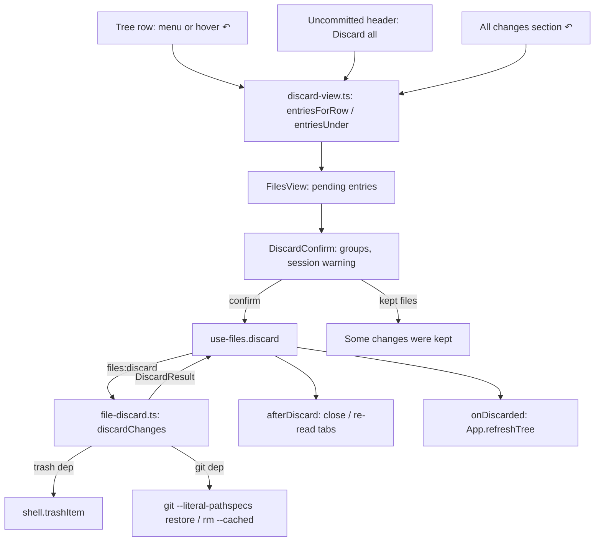

# Files Discard Design

**Spec**: `.specs/features/files-discard/spec.md`
**Status**: Approved (owner 2026-09-26); executed 2026-09-27

Line numbers below are from `feature/files-discard` as cut from `feature/file-icons` `422d68d`.
The branch is rebased onto `feature/files-status-glyphs` (#131) before Execute; `FileTree.tsx`
and `DiffSection.tsx` numbers move with it, and the #131 names used here (`changeStatusView`,
`StatusGlyph`, `.file-tree-end`, `.diff-section-end`, `.status-glyph`) come from the #131 plan
committed as `b0fae25`.

---

## Architecture Overview

The renderer decides **what** to discard, from the list it already shows; the main process
decides **how**, and is the only side that runs git or touches the Recycle Bin. One new IPC
channel joins them. Every outcome comes back as a value per file; nothing throws across the
channel.



---

## Code Reuse Analysis

### Existing Components to Leverage

| Component | Location | How to Use |
| --------- | -------- | ---------- |
| `git()` runner | `src/main/git.ts:15-35` | The only way to run git (AD-023): execFile, hidden window, `GIT_TERMINAL_PROMPT=0` |
| `GitRunner` type | `src/main/git.ts:42` | Injected, so tests can observe what the module did not run (a refused trash must run no git) |
| `gitFailureLine` | `src/main/git.ts:45-50` | Git's first stderr line as the kept reason |
| `resolveInside` | `src/main/file-reader.ts:46-52` | Lexical guard: a request path outside the worktree is kept, never touched; returns the backslashed absolute path `shell.trashItem` wants |
| `ChangedPath.oldPath` | `src/shared/files.ts:30-35` | Already the shape of a rename; the uncommitted list starts filling it |
| `diffRequestFor` / `originalRef` | `src/renderer/src/lib/diff-view.ts:29-55` | Already reads a rename's left side from `oldPath`; the parser fix is all the diff needs |
| `unquotePath` | `src/main/worktree-manager.ts:485-509` | Decodes git's C-quoting of the old path too |
| `buildTree` | `src/renderer/src/lib/files-view.ts:31-57` | Tree order for the confirmation's list |
| `tabsAfterClose` | `src/renderer/src/lib/files-view.ts:76-86` | Focus rule when discard closes tabs |
| Remove-worktree dialog | `RemoveWorktreeConfirm.tsx`, `NewWorktreeDialog.css` (`dialog-backdrop`, `dialog-panel`, `dialog-footer`, `dialog-btn-danger`), `RemoveWorktreeConfirm.css` (`rwc-*`) | Structure, focus-on-mount, Escape, backdrop click, session rows, wording "This can’t be undone." |
| Row context menu | `CommitList.tsx:52-65, 121-156` (`commit-ctx-menu`) | Window click / Escape dismissal, menu at `clientX/clientY` |
| Running-session rule | `WorktreeDetail.tsx:111`, `App.tsx:431` | `sessions.filter(s => s.cwd === worktreePath && s.status === 'running')` |
| Tree refresh after a git op | `App.tsx:523` (`onRefreshTree={refreshTree}` for the status bar) | Same callback after a discard, so the status bar count moves |
| #131 shared status | `change-status.ts` `changeStatusView`, `StatusGlyph.tsx` | The glyph each confirmation row shows |
| Real-git test pattern | `src/main/file-diff.test.ts:1-20`, `commit-log.test.ts` | `mkdtempSync` repo per test, `execFileSync('git', …)` setup |

### Integration Points

| System | Integration Method |
| ------ | ------------------ |
| IPC contract | `'files:discard': { req: { worktreePath: string; entries: ChangedPath[] }; res: DiscardResult }` in `src/shared/ipc-contract.ts`, next to the `files:*` channels (`:168-187`) |
| Main wiring | `handle('files:discard', …)` in `src/main/index.ts` beside `files:diff-stats` (`:333`), passing `trash: (p) => shell.trashItem(p)` |
| Preload / `api.ts` | None: the preload is a generic `invoke` pass-through (`src/preload/index.ts:10`) |
| File watcher | Unchanged. The discard's writes reach the renderer as ordinary `files:changed` batches (`use-files.ts:453-484`); `gitStateChanged` re-reads every open diff |
| Workflow ctx | `ctx` exposes `changedFiles` (`workflow-ctx.ts:81`); it gains the optional `oldPath`, additively |

---

## Components

### Uncommitted parser keeps the old path

- **Purpose**: A rename or copy entry carries `oldPath`.
- **Location**: `src/main/worktree-manager.ts:448-469` (`parseChangedFiles`); `ChangedFile` in `src/shared/worktrees.ts:129-133` gains `oldPath?: string`
- **Interfaces**: unchanged signatures; `R  old -> new` → `{ path: 'new', status: 'renamed', oldPath: 'old' }`; both sides unquoted separately (`R  "a b.txt" -> "c d.txt"`).
- **Dependencies**: `git status --porcelain` (v1, no `-z`, `worktree-manager.ts:434`). Only staged renames appear as `R`; an on-disk `mv` is ` D` plus `??`, which is not a rename to git and needs nothing here.
- **Reuses**: `unquotePath`.

### `file-discard.ts` (new, main)

- **Purpose**: Discard a list of uncommitted entries in one worktree; return one result per entry.
- **Location**: `src/main/file-discard.ts`
- **Interfaces**:
  - `discardChanges(worktreePath: string, entries: ChangedPath[], deps: DiscardDeps): Promise<DiscardResult>` — never rejects.
  - `interface DiscardDeps { trash: (absPath: string) => Promise<void>; run?: GitRunner; lstat?: (p: string) => Promise<Stats> }` — `run` defaults to `git`, `lstat` to `fs/promises.lstat`.
- **Dependencies**: git ≥ 2.23 (`restore`; the machine has 2.55), Electron's `shell.trashItem` through `trash`.
- **Reuses**: `git`, `gitFailureLine`, `resolveInside`.

**Algorithm.** Two phases, so the Recycle Bin always acts before git and git never runs for an
entry the Recycle Bin refused.

1. **Guard.** Every path of an entry (`path`, and `oldPath` when present) goes through
   `resolveInside`; any `null` keeps the entry with cause `outside`.
2. **Phase A, Recycle Bin, one entry at a time.** The entry's *bin paths* are:

   | Status | Bin paths | Then git (phase B) |
   | ------ | --------- | ------------------ |
   | `untracked` | `path` | none |
   | `added` | `path` | `rm --cached --quiet --ignore-unmatch -- path` |
   | `modified` | none | `restore --source=HEAD --staged --worktree -- path` |
   | `deleted` | `path` if something is on disk there (FDSC-47); `oldPath` likewise | `restore --source=HEAD --staged --worktree -- path [oldPath]` |
   | `renamed` | `path` (the new file); `oldPath` if something is on disk there (FDSC-47) | `restore --source=HEAD --staged --worktree -- oldPath path` |

   For each bin path: `lstat`; `ENOENT` skips it (FDSC-44); a symbolic link or junction
   (`isSymbolicLink()` is true for both on Windows) keeps the entry with cause `link` and stops;
   otherwise `await trash(abs)`, and a rejection keeps the entry with cause `recycle-bin` and
   stops. An untracked folder row (`dir/`) is one bin path; `resolveInside` drops the trailing
   slash, and the folder goes whole (FDSC-43).
3. **Phase B, git, for the entries phase A did not keep.** Always
   `git --literal-pathspecs …` (FDSC-09; a pathspec is a glob otherwise). Restores are batched:
   entries whose phase-B command is `restore` go in chunks whose joined paths stay under 8,000
   characters (the Windows command line is 32,767; FDSC-49). If a chunk's call fails, each entry
   of that chunk is re-run alone (restoring is idempotent), so a failure is attributed to its own
   entry with cause `git` and `gitFailureLine` (FDSC-08). `rm --cached` runs per added entry: it
   works on an unborn `HEAD`, where `restore --source=HEAD` fails with `fatal: could not resolve
   'HEAD'` (FDSC-46, measured).
4. An entry whose git step failed after phase A moved its file keeps cause `git`; the file stays in
   the Recycle Bin (FDSC-48).

Measured on git 2.55 in a scratch repo before planning: one `restore -SW` with `old new` after the
new file was moved away restores `old` and drops `new` from the index; `restore -SW` on an added
path whose file is gone removes the index entry; a batch holding one unknown pathspec fails whole
and restores nothing (hence the per-entry retry); `restore -SW` resolves a `UU` file to `HEAD`
(FDSC-50).

### IPC channel `files:discard`

- **Location**: `src/shared/ipc-contract.ts` (entry), `src/main/index.ts` (handler)
- **Interface**: request `{ worktreePath, entries }` only; no revision field exists to send (FDSC-42).

### `discard-view.ts` (new, renderer lib)

- **Purpose**: The pure decisions the components need, unit-tested (L-018).
- **Location**: `src/renderer/src/lib/discard-view.ts`
- **Interfaces**:
  - `entryForRow(list: ChangedPath[], rowPath: string): ChangedPath | null` — matches `dir` to a listed `dir/` (the tree drops the slash, `files-view.ts:34`).
  - `entriesUnder(list: ChangedPath[], folder: string): ChangedPath[]` — every entry at any depth under `folder/`, in tree order.
  - `discardGroups(entries: ChangedPath[]): { recycle: ChangedPath[]; restore: ChangedPath[] }` — `untracked`, `added`, `renamed` → recycle; `modified`, `deleted` → restore; tree order kept.
  - `keptReason(kept: DiscardKept): string` — the four FDSC-21 texts.
  - `confirmLabel(n: number): string`, `sessionWarning(n: number): string | null` — FDSC-12/14 wording.
  - `afterDiscard(tabs: TabKeyed[], entries: ChangedPath[], result: DiscardResult): { close: string[]; reread: string[] }` — for each discarded entry: close `diff:uncommitted:<path>`; for its file tab, close when the path is gone after the discard (`untracked`, `added`, `renamed`, or `deleted` with an `oldPath`), else re-read; re-read `file:<oldPath>`; for a `dir/` entry close file tabs under it. Kept entries touch nothing. Never closes a `diff:since-base:` tab or a commit tab.

### `use-files.ts` gains `discard`

- **Purpose**: Run the request and apply its consequences to this worktree's tabs.
- **Location**: `src/renderer/src/lib/use-files.ts`
- **Interfaces**: `discard(entries: ChangedPath[]): Promise<DiscardResult>` on `UseFiles`. Invokes `files:discard`, applies `afterDiscard` (closing through the `tabsAfterClose` focus rule, re-reading through `readTab`), re-lists the mode with `refreshMode`. A rejected invoke resolves to every entry kept with cause `git` and the error's message, so the dialog always has an answer.

### `DiscardConfirm` (new component)

- **Purpose**: The confirmation and, when needed, the kept list.
- **Location**: `src/renderer/src/components/DiscardConfirm.tsx` + `DiscardConfirm.css`
- **Props**: `entries`, `runningSessions: SessionView[]`, `busy`, `kept: { path; reason }[] | null`, `onCancel`, `onConfirm`, `onClose`.
- **Structure** (class names the smoke reads): `.dialog-panel.discard-confirm`; title `.discard-title`; groups `.discard-group[data-group="recycle"|"restore"]` with heading `.discard-heading` and rows `.discard-row[data-path]` (a `StatusGlyph` then the path; a rename row reads `old → new`); `.discard-sessions` with the warning and session titles; footer `Cancel` (`.dialog-btn-ghost`) and `.dialog-btn-danger.discard-confirm-btn`. Kept state: title `Some changes were kept`, rows `.discard-kept-row[data-path]` with `.discard-kept-reason`, one `Close` button.
- **Reuses**: `RemoveWorktreeConfirm`'s panel focus, Escape and backdrop handling, and its session row markup.

### `FilesView` orchestrates

- **Location**: `src/renderer/src/components/FilesView.tsx`; `App.tsx:496-503` passes the two new props.
- **State**: `pending: ChangedPath[] | null`, `busy`, `kept`. Hands `onDiscard(entries)` to `FileTree` and `FileTabs`. On confirm: `busy`, `files.discard(pending)`, then `onDiscarded()` (App's `refreshTree`, FDSC-31), then close, or show kept.
- **New props**: `runningSessions: SessionView[]`, `onDiscarded: () => void`.

### `FileTree`: menu, hover ↶, Discard all

- **Location**: `src/renderer/src/components/FileTree.tsx`, `FileTree.css`
- **Row restructure** (#131 hand-off): in `ChangedRows` a row becomes
  `<div class="file-tree-row" onContextMenu>` holding `<button class="file-tree-open">` (icon and
  `.file-tree-name`, `flex: 1`, the row's `title` and click) and `.file-tree-end` (the ↶ button
  `.file-tree-discard` first, then `StatusGlyph`). Folder rows get the same container with an end
  group holding only the ↶. The container keeps `.file-tree-row`, its padding and its indent, so
  #131's smoke (glyph flush with the row's right padding) and the icon smoke (`.file-tree-row` →
  `.file-tree-name`) read the same DOM. `FolderRows` (full mode) is untouched.
- **Mode gate**: menu, ↶ and header render only when `files.mode === 'uncommitted'`; `SinceBase`
  passes no discard handler, so diff-to-origin rows have none (FDSC-40).
- **Menu**: `.file-tree-ctx-menu` with one `.file-tree-ctx-item` `Discard changes`, dismissed by any
  window click or Escape (FDSC-03), as `CommitList` does.
- **Hover ↶**: `visibility: hidden` until `.file-tree-row:hover` or `:focus-within`; its click stops
  propagation and never reaches the open button (FDSC-37).
- **Header**: `.file-tree-uncommitted-header` above the rows with `.file-tree-discard-all`
  (`Discard all`), only while the list has an entry (FDSC-35).

### All changes section ↶

- **Location**: `DiffSection.tsx` (+ `.css`), `AllChangesTab.tsx`, `FileTabs.tsx:297`
- **Header restructure**: `<div class="diff-section-header">` container holding
  `<button class="diff-section-toggle" aria-expanded>` (chevron, path, counts) and
  `.diff-section-end` (the ↶ `.diff-section-discard` when `onDiscard` is given, then
  `StatusGlyph`). The FDIF smoke reads `aria-expanded` from `.diff-section-header` and clicks it
  (`smoke-files-diff.mjs:521-657`); those five reads move to `.diff-section-toggle` in the same
  task (L-080). #131's header checks keep working: the glyph is still inside `.diff-section-header`,
  last, flush with its padding.
- **Gate**: `AllChangesTab` gets `onDiscard?: (changed: ChangedPath) => void` and passes it to each
  section. `FileTabs` passes it only while `files.mode === 'uncommitted'`; `CommitTab.tsx:43` never
  does, so commit tabs have no ↶ by construction (FDSC-41).

### `undo` icon

- **Location**: `src/renderer/src/components/Icon.tsx` — a new `'undo'` name drawn in the set's
  24-unit, stroke-only style (a left hook and a return arc). The ↶ buttons render it at 13 px.

---

## Data Models

```typescript
// src/shared/files.ts
/** Why an entry was left as it was (FDSC-18, 21..23, 48). */
export type DiscardCause = 'recycle-bin' | 'link' | 'outside' | 'git'

export interface DiscardKept {
  cause: DiscardCause
  /** Git's first error line for `git`; the rejection's message for `recycle-bin`. */
  detail?: string
}

/** One entry's outcome; `kept` absent means discarded. */
export interface DiscardFileResult {
  path: string
  kept?: DiscardKept
}

export interface DiscardResult {
  files: DiscardFileResult[]
}
```

```typescript
// src/shared/worktrees.ts
export interface ChangedFile {
  path: string
  status: ChangeStatus
  /** The source path of a rename or a copy (FDSC-24). */
  oldPath?: string
}
```

---

## Error Handling Strategy

| Error Scenario | Handling | User Impact |
| -------------- | -------- | ----------- |
| Recycle Bin rejects a path | Entry kept, cause `recycle-bin`; no git for it | Listed under `Some changes were kept`: `The Recycle Bin refused it.` |
| Untracked link or junction | Entry kept, cause `link`; `trash` never called | `Links and junctions are never moved.` |
| Path outside the worktree | Entry kept, cause `outside`; nothing runs | `It is outside the worktree.` |
| Git fails (lock held, file locked by a process, stale entry unknown to git) | Chunk retried per entry; failing entry kept with cause `git` | Git's first error line |
| Git fails after the Recycle Bin took the file | Kept, cause `git`; file stays in the Recycle Bin | Git's line; the file is recoverable there |
| `files:discard` invoke rejects | `use-files.discard` maps it to every entry kept with cause `git` | Every file listed as kept with the error text |
| Untracked file already gone | Counted discarded | Nothing |

---

## Risks & Concerns

| Concern | Location (file:line) | Impact | Mitigation |
| ------- | -------------------- | ------ | ---------- |
| Whether `shell.trashItem` can permanently delete on a volume without a Recycle Bin. The typings only promise "Rejects if there was an error" (`node_modules/electron/electron.d.ts:13172-13183`, Electron 39.8.10); Electron's Windows implementation is remembered, not read, to abort a delete that would not recycle. **Uncertain.** | Electron native code, not in `node_modules` | A network-drive discard could lose a file if the memory is wrong | The module never deletes by itself (FDSC-17); the refusal path is unit-tested with an injected `trash`; the smoke header lists "discard an untracked file on a network share and see it kept" as a hand check the owner runs once |
| Moving a junction to the Recycle Bin | `file-reader.ts:43-45` (AD-013 junction) | Could reach a shared target folder | Links and junctions are kept (`lstat().isSymbolicLink()`), unit-tested with a real junction (`symlinkSync(…, 'junction')`, no admin needed) |
| Pathspecs are globs by default | every `git restore` call | `a[b].txt` also matches `ab.txt` | `--literal-pathspecs` on every call; unit test with both files |
| Command-line length on Windows | batched restore | A large Discard all fails outright | Chunks under 8,000 characters; unit test with 300 × 120-character paths |
| `trashItem` is one shell operation per path | phase A | Discard all of hundreds of untracked files takes seconds | The confirm button reads `Discarding…` and is disabled (FDSC-16); untracked folders go as one path |
| Tree rows and section headers are `<button>`s today (`FileTree.tsx:133`, `DiffSection.tsx:129`) | row and header markup | A ↶ nested in a button is invalid HTML | Container + sibling buttons (above); FDIF smoke selectors updated in the same task (L-080) |
| Real-git tests near the timeout | `vitest.config.ts` (30 s) | The new suite could push others over (L-005) | Measure the full suite's time before and after the main tasks; keep one repo per test, few commits |
| `core.autocrlf=true` in Git for Windows' system config | test repos | Content comparisons flip on CRLF | Test repos set `core.autocrlf false` and `status.renames true` locally (L-026); assertions read `git status --porcelain` and `git diff HEAD` rather than bytes where possible |
| Parser tests pin the old rename shape | `worktree-manager.test.ts:269-292` | Three tests fail once `oldPath` is added | Rewritten to the new shape, named in the commit body (the spec supersedes them) |

---

## Tech Decisions

| Decision | Choice | Rationale |
| -------- | ------ | --------- |
| Where the action per status is decided | Main, from the entry's status | The dialog grouped by status; main acts on exactly what was shown (FDSC-45) |
| Recycle Bin before git | Phase A then phase B | A refused move leaves the entry untouched (FDSC-18, 27) |
| Added and a rename's new file | Recycle Bin | Recoverable; the spec's `owner confirmed 2026-09-26` rows |
| Restore command | `git --literal-pathspecs restore --source=HEAD --staged --worktree` | Index and working tree in one call; literal paths |
| Unstage an added file | `git rm --cached --quiet --ignore-unmatch` | Works with no commit yet |
| Kept message | The dialog's second state | A 2.2 s toast cannot carry a list |
| Session warning data | Props from App | App already holds sessions; FilesView had none |

**AD-047 (numbered at Execute): the Files direction's one write is discarding uncommitted
changes.** Whole files only, always confirmed with the exact list; tracked files go back to `HEAD`
in index and working tree; a path the last commit does not hold leaves through the Recycle Bin;
nothing is ever deleted by the app itself; the main process owns every git call
(`--literal-pathspecs`) and takes no revision from the renderer. Supersedes, for uncommitted
changes only, the read-only rule of epic grill Q2 as written in `files-explore` (Out of Scope,
"any write to a file") and `files-diff` (reason of the hunk row). Diff-to-origin, commits and hunk
discards stay read-only. AD-025 (Monaco is a read-only viewer) is unchanged.
