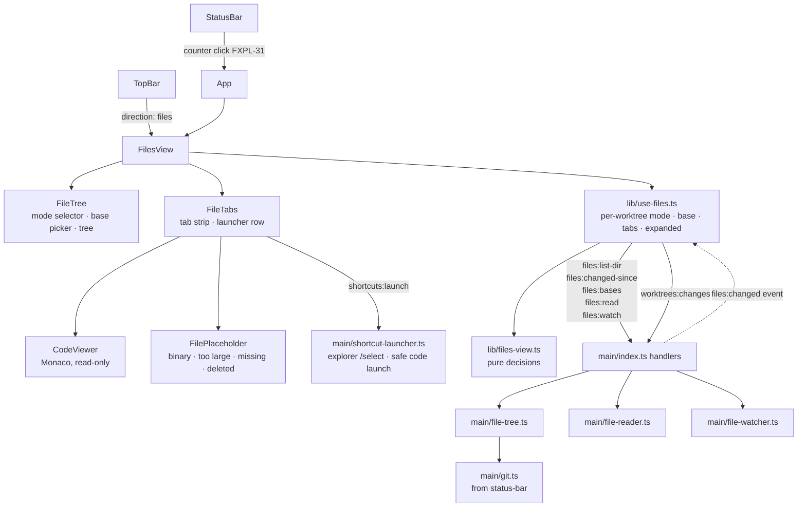

# Files Direction — Explore (F1) Design

**Spec**: `.specs/features/files-explore/spec.md`
**Status**: Draft
**Stacked on**: `feature/status-bar` — reuses its `src/main/git.ts` (status-bar design D1) and amends its counter (FXPL-31)

---

## Architecture Overview

The renderer never touches the filesystem. Main answers four questions — *what is in this folder*,
*what changed since the base*, *what can the base be*, *what is in this file* — and pushes one
event, *something changed on disk*. The renderer owns layout, tabs and the Monaco viewer.



**Chosen approaches** (owner-confirmed):

| Axis | Choice | Rejected |
| ---- | ------ | -------- |
| D1 viewer | **Monaco**, read-only, with only the Monarch basic-language contributions and the base editor worker — no TS/JSON/CSS/HTML language services | CodeMirror 6 (light, but not the VS Code look the owner asked for); Shiki + hand-built diff (F2's whole diff UI by hand, and its default WASM engine is blocked by the renderer CSP) |
| D2 watching | One recursive `fs.watch` on the selected worktree root **plus** a watch on its git-dir's `index` and `HEAD`; debounced; the *reaction* is scoped to open tabs and the mode list (FXPL-23 reworded accordingly) | A watch per open tab plus a `git status` poll — new untracked files would wait for the next poll, and the 1 s bound of FXPL-22 becomes constant polling |
| D3 listing | `git ls-files` per folder on expand, folded to direct children **in main** | One full listing cached per worktree |
| D4 base persistence | Mode and base persisted together per worktree in `AppConfig.ui` | Base kept in memory — a stacked branch would need its base re-picked after every restart |

---

## Code Reuse Analysis

| Component | Location | How to use |
| --------- | -------- | ---------- |
| `git()` / `gitFailureLine()` / `timeoutMs` | `src/main/git.ts` (status-bar T1) | Every git call in F1. **Hence the stack on `feature/status-bar`** — and it honours AD-023 (all git through one invoker) |
| `worktrees:changes` / `changedFilesOf` | `ipc-contract.ts:76`, `worktree-manager.ts:443` | The uncommitted-changes mode, unchanged (FXPL-12) |
| `shortcuts:launch` + `ShortcutLauncher` | `shortcut-launcher.ts:40` | All four launchers (FXPL-25..29); two fixes below |
| `openVisualStudio` + `VS_EDITIONS` | `shortcut-launcher.ts:72` (AD-016) | `.sln`/`.slnx` → VS 2026, elevated as today (FXPL-28/29). Passing a file path already works: the guard is `existsSync`, which accepts files |
| `IpcEvents` + `emit()` (AD-004) | `ipc.ts:30` | The `files:changed` push |
| `ResizablePane` | `components/ResizablePane.tsx` | The tree / viewer split, same resize behaviour as the sidebar |
| `useTree().selectedId`, `findWorktree` | `use-tree.ts:27`, `App.tsx:283` | The worktree Files describes (FXPL-02/06) |
| Direction segment pattern | `TopBar.tsx:98-130` | The fifth segment (FXPL-01) |
| Flat `ui.*` persistence via `config:patch` | `config.ts:63` | Mode + base map (FXPL-13, D4) |
| Launch-failure toast | `App.tsx:70` `setToast` | FXPL-30, unchanged |
| Hook-owned renderer state (AD-004) | `use-sessions.ts`, `use-tree.ts` | `use-files.ts` follows the same shape instead of growing `App.tsx` |

### Integration points

| System | Integration |
| ------ | ----------- |
| `AppConfig.ui.direction` | Union gains `'files'` (`config.ts:66`); older configs stay valid |
| `AppConfig.ui` | New optional `files?: Record<worktreeId, { mode: FilesMode; base?: string }>` — absent means full folder, `origin/HEAD` |
| `status-bar` | `StatusBar` gains an `onOpenChanges(worktreeId)` callback replacing the popover (FXPL-31); App switches direction and forces the mode |
| Renderer CSP (`index.html:9`) | Monaco's worker must be a **file** served from `'self'` (Vite `?worker`), never a `blob:` URL — the CSP has no `worker-src` and falls back to `script-src 'self'` |

---

## Components

### Main process

#### `src/main/file-tree.ts` (new)

- **Purpose**: Everything the tree lists, in all three modes.
- **Interfaces**:
  - `listDir(worktreePath: string, dir: string): Promise<DirListing>` — `git ls-files --cached --others --exclude-standard --directory -z -- <dir>/`, folded to direct children (FXPL-04/05)
  - `foldChildren(paths: string[], dir: string): FileEntry[]` — **pure**. Verified: `--cached` returns every tracked *descendant* (`src/a/f.ts` for `src/`) while `--directory` collapses a wholly untracked folder to `newdir/`; this function turns both into one level of files and folders, folders first, then alphabetical
  - `changedSince(worktreePath: string, base: string): Promise<ChangedListing>` — `git merge-base HEAD <base>`, then `git diff --name-status -z <mergeBase> HEAD` (FXPL-08, committed changes only)
  - `parseNameStatus(stdout: string): ChangedPath[]` — **pure**; maps `M/A/D/R/C/T` onto the existing `ChangeStatus` vocabulary so the renderer shows one set of labels in both diff modes
  - `listBases(worktreePath: string): Promise<BaseOptions>` — `git symbolic-ref --short refs/remotes/origin/HEAD` (verified to answer `origin/main` here) for the default, `git for-each-ref --format=%(refname:short) refs/heads refs/remotes` for the picker (FXPL-09/10/11)
- **Failure posture**: never throws; a git failure returns `{ error: gitFailureLine(err) }`, rendered in place of the tree (edge case)
- **Reuses**: `git.ts`; the `-z` NUL-separated output avoids the C-quoting `parseChangedFiles` has to undo

#### `src/main/file-reader.ts` (new)

- **Purpose**: Read one file for the viewer, safely and cheaply.
- **Interfaces**:
  - `readForView(worktreePath: string, relPath: string): Promise<FileContent>` — `stat` first; above 1 MB returns `too-large` without reading (FXPL-20); otherwise reads, sniffs, decodes UTF-8 with replacement characters (edge case)
  - `resolveInside(root: string, relPath: string): string | null` — **pure**; rejects absolute paths and any `..` that escapes the worktree. Lexical on purpose: the untracked skills junction (AD-013) sits *inside* the worktree and reading through it is correct
  - `isBinary(head: Buffer): boolean` — **pure**; a NUL byte in the first 8000 bytes, git's own heuristic
- **Returns** a discriminated union: `text` · `binary` · `too-large` · `missing` · `error`

#### `src/main/file-watcher.ts` (new — DI'd, unit-tested with fakes)

- **Purpose**: Tell the renderer which paths of the selected worktree changed.
- **Interfaces**:
  - `constructor(deps: { watch: WatchPort; resolveGitDir: (p: string) => Promise<string>; schedule: Scheduler; emit: (e: FilesChanged) => void })`
  - `select(worktreePath: string | null): Promise<void>` — closes the previous worktree's handles (FXPL-23) and opens: one recursive watch on the root, one on `<git-dir>/index`, one on `<git-dir>/HEAD`
- **Behaviour**: events are batched for 250 ms, then emitted once as `{ worktreePath, paths, gitStateChanged }`. Events under the root's `.git` entry are dropped — the git-dir watch reports what matters
- **Why the git-dir watch** (verified): a linked worktree's git-dir is `<repo>/.git/worktrees/<name>`, **outside** the worktree root. Without it, a commit or `git add` never reaches the root watch, and uncommitted mode would keep listing files that are already committed
- **Reuses**: the DI / injected-fake pattern of `TaskBoard` and `UpdateService` (`TESTING.md` pattern 3)

#### `src/main/shortcut-launcher.ts` (modified)

- **Explorer on a file** (FXPL-27): `explorer.exe /select,<path>` when the path is a file; folders unchanged
- **VS Code with an arbitrary file name**: today the path is interpolated into a shell line, `code "${path}"` (`:62`). Inside double quotes `cmd` still expands `%VAR%`, so a file named `%PATH%.txt` breaks the launch — a path that never occurred while only worktree folders were launched. The fix passes the path through an environment variable, `code "%PLAYGROUND_TARGET%"`: `cmd` expands a variable once and does not re-expand `%` inside the value
- **Both are the only launcher changes**; `openVisualStudio` is reused untouched

#### IPC (added to `IpcContract` / `IpcEvents`)

| Channel | Kind | Req | Res / payload | ACs |
| ------- | ---- | --- | ------------- | --- |
| `files:list-dir` | invoke | `{ worktreePath, dir }` | `DirListing` | 02, 04, 05 |
| `files:changed-since` | invoke | `{ worktreePath, base }` | `ChangedListing` | 08 |
| `files:bases` | invoke | `{ worktreePath }` | `BaseOptions` | 09, 10, 11 |
| `files:read` | invoke | `{ worktreePath, relPath }` | `FileContent` | 16, 17, 20, 24 |
| `files:watch` | invoke | `{ worktreePath: string \| null }` | `void` | 21, 22, 23 |
| `files:changed` | event (AD-004) | — | `FilesChanged` | 21, 22 |

### Renderer

#### `src/renderer/src/lib/files-view.ts` (new — pure, unit-tested)

- `buildTree(paths: ChangedPath[]): TreeNode[]` — the two diff modes arrive as flat lists; this nests them (FXPL-08/12)
- `launcherTarget(activeTab, lastFolder): string | null` — the recency rule of FXPL-26
- `tabsAfterClose(tabs, closedIndex): { tabs; active }` — the adjacent-tab rule of FXPL-19
- `isSolution(path): boolean` — `.sln` / `.slnx`, case-insensitive (FXPL-28)
- `filesStateFor(ui, worktreeId): { mode; base? }` — defaults of FXPL-13 and D4
- `tabsAffected(openTabs, changedPaths): string[]` — which tabs to re-read after a `files:changed` (FXPL-21), so the reaction is scoped as FXPL-23 requires

#### `src/renderer/src/lib/monaco-setup.ts` (new)

- Imports `editor.api` and the basic-languages contribution only; wires `self.MonacoEnvironment.getWorker` to the Vite `?worker` import of `editor.worker` (a same-origin file, allowed by the CSP)
- Follows the app theme: built-in `vs` / `vs-dark`, re-applied when `data-theme` flips

#### `src/renderer/src/lib/use-files.ts` (new — hook, hand-verified)

- In-memory `Map<worktreeId, { tabs; activeTab; expanded; lastFolder }>` (FXPL-18); persisted mode + base through `config:patch` (FXPL-13, D4)
- Calls `files:watch` with the selected worktree while the direction is Files, and `null` otherwise
- On `files:changed`: re-reads `tabsAffected(...)` and re-lists the current mode; `gitStateChanged` forces the uncommitted list to refresh

#### Components (new — hand-verified)

| Component | Purpose | ACs |
| --------- | ------- | --- |
| `FilesView.tsx` | Direction root: empty and path-missing states, `ResizablePane` split | 02, 03, 06 |
| `FileTree.tsx` | Mode selector, base picker, lazy tree, deleted-file rows, `.sln` double-click routing | 04, 05, 07–15, 28, 28a, 28b |
| `FileTabs.tsx` | Tab strip, close behaviour, launcher row | 16, 18, 19, 25, 26, 30 |
| `CodeViewer.tsx` | Monaco read-only; on new content keeps `scrollTop`; the "not a diff yet" label in diff modes | 14, 17, 21 |
| `FilePlaceholder.tsx` | Binary, too large, missing, deleted — name, size, type, launchers | 15, 20, 24 |

#### Modified

| File | Change | ACs |
| ---- | ------ | --- |
| `src/shared/config.ts` | `'files'` in the direction union; `ui.files` map | 01, 13 |
| `TopBar.tsx` | Sixth segment | 01 |
| `App.tsx` | Mounts `FilesView`; handles the status bar's `onOpenChanges` | 01, 31, 32 |
| `StatusBar.tsx` (status-bar) | Counter click calls `onOpenChanges` instead of opening the popover | 31 |

---

## Data Models

```typescript
// src/shared/files.ts
export type FilesMode = 'full' | 'since-base' | 'uncommitted'

export interface FileEntry {
  name: string
  /** Path relative to the worktree root, forward slashes. */
  path: string
  kind: 'file' | 'dir'
  /** A folder `git ls-files --directory` reported as wholly untracked. */
  untracked?: boolean
}

export interface DirListing { entries: FileEntry[]; error?: string }

export interface ChangedPath { path: string; status: ChangeStatus; oldPath?: string }

export interface ChangedListing { mergeBase: string | null; files: ChangedPath[]; error?: string }

export interface BaseOptions {
  /** `origin/HEAD`'s target, e.g. 'origin/main'; null when the repo has none (FXPL-11). */
  defaultBase: string | null
  branches: string[]
}

export type FileContent =
  | { kind: 'text'; text: string; size: number }
  | { kind: 'binary'; size: number }
  | { kind: 'too-large'; size: number }
  | { kind: 'missing' }
  | { kind: 'error'; message: string }

export interface FilesChanged {
  worktreePath: string
  /** Relative paths touched in this batch. */
  paths: string[]
  /** The index or HEAD moved: a commit, a stage or a checkout. */
  gitStateChanged: boolean
}
```

`ChangeStatus` is imported from `src/shared/worktrees.ts`, so both diff modes use the one vocabulary.

---

## Error Handling Strategy

| Scenario | Handling | User sees |
| -------- | -------- | --------- |
| `git ls-files` fails | `DirListing.error = gitFailureLine(err)` | Git's line instead of the tree (edge case) |
| No `origin/HEAD` | `defaultBase: null` | Base picker prompting for a choice; empty list (FXPL-11) |
| Chosen base deleted later | `merge-base` fails → `ChangedListing.error` | The FXPL-11 prompt again (edge case) |
| File above 1 MB | `stat` before any read | Placeholder with size (FXPL-20) |
| Binary file | `isBinary` on the first 8000 bytes | Placeholder with type (FXPL-20) |
| File deleted while open | `files:changed` → re-read → `missing` | Tab stays, placeholder (FXPL-24) |
| Path outside the worktree | `resolveInside` → null → `error` | Nothing read; defence in depth, since the renderer only sends paths main listed |
| Non-UTF-8 text | Decoded with replacement characters | Readable text with `�` (edge case) |
| Launch fails | Existing `LaunchResult` | The existing toast (FXPL-30) |

---

## Risks & Concerns

| Concern | Location | Impact | Mitigation |
| ------- | -------- | ------ | ---------- |
| **Monaco under electron-vite, the CSP and a packaged build is unproven in this app** | new | The whole viewer — and F2 — rests on it | **First renderer task is a spike** that renders a read-only Monaco in dev *and* in the packaged `win-unpacked` build, measures the bundle growth, and confirms no CSP violation — the AM1 precedent (`agent-spike`) for the node-pty/xterm stack |
| **A linked worktree's index lives outside its root** | verified: `<repo>/.git/worktrees/<name>` | A commit would never refresh uncommitted mode | Second watch on `<git-dir>/index` and `HEAD`; unit-tested with a fake watch port |
| **VS Code launch interpolates the path into a shell line** | `shortcut-launcher.ts:62` | F1 sends arbitrary file names; `%VAR%` expands inside quotes | Pass the path through an environment variable; test with a real `%PATH%.txt` |
| **`explorer.exe /select,` quoting** | `shortcut-launcher.ts:56` | Explorer parses its own command line; a path with spaces or commas may open the wrong folder. **Not verified — flagged, not assumed** | Verify at execution with a spaced, comma-bearing path; if it misbehaves, fall back to opening the parent folder, which still satisfies "never open the file itself" |
| Root expand in a large monorepo reads the whole index | `file-tree.ts` `listDir` | `--cached` returns every tracked descendant; the fold is in main, so only direct children cross IPC, but git still emits them all | Measure on the owner's largest repo during the smoke; if it is slow, switch the tracked half to `git ls-tree` for direct children — the fold function's contract does not change |
| Watch events from agent churn (`bin/`, `obj/`, build output) | `file-watcher.ts` | Floods of events under ignored folders | 250 ms batching, and the reaction is scoped (FXPL-23): an event outside open tabs costs one re-list of the current mode, not a re-render of everything |
| `App.tsx` grows (AD-004) | `App.tsx` | Another direction threaded through the god component | State lives in `use-files.ts`; App gains a mount and one callback |
| Superseding shipped requirements STBR-30 / STBR-32 | `status-bar` spec | A merged spec would describe a popover that no longer exists | Record an AD when F1 ships, the AD-018 precedent for AGCF-08 AC-2 |

---

## Tech Decisions

| Decision | Choice | Rationale |
| -------- | ------ | --------- |
| Monaco footprint | `editor.api` + basic-language (Monarch) contributions + `editor.worker` only | Read-only highlighting needs no language service; the TS/JSON/CSS/HTML workers are most of Monaco's weight and would load for nothing |
| Monaco theme | Built-in `vs` / `vs-dark`, switched with the app theme | "Like VS Code" is the requirement; a custom theme would be a second design surface with no handoff reference |
| Read path | `files:read` over `invoke` | The 1 MB cap makes a custom protocol unnecessary; a 1 MB string over IPC is routine |
| Binary sniff | NUL in the first 8000 bytes | Git's own heuristic; agrees with what `git diff` will call binary in F2 |
| Git output format | `-z` everywhere a path is listed | NUL separation sidesteps git's C-quoting of unusual names entirely |
| Watch batching | 250 ms | Inside FXPL-21/22's 1 s bound with room for the re-read and re-render |

> **Project-level decisions — recorded in `.specs/STATE.md` (2026-09-19):**
> - **AD-024** — *the renderer never reads the filesystem; every file the Files direction shows is read in main and confined to the selected worktree by `resolveInside`.*
> - **AD-025** — *Monaco is the app's read-only code and diff viewer* (design D1).
> - **AD-028** — *FXPL-31 supersedes STBR-30 and STBR-32*, effective when this feature ships, following the AD-018 pattern.

---

## Test Strategy

| Layer | Test type | What it proves |
| ----- | --------- | -------------- |
| `foldChildren`, `parseNameStatus`, `resolveInside`, `isBinary` | unit (pure) | Listing, statuses, confinement and binary detection per AC |
| `file-tree.ts` against a temp repo | unit (real git, pattern 2) | All three modes, `--directory` collapse, no `origin/HEAD`, deleted base |
| `file-reader.ts` against a temp dir | unit (real fs) | 1 MB cap without reading, binary, missing, non-UTF-8 |
| `FileWatcher` with a fake watch port and scheduler | unit (DI, pattern 3) | Batching, `.git` filtering, the git-dir watch, switching worktrees closes handles |
| `shortcut-launcher.ts` | unit (existing pure-helper style) | `/select,` argument building; the env-var launch line |
| `files-view.ts` | unit (pure) | Tree nesting, launcher recency, tab close, `.sln`, mode defaults, affected tabs |
| Components, hook, Monaco setup | none — hand-verified + CDP smoke | Per `TESTING.md` |
| Monaco spike | manual, dev + packaged | The de-risk deliverable |

---

## Requirement Coverage

| Component | ACs |
| --------- | --- |
| `file-tree.ts` | 04, 05, 08, 09, 10, 11 |
| `file-reader.ts` | 16, 17, 20, 24 |
| `file-watcher.ts` | 21, 22, 23 |
| `shortcut-launcher.ts` | 25, 27, 29, 30 |
| `files-view.ts` | 08, 12, 13, 19, 21, 23, 26, 28 |
| `monaco-setup.ts` + `CodeViewer.tsx` | 14, 17, 21 |
| `use-files.ts` | 06, 13, 18, 21, 22, 23 |
| `FilesView.tsx` | 02, 03, 06 |
| `FileTree.tsx` | 04, 05, 07–15, 28 |
| `FileTabs.tsx` | 16, 18, 19, 25, 26, 30 |
| `FilePlaceholder.tsx` | 15, 20, 24 |
| `config.ts` + `TopBar.tsx` | 01, 13 |
| `App.tsx` + `StatusBar.tsx` | 01, 31, 32 |

Every one of FXPL-01..32 appears at least once.
