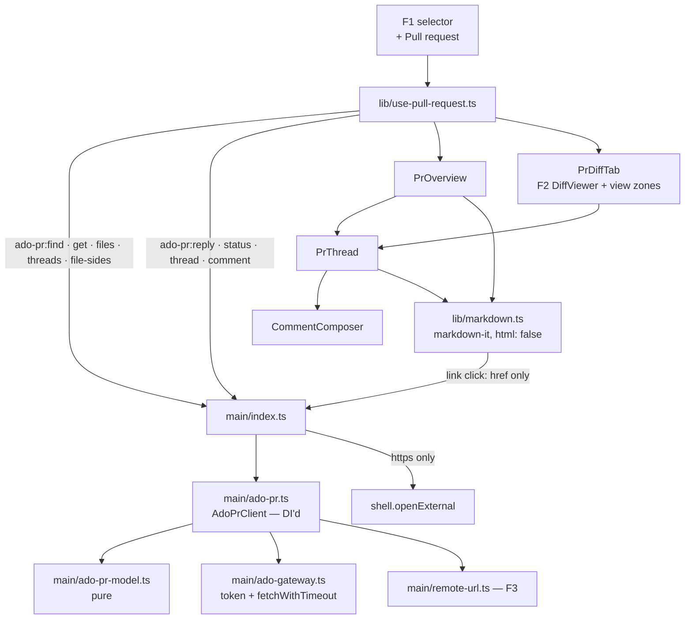

# Files Direction — Azure DevOps Pull Requests (F4) Design

**Spec**: `.specs/features/files-pr-ado/spec.md`
**Status**: Draft
**Stacked on**: `feature/files-commits` (F3) — reuses F3's `parseRemote` and main-built opener, F2's `DiffViewer`, F1's mode selector and tree

**Sources**: Azure DevOps REST 7.1 reference on learn.microsoft.com — *Pull Requests – Get Pull Requests*, *Pull Request Threads – List / Create*, *Pull Request Iteration Changes – Get* — read while writing this design. Anything below marked **[spike]** is not settled by those pages and is measured in T1.

---

## Architecture Overview

Main owns every request to Azure DevOps through a new DI'd client, `AdoPrClient`, fed by the
gateway's existing token path and `fetchWithTimeout`. A pure module turns ADO's wire shapes into the
app's model — which PR, which files, which threads go where. The renderer shows the Overview, the PR
files, and PR diff tabs built on F2's `DiffViewer` with threads in Monaco view zones.



**Decisions**:

| Axis | Choice | Rejected / why |
| ---- | ------ | -------------- |
| D1 Markdown (owner) | `markdown-it` with `html: false`: raw HTML is never parsed, so there is nothing to sanitize; a `link_open` rule strips `href` into `data-href`, an `image` rule renders a link instead | `marked` + DOMPurify — parses HTML then cleans it, so safety rests on the whitelist being right, and it needs a DOM to test |
| Client placement | A new `AdoPrClient` in `ado-pr.ts`, constructed with `{ getToken, fetchFn }` — the gateway exports its token acquisition | Growing `AdoGateway` (already ~280 lines of work-item logic); the DI shape mirrors `TaskBoard` and makes every request unit-testable against a fake `fetch` |
| Diff content | Both sides fetched from Azure DevOps by commit (`commonRefCommit` / `sourceRefCommit` of the latest iteration), never from the local repository | Spec + epic Q9 |
| Threads in the diff | F2's `DiffViewer` gains two **optional** props — `zones` (DOM per line, per side) and `onSelectModified` — with no change when absent | Amending F2's plan again. Optional props are additive and F2's behaviour and tests stay untouched |
| Where writes happen | Main only; the renderer sends intent (`threadId`, `status`, `content`, anchor), never a URL or a token | Same posture as F3's FCMT-28 |

---

## Code Reuse Analysis

| Component | Location | How to use |
| --------- | -------- | ---------- |
| `az account get-access-token` path | `ado-gateway.ts:235` | Exported as `getAdoToken()`, injected into `AdoPrClient` — **same task fixes the raw NUL at `:280`** (FPRA-36) |
| `fetchWithTimeout` | `ado-gateway.ts:259` | Every PR request; already a pure, injectable seam |
| `parseRemote`, `commitUrl` shape | F3 `remote-url.ts` | ADO remotes → `{ org, project, repo }`; add `prUrl` and `createPrUrl` beside `commitUrl` |
| Main-built https opener | F3 `openCommit` pattern | PR page, Create PR, markdown links |
| `DiffViewer` | F2 | PR diff tabs, plus the two optional props |
| `FilePlaceholder`, `DiffSide` | F1 / F2 | Binary / too-large PR files |
| F1 mode selector, `FileTree`, `buildTree` | F1 | Fifth mode; the PR file tree |
| `relativeTime` | status-bar | Comment dates |
| "run `az login`" state, `az` chip | `TasksPane.tsx:122`, `TopBar.tsx:32` | FPRA-07 |
| 5 s focus debounce | `App.tsx:165` | FPRA-33 |

---

## Components

### Main process

#### `src/main/ado-pr.ts` — `AdoPrClient` (new, DI'd)

Every method returns a result union and never throws.

| Method | Calls (REST 7.1) | ACs |
| ------ | ---------------- | --- |
| `findPrs(remotes, branch)` | Resolve the source repository id (the branch's upstream remote) with `GET _apis/git/repositories/{name}`; then, **for each ADO remote as target**, `GET …/repositories/{target}/pullrequests?searchCriteria.sourceRefName=refs/heads/{branch}&searchCriteria.sourceRepositoryId={sourceId}&searchCriteria.status=active` | 02–06 |
| `getPr(target, id)` | `GET …/pullrequests/{id}` — **needed because the list endpoint truncates `description` to 400 characters** | 09, 10 |
| `latestIteration(target, id)` | `GET …/pullRequests/{id}/iterations` → last id, `sourceRefCommit`, `commonRefCommit` **[spike: field names]** | 16, 34 |
| `changedFiles(target, id, iteration)` | `GET …/iterations/{n}/changes?$compareTo=0&$top=2000`, **following `nextSkip` / `nextTop` until both are 0** — the endpoint defaults to 100 entries | 15, 16, 27 |
| `threads(target, id, iteration)` | `GET …/pullRequests/{id}/threads?$iteration={n}&$baseIteration=0` — positions tracked to the latest iteration against the common commit | 11, 13, 18, 19 |
| `fileSide(target, path, commit)` | Item metadata first, content only when ≤ 1 MB and not binary **[spike: exact item / blob calls and the size field]** | 16, 17 |
| `reply(target, id, threadId, rootCommentId, content)` | `POST …/threads/{threadId}/comments` `{ content, parentCommentId, commentType: 1 }` | 25 |
| `setStatus(target, id, threadId, status)` | `PATCH …/threads/{threadId}` `{ status }` | 26 |
| `createThread(target, id, anchor, content)` | `POST …/threads` with `threadContext` (`filePath`, `rightFileStart`, `rightFileEnd`) and `pullRequestThreadContext` (`changeTrackingId` from `changedFiles`, `iterationContext`) | 27 |
| `generalComment(target, id, content)` | `POST …/threads` with `comments` and `status: 1`, no `threadContext` | 29 |

#### `src/main/ado-pr-model.ts` (new — pure, unit-tested)

- `toChangedPaths(entries)` — `add / edit / delete / rename` → `ChangeStatus`; strips ADO's leading `/`; keeps `originalPath`; carries `changeTrackingId`
- `classifyThread(thread, latestIteration)` → `system` · `general` · `placed { side, startLine, endLine }` · `outdated` · `deleted` (FPRA-13, 18, 19):
  - `system` when the first comment's `commentType` is `system` or `properties.CodeReviewThreadType` is present
  - `deleted` when `isDeleted` or every comment is deleted
  - `placed` on the right when `rightFileStart` exists, on the left when only `leftFileStart` does
  - **`outdated` rule [spike]**: placed only when the thread was created on, or tracked to (`trackingCriteria.secondComparingIteration`), the latest iteration
- `visibleComments(thread)` — drops `isDeleted` comments, which ADO returns without content
- `isMarkdown(thread)` — `properties["Microsoft.TeamFoundation.Discussion.SupportsMarkdown"] === 1`
- `anchorFromSelection(selection, convention)` — Monaco's 1-based line and column → ADO `CommentPosition`. **The offset convention is a constant set by the spike**: the reference text says `offset` "starts at 0", but its own example sends `offset: 1` for a line start
- `iterationContextFor(latest)` — **[spike]** the reference states that equal first and second iterations mean the left side is the common commit, which suggests `{ first: n, second: n }` for the whole-PR view
- `voteLabel(vote)` — `10` approved · `5` approved with suggestions · `0` no vote · `-5` waiting for author · `-10` rejected (reference `IdentityRefWithVote`)
- `pickRemoteRepos(remotes)` and `sourceRemote(branchConfig)` — which remotes are ADO targets, which one is the source

#### `src/main/remote-url.ts` (F3, extended)

- `prUrl(ref, id)` → `https://dev.azure.com/{org}/{project}/_git/{repo}/pullrequest/{id}`
- `createPrUrl(ref, branch)` → the repository's PR-creation page with the source branch filled **[spike: exact query parameters]**; if the parameter cannot be confirmed, the repository's pull-request list page — never a guessed URL

#### `src/main/link-guard.ts` (new — pure, unit-tested)

- `isOpenableLink(href)` — true only for an absolute `https:` URL; `javascript:`, `data:`, `file:`, `http:`, relative and malformed all false (FPRA-23)

#### IPC

| Channel | Req | Res |
| ------- | --- | --- |
| `ado-pr:find` | `{ worktreePath }` | `PrSearch` (found PRs, or why none) |
| `ado-pr:get` | `{ worktreePath, target, id }` | `PrDetail` (PR, reviewers, latest iteration, files, threads) |
| `ado-pr:file-sides` | `{ worktreePath, target, id, path, originalPath? }` | `DiffSides` (F2 shape) |
| `ado-pr:reply` / `:status` / `:thread` / `:comment` | intent only | `WriteResult` |
| `ado-pr:open` | `{ worktreePath, target, id }` or `{ create: true }` | `LaunchResult` |
| `ado-pr:open-link` | `{ href }` | `LaunchResult` — main re-checks `isOpenableLink` |

### Renderer

#### `src/renderer/src/lib/markdown.ts` (new — pure, unit-tested in Node)

- `renderMarkdown(source, { markdown: boolean }): string` — `markdown-it` with `html: false`, `linkify: false`; `link_open` moves `href` to `data-href` and drops it; images render as a link to their source; non-markdown threads are escaped text (FPRA-10, 21, 22, 24)
- Tested against: `<script>`, ``, `[x](javascript:alert(1))`, a `data:` link, an `https:` link, an image, an HTML comment, a `<details>` block

#### `src/renderer/src/lib/pr-view.ts` (new — pure, unit-tested)

- `overviewGroups(threads)` — active, resolved, outdated, general, activity (FPRA-11, 13, 19, 20)
- `statusLabel(status)` and the list of statuses offered (FPRA-26)
- `zonesForFile(threads, path)` — the view zones for one PR diff, per side (FPRA-18)
- `newIterationBanner(onScreen, latest)` (FPRA-34)

#### Components (new — hand-verified)

| Component | Purpose | ACs |
| --------- | ------- | --- |
| `PrPicker.tsx` | Number, title, target branch; choice kept per worktree in memory | 04 |
| `PrOverview.tsx` | Header, sanitized description, reviewers with votes, thread list, Activity, Open in browser, general comment, empty / no-remote / auth / detached states | 05–14, 29 |
| `PrThread.tsx` | Comments, collapse when resolved, Reply, status selector | 20, 21, 25, 26 |
| `CommentComposer.tsx` | Write / Preview, Ctrl+Enter, keeps text on failure | 30, 31 |
| `PrDiffTab.tsx` | `DiffViewer` with PR sides, thread zones, **Comment** on a modified-side selection only | 16, 17, 18, 27, 28 |
| `lib/use-pull-request.ts` | PR state per worktree; reload on entry, focus (5 s), after a write, refresh button; banner | 33, 34, 35 |

A click on a rendered link calls `ado-pr:open-link` with the `data-href`; nothing in the renderer navigates.

#### Modified

| File | Change |
| ---- | ------ |
| `shared/files.ts` | `FilesMode` gains `'pull-request'`; PR types |
| `components/DiffViewer.tsx` (F2) | Optional `zones` and `onSelectModified`; absent = today's behaviour |
| `components/FileTree.tsx` | Fifth option; the PR file tree in that mode |
| `components/FileTabs.tsx` | Fixed Overview tab and PR diff tabs in that mode |
| `lib/diff-view.ts` (F2) | `tabKeyOf` knows `pr-overview` and `pr:<id>:<path>` |
| `main/ado-gateway.ts` | Exports `getAdoToken`; raw NUL → `\u0000` |
| `package.json` | `markdown-it` (+ types) |

---

## Data Models

```typescript
// src/shared/files.ts (additions)
export interface PrRef { target: { org: string; project: string; repo: string }; id: number }

export interface PrSummary extends PrRef { title: string; targetBranch: string; isDraft: boolean }

export type PrSearch =
  | { kind: 'found'; prs: PrSummary[] }
  | { kind: 'none'; createUrlAvailable: boolean }
  | { kind: 'no-ado-remote' } | { kind: 'auth' } | { kind: 'detached' } | { kind: 'error'; message: string }

export interface Reviewer { name: string; vote: -10 | -5 | 0 | 5 | 10; isGroup: boolean; isRequired: boolean }

export type ThreadStatus = 'active' | 'fixed' | 'wontFix' | 'closed' | 'byDesign' | 'pending' | 'unknown'

export interface PrComment { id: number; author: string; content: string; at: number }

export interface PrThreadView {
  id: number
  status: ThreadStatus
  markdown: boolean
  comments: PrComment[]
  place:
    | { kind: 'general' }
    | { kind: 'placed'; path: string; side: 'left' | 'right'; startLine: number; endLine: number }
    | { kind: 'outdated'; path: string; line: number }
    | { kind: 'system' }
}

export interface PrFile extends ChangedPath { changeTrackingId: number }

export interface PrDetail extends PrSummary {
  author: string; description: string; createdAt: number; sourceBranch: string
  reviewers: Reviewer[]; iteration: number; files: PrFile[]; threads: PrThreadView[]
}

export interface Anchor { path: string; startLine: number; startOffset: number; endLine: number; endOffset: number }

export type WriteResult = { ok: true } | { ok: false; message: string }
```

**[amended at F5 Spec — provider-neutral model]** F5 (GitHub) reuses the Overview, thread, composer and
hook. The shared model therefore carries a `provider: 'azure-devops' | 'github'` on `PrSummary`, and
`PrThreadView` gains `resolution: 'active' | 'resolved'` next to `status`, which becomes
`providerStatus` — ADO's seven values here, GitHub's none. Components take the provider and render
its actions: ADO a status selector, GitHub a Resolve / Reopen toggle. Reviewers become
`{ name, state, isGroup, isRequired }` with `state` a neutral union that ADO's votes and GitHub's
review states both map onto. F4 alone still renders exactly what its spec asks; only the types and
props widen.

---

## Error Handling Strategy

| Scenario | Handling | User sees |
| -------- | -------- | --------- |
| Token unavailable | Same detection as the Tasks pane | "run `az login`" (FPRA-07) |
| 401 / 403 on a write | `WriteResult.ok = false` with ADO's message | Inline in the composer, text kept (FPRA-31) |
| Network failure / timeout | `fetchWithTimeout` rejects → error result | Inline error; nothing half-written is shown as posted |
| Write succeeded, reload failed | The written content stays; a notice says the PR could not be refreshed | Edge case |
| PR no longer active on reload | `getPr` status ≠ active | "This pull request was completed or abandoned" (edge case) |
| > 100 changed files | Paged by `nextSkip` / `nextTop` | Every file listed |
| A side > 1 MB or binary | Checked from metadata before content | F1 placeholder |
| Rendered link not https | Renderer does nothing; main re-checks anyway | Nothing opens (FPRA-23) |

---

## Risks & Concerns

| Concern | Location | Impact | Mitigation |
| ------- | -------- | ------ | ---------- |
| **Offset convention contradicted in the reference** | `CommentPosition` vs the Create example | A new thread highlights the wrong characters | T1 measures it; `anchorFromSelection` takes the convention as a constant with tests for both |
| **ADO may strip `<…>` from comment content** | spec's open question | Review comments citing generics reach reviewers mutilated | T1 posts a probe on a sandbox PR; if confirmed, a task adds the composer warning and its AC |
| **The spike writes to Azure DevOps** | T1 | An outward write | Runs only on a sandbox PR the owner names, with the owner's explicit go-ahead at execution; findings recorded with fictitious names only |
| Outdated-thread signal inferred, not documented | `classifyThread` | A thread drawn on the wrong line | T1 observes a thread across a new push; the rule is one pure function with tests |
| `iterationContext` for the whole-PR view inferred from one sentence | `iterationContextFor` | A new thread anchored to the wrong diff | T1 creates a thread in ADO's own UI on the whole-PR view and reads its context back |
| Unbounded third-party content | Overview, threads | Huge descriptions or many threads slow the tab | Rendered on demand per collapsed section; nothing mounts in a closed section |
| The template's `setWindowOpenHandler` forwards any URL (F3 finding) | `index.ts:194` | A rendered anchor with a live `href` would reach the OS | `markdown.ts` never emits a live `href`; all opening goes through `ado-pr:open-link` |
| Raw NUL in the gateway hides it from code search | `ado-gateway.ts:280` | Searches for ADO code silently skip the file | FPRA-36, in T2 |
| Company data leaking into a public repository | fixtures, findings, smoke | Privacy guardrail breach | Fictitious names everywhere (`acme`, `platform`, `widget`); the spike records shapes and conventions, never content |

---

## Test Strategy

| Layer | Test type | What it proves |
| ----- | --------- | -------------- |
| `ado-pr-model.ts` | unit (pure, doc-shaped fixtures) | Thread classification incl. system, deleted and outdated; anchors under both offset conventions; change mapping; votes |
| `AdoPrClient` with a fake `fetch` | unit (DI) | The exact URLs and bodies of every read and write; paging of changes to the end; description from `getPr`, not the list; no write request on any read path |
| `remote-url.ts` additions, `link-guard.ts` | unit (pure) | PR and create URLs always https; link allowlist |
| `markdown.ts` | unit (Node) | Every injection vector listed above renders inert |
| `pr-view.ts` | unit (pure) | Overview groups, zones per file and side, banner |
| Components, hook, `DiffViewer` props | none — hand-verified + CDP smoke | Per `TESTING.md` |
| Spike | manual, sandbox | The five **[spike]** items |

---

## Requirement Coverage

| Component | ACs |
| --------- | --- |
| `ado-pr.ts` | 02–06, 09, 15, 16, 25, 26, 27, 29, 32 |
| `ado-pr-model.ts` | 11, 13, 15, 18, 19, 20, 27 |
| `remote-url.ts`, `link-guard.ts` | 05, 14, 23 |
| `markdown.ts` | 10, 21, 22, 24 |
| `pr-view.ts` | 11, 13, 18, 19, 20, 34 |
| `ado-gateway.ts` | 07, 36 |
| `PrPicker`, `PrOverview` | 04–14, 29 |
| `PrThread`, `CommentComposer` | 20, 21, 25, 26, 30, 31 |
| `PrDiffTab`, `DiffViewer` props | 16, 17, 18, 27, 28 |
| `use-pull-request.ts` | 33, 34, 35 |
| `FileTree`, `FileTabs`, `files.ts` | 01, 12, 15 |
| Every write path | 32 |

Every one of FPRA-01..36 appears at least once.
