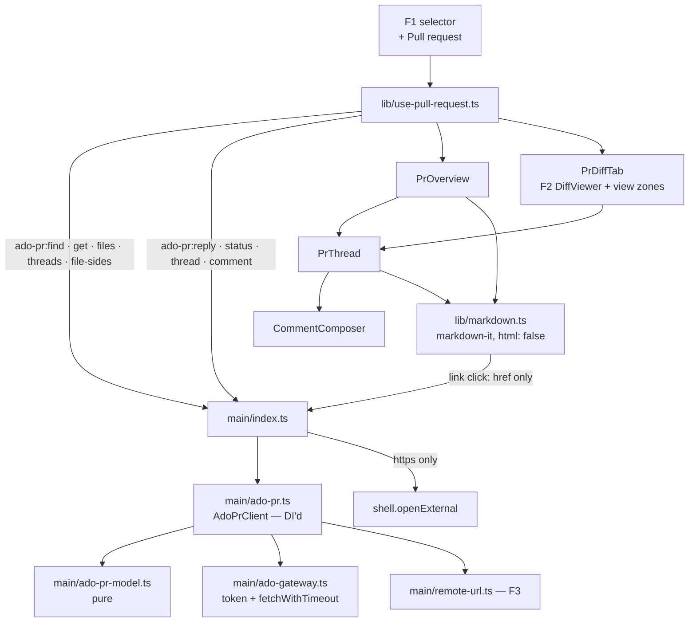

# Files Direction — Azure DevOps Pull Requests (F4) Design

**Spec**: `.specs/features/files-pr-ado/spec.md`
**Status**: Draft
**Base**: `main` (**[reconciled 2026-10-10]** F1–F3 merged) — reuses F3's `parseRemote` and `openCommit`, AD-044's `isHttpsUrl`, F2's `DiffViewer`, F1's mode selector and tree

**Sources**: Azure DevOps REST 7.1 reference on learn.microsoft.com — *Pull Requests – Get Pull Requests*, *Pull Request Threads – List / Create*, *Pull Request Iteration Changes – Get* — read while writing this design. Anything below marked **[spike]** is not settled by those pages and is measured in T1.

---

## Architecture Overview

Main owns every request to Azure DevOps through a new DI'd client, `AdoPrClient`, fed by the
gateway's existing token path and `fetchWithTimeout`. A pure module turns ADO's wire shapes into the
app's model — which PR, which files, which threads go where. The renderer shows the Overview, the PR
files, and PR diff tabs built on F2's `DiffViewer` with threads in Monaco view zones.


```mermaid
graph TD
    Mode[F1 selector<br/>+ Pull request] --> Hook[lib/use-pull-request.ts]
    Hook -->|ado-pr:find · get · files · threads · file-sides| Main
    Hook -->|ado-pr:reply · status · thread · comment| Main
    Hook --> Overview[PrOverview]
    Hook --> PrDiff[PrDiffTab<br/>F2 DiffViewer + view zones]
    Overview --> Thread[PrThread]
    PrDiff --> Thread
    Thread --> Composer[CommentComposer]
    Thread --> MD[lib/markdown.ts<br/>markdown-it, html: false]
    Overview --> MD
    MD -->|link click: href only| Main
    Main[main/index.ts] --> Client[main/ado-pr.ts<br/>AdoPrClient — DI'd]
    Client --> Model[main/ado-pr-model.ts<br/>pure]
    Client --> GW[main/ado-gateway.ts<br/>token + fetchWithTimeout]
    Client --> Remote[main/remote-url.ts — F3]
    Main -->|https only| Shell[shell.openExternal]
```

**Decisions**:

| Axis | Choice | Rejected / why |
| ---- | ------ | -------------- |
| D1 Markdown (owner) | `markdown-it` with `html: false`: raw HTML is never parsed, so there is nothing to sanitize; a `link_open` rule strips `href` into `data-href`, an `image` rule renders a link instead | `marked` + DOMPurify — parses HTML then cleans it, so safety rests on the whitelist being right, and it needs a DOM to test |
| Client placement | A new `AdoPrClient` in `ado-pr.ts`, constructed with `{ getToken, fetchFn }` — **[reconciled 2026-10-10]** `getToken` is the gateway's own cached method, made public, so both share one cache | Growing `AdoGateway` (already ~280 lines of work-item logic); the DI shape mirrors `TaskBoard` and makes every request unit-testable against a fake `fetch` |
| Diff content | Both sides fetched from Azure DevOps by commit (`commonRefCommit` / `sourceRefCommit` of the latest iteration), never from the local repository | Spec + epic Q9 |
| Threads in the diff | F2's `DiffViewer` gains two **optional** props — `zones` (DOM per line, per side) and `onSelectModified` — with no change when absent | Amending F2's plan again. Optional props are additive and F2's behaviour and tests stay untouched |
| Where writes happen | Main only; the renderer sends intent (`threadId`, `status`, `content`, anchor), never a URL or a token | Same posture as F3's FCMT-28 |

---

## Code Reuse Analysis

| Component | Location | How to use |
| --------- | -------- | ---------- |
| `az account get-access-token` path | `AdoGateway.getToken()` (`ado-gateway.ts:225`) | Made public and injected into `AdoPrClient` as `() => gateway.getToken()`. **[reconciled 2026-10-10]** The raw NUL is gone since #122 (FPRA-36) |
| `fetchWithTimeout` | `ado-gateway.ts:259` | Every PR request; already a pure, injectable seam |
| `parseRemote`, `commitUrl` shape | F3 `remote-url.ts` | ADO remotes → `{ org, project, repo }`; add `prUrl` and `createPrUrl` beside `commitUrl` |
| Main-built https opener | F3 `openCommit` (`commit-log.ts`) + AD-044 `isHttpsUrl` (`url-policy.ts`) | PR page, Create PR, markdown links |
| `DiffViewer` | F2 | PR diff tabs, plus the two optional props |
| `FilePlaceholder`, `DiffSide` | F1 / F2 | Binary / too-large PR files |
| F1 mode selector, `FileTree`, `buildTree` | F1 | Fifth mode; the PR file tree |
| `relativeTime` | `lib/relative-time.ts` | Comment dates |
| "run `az login`" state, `az` chip | `TasksPane.tsx:138`, `TopBar.tsx` | FPRA-07 |
| 5 s focus debounce | `App.tsx:273` | FPRA-33 |
| Per-worktree lens | `use-files.ts`, `FilesState` in `shared/config.ts` | The PR lens skips local listing and watching; the mode is remembered |
| Fixed tab, pins, bulk close | `FileTabs.tsx` (#125) | The Overview is a fixed tab |
| Change glyphs | `StatusGlyph`, `change-status.ts` (#131) | The PR file tree |

---

## Components

### Main process

#### `src/main/ado-pr.ts` — `AdoPrClient` (new, DI'd)

Every method returns a result union and never throws.

| Method | Calls (REST 7.1) | ACs |
| ------ | ---------------- | --- |
| `findPrs(remotes, branch)` | Resolve the source repository id (the branch's upstream remote) with `GET _apis/git/repositories/{name}`; then, **for each ADO remote as target**, `GET …/repositories/{target}/pullrequests?searchCriteria.sourceRefName=refs/heads/{branch}&searchCriteria.sourceRepositoryId={sourceId}&searchCriteria.status=active` | 02–06 |
| `getPr(target, id)` | `GET …/pullrequests/{id}` — **needed because the list endpoint truncates `description` to 400 characters** | 09, 10 |
| `latestIteration(target, id)` | `GET …/pullRequests/{id}/iterations` → last id, `sourceRefCommit.commitId`, `commonRefCommit.commitId` (S2) | 16, 34 |
| `changedFiles(target, id, iteration)` | `GET …/iterations/{n}/changes?$compareTo=0&$top=2000`, **following `nextSkip` / `nextTop` until both are 0 or absent** (S7) — the endpoint defaults to 100 entries | 15, 16, 27 |
| `threads(target, id, iteration)` | `GET …/pullRequests/{id}/threads?$iteration={n}&$baseIteration=0` — positions tracked to the latest iteration against the common commit | 11, 13, 18, 19 |
| `fileSide(target, path, commit)` | Item metadata (`includeContentMetadata=true`), then `blobs/{objectId}?$format=json` for `size`, content only when ≤ 1 MB and not binary; a 404 at the common commit is an empty side (S6) | 16, 17 |
| `reply(target, id, threadId, rootCommentId, content)` | `POST …/threads/{threadId}/comments` `{ content, parentCommentId, commentType: 1 }` | 25 |
| `setStatus(target, id, threadId, status)` | `PATCH …/threads/{threadId}` `{ status }` | 26 |
| `createThread(target, id, anchor, content)` | `POST …/threads` with `threadContext` (`filePath`, `rightFileStart`, `rightFileEnd`), `pullRequestThreadContext` (`changeTrackingId` from `changedFiles`, `iterationContext`) and `properties` `SupportsMarkdown` = `{ type: 'System.Int32', value: 1 }` (S1, S5) | 27 |
| `generalComment(target, id, content)` | `POST …/threads` with `comments`, `status: 1` and the same `SupportsMarkdown` property, no `threadContext` | 29 |

#### `src/main/ado-pr-model.ts` (new — pure, unit-tested)

- `toChangedPaths(entries)` — `add / edit / delete / rename` → `ChangeStatus`; strips ADO's leading `/`; keeps `originalPath`; carries `changeTrackingId`
- `classifyThread(thread, latestIteration)` → `system` · `general` · `placed { side, startLine, endLine }` · `outdated` · `deleted` (FPRA-13, 18, 19):
  - `system` when the first comment's `commentType` is `system` or `properties.CodeReviewThreadType` is present
  - `deleted` when `isDeleted` or every comment is deleted
  - `placed` on the right when `rightFileStart` exists, on the left when only `leftFileStart` does
  - **`outdated` rule (S3)**: tracked (`trackingCriteria` present) **and** its current range is empty (start = end) **and** its original range (`origRightFileStart/End`) is not. Untracked threads are placed at their position, which is still right; `offset` `2147483647` means the end of the line
- `visibleComments(thread)` — drops `isDeleted` comments, which ADO returns without content
- ~~`isMarkdown(thread)`~~ — **dropped (S5)**: Azure DevOps renders every comment as markdown, with or without the property
- `anchorFromSelection(selection)` — Monaco's 1-based line and column → ADO `CommentPosition`, **copied across unchanged** (S1: 1-based UTF-16 columns, end exclusive — the reference's "starts at 0" is wrong); normalized so start ≤ end
- `iterationContextFor(latest)` — `{ firstComparingIteration: n, secondComparingIteration: n }` for the whole-PR view (S2)
- `voteLabel(vote)` — `10` approved · `5` approved with suggestions · `0` no vote · `-5` waiting for author · `-10` rejected (reference `IdentityRefWithVote`)
- `pickRemoteRepos(remotes)` and `sourceRemote(branchConfig)` — which remotes are ADO targets, which one is the source

#### `src/main/remote-url.ts` (F3, extended)

- `prUrl(ref, id)` → `https://dev.azure.com/{org}/{project}/_git/{repo}/pullrequest/{id}`
- `createPrUrl(ref, branch)` → `https://dev.azure.com/{org}/{project}/_git/{repo}/pullrequestcreate?sourceRef={branch}` (S8; `targetRef` optional, branch names without `refs/heads/`)

#### `src/main/url-policy.ts` (AD-044, reused)

**[reconciled 2026-10-10]** No `link-guard.ts`: `isHttpsUrl(url)` is already the app's one https-only rule. F4 adds the FPRA-23 cases to its tests — `javascript:` in any case, `data:`, `file:`, `http:`, relative and malformed all false. Below, `isOpenableLink` reads as `isHttpsUrl`.

#### IPC

| Channel | Req | Res |
| ------- | --- | --- |
| `ado-pr:find` | `{ worktreePath }` | `PrSearch` (found PRs, or why none) |
| `ado-pr:get` | `{ worktreePath, target, id }` | `PrDetail` (PR, reviewers, latest iteration, files, threads) |
| `ado-pr:file-sides` | `{ worktreePath, target, id, path, originalPath? }` | `DiffSides` (F2 shape) |
| `ado-pr:reply` / `:status` / `:thread` / `:comment` | intent only | `WriteResult` |
| `ado-pr:open` | `{ worktreePath, target, id }` or `{ create: true }` | `LaunchResult` |
| `ado-pr:open-link` | `{ href }` | `LaunchResult` — main re-checks `isHttpsUrl` |

### Renderer

#### `src/renderer/src/lib/markdown.ts` (new — pure, unit-tested in Node)

- `renderMarkdown(source): string` — `markdown-it` with `html: false`, `linkify: false`; `link_open` moves `href` to `data-href` and drops it; images render as a link to their source (FPRA-10, 21, 22, 24). Every comment is markdown (S5)
- Tested against: `<script>`, ``, `[x](javascript:alert(1))`, a `data:` link, an `https:` link, an image, an HTML comment, a `<details>` block

#### `src/renderer/src/lib/pr-view.ts` (new — pure, unit-tested)

- `overviewGroups(threads)` — active, resolved, outdated, general, activity (FPRA-11, 13, 19, 20)
- `statusLabel(status)` and the list of statuses offered (FPRA-26)
- `zonesForFile(threads, path)` — the view zones for one PR diff, per side (FPRA-18)
- `newIterationBanner(onScreen, latest)` (FPRA-34)

#### Components (new — hand-verified)

| Component | Purpose | ACs |
| --------- | ------- | --- |
| `PrPicker.tsx` | Number, title, target branch; choice kept per worktree in memory | 04 |
| `PrOverview.tsx` | Header, sanitized description, reviewers with votes, thread list, Activity, Open in browser, general comment, empty / no-remote / auth / detached states | 05–14, 29 |
| `PrThread.tsx` | Comments, collapse when resolved, Reply, status selector | 20, 21, 25, 26 |
| `CommentComposer.tsx` | Write / Preview, Ctrl+Enter, keeps text on failure | 30, 31 |
| `PrDiffTab.tsx` | `DiffViewer` with PR sides, thread zones, **Comment** on a modified-side selection only | 16, 17, 18, 27, 28 |
| `lib/use-pull-request.ts` | PR state per worktree; reload on entry, focus (5 s), after a write, refresh button; banner | 33, 34, 35 |

A click on a rendered link calls `ado-pr:open-link` with the `data-href`; nothing in the renderer navigates.

#### Modified

| File | Change |
| ---- | ------ |
| `shared/files.ts` | `FilesMode` gains `'pull-request'`; PR types |
| `components/DiffViewer.tsx` (F2) | Optional `zones` and `onSelectModified`; absent = today's behaviour. Zones must coexist with `fitContent` and Hide / Show unchanged (#130) |
| `lib/use-files.ts` | `'pull-request'` lens: no local listing, watch or diff read |
| `components/FileTree.tsx` | Fifth option; the PR file tree in that mode |
| `components/FileTabs.tsx` | Fixed Overview tab and PR diff tabs in that mode |
| `lib/diff-view.ts` (F2) | `tabKeyOf` knows `pr-overview` and `pr:<id>:<path>` |
| `main/ado-gateway.ts` | `getToken()` becomes public (the NUL was fixed by #122) |
| `package.json` | `markdown-it` (+ types) |

---

## Data Models

```typescript
// src/shared/files.ts (additions)
export interface PrRef { target: { org: string; project: string; repo: string }; id: number }

export interface PrSummary extends PrRef { title: string; targetBranch: string; isDraft: boolean }

export type PrSearch =
  | { kind: 'found'; prs: PrSummary[] }
  | { kind: 'none'; createUrlAvailable: boolean }
  | { kind: 'no-ado-remote' } | { kind: 'auth' } | { kind: 'detached' } | { kind: 'error'; message: string }

export interface Reviewer { name: string; vote: -10 | -5 | 0 | 5 | 10; isGroup: boolean; isRequired: boolean }

export type ThreadStatus = 'active' | 'fixed' | 'wontFix' | 'closed' | 'byDesign' | 'pending' | 'unknown'

export interface PrComment { id: number; author: string; content: string; at: number }

export interface PrThreadView {
  id: number
  status: ThreadStatus
  comments: PrComment[]
  place:
    | { kind: 'general' }
    | { kind: 'placed'; path: string; side: 'left' | 'right'; startLine: number; endLine: number }
    | { kind: 'outdated'; path: string; line: number }
    | { kind: 'system' }
}

export interface PrFile extends ChangedPath { changeTrackingId: number }

export interface PrDetail extends PrSummary {
  author: string; description: string; createdAt: number; sourceBranch: string
  reviewers: Reviewer[]; iteration: number; files: PrFile[]; threads: PrThreadView[]
}

export interface Anchor { path: string; startLine: number; startOffset: number; endLine: number; endOffset: number }

export type WriteResult = { ok: true } | { ok: false; message: string }
```

**[amended at F5 Spec — provider-neutral model]** F5 (GitHub) reuses the Overview, thread, composer and
hook. The shared model therefore carries a `provider: 'azure-devops' | 'github'` on `PrSummary`, and
`PrThreadView` gains `resolution: 'active' | 'resolved'` next to `status`, which becomes
`providerStatus` — ADO's seven values here, GitHub's none. Components take the provider and render
its actions: ADO a status selector, GitHub a Resolve / Reopen toggle. Reviewers become
`{ name, state, isGroup, isRequired }` with `state` a neutral union that ADO's votes and GitHub's
review states both map onto. F4 alone still renders exactly what its spec asks; only the types and
props widen.

---

## Error Handling Strategy

| Scenario | Handling | User sees |
| -------- | -------- | --------- |
| Token unavailable | Same detection as the Tasks pane | "run `az login`" (FPRA-07) |
| 401 / 403 on a write | `WriteResult.ok = false` with ADO's message | Inline in the composer, text kept (FPRA-31) |
| Network failure / timeout | `fetchWithTimeout` rejects → error result | Inline error; nothing half-written is shown as posted |
| Write succeeded, reload failed | The written content stays; a notice says the PR could not be refreshed | Edge case |
| PR no longer active on reload | `getPr` status ≠ active | "This pull request was completed or abandoned" (edge case) |
| > 100 changed files | Paged by `nextSkip` / `nextTop` | Every file listed |
| A side > 1 MB or binary | Checked from metadata before content | F1 placeholder |
| Rendered link not https | Renderer does nothing; main re-checks anyway | Nothing opens (FPRA-23) |

---

## Risks & Concerns

| Concern | Location | Impact | Mitigation |
| ------- | -------- | ------ | ---------- |
| **Offset convention contradicted in the reference** | `CommentPosition` vs the Create example | A new thread highlights the wrong characters | T1 measures it; `anchorFromSelection` takes the convention as a constant with tests for both |
| **ADO may strip `<…>` from comment content** | spec's open question | Review comments citing generics reach reviewers mutilated | T1 posts a probe on a sandbox PR; if confirmed, a task adds the composer warning and its AC |
| **The spike writes to Azure DevOps** | T1 | An outward write | Runs only on a sandbox PR the owner names, with the owner's explicit go-ahead at execution; findings recorded with fictitious names only |
| Outdated-thread signal inferred, not documented | `classifyThread` | A thread drawn on the wrong line | T1 observes a thread across a new push; the rule is one pure function with tests |
| `iterationContext` for the whole-PR view inferred from one sentence | `iterationContextFor` | A new thread anchored to the wrong diff | T1 creates a thread in ADO's own UI on the whole-PR view and reads its context back |
| Unbounded third-party content | Overview, threads | Huge descriptions or many threads slow the tab | Rendered on demand per collapsed section; nothing mounts in a closed section |
| A rendered anchor with a live `href` | renderer | It would reach `setWindowOpenHandler` — https-only since #115, but still not the path for third-party links | `markdown.ts` never emits a live `href`; all opening goes through `ado-pr:open-link` |
| Company data leaking into a public repository | fixtures, findings, smoke | Privacy guardrail breach | Fictitious names everywhere (`acme`, `platform`, `widget`); the spike records shapes and conventions, never content |

---

## Test Strategy

| Layer | Test type | What it proves |
| ----- | --------- | -------------- |
| `ado-pr-model.ts` | unit (pure, doc-shaped fixtures) | Thread classification incl. system, deleted and outdated; anchors under both offset conventions; change mapping; votes |
| `AdoPrClient` with a fake `fetch` | unit (DI) | The exact URLs and bodies of every read and write; paging of changes to the end; description from `getPr`, not the list; no write request on any read path |
| `remote-url.ts` additions, `url-policy.ts` cases | unit (pure) | PR and create URLs always https; link allowlist |
| `markdown.ts` | unit (Node) | Every injection vector listed above renders inert |
| `pr-view.ts` | unit (pure) | Overview groups, zones per file and side, banner |
| Components, hook, `DiffViewer` props | none — hand-verified + CDP smoke | Per `TESTING.md` |
| Spike | manual, sandbox | Done — § Spike Findings S1–S9 |

---

## Requirement Coverage

| Component | ACs |
| --------- | --- |
| `ado-pr.ts` | 02–06, 09, 15, 16, 25, 26, 27, 29, 32 |
| `ado-pr-model.ts` | 11, 13, 15, 18, 19, 20, 27 |
| `remote-url.ts`, `url-policy.ts` | 05, 14, 23 |
| `markdown.ts` | 10, 21, 22, 24 |
| `pr-view.ts` | 11, 13, 18, 19, 20, 34 |
| `ado-gateway.ts` | 07 (36 met by #122) |
| `PrPicker`, `PrOverview` | 04–14, 29 |
| `PrThread`, `CommentComposer` | 20, 21, 25, 26, 30, 31 |
| `PrDiffTab`, `DiffViewer` props | 16, 17, 18, 27, 28 |
| `use-pull-request.ts` | 33, 34, 35 |
| `FileTree`, `FileTabs`, `files.ts` | 01, 12, 15 |
| Every write path | 32 |

Every one of FPRA-01..36 appears at least once.

---

## Spike Findings (T1, 2026-10-10)

Measured over REST 7.1 with the `az` token, plain `fetch`-equivalent calls, on a draft pull request with no reviewers in an organization the owner named. Names below are fictitious (`acme` / `platform` / `widget`, branch `feature/probe`, file `probe.txt`); no content, identity or id from that organization is recorded. Every probe comment was deleted afterwards; the pull request stayed a draft.

| # | Question | Finding | Consequence |
| - | -------- | ------- | ----------- |
| S1 | Offset convention | A thread created in the web UI on one word read back as `{ line: 3, offset: 34 }` → `{ line: 3, offset: 39 }`. The word starts at character 34 (1-based) and ends before 39, **after** a two-byte `á` on the same line: a byte count would give 35 → 40. So `offset` is a **1-based UTF-16 character column, end exclusive** — Monaco's own column model. A thread created through the API with that convention was stored unchanged | `anchorFromSelection` copies Monaco's line and column across; no constant, no conversion |
| S2 | Iteration context | Web-created threads on the whole-PR view carry `{ firstComparingIteration: n, secondComparingIteration: n }` for the iteration on screen | `iterationContextFor(n)` = `{ n, n }`, as inferred |
| S3 | Outdated signal | Read with `$iteration=<latest>&$baseIteration=0` (the plain list returns creation positions only). A thread whose lines did not move comes back **without** `trackingCriteria`, at its creation position, and is correct there. A thread whose line changed or moved comes back **with** `trackingCriteria` (`secondComparingIteration` = latest, `origRightFileStart/End`) and its current position in `rightFileStart/End`; a changed line widens to the whole line (`offset` 1 → `2147483647`). A thread whose **line was deleted** is not dropped: it comes back tracked with an **empty** position, start = end (`{ 2, 1 }` → `{ 2, 1 }`) | `outdated` = tracked **and** current range empty **and** original range not empty; everything else is `placed` at `rightFileStart` / `rightFileEnd`. `2147483647` means "to the end of the line" |
| S4 | `<…>` in comments | A thread and a reply containing `` `List<string>` ``, `a <b> c`, `"quotes"`, `>`, `&` and accented letters were stored and read back **byte-identical** (77 of 77 characters) | Pull-request comments are not sanitized the way work-item fields are. **FPRA-37 is not added and T25 is removed** |
| S5 | Markdown flag | The web UI sets `Microsoft.TeamFoundation.Discussion.SupportsMarkdown` as `{ "$type": "System.Int32", "$value": 1 }`; a thread created through the API without it has no such property — and the web UI **still renders its comment as markdown** (inline code shown as code). Properties are written as `{ type, value }` and read back as `{ $type, $value }` | Render every comment as markdown (HTML disabled); `isMarkdown` and the `markdown` flag are dropped. Writes still send `SupportsMarkdown` = 1, as the web UI does |
| S6 | Reading a file | Item metadata (`items?path=…&versionDescriptor.versionType=commit&includeContentMetadata=true&$format=json`) gives `objectId` and `contentMetadata` (`encoding`, `contentType`, `fileName`, `extension`) but **no size**; `blobs/{objectId}?$format=json` gives `size` in bytes. A side the iteration added is a **404** at the common commit (`GitItemNotFoundException`). Change entries carry `objectId` upper-cased | `fileSide`: item metadata → blob size → content only when ≤ 1 MB and not binary (`contentMetadata.isBinary`, absent for text); a 404 on the original side of an add is an empty side. **[corrected after T27]** `$format=json` is required: without it the same call answers `text/plain` with the file's own text; the probe had sent it, the first record of this row did not |
| S7 | Paging of changes | A single-page response carries **no** `nextSkip` / `nextTop` at all, not zeros | Stop when both are absent or 0 |
| S8 | Create-PR URL | `https://dev.azure.com/{org}/{project}/_git/{repo}/pullrequestcreate?sourceRef={branch}&targetRef={branch}` opens the creation form with both branches filled (checked in the browser by the owner); branch names without `refs/heads/` | `createPrUrl(ref, branch, target?)` builds that URL |
| S9 | Deleting | Deleting every comment of a thread marks the thread `isDeleted: true`; deleted comments come back `isDeleted: true` **without** `content` | Confirms `deleted` and `visibleComments` as designed |
