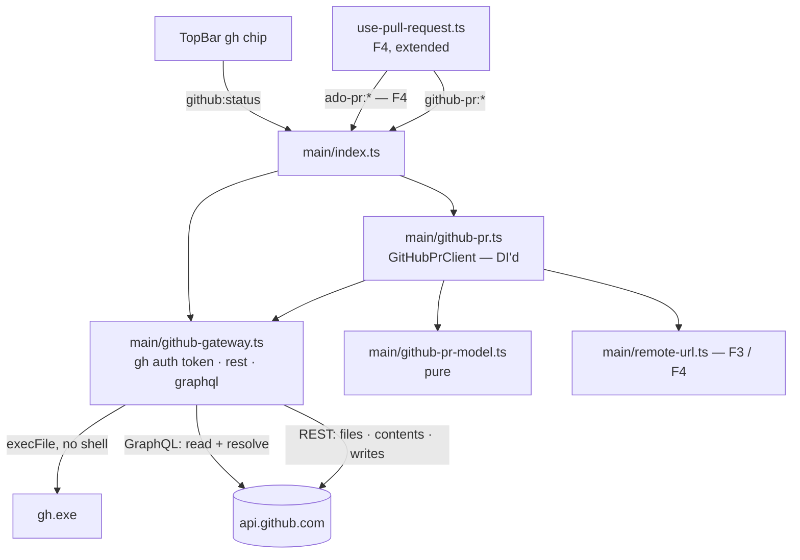

# Files Direction — GitHub Pull Requests (F5) Design

**Spec**: `.specs/features/files-pr-github/spec.md`
**Status**: Draft
**Stacked on**: `feature/files-pr-ado` (F4, as amended at F5 Spec to a provider-neutral model)

**Sources**: GitHub REST reference *Pull request review comments* (read while writing); GitHub's GraphQL schema, **introspected** with this machine's `gh` (read-only) for the review-thread mutations and `PullRequestReviewThread`'s fields. Anything marked **[spike]** is measured in T1.

---

## Architecture Overview

F5 adds a provider, not a mode. Main gets a minimal `GitHubGateway` (token and request primitives,
built for issue #50 to extend), a DI'd `GitHubPrClient`, and a pure model. The renderer keeps every
F4 surface; the Pull request hook asks both providers and merges, and components render each
thread's provider actions.



**Decisions**:

| Axis | Choice | Rejected / why |
| ---- | ------ | -------------- |
| D1 API split (owner) | **GraphQL** reads the PR, its reviews, review threads (with `isResolved`, `isOutdated`, `viewerCanReply/Resolve/Unresolve`) and PR comments in one paginated query, and runs `resolveReviewThread` / `unresolveReviewThread` — which exist **only** there. **REST** lists files (with the `patch` GraphQL does not return), reads file contents, and makes the three writes whose documented behaviour is to post immediately | All-GraphQL writes: a thread added by mutation without an explicit review may land in a pending review, against F5-Q2. All-REST is impossible: REST cannot resolve a thread |
| D2 "Within the diff" (owner) | Every selected modified-side line inside **one** hunk of the file's patch | Lines spread over several hunks — anchors GitHub may refuse after the user has written the comment |
| Channels | `github-pr:*` beside F4's `ado-pr:*`; the renderer hook calls both `find`s in parallel and merges, and routes every later call by `pr.provider` | Renaming F4's channels to a generic `pr:*` — churn in a plan for no behaviour gained |
| Invoking `gh` | `execFile('gh', ['auth', 'token'])`, `shell: false` | **Verified**: `gh` here is a native `gh.exe` (`C:\Program Files\GitHub CLI\gh.exe`), not a `.cmd` shim like `code` (`shortcut-launcher.ts:62`), so no shell and no quoting surface. `ENOENT` → not installed; non-zero exit → not signed in |
| Timeouts | F4's `fetchWithTimeout`, imported from `ado-gateway.ts` | Already a pure, generic, tested seam |

---

## Code Reuse Analysis

| Component | Location | How to use |
| --------- | -------- | ---------- |
| The whole Pull request mode | F4 (amended): `PrOverview`, `PrThread`, `CommentComposer`, `PrDiffTab`, `PrPicker`, `use-pull-request.ts`, `pr-view.ts` | Unchanged structure; provider-aware props from the F4 amendment |
| Provider-neutral model | F4 T3 as amended | `provider: 'github'`, `resolution`, neutral reviewer `state` |
| `markdown.ts`, `link-guard.ts`, `ado-pr:open-link` pattern | F4 | GitHub bodies, links, the install-page link |
| `parseRemote` (github.com HTTPS / SSH) | F3 | GitHub remotes → `{ owner, repo }` |
| `fetchWithTimeout` | `ado-gateway.ts:259` | Every GitHub request |
| `DiffViewer` with `zones` / `onSelectModified` | F2 + F4 T16 | GitHub threads and selections |
| `az` chip | `TopBar.tsx:32` | The `gh` chip beside it |
| 5 s focus debounce | `App.tsx:165` | FPRG-05 |
| `FilePlaceholder`, `DiffSides` | F1 / F2 | Binary or oversized files |

---

## Components

### Main process

#### `src/main/github-gateway.ts` (new — the piece issue #50 extends)

- `ghStatus(): Promise<'ok' | 'not-installed' | 'not-signed-in'>` — `gh auth token` via `execFile`; the token is kept in memory for the process and never written anywhere (FPRG-01, 03, 04)
- `rest(method, path, body?)` and `graphql(query, variables)` — `https://api.github.com`, `Authorization: Bearer`, `X-GitHub-Api-Version: 2022-11-28`, `fetchWithTimeout`; both return a result union and never throw
- Rate limit: a 403 or 429 with `x-ratelimit-remaining: 0` — or a GraphQL `RATE_LIMITED` error — returns `{ kind: 'rate-limited', resetAt }` from `x-ratelimit-reset` (FPRG-26)
- `runner` and `fetchFn` injected, so the `gh` exit paths and the rate-limit parsing are unit-tested without a CLI or a network

#### `src/main/github-pr.ts` — `GitHubPrClient` (new, DI'd)

| Method | Calls | ACs |
| ------ | ----- | --- |
| `findPrs(remotes, branch)` | Source owner = owner of the remote the branch pushes to; for **each** GitHub remote as target, REST `GET /repos/{target}/pulls?state=open&head={sourceOwner}:{branch}` | 06, 07 |
| `createTarget(source)` | REST `GET /repos/{source}` → `parent` when `fork` is true, else the source; plus its `default_branch` | 08 |
| `getPr(target, number)` | One GraphQL query: PR fields, `latestReviews`, `reviewRequests`, `reviewThreads` (path, line, startLine, diffSide, startDiffSide, isResolved, isOutdated, viewerCan*, comments), PR `comments` — each connection paged with `first: 100` and `pageInfo` until exhausted | 09, 10, 13, 14, 17, 18 |
| `files(target, number)` | REST `GET /repos/{target}/pulls/{n}/files?per_page=100&page=…`, all pages; keeps `patch`, `status`, `previous_filename`; stops at GitHub's 3000-file ceiling and flags it | 11, 22 |
| `mergeBase(target, baseSha, headSha)` | REST `GET /repos/{target}/compare/{baseSha}...{headSha}` → `merge_base_commit.sha` **[spike: cross-fork head sha resolves in the base repository]** | 12 |
| `fileSide(repo, path, ref)` | REST `GET /repos/{repo}/contents/{path}?ref={ref}`: `size` read first, content decoded only when ≤ 1 MB and not binary; the head side uses the **head repository**, null when the fork is gone | 12 |
| `reply(target, number, rootCommentId, body)` | REST `POST /repos/{target}/pulls/{n}/comments/{id}/replies` | 16 |
| `setResolved(threadNodeId, resolved)` | GraphQL `resolveReviewThread` / `unresolveReviewThread` | 17 |
| `anchoredComment(target, number, headSha, anchor, body)` | REST `POST /repos/{target}/pulls/{n}/comments` with `commit_id`, `path`, `line`, `side: RIGHT`, `start_line`, `start_side` for a range | 19 |
| `generalComment(target, number, body)` | REST `POST /repos/{target}/issues/{n}/comments` | 21, 23 |

#### `src/main/github-pr-model.ts` (new — pure, unit-tested)

- `parsePatchHunks(patch): Hunk[]` — each `@@ -a,b +c,d @@` header gives the new-side range `c … c+d−1`; `d` omitted means 1; `d = 0` means no new-side lines (FPRG-19, 22)
- `inOneHunk(selection, hunks): boolean` — D2; a file with no patch → always false (FPRG-22)
- `citation(path, startLine, endLine, text): string` — `` `path:Lstart–Lend` `` followed by the selected text fenced with a fence longer than any backtick run inside it, so a selection containing ` ``` ` cannot break out (FPRG-20, 21)
- `toThreadViews(threads)` — `isOutdated` → outdated; `isResolved` → `resolution: 'resolved'`; `diffSide` / `startDiffSide` → side; permissions carried (FPRG-13, 14, 17, 18)
- `reviewerStates(latestReviews, reviewRequests)` — latest state per reviewer; pending own reviews excluded; requested users and teams without a review listed (FPRG-09)
- `timeline(reviews, comments)` — review bodies and PR comments merged in time order; empty review bodies dropped (FPRG-10)
- `sourceOwner(remotes, branchConfig)` and GitHub remotes selection (FPRG-06)

#### `src/main/remote-url.ts` (extended)

- `githubPrUrl(ref, n)` → `https://github.com/{owner}/{repo}/pull/{n}`
- `githubCompareUrl(target, defaultBranch, sourceOwner, branch)` → `https://github.com/{target}/compare/{defaultBranch}...{sourceOwner}:{branch}?expand=1`, segments encoded; every output passes `isOpenableLink`

#### IPC

| Channel | Req | Res |
| ------- | --- | --- |
| `github:status` | — | `'ok' \| 'not-installed' \| 'not-signed-in'` |
| `github-pr:find` | `{ worktreePath }` | `PrSearch` (F4 shape) |
| `github-pr:get` | `{ worktreePath, target, number }` | `PrDetail` (F4 shape, `provider: 'github'`) |
| `github-pr:file-sides` | `{ worktreePath, target, number, path, previousPath? }` | `DiffSides` |
| `github-pr:reply` / `:resolve` / `:comment` / `:general` | intent only | `WriteResult` |
| `github-pr:open` | `{ target, number }` or `{ compare: true }` | `LaunchResult` |

### Renderer

| File | Change | ACs |
| ---- | ------ | --- |
| `lib/use-pull-request.ts` (F4) | Calls `ado-pr:find` and `github-pr:find` in parallel, merges; routes by `pr.provider`; per-provider cache | 07, 25 |
| `lib/pr-view.ts` (F4) | `commentPlan(pr, file, selection)` → `anchored` or `general` with the banner text — the only place the D2 rule meets the UI | 19, 20, 22 |
| `lib/use-github-status.ts` (new) | `github:status` on mount and on focus (5 s debounce); visible only when a registered repo has a GitHub remote | 02, 05 |
| `components/TopBar.tsx` | `gh` chip beside `az`; install link through the https path | 02, 03, 04 |
| `components/PrThread.tsx` (F4) | GitHub action: Resolve / Reopen toggle, disabled with reason when not permitted | 17, 18 |
| `components/CommentComposer.tsx` (F4) | Shows the general-comment banner and the citation in Preview when the plan is `general` | 20 |
| `components/PrPicker.tsx` (F4) | Provider glyph per PR | 07 |
| `components/PrOverview.tsx` (F4) | Reviewer states and the review timeline for GitHub | 09, 10 |

---

## Data Models

```typescript
// src/shared/files.ts (additions on top of F4's amended model)
export type GhStatus = 'ok' | 'not-installed' | 'not-signed-in'

export interface Hunk { newStart: number; newEnd: number } // inclusive; newEnd < newStart when d = 0

export interface GitHubPrFile extends ChangedPath {
  /** Parsed from GitHub's patch; null when GitHub omitted it (large or binary). */
  hunks: Hunk[] | null
}

export type CommentPlan =
  | { kind: 'anchored'; anchor: { path: string; startLine: number; endLine: number } }
  | { kind: 'general'; banner: string; citation: string }

export type NeutralReviewState =
  | 'approved' | 'approved-with-suggestions' | 'changes-requested'
  | 'commented' | 'dismissed' | 'waiting' | 'no-response'
// ADO votes (F4) and GitHub review states both map onto this union.
```

---

## Error Handling Strategy

| Scenario | Handling | User sees |
| -------- | -------- | --------- |
| `gh` missing | `ENOENT` | `gh · not installed` + install link (FPRG-03) |
| `gh` signed out | Non-zero exit | `gh · not signed in`; "run `gh auth login`" in the mode (FPRG-04) |
| Rate limited | `rate-limited` with reset time | Message with the reset time; no retry (FPRG-26) |
| Fork deleted | `head.repo` null | Head side: "head repository unavailable"; rest of the PR works (edge case) |
| 3000-file ceiling | `files` flags truncation | "List incomplete" in the tree (edge case) |
| 422 on an anchored comment | Should not happen after `inOneHunk`; if it does, `WriteResult` with GitHub's message | Inline in the composer, text kept |
| No permission to resolve | `viewerCanResolve` false | Disabled toggle with reason (FPRG-18) |
| Write while token expired | 401 → `not-signed-in` | Composer keeps text; chip updates |

---

## Risks & Concerns

| Concern | Location | Impact | Mitigation |
| ------- | -------- | ------ | ---------- |
| **The out-of-hunk rejection is known behaviour, not documented on the reference page** | spec open question | The general-comment path could trigger when GitHub would have accepted, or vice versa | T1 posts one anchored comment inside a hunk, one on an expanded context line, and one spanning two hunks on the scratch PR |
| **Probing this repository's upstream would notify real maintainers** | T1, T-smoke | Noise to strangers; a public artefact | Probes and smoke only on a scratch repository the owner names; coordinates from environment variables; the spec makes it a success criterion |
| Cross-fork `compare` with a fork's head sha | `mergeBase` | Wrong or failing base side for fork PRs | T1 checks it on a fork PR in the scratch setup; fallback is `compare/{base}...{headOwner}:{headRef}` |
| GraphQL connection limits | `getPr` | Threads or comments silently cut at 100 | Every connection paged to `hasNextPage: false`; a 150-thread fake response is a unit test |
| Fence injection in citations | `citation` | A selected ` ``` ` closing the quote early and turning the rest into live markdown | Fence longer than the longest backtick run in the selection; unit-tested |
| A GitHub PAT-style token in memory | `github-gateway.ts` | Leaks if logged | Never logged, never sent over IPC; the renderer never sees it |
| Two providers' requests on every PR-mode entry | `use-pull-request.ts` | Latency and one extra failure path | Parallel calls; a provider that fails shows its own state without hiding the other's PRs (FPRG-07) |

---

## Test Strategy

| Layer | Test type | What it proves |
| ----- | --------- | -------------- |
| `github-pr-model.ts` | unit (pure) | Hunk parsing incl. `d` omitted and `d = 0`; D2 inside / across / no patch; citation fences; thread mapping incl. outdated and permissions; reviewer states; timeline order and empty bodies |
| `github-gateway.ts` | unit (fake runner + fake `fetch`) | `ENOENT`, non-zero exit and success; rate-limit detection from REST headers and GraphQL errors; headers sent |
| `GitHubPrClient` | unit (fake `fetch`) | Exact URLs and bodies; files and GraphQL connections paged to the end; the head side read from the head repository; writes only when called, one request each |
| `remote-url.ts` additions | unit (pure) | PR and compare URLs, encoding, https-only |
| `pr-view.ts` `commentPlan` | unit (pure) | Anchored vs general with the exact banner and citation |
| Components, hooks, chip | none — hand-verified + CDP smoke | Per `TESTING.md` |
| Spike | manual, scratch repository | The **[spike]** items |

---

## Requirement Coverage

| Component | ACs |
| --------- | --- |
| `github-gateway.ts` | 01, 03, 04, 26 |
| `github-pr.ts` | 06, 07, 08, 09, 10, 11, 12, 16, 17, 19, 21, 23, 24 |
| `github-pr-model.ts` | 06, 09, 10, 13, 14, 17, 18, 19, 20, 21, 22 |
| `remote-url.ts` | 08 |
| `use-github-status.ts`, `TopBar.tsx` | 02, 03, 04, 05 |
| `use-pull-request.ts` | 07, 25 |
| `pr-view.ts` | 19, 20, 22 |
| `PrThread`, `CommentComposer`, `PrPicker`, `PrOverview` | 07, 09, 10, 15, 17, 18, 20 |
| Every write path | 24 |

Every one of FPRG-01..26 appears at least once.
