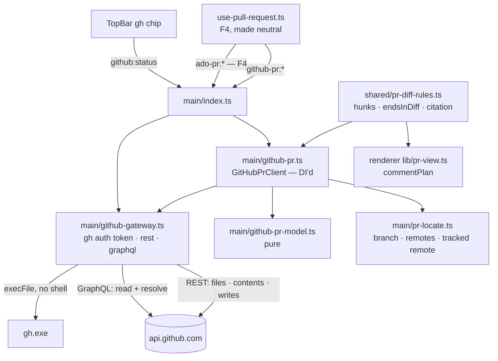

# Files Direction — GitHub Pull Requests (F5) Design

**Spec**: `.specs/features/files-pr-github/spec.md`
**Status**: Draft — reconciled with F4 as shipped on 2026-10-10
**Stacked on**: `feature/files-pr-ado` (F4, PR #169, head `f837489`)

**Sources**: GitHub REST reference *Pull request review comments* (read while writing); GitHub's GraphQL schema, **introspected** with this machine's `gh` (read-only) for the review-thread mutations and `PullRequestReviewThread`'s fields. Anything marked **[spike]** is measured in T1.

---

## Architecture Overview

F5 adds a provider, not a mode. A refactor phase first makes F4's model provider-neutral where it
shipped Azure DevOps' own shapes (§ Reconciliation). Then main gets a minimal `GitHubGateway` (token
and request primitives, built for issue #50 to extend), a DI'd `GitHubPrClient`, and a pure model.
The renderer keeps every F4 surface; the Pull request hook asks both providers and merges, and
components render each thread's provider actions.


```mermaid
graph TD
    Chip[TopBar gh chip] -->|github:status| Main
    Hook[use-pull-request.ts<br/>F4, made neutral] -->|ado-pr:* — F4| Main
    Hook -->|github-pr:*| Main
    Main[main/index.ts] --> GW[main/github-gateway.ts<br/>gh auth token · rest · graphql]
    Main --> Client[main/github-pr.ts<br/>GitHubPrClient — DI'd]
    Client --> GW
    Client --> Model[main/github-pr-model.ts<br/>pure]
    Client --> Locate[main/pr-locate.ts<br/>branch · remotes · tracked remote]
    Rules[shared/pr-diff-rules.ts<br/>hunks · endsInDiff · citation] --> Client
    Rules --> View[renderer lib/pr-view.ts<br/>commentPlan]
    GW -->|execFile, no shell| Gh[gh.exe]
    GW -->|GraphQL: read + resolve| API[(api.github.com)]
    GW -->|REST: files · contents · writes| API
```

**Decisions**:

| Axis | Choice | Rejected / why |
| ---- | ------ | -------------- |
| D1 API split (owner) | **GraphQL** reads the PR, its reviews, review threads (with `isResolved`, `isOutdated`, `subjectType`, `viewerCanReply/Resolve/Unresolve`) and PR comments in one paginated query, and runs `resolveReviewThread` / `unresolveReviewThread` — which exist **only** there. **REST** lists files (with the `patch` GraphQL does not return), reads file contents, and makes the three writes whose documented behaviour is to post immediately | All-GraphQL writes: a thread added by mutation without an explicit review may land in a pending review, against F5-Q2. All-REST is impossible: REST cannot resolve a thread |
| D2 "Within the diff" (owner, amended after T1) | The selection's **first and last** modified-side lines each lie in a hunk of the file's patch — the same hunk or two different ones. This is GitHub's own rule as T1 measured it (S1) | "Inside one hunk", the planned rule: it would turn into a general comment a range GitHub anchors. The owner chose GitHub's rule on 2026-10-10 |
| D3 Where the diff rules live | `parsePatchHunks`, `endsInDiff` and `citation` in **`src/shared/pr-diff-rules.ts`**: pure, in coverage, imported by main (the client) and the renderer (`commentPlan`) — one rule, no duplicate | In `main/github-pr-model.ts`: the renderer cannot import main, so `commentPlan` would re-implement the rule |
| D4 Review bodies and PR comments (owner, 2026-10-10) | `PrDetail.timeline`, a list of its own drawn in the Overview's General section, no buttons | As threads with disabled Reply / Resolve: buttons that never work |
| Channels | `github-pr:*` beside F4's `ado-pr:*`, **mirroring F4's names and shapes**: `thread` = anchored, `comment` = general, requests carry `pr: PrRef`. The hook calls both `find`s in parallel and routes every later call by `pr.target.provider`. F4's `ado-pr:open-link` (nothing ADO in it) becomes `pr:open-link` | Renaming every F4 channel to `pr:*` — churn for no behaviour gained |
| Invoking `gh` | `execFile('gh', ['auth', 'token'])`, `shell: false`, `windowsHide`, stdin closed, a timeout (**AD-059**) | **Verified**: `gh` here is a native `gh.exe` (`C:\Program Files\GitHub CLI\gh.exe`), not a `.cmd` shim like `code` (`shortcut-launcher.ts:65`), so no shell and no quoting surface. `ENOENT` → not installed; non-zero exit → not signed in |
| Timeouts | F4's `fetchWithTimeout(fetchFn, url, init, timeoutMs)` (`ado-gateway.ts:263`), with a GitHub constant beside F4's `ADO_PR_FETCH_TIMEOUT_MS` (`ado-pr.ts:51`) | Already a pure, generic, tested seam |
| Opening addresses | Every URL is built in main and checked by **AD-044**'s `isHttpsUrl` (`url-policy.ts:8`) before `shell.openExternal`; AD-026's inert rendering holds | F5's first draft named a `link-guard.ts` / `isOpenableLink` that F4 never shipped (AD-044 superseded it) |

---

## Reconciliation with F4 as shipped (2026-10-10)

F4 shipped `PrProvider`, `PrSummary.provider`, `PrThreadView.resolution` + `providerStatus`, a neutral
`ReviewerState` and `STATUS_CONTROLS` chosen by provider (`PrThread.tsx:57`). Still Azure DevOps'
own: the target `{ org, project, repo }`, the numeric thread id, `PrDetail.iteration`,
`PrFile.changeTrackingId`, the `no-ado-remote` search result, the status intent
(`onSetStatus(AdoThreadStatus)`, the hook's `setStatus`), one search per worktree, the `az login` and
"no Azure DevOps remote" texts, the numeric `newIterationBanner`, the hard-coded `!{id}`, and a Reply
with no permission gate. The owner chose (2026-10-10) **a refactor phase before any GitHub code**
(tasks T2–T6). It changes no behaviour on an Azure DevOps PR; F4's tests stay green, edited only
where they build a value whose type changed.

| # | Change | Where |
| - | ------ | ----- |
| N1 | `PrTarget` becomes the provider union — the shape of F3's `RemoteRef`: `{ provider: 'azure-devops', org, project, repo } \| { provider: 'github', owner, repo }`. `PrSummary.provider` is dropped; `pr.target.provider` is the one source. `prKey(ref)` (provider in it) keys the picker, the hook's `refOf` / `sameRef`, the tab (`pr:${prKey}:${path}`, was `diff-view.ts:117`) and the per-PR caches; `prLabel(ref)` reads `!7` or `#7` (was hard-coded at `PrPicker.tsx:45`, `PrOverview.tsx:145,202`) | `shared/files.ts`, `ado-pr.ts`, `remote-url.ts` (`prUrl` / `createPrUrl` take the ADO arm), `pr-view.ts`, `diff-view.ts`, `PrPicker`, `PrOverview`, the hook, the F4 smoke |
| N2 | `PrDetail.revision: string`, opaque and compared for equality — Azure DevOps' iteration as text, GitHub's head SHA. `newIterationBanner` becomes `revisionBanner(onScreen: string \| null, latest: string)` (iterations only grow, so "differs" equals F4's "greater"). Provider-only data moves aside: `PrDetail.ado?: { iteration }`, `PrFile.changeTrackingId?` (present for ADO) | `shared/files.ts`, `ado-pr.ts`, `pr-view.ts`, the hook |
| N3 | `PrThreadView.id: number \| string` (a GitHub thread is a node id); `PrThreadView.can?: { reply, resolve, reopen }` — absent means all allowed, which is Azure DevOps | `shared/files.ts`, `PrThread` |
| N4 | Thread actions by provider: `ThreadStateIntent = { provider: 'azure-devops', status } \| { provider: 'github', resolved }`; the hook's `setStatus` becomes `setThreadState(thread, intent)`; `StatusControlProps` takes the intent; `PrThread`'s reopen-and-expand keys on `resolution`, not on ADO's `active \| pending`; Reply is disabled with a reason when `can.reply` is false | `shared/files.ts`, the hook, `PrThread` |
| N5 | Search per provider: `PrSearch`'s `no-ado-remote` becomes `no-remote`, and `rate-limited { resetAt }` joins it and `PrDetailResult`. The hook keeps `searches: Partial<Record<PrProvider, PrSearch>>`, the picker lists every `found` PR, and each provider's own state (signed out, no remote, not pushed, rate-limited, error) is shown on its own line without hiding the other's PRs. The sign-in and remote texts name their provider (were `use-pull-request.ts:211`, `PrOverview.tsx:108-128,297-298`) | `shared/files.ts`, the hook, `PrOverview` |
| N6 | `src/main/pr-locate.ts`: `locateBranch(run, worktreePath)` → `{ kind: 'ok', branch, remotes: { name, ref: RemoteRef }[], tracked: string \| null } \| detached \| error`, with F4's private `parseRemoteUrls` (`ado-pr.ts:590`) moved in. `AdoPrClient.locate` (`ado-pr.ts:471`) keeps its result and filters the ADO remotes from it; F5's client filters the GitHub ones. Every git read stays on the paced runner (AD-023) | `pr-locate.ts`, `ado-pr.ts` |

**Fixes F4 found during Execute that F5 inherits** (F4 `tasks.md` § Fixes): threads are drawn by the
**ZoneWidget pattern** (an empty view zone plus an overlay widget, `DiffViewer.tsx:60-68`) — a thread
inside a plain view zone takes no clicks; the Comment bar is **always mounted** so a selection does
not shift the editor; file-level threads are `general` with a `path` (`files.ts:308-319`), and
GitHub's `subjectType: FILE` maps the same way.

---

## Spike Findings (T1, 2026-10-10)

Measured on a throwaway draft PR whose base and head branches were orphan branches in the owner's
fork (so no workflow ran), with `gh api` from a scratch script outside the repository. The file
under test had 40 lines; lines 5 and 30 changed, giving new-side hunks 2–8 and 27–33; a 64-byte
binary file was added. Cross-fork reads used GET only on the upstream. Every probe comment was
deleted afterwards, the PR closed and its branches deleted. Names below are fictitious.

| # | Question | Finding | Design consequence |
| - | -------- | ------- | ------------------ |
| S1 | Which anchors does GitHub accept? (the spec's open question) | **Accepted**: a changed line (5); a range over context lines of one hunk (3–7); the hunk's last context line (8); **a range from one hunk to the other (5–30)**. **Rejected, 422**: the first line after a hunk (9); a line in no hunk (18); a range with one end outside (5–18, 18–30, 1–4); both ends outside (12–20); a line of a binary file with no patch. Every rejection reads `Validation Failed` / `pull_request_review_thread.line` / `could not be resolved` | GitHub checks the two ends only. D2 amended to "both ends in a hunk"; owner chose it over "inside one hunk" |
| S2 | Does a REST comment post immediately? | Yes. Each anchored comment and each reply creates its **own submitted review**, state `COMMENTED`, empty body; no `PENDING` review ever exists. Deleting the comment deletes that empty review too | FPRG-19's "not into a pending review" holds with REST. `timeline` must drop empty-body reviews, or every comment shows twice |
| S3 | What do `latestReviews` and `reviewRequests` return? | `latestReviews` left out the PR author's six own `COMMENTED` reviews (empty list); `reviews` had all six | The author is never listed as a reviewer of their own PR |
| S4 | Thread fields | A one-line thread reports `startLine` equal to `line` (REST says `start_line: null`), `startDiffSide: null`. A file-level thread (`subject_type: file`, accepted on the binary file) reports `subjectType: FILE` **with `line: 1`**. `resolveReviewThread` / `unresolveReviewThread` work and are idempotent; on a resolved thread `viewerCanResolve` is false and `viewerCanUnresolve` true, and the reverse when active; `viewerCanReply` stays true | `toThreadViews` tests `FILE` before reading `line`; the toggle reads the permission that applies to the thread's state |
| S5 | Outdated | After a second head commit changing line 5: the 5–5 thread and the 5–30 thread became `isOutdated: true` with `line` and `startLine` **null** and `originalLine` / `originalStartLine` kept; the 3–7 thread (line 5 inside it, ends unchanged) and the line-8 thread stayed current | Outdated threads are listed on `originalLine`; GitHub judges outdatedness by the ends too |
| S6 | Merge base and contents on a fork PR | `GET /repos/{upstream}/compare/{baseSha}...{headSha}` resolves with the head sha of an open fork PR **and with a commit that exists only in the fork**; the `{owner}:{ref}` and `{owner}:{sha}` forms give the same merge base. `GET /repos/{upstream}/contents/{path}?ref={fork-only sha}` also returns the file | `mergeBase` keeps the sha form. The head side falls back to the base repository when the fork is gone (owner, 2026-10-10) |
| S7 | Files and contents | A binary file's entry in `pulls/{n}/files` has **no `patch` key** (not `null`), `additions: 0`. `contents` returns `size`, `type: file`, `encoding: base64` with the content **wrapped by newlines** (1607 characters for 1184 bytes); a folder returns an array; a missing path 404s. Rate-limit headers: `x-ratelimit-limit/remaining/reset/resource/used`; `X-Github-Api-Version-Selected: 2022-11-28` | Strip newlines before decoding; treat an absent `patch` as no patch; `fileSide` rejects an array |
| S8 | General comment with Issues disabled | The fork has Issues disabled; `POST /repos/{fork}/issues/{n}/comments` on its PR still worked | `generalComment` does not depend on the repository's Issues setting |

---

## Code Reuse Analysis

| Component | Location | How to use |
| --------- | -------- | ---------- |
| The whole Pull request mode | F4: `PrOverview`, `PrThread`, `CommentComposer` (exports `MarkdownBody`), `PrDiffTab` (reaches the hook through the `files.pr` lens, `use-files.ts:563`), `PrPicker`, `use-pull-request.ts`, `pr-view.ts` | Unchanged structure after N1–N5 |
| Neutral model | `shared/files.ts:218-391` after N1–N4 | `ReviewerState` extended with `changes-requested`, `commented`, `dismissed`; labels in `REVIEWER_STATES` (`PrOverview.tsx:18`, a `Record`, so typecheck forces them) |
| `renderMarkdown` | `renderer/src/lib/markdown.ts:40` (markdown-it, `html: false`, `data-href` only for https) | GitHub bodies; the citation preview |
| `pr:open-link` (was `ado-pr:open-link`, `ipc-contract.ts:304` → `openPrLink`, `ado-pr.ts:560`) | F4 | GitHub markdown links |
| `isHttpsUrl` | `main/url-policy.ts:8` (AD-044) | Every URL main opens, the install page included |
| `parseRemote` (github.com HTTPS, scp and `ssh://`) | `remote-url.ts:16` (F3) | GitHub remotes → `{ owner, repo }`; `github.com` only, no GHE |
| `fetchWithTimeout` | `ado-gateway.ts:263` | Every GitHub request |
| `DiffViewer` `zones` / `onSelectModified` | `DiffViewer.tsx:44,126,132` | GitHub threads and selections |
| `az` chip | `TopBar.tsx:31-37`, rendered `:159-160`, fed by props from `App.tsx:174-177` | The `gh` chip beside it, through a new `TopBar` prop |
| 5 s focus debounce | `FOCUS_RELOAD_MS`, `use-pull-request.ts:23` (and `App.tsx:277`) | FPRG-05 |
| `FilePlaceholder`, `DiffSides` | F1 / F2 (`files.ts:112`) | Binary or oversized files |
| F4 smoke harness | `scripts/smoke-files-pr-ado.mjs` (env coordinates, throwaway `--user-data-dir`, CDP `check()` / `skip()`, run marker, `finally` cleanup) | T27, with `gh auth token` and `api.github.com` |

---

## Components

### Main process

#### `src/main/github-gateway.ts` (new — the piece issue #50 extends)

- `ghStatus(): Promise<'ok' | 'not-installed' | 'not-signed-in'>` — `gh auth token` via `execFile` per AD-059; the token is kept in memory for the process and never written anywhere (FPRG-01, 03, 04)
- `rest(method, path, body?)` and `graphql(query, variables)` — `https://api.github.com`, `Authorization: Bearer`, `X-GitHub-Api-Version: 2022-11-28`, `fetchWithTimeout`; both return a result union and never throw
- Rate limit: a 403 or 429 with `x-ratelimit-remaining: 0` — or a GraphQL `RATE_LIMITED` error — returns `{ kind: 'rate-limited', resetAt }` from `x-ratelimit-reset` (FPRG-26)
- A 401 drops the cached token and returns `not-signed-in`
- `runner` and `fetchFn` injected, so the `gh` exit paths and the rate-limit parsing are unit-tested without a CLI or a network

#### `src/main/github-pr.ts` — `GitHubPrClient` (new, DI'd)

| Method | Calls | ACs |
| ------ | ----- | --- |
| `findPrs(worktreePath)` | `locateBranch` (N6); source owner = owner of the tracked GitHub remote; for **each** GitHub remote as target, REST `GET /repos/{target}/pulls?state=open&head={sourceOwner}:{branch}` | 06, 07 |
| `createTarget(source)` | REST `GET /repos/{source}` → `parent` when `fork` is true, else the source; plus its `default_branch` | 08 |
| `getPr(pr)` | One GraphQL query: PR fields, `latestReviews`, `reviewRequests`, `reviewThreads` (path, line, startLine, diffSide, startDiffSide, subjectType, isResolved, isOutdated, viewerCan*, comments with `databaseId`), PR `comments` — each connection paged with `first: 100` and `pageInfo` until exhausted | 09, 10, 13, 14, 17, 18 |
| `files(pr)` | REST `GET /repos/{target}/pulls/{n}/files?per_page=100&page=…`, all pages; keeps `patch`, `status`, `previous_filename`; stops at GitHub's 3000-file ceiling and flags it | 11, 22 |
| `mergeBase(target, baseSha, headSha)` | REST `GET /repos/{target}/compare/{baseSha}...{headSha}` → `merge_base_commit.sha` — resolves with a fork's head sha (S6) | 12 |
| `fileSide(repo, path, ref)` | REST `GET /repos/{repo}/contents/{path}?ref={ref}`: `size` read first, content decoded only when ≤ 1 MB and not binary (base64 wrapped with newlines, S7); the head side uses the **head repository**, then the base repository at the same commit when the fork is gone (S6, owner 2026-10-10), and is unavailable only when both fail | 12 |
| `reply(pr, rootCommentId, body)` | REST `POST /repos/{target}/pulls/{n}/comments/{id}/replies` | 16 |
| `setResolved(threadNodeId, resolved)` | GraphQL `resolveReviewThread` / `unresolveReviewThread` | 17 |
| `anchoredComment(pr, headSha, anchor, body)` | REST `POST /repos/{target}/pulls/{n}/comments` with `commit_id`, `path`, `line`, `side: RIGHT`, `start_line`, `start_side` for a range | 19 |
| `generalComment(pr, body)` | REST `POST /repos/{target}/issues/{n}/comments` | 21, 23 |

#### `src/shared/pr-diff-rules.ts` (new — pure, unit-tested, D3)

- `parsePatchHunks(patch): Hunk[]` — each `@@ -a,b +c,d @@` header gives the new-side range `c … c+d−1`; `d` omitted means 1; `d = 0` means no new-side lines (FPRG-19, 22)
- `endsInDiff(startLine, endLine, hunks): boolean` — D2: `startLine` and `endLine` each inside some hunk's new-side range; `null` hunks (no patch) → always false (FPRG-19, 20, 22)
- `citation(path, startLine, endLine, text): string` — `` `path:Lstart–Lend` `` followed by the selected text fenced with a fence longer than any backtick run inside it, so a selection containing ` ``` ` cannot break out (FPRG-20, 21)

#### `src/main/github-pr-model.ts` (new — pure, unit-tested)

- `toThreadViews(threads)` — checked in this order: `subjectType: FILE` → `general` with its path (GitHub still reports `line: 1` for it, S4); `isOutdated` → `outdated` on `originalLine` (`line` is null then, S5); otherwise `placed` from `startLine` (equal to `line` for one line, S4) to `line` on `diffSide`. `isResolved` → `resolution: 'resolved'`; `viewerCanReply` → `can.reply`, `viewerCanResolve` → `can.resolve`, `viewerCanUnresolve` → `can.reopen`; `rootCommentId` = the first comment's `databaseId` (FPRG-13, 14, 17, 18)
- `reviewerStates(latestReviews, reviewRequests)` — latest state per reviewer onto the extended `ReviewerState`; pending own reviews excluded (`latestReviews` already leaves out the PR author's own, S3); requested users and teams without a review listed as `no-vote` (FPRG-09)
- `timeline(reviews, comments)` — review bodies and PR comments merged into `PrTimelineEntry[]` in time order; empty review bodies dropped — every comment posted outside a review creates one (S2) (FPRG-10)
- `sourceOwner(remotes, tracked)` and GitHub-remote selection over `locateBranch`'s result (FPRG-06)

#### `src/main/remote-url.ts` (extended)

- `githubPrUrl(ref, n)` → `https://github.com/{owner}/{repo}/pull/{n}`
- `githubCompareUrl(target, defaultBranch, sourceOwner, branch)` → `https://github.com/{target}/compare/{defaultBranch}...{sourceOwner}:{branch}?expand=1`, segments encoded; every output passes `isHttpsUrl`

#### IPC

| Channel | Req | Res |
| ------- | --- | --- |
| `github:status` | — | `GhStatus` |
| `github-pr:find` | `{ worktreePath }` | `PrSearch` |
| `github-pr:get` | `{ worktreePath, pr: PrRef }` | `PrDetailResult` |
| `github-pr:file-sides` | `{ worktreePath, pr: PrRef, path, oldPath? }` | `DiffSides` |
| `github-pr:reply` · `:resolve` · `:thread` (anchored) · `:comment` (general) | `pr: PrRef` + intent only | `WriteResult` |
| `github-pr:open` | `{ worktreePath, pr }` or `{ worktreePath, create: true }` | `LaunchResult` (`shared/shortcuts.ts:3`) |
| `pr:open-link` (renamed from `ado-pr:open-link` in T2) | `{ href }` | `LaunchResult` |

### Renderer

| File | Change | ACs |
| ---- | ------ | --- |
| `lib/use-pull-request.ts` (F4, neutral after N1–N5) | Calls `ado-pr:find` and `github-pr:find` in parallel into `searches`; routes by `pr.target.provider`; per-PR caches keyed by `prKey` | 07, 25 |
| `lib/pr-view.ts` (F4) | `commentPlan(pr, file, selection)` → `anchored` or `general` with the banner text, using `shared/pr-diff-rules.ts` — the only place the D2 rule meets the UI | 19, 20, 22 |
| `components/PrThread.tsx` reasons | The toggle reads `can.resolve` on an active thread and `can.reopen` on a resolved one — GitHub sets the other one false by state, not by permission (S4) — so "no permission" shows only when the one that applies is false | 18 |
| `lib/use-github-status.ts` (new) | `github:status` on mount and on focus (5 s debounce); hidden on `no-github-remote` | 02, 05 |
| `components/TopBar.tsx` | `gh` chip beside `az`; install link opened by main | 02, 03, 04 |
| `components/PrThread.tsx` (F4) | GitHub action: Resolve / Reopen toggle; every action disabled with its reason per `can` | 17, 18 |
| `components/CommentComposer.tsx` (F4) | Shows the general-comment banner and the citation in Preview when the plan is `general` | 20 |
| `components/PrPicker.tsx` (F4) | Provider glyph per PR | 07 |
| `components/PrOverview.tsx` (F4) | GitHub reviewer states; the timeline in General with no buttons | 09, 10 |

---

## Data Models

```typescript
// src/shared/files.ts — additions after the N1–N6 refactor
export type GhStatus = 'ok' | 'not-installed' | 'not-signed-in' | 'no-github-remote'

export interface Hunk { newStart: number; newEnd: number } // inclusive; newEnd < newStart when d = 0

export interface GitHubPrFile extends PrFile {
  /** Parsed from GitHub's patch; null when GitHub omitted it (large or binary). */
  hunks: Hunk[] | null
}

export type CommentPlan =
  | { kind: 'anchored'; anchor: { path: string; startLine: number; endLine: number } }
  | { kind: 'general'; banner: string; citation: string }

// ReviewerState (F4) gains GitHub's states; requested-without-review is `no-vote`.
export type ReviewerState =
  | 'approved' | 'approved-with-suggestions' | 'no-vote' | 'waiting-for-author' | 'rejected'
  | 'changes-requested' | 'commented' | 'dismissed'

/** A review body or a PR comment (D4): read, never answered in place. */
export interface PrTimelineEntry {
  author: string
  at: number
  content: string
  reviewState?: ReviewerState
}
// PrDetail gains `timeline?: PrTimelineEntry[]` (GitHub) and
// `github?: { headSha: string; baseSha: string; headRepo: { owner: string; repo: string } | null; filesIncomplete: boolean }`.
```

---

## Error Handling Strategy

| Scenario | Handling | User sees |
| -------- | -------- | --------- |
| `gh` missing | `ENOENT` | `gh · not installed` + install link (FPRG-03) |
| `gh` signed out | Non-zero exit | `gh · not signed in`; "run `gh auth login`" on GitHub's line of the mode (FPRG-04) |
| No GitHub remote anywhere | `github:status` → `no-github-remote` | No chip (FPRG-02) |
| Branch tracks no GitHub remote | `findPrs` → `none`, no request | "Not pushed to GitHub" on GitHub's line (FPRG-06) |
| Rate limited | `rate-limited` with reset time | Message with the reset time; no retry (FPRG-26) |
| Fork deleted | `head.repo` null | Head side read from the base repository at the head commit; "head repository unavailable" only when that fails too; rest of the PR works (edge case) |
| 3000-file ceiling | `files` flags truncation | "List incomplete" in the tree (edge case) |
| 422 on an anchored comment | Should not happen after `endsInDiff`; if it does (GitHub's `pull_request_review_thread.line` … `could not be resolved`, S1), `WriteResult` with GitHub's message | Inline in the composer, text kept |
| No permission to reply / resolve / reopen | `can.*` false | Disabled action with reason (FPRG-18) |
| Write while token expired | 401 → `not-signed-in` | Composer keeps text; chip updates |
| One provider fails | Its own `PrSearch` | Its line says why; the other provider's PRs stay in the picker (FPRG-07) |

---

## Risks & Concerns

| Concern | Location | Impact | Mitigation |
| ------- | -------- | ------ | ---------- |
| ~~The out-of-hunk rejection is known behaviour, not documented on the reference page~~ | spec open question | — | **Closed by T1** (S1): measured and D2 amended |
| **Probing this repository's upstream would notify real maintainers** | T1, T27 | Noise to strangers; a public artefact | Writes only on a draft PR whose base and head are both in the owner's fork (owner, 2026-10-10); `gh pr create` there always passes `--repo` and `--base`, since its default base is the upstream; coordinates from environment variables; the smoke refuses to write when the PR's base repository is `obogoni/playground` |
| ~~Cross-fork `compare` with a fork's head sha~~ | `mergeBase` | — | **Closed by T1** (S6): the sha form resolves in the base repository, even for a commit that exists only in the fork |
| The N1–N6 refactor regresses Azure DevOps | T2–T6 | F4 breaks for its users | F4's tests stay green; F4's smoke re-run read-only after T6 if the owner's sandbox PR is still open, else at T27 time |
| GraphQL connection limits | `getPr` | Threads or comments silently cut at 100 | Every connection paged to `hasNextPage: false`; a 150-thread fake response is a unit test (lesson L-128: confirm the connection pages before writing the case) |
| Fence injection in citations | `citation` | A selected ` ``` ` closing the quote early and turning the rest into live markdown | Fence longer than the longest backtick run in the selection; unit-tested, and rendered through `renderMarkdown` in `pr-view.test.ts` |
| A GitHub token in memory | `github-gateway.ts` | Leaks if logged | Never logged, never sent over IPC; the renderer never sees it |
| Two providers' requests on every PR-mode entry | `use-pull-request.ts` | Latency and one extra failure path | Parallel calls; no GitHub request when no GitHub remote (FPRG-07) |
| Equal numbers on both providers | tab keys, caches | ADO `!7` and GitHub `#7` share a tab | `prKey` carries the provider (N1) |

---

## Test Strategy

| Layer | Test type | What it proves |
| ----- | --------- | -------------- |
| N1–N6 refactor | existing F4 tests (edited only where a value's type changed) + unit for `prKey` / `prLabel` / `revisionBanner` / `locateBranch` | No Azure DevOps behaviour changed |
| `shared/pr-diff-rules.ts` | unit (pure) | Hunk parsing incl. `d` omitted and `d = 0`; D2 both ends in one hunk / in two hunks / one end outside / no patch; citation fences |
| `github-pr-model.ts` | unit (pure) | Thread mapping incl. outdated, file-level and permissions; reviewer states; timeline order and empty bodies; source owner |
| `github-gateway.ts` | unit (fake runner + fake `fetch`) | `ENOENT`, non-zero exit and success; rate-limit detection from REST headers and GraphQL errors; headers sent; 401 |
| `GitHubPrClient` | unit (fake `fetch`) | Exact URLs and bodies; files and GraphQL connections paged to the end; the head side read from the head repository; writes only when called, one request each |
| `remote-url.ts` additions | unit (pure) | PR and compare URLs, encoding, https-only |
| `pr-view.ts` `commentPlan` | unit (pure) | Anchored vs general with the exact banner and citation; the citation renders as one code block |
| Components, hooks, chip | none — hand-verified + CDP smoke | Per `TESTING.md` |
| Spike | manual, the owner's fork | The **[spike]** items — done, § Spike Findings |

---

## Requirement Coverage

| Component | ACs |
| --------- | --- |
| `github-gateway.ts` | 01, 03, 04, 26 |
| `github-pr.ts` | 06, 07, 08, 09, 10, 11, 12, 16, 17, 19, 21, 23, 24 |
| `github-pr-model.ts` | 06, 09, 10, 13, 14, 17, 18 |
| `shared/pr-diff-rules.ts` | 19, 20, 21, 22 |
| `remote-url.ts` | 08 |
| `use-github-status.ts`, `TopBar.tsx` | 02, 03, 04, 05 |
| `use-pull-request.ts` (N5 + T20) | 07, 25 |
| `pr-view.ts` | 19, 20, 22 |
| `PrThread`, `CommentComposer`, `PrPicker`, `PrOverview` | 07, 09, 10, 15, 17, 18, 20 |
| Every write path | 24 |

Every one of FPRG-01..26 appears at least once.
