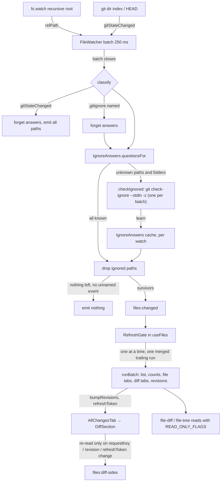

# Files Watch Ignored Design

**Spec**: `.specs/features/files-watch-ignored/spec.md`
**Status**: Approved (planned 2026-10-01, approved by the owner 2026-10-01). Reconciled 2026-10-03 against
`origin/main` `fc19a3c`, which holds #147; T1 can stop the feature and send it back to the owner, and so
can T2.

Line numbers below are from `fc19a3c`. #147 and #154 changed `git.ts` and `index.ts` after planning; the
Files files did not change.

---

## Architecture Overview

Three independent cuts, one per cause the issue names, plus the measurement around them.

1. **Main drops what git ignores.** `FileWatcher` keeps batching events for 250 ms exactly as today.
   When a batch closes it no longer emits at once: it classifies the batch's paths against a per-watch
   cache of git's answers (`IgnoreAnswers`), asks `git check-ignore` once about whatever has no answer,
   and emits only what survives. A batch with nothing left emits nothing, so the renderer never hears of
   it.
2. **The view's reads stop moving the index.** Every git read in `file-diff.ts` and `file-tree.ts`, and
   the watcher's `check-ignore`, is prefixed with `READ_ONLY_FLAGS` (`--no-optional-locks -c
   diff.autoRefreshIndex=false`). Without the second flag `git diff --numstat HEAD` rewrites
   `.git/index` after any same-bytes rewrite, which fires the watcher's own `index` watch and the
   git-state watcher's.
3. **The renderer refreshes once at a time, and only what changed.** The hook sends each `files:changed`
   batch through a `RefreshGate` (one running, one merged trailing run). An All changes section re-reads
   when its request's *content* changes (`requestKey`), when its file was written (a per-path disk
   revision, Uncommitted mode only), or when the git state moved (`refreshToken`, as today).



### Approaches considered for the ignore decision

The issue leaves the mechanism to the design and asks for a measurement. Both use git itself and cache
per watch.

| | A. `check-ignore` per batch, cached (chosen) | B. Ignored list at select, refreshed on `.gitignore` change |
| - | - | - |
| Git processes from ignored writes | One for the first batch that names an unknown folder, then none | One at each selection, then none |
| An ignored folder created after the view opened (a fresh worktree's first build, a rebuild after a clean) | Seen on its first batch | Missed until the next selection, unless a second mechanism re-lists (folder birth times, or a size threshold) |
| A tracked file inside an ignored folder | Correct: `check-ignore bin` answers "not ignored" when `bin` holds a tracked file, so no prefix is cached for it | Correct: the list then names `bin/Debug/`, not `bin/` |
| A deleted ignored folder (`rm -rf bin`) | Paths under it match; `bin` itself may pass once | Correct: the prefix stays cached |
| Cost per call, 20,000 tracked files (planning probe) | 53 ms for a 9-path batch; 295 ms for 2,000 paths; the process floor is 43 ms | 65 ms per list here; the owner's large repository takes about 650 ms for the same walk (`ls-files --others`) |
| New runner surface | `git()` gains an `input` option (stdin); exit code 1 means "none ignored" | None |

A wins on the case that matters most in this app: an agent builds in a worktree the app just created, so
`bin/` and `obj/` appear after the Files view opened. B needs a second mechanism to see them, which is
more state than A's one cache. T2 re-measures on the executing machine and stops the feature if A's
numbers fail the rule written there.

### Approaches considered for the single flight

1. **In the Files hook (chosen, owner-confirmed).** The hook knows when its reads settle; a pure gate in
   `src/renderer/src/lib/` is unit-testable with deferred promises.
2. **In main, holding the next emit until the renderer acknowledges.** Needs an acknowledgement channel
   and still cannot see the renderer's reads. Rejected.

---

## Planning findings (throwaway repositories only, git 2.55.0.windows.4)

Measured on 2026-10-01 in temporary repositories the probe created and deleted. The owner's
repositories were not touched. T2 re-runs the same probes on the executing machine and records its git
version.

**Index rewrite.** After every tracked file's mtime is touched with the bytes unchanged (what a build
step or an editor save without changes does), one command, `.git/index` compared before and after:

| Command | Rewrote the index |
| ------- | ----------------- |
| `diff --numstat -z HEAD` | yes |
| `--no-optional-locks diff --numstat -z HEAD` | **yes** |
| `-c diff.autoRefreshIndex=false diff --numstat -z HEAD` | no |
| `--no-optional-locks -c diff.autoRefreshIndex=false diff --numstat -z HEAD` | no |
| `diff-index --numstat -z HEAD` (plumbing) | no |
| `status --porcelain` | yes |
| `--no-optional-locks status --porcelain` | no |
| `ls-files --others`, `ls-tree`, `cat-file -s`, `diff --cached --name-status HEAD`, `ls-files --others --ignored --directory` | no |

With a content change only (no stat-only entry), no command rewrote the index. The output of
`diff --numstat` was the same with and without the config. So the view does retrigger the git-state
watchers today, on every refresh that follows a same-bytes rewrite, and `--no-optional-locks` alone does
not stop it: `-c diff.autoRefreshIndex=false` does.

**`check-ignore` semantics.** With `.gitignore` = `bin/`, `*.log`:

- `bin`, `bin/Debug`, `bin/Debug/a.dll` are all reported ignored (git checks that `bin` is a folder).
- After `git add -f bin/keep.txt`: `bin` and `bin/keep.txt` are **not** reported; `bin/Debug/a.dll` is.
- After `rm -rf bin`: `bin` is not reported (git cannot tell a missing path was a folder); `bin/Debug`
  and `bin/Debug/net8.0/a1.dll` are (a leading path component is a folder by construction).
- Exit code 0 when at least one path is ignored, 1 when none, 128 on `-z` without `--stdin`.

### Re-measured at Execute (T2, 2026-10-03, git 2.55.0.windows.4, Node 24.19.0, same machine as #147's baseline)

Scratch scripts in the session's scratch folder, throwaway repositories under the system temp folder,
all deleted after the run.

**Index rewrite**, one fresh repository per cell (50 tracked files, committed, then 1.5 s idle so the
index is older than the write), one command, `.git/index` compared before and after:

| Same-bytes write | `diff --numstat -z HEAD` | `--no-optional-locks` + it | `-c diff.autoRefreshIndex=false` + it | both flags + it |
| ---------------- | ------------------------ | -------------------------- | ------------------------------------- | --------------- |
| Every file rewritten, run at once | rewrote | **rewrote** | no | no |
| Every file rewritten, run 1.5 s later | rewrote | **rewrote** | no | no |
| Every mtime set 5 s ahead | rewrote | **rewrote** | no | no |
| One file rewritten | rewrote | **rewrote** | no | no |
| One content change, the rest same bytes | rewrote | **rewrote** | no | no |

The planning finding holds: `--no-optional-locks` alone does not stop `git diff`'s refresh, and the
config does. A first, sequential probe that reused one repository right after `git update-index
--refresh` saw `--no-optional-locks` alone leave the index alone; that setup is unlike the app's (an
index written long before a build rewrites files) and was not explained further. In that same probe,
`status --porcelain` rewrote and `--no-optional-locks status --porcelain` did not; `diff-index`,
`ls-files --others`, `ls-tree`, `cat-file -s`, `diff --cached --name-status` and `ls-files --others
--ignored --directory` never did, as at planning.

**`check-ignore --stdin -z` semantics** (root `.gitignore` = `bin/`, `*.log`; `src/.gitignore` = `gen/`;
`.git/info/exclude` = `scratch/`; asked with `READ_ONLY_FLAGS`):

- `bin`, `bin/Debug`, `bin/Debug/a.dll`, `src/x.log`, `src/gen`, `src/gen/a.ts`, `scratch`, `scratch/n.txt`
  reported; `src/a.ts` not. Exit 0.
- Only `src/a.ts` and `src` asked: nothing reported, exit 1.
- `bin/a b.dll`, `bin/#h.dll`, `bin/!x.dll`, `bin/-lead.dll`, `bin/é.dll` come back exactly as sent;
  `src/é.ts` not reported.
- After `git add -f bin/keep.txt` and a commit: `bin` and `bin/keep.txt` not reported; `bin/Debug` and
  `bin/Debug/a.dll` reported.
- After `bin/` is deleted: `bin` not reported; `bin/Debug`, `bin/Debug/a.dll`, `bin/Debug/net8.0/a1.dll`
  reported.
- A folder that is not a repository: exit 128.

Every row matches the planning findings above.

**Cost**, a synthetic repository of 20,001 tracked files in 40 folders, each with untracked `bin/Debug/`
and `obj/`, and an untracked `node_modules/` of 20,000 files:

| Call | Median | Runs (ms) |
| ---- | ------ | --------- |
| 9-path `check-ignore` (folders, files, `node_modules`) | **87 ms** | 83 82 96 87 87 84 85 87 87 86 |
| 2,000-path `check-ignore` | **330 ms** | 330 326 343 354 326 |
| `ls-files --others --ignored --exclude-standard --directory` | 95 ms | 97 95 95 95 97 |
| Process floor (`git --version`) | 73 ms | — |

Against the decision rule: 87 ms ≤ 150 ms, 330 ms ≤ 1,000 ms, every semantics row matches. **A
confirmed.**

---

## Code Reuse Analysis

### Existing Components to Leverage

| Component | Location | How to Use |
| --------- | -------- | ---------- |
| The single git runner | `src/main/git.ts:20-46` (`git`) | Gains `input`; every new call goes through it (AD-023). It reports to `diagnostics()` (AD-057) and starts through the spawn pacer (PERF-22), so `check-ignore` is counted and queued with no extra code |
| The real-git runner tests | `src/main/git.test.ts:36` | Its timeout case relies on stdin staying open when no `input` is given; the new option leaves that path alone |
| The watcher and its fake-port harness | `src/main/file-watcher.ts:43-125`, `src/main/file-watcher.test.ts:18-87` | The batch timer, the selection guards and the handles stay; the emit becomes a classification step |
| The real `fs.watch` port | `src/main/watch-port.ts:14-26` | Unchanged; it already names paths relative to the root |
| Wiring | `src/main/index.ts:426-435` (`fileWatcher`), `:150` (`resolveGitDir`) | One more dep, `checkIgnored` |
| Files reads | `src/main/file-diff.ts:134-168` (`readSide`), `:183-215` (`diffStats`), `:263-284` (`untrackedStats`); `src/main/file-tree.ts:38-85` (`listDir`), `:207-221` (`changedSince`) | Each `git` / `run` call gets `...READ_ONLY_FLAGS` in front of its arguments |
| The recording runner in the diff tests | `src/main/file-diff.test.ts:183-188`, `:288` | `:288` reads `args[0]` as the subcommand; it is updated to assert the prefix and then the subcommand |
| The hook's batch reaction | `src/renderer/src/lib/use-files.ts:498-529` | Moves into a `runBatch` that returns a promise; the subscription only filters and calls the gate |
| The loaders | `src/renderer/src/lib/use-files.ts:277-339`, `:358-394`, `:397-424` | Return their promises instead of dropping them; `refreshMode` returns `Promise.allSettled` of what it started |
| `tabsAffected` | `src/renderer/src/lib/files-view.ts:205-208` | Picks the listed files a batch names, for the revisions |
| `diffRequestFor` | `src/renderer/src/lib/diff-view.ts:29-45` | Unchanged; `requestKey` reads what it builds |
| The section's read effect | `src/renderer/src/components/DiffSection.tsx:99-115` | Depends on `requestKey` and `revision` instead of the request object |
| The stack | `src/renderer/src/components/AllChangesTab.tsx:96-99`, `:360-375` | Passes `revision` per file; its `requests` map can stay as it is |
| The stack's hosts | `src/renderer/src/components/FileTabs.tsx:460-475`, `src/renderer/src/components/CommitTab.tsx:50-64` | FileTabs passes revisions in Uncommitted mode only; CommitTab passes none |
| Bench | `scripts/bench-sessions.mjs` `OPTIONS`, `scripts/bench-summary.mjs` (both from #147, not written yet) | Four `OPTIONS` rows and three loops; a Files block in the rows and three targets |
| Files diff smoke | `scripts/smoke-files-diff.mjs:513-560` (the `SMOKE_ONLY` dispatch), `:1004-1006` (discard, then icons) | A `watchSection` with `SMOKE_ONLY=watch`, placed between the discard section and the icon checks |

### Integration Points

| System | Integration Method |
| ------ | ------------------ |
| Git | `git check-ignore --stdin -z` through `git()` with `input`; reads with `READ_ONLY_FLAGS` |
| The renderer | `files:changed` keeps its shape (`FilesChanged`); it is simply sent less often and with fewer paths |
| Diagnostics (#147) | `check-ignore` is counted by the runner; `files:changed` emits are already counted at the emit site |

---

## Components

### Git runner input and read flags (`src/main/git.ts`)

- **Purpose**: let a git call receive stdin, and name the flags that keep a read from touching the index.
- **Interfaces**:

  ```typescript
  /**
   * Prefix for every read that must not write the index (FWIG-15). `--no-optional-locks` stops
   * `status`'s refresh; `diff.autoRefreshIndex=false` stops `diff`'s, which the first does not.
   */
  export const READ_ONLY_FLAGS: readonly string[] = ['--no-optional-locks', '-c', 'diff.autoRefreshIndex=false']

  export function git(
    cwd: string,
    args: string[],
    opts: { timeoutMs?: number; input?: string } = {}
  ): Promise<{ stdout: string }>
  ```

- **Behaviour**: with `input`, the child's stdin receives it and is closed (`started.child.stdin?.end(input)`
  on the promise `promisify(execFile)` returns, inside the pacer callback, before `.finally(end)`). Without
  it, nothing changes on `main`: stdin stays open, which `git.test.ts`'s timeout cases rely on. #165
  (CRTO-06, open) ends stdin on every call; when it merges, the two become one `end(opts.input)`.
- **Reuses**: AD-023's runner; #147's `diagnostics().gitRequested` wrapper and the PERF-22 pacer stay
  around the call.

### Ignore answers (`src/main/ignore-check.ts`)

- **Purpose**: remember what git said about paths in one watch, and say what a batch still has to ask.
- **Interfaces**:

  ```typescript
  export const IGNORE_ASK_LIMIT = 2000
  export const IGNORE_CHECK_TIMEOUT_MS = 5000

  /** Worktree-relative parent folders, outermost first: 'a/b/c.ts' → ['a', 'a/b']. */
  export function parentFolders(path: string): string[]

  export class IgnoreAnswers {
    /** True when git said this path, or a folder above it, is ignored. */
    isIgnored(path: string): boolean
    /**
     * What one batch must ask: every parent folder and every path with no answer, skipping anything
     * under a folder already known ignored. Folders first; only folders when the total exceeds
     * IGNORE_ASK_LIMIT; nothing when the folders alone exceed it (FWIG-05/06).
     */
    questionsFor(paths: readonly string[]): string[]
    /** Records git's answer for exactly these questions: listed in `ignored` → ignored, else kept. */
    learn(asked: readonly string[], ignored: ReadonlySet<string>): void
    forget(): void
  }

  export type IgnoreRunner = (
    cwd: string,
    args: string[],
    opts: { input: string; timeoutMs: number }
  ) => Promise<{ stdout: string }>

  /**
   * `git [...READ_ONLY_FLAGS] check-ignore --stdin -z` over `paths`. The set of paths git reports
   * ignored; an empty set on exit code 1; null on any other failure or a timeout (FWIG-10).
   */
  export function checkIgnored(
    worktreePath: string,
    paths: readonly string[],
    run?: IgnoreRunner // default: git
  ): Promise<Set<string> | null>
  ```

- **Rules**: an ignored answer for a path is a prefix for everything under it (git never re-includes a
  file inside an excluded folder, and it answers "not ignored" for a folder that holds a tracked file).
  A path or folder can be ignored, kept, or unknown; only unknown ones are asked. Paths are compared as
  the watcher names them (forward slashes, no leading `./`).
- **Dependencies**: `git.ts`. Pure apart from `checkIgnored`.

### File watcher (`src/main/file-watcher.ts`)

- **Purpose**: unchanged (watch one worktree, batch 250 ms), plus: emit only what git does not ignore.
- **Deps**: `FileWatcherDeps` gains `checkIgnored: (worktreePath: string, paths: readonly string[]) => Promise<Set<string> | null>`.
  `index.ts` passes `(wt, paths) => checkIgnored(wt, paths)`.
- **State per watch**: `answers: IgnoreAnswers` (new on every `select`), a watch generation number, a
  `sawUnnamed` flag beside `paths` and `gitStateChanged`, and a promise chain `classifying`.
- **Batch close** (the `schedule.after` callback): snapshot `paths`, `gitStateChanged`, `sawUnnamed`;
  reset them; append `classify(snapshot, generation)` to `classifying`.
- **`classify`**:
  1. Stale generation or another selection → return (FWIG-13).
  2. `gitStateChanged` → `answers.forget()`, emit `{ paths, gitStateChanged: true }` (FWIG-08).
  3. A path whose last segment is `.gitignore` → `answers.forget()` (FWIG-07).
  4. `ask = answers.questionsFor(paths)`; when not empty, `await deps.checkIgnored(wt, ask)`; re-check the
     generation (FWIG-13); a set → `answers.learn(ask, set)`; null → nothing learned (FWIG-10).
  5. `kept = paths.filter((p) => !answers.isIgnored(p))`; nothing kept and no unnamed event → return
     (FWIG-01); otherwise emit `{ paths: kept, gitStateChanged: false }` (FWIG-02, FWIG-11).
- **Order**: `classifying` is one promise chain per watcher, so checks never overlap and emits leave in
  batch order (FWIG-12). A rejection inside `classify` is caught on the chain, logged, and the batch is
  emitted unfiltered.
- **`select`**: unchanged, plus a new `IgnoreAnswers` and a bumped generation (FWIG-09).

### Files reads (`src/main/file-diff.ts`, `src/main/file-tree.ts`)

- Every `git(...)` and `run(...)` in `readSide`, `diffStats`, `untrackedStats`, `listDir` and
  `changedSince` gets `...READ_ONLY_FLAGS` in front of its arguments. Nothing else changes; `listBases`,
  the commit reads and the discard are outside the refresh path and stay as they are. The Uncommitted
  list's `git status` (`changedFilesOf`, `STATUS_ARGS` at `src/main/worktree-manager.ts:420`) already
  passes `--no-optional-locks`, which the probe shows is enough for `status`; it belongs to #149's file
  and is left alone.

### Refresh gate (`src/renderer/src/lib/refresh-gate.ts`)

- **Purpose**: one batch refresh at a time, and exactly one merged trailing run.
- **Interfaces**:

  ```typescript
  export interface RefreshGate<T> {
    /** Runs `job` now when idle; otherwise it becomes, or merges into, the one waiting job. */
    request(job: T): void
    /** Forgets the waiting job; the running one finishes. */
    dropWaiting(): void
  }
  export function createRefreshGate<T>(
    run: (job: T) => Promise<unknown>,
    merge: (waiting: T, next: T) => T
  ): RefreshGate<T>

  /** Paths in first-seen order without duplicates; git-state change if either had it; `b`'s worktree. */
  export function mergeBatches(a: FilesChanged, b: FilesChanged): FilesChanged
  ```

- **Behaviour**: `request` while idle calls `run` synchronously (FWIG-18). While running, the job is
  kept or merged (FWIG-19/20). When the running promise settles, fulfilled or rejected, or `run` throws
  synchronously, the gate starts the waiting job if there is one (FWIG-21). `dropWaiting` clears it
  (FWIG-23).

### Request key and disk revisions (`diff-view.ts`, `files-view.ts`)

- `requestKey(request: DiffRequest | null): string` in `diff-view.ts`: the request's content as one
  string (`-` for no request; each side `rev:<rev>:<path>`, `disk:<path>` or `none`). Two requests that
  read the same sides have the same key (FWIG-24); any change of status, path, old path or revision
  changes it (FWIG-26).
- `bumpRevisions(prev: Readonly<Record<string, number>>, paths: readonly string[]): Record<string, number>`
  in `files-view.ts`: every named path one higher, a new object; `prev` returned as is when `paths` is
  empty, so nothing re-renders.

### Files hook (`src/renderer/src/lib/use-files.ts`)

- The loaders, `readTab`, `readDiff` and `refreshMode` return their promises (still never reject: each
  keeps its `.catch(console.error)`).
- `WorktreeFiles` gains `revisions: Record<string, number>`; `UseFiles` gains
  `diskRevisions: Readonly<Record<string, number>>`.
- `runBatch(event): Promise<void>`: reads `live.current`; returns at once when the direction is not
  active or the worktree is another (FWIG-22/23). Otherwise it does what the handler does today, collecting
  every promise: file tabs the batch names; on a git-state change every diff tab and `refreshToken + 1`;
  otherwise the Uncommitted diff tabs it names, and `bumpRevisions` for
  `tabsAffected(here.uncommitted paths, event.paths)`; then `refreshMode`. It resolves on
  `Promise.allSettled` of all of them (FWIG-21).
- A `RefreshGate<FilesChanged>` lives in a ref, created once; `run` reaches `runBatch` through a ref so
  the subscription never resubscribes. The `files:changed` listener keeps its two filters and calls
  `gate.request(event)`. An effect on `[active, worktreePath]` calls `dropWaiting()`.

### Stack and sections (`DiffSection.tsx`, `AllChangesTab.tsx`, `FileTabs.tsx`)

- `DiffSection` gets `revision: number`. It keeps the latest `request` in a ref written by an effect, and
  its read effect depends on `[mounted, expanded, requestKey(request), revision, stat.uncountable,
  worktreePath, refreshToken]`, reading the request from the ref. Reading a ref during render is a lint
  error under `eslint-plugin-react-hooks` 7, so the key is computed in render and the ref is only read in
  the effect.
- `AllChangesTab` gets `revisions?: Readonly<Record<string, number>>` and passes
  `revision={revisions?.[file.path] ?? 0}`.
- `FileTabs` passes `revisions={files.mode === 'uncommitted' ? files.diskRevisions : undefined}`
  (FWIG-25, FWIG-28). `CommitTab` passes none (FWIG-29).

### Bench rows (`scripts/bench-sessions.mjs`, `scripts/bench-summary.mjs`)

| Flag | Default | Meaning |
| ---- | ------- | ------- |
| `--files-view` | off | Seed the Files fixture in `bench-wt-1` and open the Files direction on it after the spawn (FWIG-32) |
| `--build-interval <ms>` | 0 (off) | Write `build-out/obj-<k mod 50>.bin` in `bench-wt-1`, new bytes each time (FWIG-33) |
| `--edit-interval <ms>` | 0 (off) | Rewrite the seeded line of `bench-wt-1/src/f0000.ts` in place, same byte length (FWIG-34; amended 2026-10-03, see T4) |
| `--touch-interval <ms>` | 0 (off) | Rewrite `bench-wt-1/src/f0100.ts` with its own bytes (FWIG-35) |

- **Seed** (with `--files-view`): in `ws/app` before the worktrees are added, a committed `.gitignore`
  holding `build-out/`; in `bench-wt-1`, `build-out/obj-00.bin` to `obj-49.bin` and one appended line in
  each of `src/f0000.ts` to `src/f0011.ts`, uncommitted, its value zero-padded to six digits so the edit
  loop can rewrite it at the same length. In the throwaway `config.json`,
  `ui.files["<bench-wt-1>"] = { mode: 'uncommitted' }`.
- **Opening the view**: through CDP, as `scripts/smoke-files-diff.mjs:335-354` does: the `Tree` segment,
  the `bench/1` branch row, the `Files` segment; then wait until `.diff-section` elements exist. A missing
  section after 15 s fails the run (exit 1).
- **Loops** start with the index loop, when the sessions open, and stop with it. Each counts and skips a
  failed write.
- **Summary**: `rowOf(line, { filesWorktree: 'bench-wt-1' })` adds `filesEmits`
  (`emits['files:changed']['bench-wt-1']`), `filesGit` (`git.byWorktree['bench-wt-1'].count`),
  `filesCatFile` (`git.byWorktree['bench-wt-1'].bySubcommand['cat-file'].count`) and `filesStatusEmits`
  (`emits['worktree:status']['bench-wt-1']`), each 0 when absent. `formatSummary` prints them as a
  `files` block when `--files-view` was given. `judgeTargets` adds the three Files targets (FWIG-37..39)
  and `DEFAULT_TARGETS.filesCatFilePerEmit = 2`. Every name here is adapted to what #147 actually ships.

### Files diff smoke section (`scripts/smoke-files-diff.mjs`)

- `watchSection(ws)`, run by `SMOKE_ONLY=watch` after `selectWorktree`, and in the full drive between
  `discardChecks` and `iconChecks`, so the icon section stays last.
- **Fixture**: append `fwig-build/` to the seed's `.git/info/exclude` (kept out of every listing an earlier
  section counts); create `fwig-build/`. **Subscribe** in the page: `window.api.on('files:changed', ...)`
  pushing into `window.__fwigEvents`, after a 2 s drain.
- **15a** (FWIG-43): 20 writes `fwig-build/out-NN.bin`, 100 ms apart; 1,500 ms later, no event for the
  worktree.
- **15b** (FWIG-44, the control that lets 15a fail honestly, L-031): write `fwig-control-<stamp>.txt` at
  the root; within 2,000 ms an event naming it.
- **15c** (FWIG-45): the Folder tree's root rows and the Uncommitted list hold no `fwig-build` entry.
- **Cleanup**: unsubscribe, delete the control file and `fwig-build/`, restore `.git/info/exclude`.
- Nothing in it depends on the batch's sub-250 ms timing (the FOLD-08 trap): every wait is a whole
  batch or more.

---

## Data Models

`FilesChanged` (`src/shared/files.ts:69-75`) is unchanged. New renderer state:

```typescript
interface WorktreeFiles {
  // ... unchanged fields
  /** Disk batches that named each listed Uncommitted file, by path (FWIG-25). In memory only. */
  revisions: Record<string, number>
}
```

---

## Error Handling Strategy

| Error Scenario | Handling | User Impact |
| -------------- | -------- | ----------- |
| `check-ignore` fails (not a repository, git missing, broken index) | That batch passes unfiltered; nothing is learned | Refreshes as today |
| `check-ignore` hangs | Killed at 5,000 ms by the runner's timeout; batch passes unfiltered | One batch late by up to 5 s, then as today |
| Exit code 1 from `check-ignore` | Read as "none ignored", not as a failure | None |
| The selection moves during a check | The batch is dropped after the check | None |
| A read inside a gated refresh rejects | It is already caught and logged by its loader; the gate still releases | Same as today |
| `run` throws synchronously in the gate | The gate releases and starts the waiting job | None |
| The bench cannot find `.diff-section` after opening Files | Exit 1 with the reason | Run must be repeated |

---

## Risks & Concerns

| Concern | Location (file:line) | Impact | Mitigation |
| ------- | -------------------- | ------ | ---------- |
| Open PRs #164 (#149) and #165 (#153) touch `index.ts`, and #165 touches `git()` | `src/main/git.ts:20-46`, `src/main/index.ts:426-435` | Rebase conflicts | The runner change is additive (`input`) and the wiring is one dep line; whichever merges first, the other rebases |
| `check-ignore` waits in the spawn pacer's queue (PERF-22, 4 at once) | `src/main/spawn-pacer.ts` | During a tree refresh a batch's check can start late; the 5,000 ms timeout counts from the spawn | The batch is late, never wrong; the smoke's 2,000 ms bound and FDIF-30's 1,000 ms catch a slow path |
| `git diff --numstat` no longer refreshes stat-dirty entries | `src/main/file-diff.ts:207` | Files rewritten with their own bytes are re-hashed on each refresh until another git command refreshes the index | Accepted (spec assumption); hashing is far cheaper than the recount and full re-read it replaces |
| The first batch after a selection pays one `check-ignore` (about 50 ms) | `src/main/file-watcher.ts` (new step) | FXPL-21/22's 1 s bound loses about 50 ms on the first write of each folder | Measured by the smoke's FDIF-30 check, which must stay at or under 1,000 ms |
| A path cached as kept when it was a deleted folder, then recreated | `src/main/ignore-check.ts` (new) | The recreated folder's own path passes once per rebuild | Recorded edge case; paths under it are still asked and dropped |
| Answers grow without bound during a long watch | `src/main/ignore-check.ts` (new) | Memory for every distinct path seen | Bounded by the paths a worktree has; cleared on every selection, `.gitignore` change and git-state change |
| Section re-reads run outside the gate | `src/renderer/src/components/DiffSection.tsx:103-115` | A section read may overlap the next batch refresh | Bounded to the sections whose file was written; recorded as an assumption |
| `file-diff.test.ts:288` reads `args[0]` as the subcommand | `src/main/file-diff.test.ts:288` | Breaks once reads are prefixed | T11 updates it to assert the prefix, then the subcommand: stronger, not weaker |
| The hook and the components have no unit tests by convention | `src/renderer/src/lib/use-files.ts`, components | The wiring is only seen by the smoke and the bench | Every decision is a lib function with unit tests (L-018); the bench's edit target and the smoke's checks see the wiring; T20 shows the bench target fail under a wiring mutant |
| The bench seed is small, so refreshes may not overlap even today | `scripts/bench-sessions.mjs` | The overlap half of the target cannot be shown by the bench | The build loop makes the overlap moot (no refresh at all); the gate's no-overlap is proven by its unit tests, as the issue's testing decisions ask |
| A `.git/info/exclude` fixture depends on git honouring it in `check-ignore` | `scripts/smoke-files-diff.mjs` (new section) | The smoke would test a different source than a `.gitignore` | T9's real-repository tests cover `.gitignore` files at two depths and `info/exclude` |

---

## Tech Decisions (only non-obvious ones)

| Decision | Choice | Rationale |
| -------- | ------ | --------- |
| Ignore mechanism | `check-ignore --stdin -z`, one per batch, cached per watch. **A confirmed at T2** (9 paths 87 ms, 2,000 paths 330 ms, semantics unchanged) | See the comparison above; it sees folders created after the view opened |
| Ancestors | Ask the unknown parent folders with the paths | One answer for `bin` covers every later path under it |
| Forgetting | New selection, `.gitignore` named, git-state change | Tracking decides `check-ignore`'s answer, and the index moved |
| Read flags | One constant, `READ_ONLY_FLAGS`, in front of every Files read | The probe showed `diff` needs the config, not only the lock flag; one constant keeps every read alike |
| Stable requests | A content key in `DiffSection`, not memoized objects in the stack | Lint forbids reading refs during render; a key is pure and testable |
| Disk revisions | Per path, Uncommitted mode only | FDIF-30 is an Uncommitted requirement; diff-to-origin compares two commits |
| Gate scope | `files:changed` batches only | User actions must answer at once; batches are what pile up |

> **AD-061 (numbered 2026-10-03: `main` holds up to AD-057, PR #164 holds AD-058, PR #165 AD-059
> and PR #166 AD-060): the Files view's git reads never write
> the index, and its watcher drops what git ignores.** Every git read the Files view runs to list, count,
> diff or classify passes `READ_ONLY_FLAGS` (`--no-optional-locks -c diff.autoRefreshIndex=false`):
> `--no-optional-locks` alone does not stop `git diff` from refreshing the index (measured with git
> 2.55.0.windows.4). The Files watcher asks `git check-ignore` about paths it has no answer for, at most
> once per batch, caches the answers per watch, and emits only what git does not ignore. Refreshes the
> watcher's batches start run one at a time with one merged trailing run.
