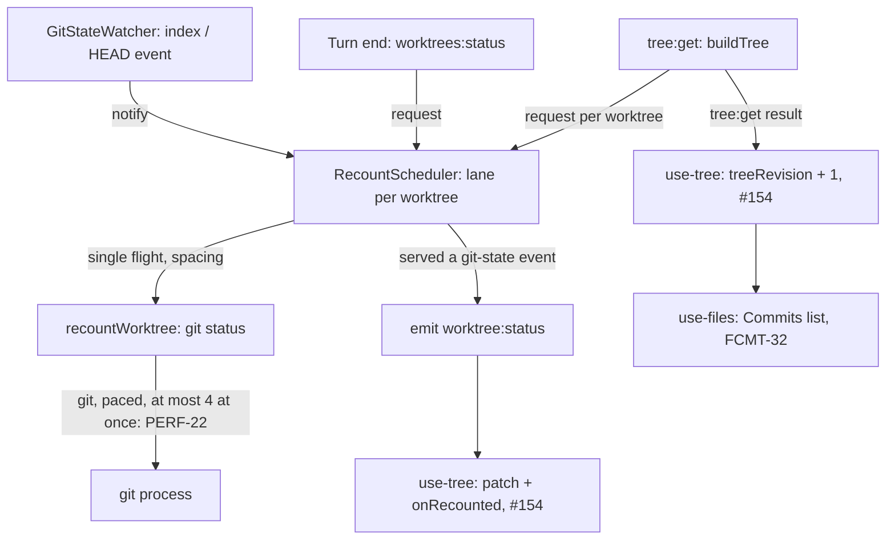

# Git Recount Coalescing Design

**Spec**: `.specs/features/git-recount-coalesce/spec.md`
**Status**: Approved (planned 2026-10-01, approved by the owner 2026-10-01). Executes only after #147 (`perf-diagnostics`): T1 reads its
baseline and can stop the feature.

> **Reconciled 2026-10-03** (spec.md `## Dependencies`, owner's answers the same day). Upstream PR #154
> already ships the renderer half: `patchWorktreeStatus` keeps the tree (PERF-11), and the status bar
> re-reads on `onRecounted` for its own worktree and on `treeRevision` (PERF-12/13, AD-052). It also
> paces every `git()` call, at most 4 at once (PERF-22). So this design drops the scheduler's pool
> (`RECOUNT_POOL_SIZE`), `exclusive` and the read lane, the renderer sections (tree patch, sync trigger,
> `refreshRevision`, `use-git-sync`), the bench's `--select` and the smoke's `counterFollow`. The
> Commits-list change stays and uses `useTree`'s existing `treeRevision`. Sections below are amended in
> place; struck items are kept for the record.

---

## Architecture Overview

One new deep module in main, `src/main/recount-scheduler.ts`, owns every `git status` main runs to
count a worktree. It keeps one **lane** per worktree path: the lane holds the pending burst, the
waiting requests, the last recount's end time and whether a recount is running. Two inputs feed it: `notify` (a
git-state event from the watcher) and `request` (a turn end or the tree build, answered with a count).
One output leaves it: `onRecounted`, called after a recount that served a git-state event, which
`index.ts` turns into `worktree:status`.

The renderer already treats `worktree:status` as the git-state signal (#154, AD-052). The one renderer
change left: the Files Commits list follows `useTree`'s `treeRevision` instead of tree identity.



### Approaches considered

All three deliver the same scope; the recommendation leads.

1. **A per-worktree lane scheduler in main (chosen).** Coalescing, single flight, the trailing run
   and the spacing sit in one class with a fake-clock test. Every path
   that counts a worktree goes through it, so the target holds whatever set the recount off. Costs a new
   module and the rewrite of the watcher's batch.
2. **Keep the watcher's batch and de-duplicate in `recountWorktree`** (share one in-flight promise per
   worktree). Small, but the rate stays at four starts a second under steady writes, a trailing change
   is answered by a stale run, and the status bar's reads still overlap the next recount. Misses both
   targets.
3. **Coalesce in the renderer** (debounce the patch and the sync re-read). Leaves main's `git status`
   rate and the focus fan-out untouched. Rejected.

---

## Code Reuse Analysis

### Existing Components to Leverage

| Component | Location | How to Use |
| --------- | -------- | ---------- |
| `Scheduler` (`after(ms, fn)` returning a cancel) | `src/main/file-watcher.ts:22-26` | The scheduler's timer seam; `timerScheduler` (`src/main/index.ts:153-158`) is the real one |
| `GitStateWatcher` | `src/main/git-state-watcher.ts:28-87` | Keeps `sync`, `closeAll`, the git-dir resolve and the `index` / `HEAD` filter; loses `startBatch` and `schedule`, gains `onEvent` and `onDropped` |
| Its fakes | `src/main/git-state-watcher.test.ts` (`harness`, `handleOf`, fake handles that `fire`) | Kept; assertions move from "settles after the flush" to "reports the event" |
| `recountWorktree` | `src/main/index.ts:164-170` | Becomes the scheduler's runner unchanged: one `worktreeStatus`, a logged `null` on failure; #147's `recountStarted` probe stays in it |
| `worktreeStatus`, `statusOf`, `STATUS_ARGS` | `src/main/worktree-manager.ts:420-443` | `worktreeStatus` stays the counter; `listWorktrees` takes the counter as a parameter defaulting to it |
| `buildTree` | `src/main/tree.ts:12-36` | Gains an optional `countChanges` passed to `listWorktrees` |
| Real-git fixtures | `src/main/tree.test.ts:14-23`, `src/main/worktree-manager.test.ts` | The injected-counter tests reuse them |
| `useTree`'s `treeRevision` | `src/renderer/src/lib/use-tree.ts` (#154, PERF-13) | Bumped per `tree:get` result; the Commits list follows it (RCNT-26) |
| The status bar smoke | `scripts/smoke-status-bar.mjs` (`counterRefresh`) | Run unchanged as the freshness guard (T10) |
| #147's bench | `scripts/bench-sessions.mjs`, `scripts/bench-summary.mjs` | Run unchanged; its targets block judges RCNT-32 |

### Integration Points

| System | Integration Method |
| ------ | ------------------ |
| The IPC contract | No change: `worktree:status` keeps `{ worktreePath, dirty, changes }`, `worktrees:status` keeps its answer; their meaning is documented in `src/shared/ipc-contract.ts` |
| #147's diagnostics | `recountStarted` stays in `recountWorktree`; `emitted('worktree:status')` moves with the emit into `onRecounted` |
| The quit path | `src/main/index.ts:391-394` (`will-quit`) gains `recounts.stop()` beside `gitStateWatcher.closeAll()` |

---

## Components

### RecountScheduler (`src/main/recount-scheduler.ts`)

- **Purpose**: decide when each worktree's `git status` runs, and run at most one per worktree at a
  time. How many git processes run across worktrees is `git()`'s pacer's business (PERF-22).
- **Location**: `src/main/recount-scheduler.ts`, tested by `src/main/recount-scheduler.test.ts`
- **Constants** (exported, each pinned by a literal assertion, L-009 / L-019; tests never override them,
  the fake clock makes them free):
  - `RECOUNT_QUIET_MS = 250`
  - `RECOUNT_MAX_WAIT_MS = 1_000`
  - `RECOUNT_MIN_INTERVAL_MS = 1_000`
  - ~~`RECOUNT_POOL_SIZE = 3`~~ (dropped 2026-10-03)
- **Interface**:

  ```typescript
  import type { Scheduler } from './file-watcher'

  export interface WorktreeCount {
    dirty: boolean
    changes: number
  }

  export interface RecountSchedulerDeps {
    /** One `git status` for the worktree; `null` when git could not answer (SCRF-06). */
    recount: (worktreePath: string) => Promise<WorktreeCount | null>
    /** A recount that served at least one git-state event returned a count (RCNT-09). */
    onRecounted: (worktreePath: string, count: WorktreeCount) => void
    /** Monotonic milliseconds; `performance.now()` in the app. */
    now: () => number
    schedule: Scheduler
  }

  export class RecountScheduler {
    constructor(deps: RecountSchedulerDeps)
    /** A git-state event for this worktree (RCNT-02..08). */
    notify(worktreePath: string): void
    /** Count this worktree now-ish; answered by the first recount that starts after the call (RCNT-13..15). */
    request(worktreePath: string): Promise<WorktreeCount | null>
    /** The watcher dropped this worktree: cancel its waiting git-state recount (RCNT-11). */
    forget(worktreePath: string): void
    /** Quit: cancel everything waiting, answer requests with null, emit nothing more (RCNT-12). */
    stop(): void
  }
  ```

- **Lane state** (one per worktree path, created on first use):

  ```typescript
  interface Lane {
    path: string
    /** A recount of this worktree is running. */
    running: boolean
    /** The pending git-state burst; both null when none. */
    firstEventAt: number | null
    lastEventAt: number | null
    /** Requests waiting for the next recount to start. */
    waiters: Array<(count: WorktreeCount | null) => void>
    /** When this worktree's last recount ended (its runner settled); null before the first. */
    lastEndAt: number | null
    /** The armed timer's cancel, if any. */
    cancelTimer: (() => void) | null
  }
  ```

- **The due time** of a lane with something pending:

  ```
  wanted = waiters.length > 0
             ? now
             : min(lastEventAt + RECOUNT_QUIET_MS, firstEventAt + RECOUNT_MAX_WAIT_MS)
  due    = max(wanted, lastEndAt + RECOUNT_MIN_INTERVAL_MS)     // lastEndAt null → wanted
  ```

- **Behaviour**:
  - `notify(path)`: ignored after `stop`. Sets `firstEventAt ??= now` and `lastEventAt = now`. If the
    lane is not running, `arm(lane)`; if it is running, nothing more: the burst waits for the end of the
    run (RCNT-06).
  - `request(path)`: after `stop`, resolves `null` at once. Otherwise pushes a waiter, then `arm(lane)`
    when the lane is not running.
  - `arm(lane)`: cancels the armed timer; computes `due`; if `due <= now` the recount starts at once;
    otherwise `schedule.after(due - now, () => arm(lane))`. Re-computing on fire, rather than trusting
    the earlier figure, lets a later event push the quiet period out (RCNT-02) without a second timer.
  - **Start** (RCNT-05, 07, 09): `running = true`; takes the burst
    (`servedEvent = firstEventAt !== null`) and the waiters, clears both; calls `recount(path)`. A
    throw counts as `null` (RCNT-10). When it settles, success, `null` or throw: `lastEndAt = now`
    (RCNT-04, amended after T11), then every taken waiter gets the count; if
    `servedEvent` and the count is not `null` and the scheduler is not stopped, `onRecounted(path,
    count)`. Then `running = false`, and the lane is re-armed if anything is pending.
  - `forget(path)`: cancels the timer and drops the burst; waiters stay and are served (RCNT-41), so a
    lane with waiters is re-armed. An idle lane with nothing pending is deleted, so the map holds only
    worktrees in use.
  - `stop()`: marks the scheduler stopped, cancels every timer, resolves every waiter with `null`. A
    recount already running finishes, but emits nothing (RCNT-12).
- **Dependencies**: `Scheduler` from `file-watcher.ts`; nothing else.
- **Reuses**: the injected-fake pattern of `GitStateWatcher` and `FileWatcher` (TESTING.md, pattern 3).

### GitStateWatcher (`src/main/git-state-watcher.ts`, modified)

- **Purpose**: unchanged in what it watches; it now reports each relevant event instead of batching.
- **Interface**:

  ```typescript
  export interface GitStateWatcherDeps {
    watch: WatchPort
    resolveGitDir: (worktreePath: string) => Promise<string>
    /** Every `index` or `HEAD` event in this worktree's git dir, as it happens (RCNT-01). */
    onEvent: (worktreePath: string) => void
    /** This worktree is no longer watched (a later `sync` dropped it), not called by `closeAll`. */
    onDropped: (worktreePath: string) => void
  }
  ```

- **Changes**: `schedule`, `onSettled`, `startBatch`, `Entry.cancelBatch` and the `BATCH_MS` import
  go. The listener calls `onEvent(path)` for `index` and `HEAD` only. `sync` calls `onDropped(path)`
  for every worktree it closes. `closeAll` closes without calling it (the quit path stops the scheduler
  itself).

### Worktree listing and the tree build (modified)

- `listWorktrees(repoPath: string, countChanges: CountChanges = worktreeStatus): Promise<WorktreeNode[]>`
  with `type CountChanges = (worktreePath: string) => Promise<{ dirty: boolean; changes: number } | null>`.
  A `null` answer reads as clean, the stance `statusOf` keeps today; `statusOf` is folded into this
  line.
- `buildTree(registry: WorkspaceRegistry, opts: { countChanges?: CountChanges } = {})` passes
  `opts.countChanges` to every `listWorktrees`.

### Main wiring (`src/main/index.ts`, modified)

| Where | Change |
| ----- | ------ |
| Before the watcher | `const recounts = new RecountScheduler({ recount: recountWorktree, onRecounted, now: () => performance.now(), schedule: timerScheduler })`; `onRecounted` emits `worktree:status` to `mainWindow` with `{ worktreePath, ...count }` and calls #147's `diagnostics().emitted('worktree:status', worktreePath)` |
| `GitStateWatcher` construction | `onEvent: (p) => recounts.notify(p)`, `onDropped: (p) => recounts.forget(p)`; `schedule` and `onSettled` removed |
| `tree:get` | `buildTree(registry, { countChanges: (p) => recounts.request(p) })` |
| `worktrees:status` | `({ worktreePath }) => recounts.request(worktreePath)` |
| `will-quit` | `recounts.stop()` beside `gitStateWatcher.closeAll()` |

`git:run`, `git:sync-state` and `git:commits` stay outside the scheduler (Out of Scope; owner 2026-10-03).

### ~~The tree patch, the sync trigger, `use-tree`, `use-git-sync`~~

Delivered by #154 (PERF-11..13, AD-052) before this feature executed; no change here.

### `App` and the Files direction (modified)

`useFiles({ treeRevision })`, with `useTree`'s `treeRevision`, instead of `tree` (RCNT-26). FCMT-32 names a status-bar
operation and a focus; both end in `refreshTree`, so both still bump the revision. The Files watcher's
`gitStateChanged` path (`use-files.ts:510-514`) keeps reloading on its own git-state signal.

### ~~Bench option and smoke section~~

Dropped 2026-10-03: the bench runs unchanged (#147's index run is the before figure), and the smoke's
`counterRefresh()` runs unchanged as the freshness guard (T10).

---

## Data Models

No new data. The IPC payloads keep their shape:

```typescript
// src/shared/ipc-contract.ts, documentation change only
/**
 * Sent after main recounted a worktree because its `index` or `HEAD` moved; the event is the
 * git-state signal (the status bar re-reads on it), the count is that recount's. A recount that only
 * answered a request (turn end, tree build) sends nothing.
 */
'worktree:status': { worktreePath: string; dirty: boolean; changes: number }
```

### Timing walk-through (default constants)

| Situation | Events | Recount starts |
| --------- | ------ | -------------- |
| One commit, worktree idle for a while | `index` at 0, 40, 90 ms | 340 ms (quiet) |
| Continuous writes every 100 ms | 0, 100, 200, ... | 1,000 ms (max wait), then at least 1,000 ms after each recount ended |
| A short recount, then a short burst | run 1 at 0 ms ends at 50; events at 60, 90 | 1,050 ms (spacing from the end), not 340 |
| A turn end right after a git-state run that started at 0 and ended at 50 | request at 200 ms | 1,050 ms; the request is answered by that run |
| A focus with 7 worktrees, all idle | 7 requests at 0 | 7 at 0; `git()` runs 4 processes at once, the rest wait in its queue (PERF-22) |

---

## Error Handling Strategy

| Error Scenario | Handling | User Impact |
| -------------- | -------- | ----------- |
| `git status` fails (vanished path, broken git dir) | `recountWorktree` logs and answers `null`; waiters get `null`; no event; the lane frees | The last count stays (SCRF-06); a tree build shows the worktree clean, as today |
| The runner throws | Treated as `null` | Same |
| An event arrives after quit | Ignored | None |
| A request arrives after quit | Answered `null` at once | None (the window is closing) |
| A worktree is dropped with a recount running | The run finishes; its event lands on a tree that no longer holds the worktree and changes nothing | None |

---

## Risks & Concerns

| Concern | Location (file:line) | Impact | Mitigation |
| ------- | -------------------- | ------ | ---------- |
| The spacing delays a recount that follows another within a second | `src/main/recount-scheduler.ts` (new) | A second commit right after a first shows up to 1,000 ms later than today | SCRF-01's 2,000 ms bound is RCNT-27, a smoke check (T10); the owner confirmed the values on 2026-10-01 and accepted that the status bar may take up to about 1 s to update |
| `tree:get` now waits for single-flight recounts | `src/main/index.ts` (`tree:get`), `src/main/tree.ts` | A worktree recounted under a second ago waits up to 1,000 ms | Bounded and measured: T11 records the startup row; the owner accepted the 1 s spacing on 2026-10-01 |
| Existing tests pin superseded behaviour | `src/main/git-state-watcher.test.ts` (the 250 ms batch, SCRF-02) | Rewriting a test is normally forbidden | The rewrites follow from the owner-confirmed revision (issue #149); T7 names the tests it rewrites and why, and the spec note lands in the same commit |
| Earlier smoke checks measure what this restructures (L-086) | `scripts/smoke-status-bar.mjs` `counterRefresh` (SCRF-01/07/09/10); `scripts/smoke-files-commits.mjs` check 20 (FCMT-32) | A broken trigger would only show there | T10 runs the full status bar smoke; T9 runs the Files Commits smoke |
| The status bar's own operations and reads run outside the lane | `src/main/index.ts` (`git:run`, `git:sync-state`, `git:commits`) | A sync-state read may run beside the next recount of the selected worktree | Owner 2026-10-03: no-overlap is a regression guard; the bench selects no worktree, so it does not see these reads |
| The diagnostics `recounts` figure changes meaning | `src/main/index.ts:164-170` (#147's probe) | Startup and focus rows read higher than #147's baseline | Steady rows hold no tree build, and the targets read the steady rows; recorded in the spec assumptions and in T11 |
| A main-process mutant is not live in `npm run dev` | dev app | A falsification could pass on old code (status-changes-refresh T9) | T10 relaunches the dev app for every main mutant and checks the mutant applied |
| The branch label after a terminal checkout stays stale until a `tree:get` | `src/renderer/src/lib/tree-status.ts` | None for this feature | Pre-existing; Out of Scope |
| The lane map | `src/main/recount-scheduler.ts` (new) | Could grow with paths seen | `forget` deletes idle lanes; every lane path is a tree worktree |
| The watcher resolves each new worktree's git dir in parallel at `sync` | `src/main/git-state-watcher.ts:41-49` | One `rev-parse --git-dir` per new worktree at once, after the first `tree:get` | Once per worktree, not per event or focus, so the per-worktree overlap guard is unaffected |

---

## Tech Decisions (only non-obvious ones)

| Decision | Choice | Rationale |
| -------- | ------ | --------- |
| Who coalesces | The scheduler alone; the watcher's batch goes | Two coalescers add their delays (250 + 250 ms before any run) |
| Re-arm on fire | The timer re-computes the due time when it fires | One timer per lane, and a later event moves the quiet period without bookkeeping |
| The spacing | A third constant, 1,000 ms from a recount's end to the next start of that worktree (amended 2026-10-03, owner, after T11; was between starts) | Makes "at most one per second" true by construction, whatever the event pattern; counted from the end, it holds for git process starts too, even when a recount waits in `git()`'s queue (PERF-22) |
| No pool of its own | `git()`'s pacer (PERF-22) is the only concurrency bound | A second cap of 3 above a global cap of 4 adds a queue and no protection |
| Event shape | Unchanged; the event is the git-state signal | Today only the watcher emits; no contract churn |
| Tree identity for the Files list | `treeRevision` (#154's), not `tree` | FCMT-32's triggers are all `tree:get` results |
| Clock | `performance.now()` | A wall clock can jump |

> **AD-058 (chosen at T7, the next free one after every AD on `origin/main`, on open upstream
> PRs and on sibling worktrees; #147 holds AD-057): main coalesces every worktree recount in one
> scheduler.** `src/main/recount-scheduler.ts` owns every `git status` main runs to count a worktree:
> git-state events wait for a 250 ms quiet period or 1,000 ms at most; turn-end and tree-build requests
> skip the quiet period; a worktree runs one recount at a time, one trailing recount serves what
> arrived during it, and a recount starts at least 1,000 ms after the previous one of that worktree
> ended (amended 2026-10-03 after T11, was "starts are at least 1,000 ms apart"). How many run across worktrees
> is left to `git()`'s pacer (PERF-22). `worktree:status` is sent only after a recount that served a
> git-state event. The Files Commits list follows `tree:get` results (`treeRevision`), not tree
> identity. **Revises** SCRF-02 (the watcher's 250 ms batch moves into the scheduler; the criterion
> still holds) and FCMT-32's trigger. Spec / design / tasks:
> `.specs/features/git-recount-coalesce/` (RCNT-01..41).
