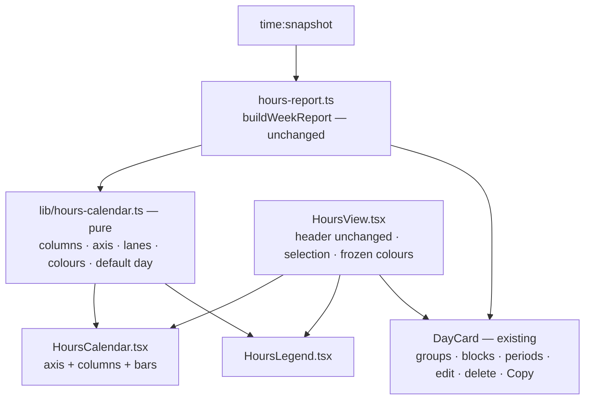

# Hours Calendar Design

**Spec**: `.specs/features/hours-calendar/spec.md`
**Status**: Draft
**Stacked on**: `feature/time-tracking` (PR #93) — the Hours view, `buildWeekReport`, `formatDayCopy` and the period edit/delete flow live there

**Method**: the `dataviz` skill's procedure — form first, colour by job, **validator run** against the app's real surfaces, mark specs, hover layer, accessibility pass.

---

## Architecture Overview

Renderer-only. `buildWeekReport` (TIME-32..38, 40) already produces the week as days → groups →
merged blocks → raw periods, and stays **untouched**. A new pure module turns that report into
calendar geometry; the view renders it and hands the selected day to the existing day component.



**No new IPC, no main-process change, no change to the time log, the report, the merge rule or the Copy format.**

---

## Form (dataviz step 1)

The job is **when, and on what** — time positioned on a clock, per day, with identity by task. That is a
calendar's week view (a vertical timeline per day), not a bar chart of totals: totals stay as numbers
in the column headers and the legend.

## Colour (steps 2–3) — computed, not chosen

Colour does one job here: **categorical identity** (which task). In a calendar any bar can sit beside
any other — side by side in lanes, or consecutively in a column — so the validator was run with
**`--pairs all`**, against the surface the grid renders on: the view's `--panel` (`#ffffff` light,
`#221f1b` dark, from `tokens.css`).

| Candidate set (all pairs) | Light `#ffffff` | Dark `#221f1b` |
| ------------------------- | --------------- | -------------- |
| The reference 8 slots | FAIL — red ↔ orange normal-vision ΔE 7.1; CVD 3.2 | FAIL — magenta ↔ aqua CVD 1.6 |
| **Slots 1–3: blue, orange, aqua** | **PASS** — worst CVD 9.2, normal-vision 24.0 | **PASS** — worst CVD 9.4, normal-vision 20.9 |
| + violet (4) | pass | FAIL — violet ↔ blue normal-vision 9.8 |
| + violet, magenta (5) | FAIL | FAIL |

Hence the owner's Q9 rule: **three colours** for the three tasks with the most time; everything else
folds.

| Role | Light | Dark | Treatment |
| ---- | ----- | ---- | --------- |
| Task slot 1 (most time) | `#2a78d6` | `#3987e5` | Filled |
| Task slot 2 | `#eb6834` | `#d95926` | Filled |
| Task slot 3 | `#1baf7a` | `#199e70` | Filled |
| Other tasks | `--text-faint` | `--text-faint` | Filled, neutral |
| No task (any folder) | transparent | transparent | **Outlined** 1.5 px in `--text-muted`, so it never reads as Other |

- **Contrast relief (validator WARN):** aqua is 2.82:1 on the light panel. The relief rule is met twice
  over: the day detail panel *is* the table view, and bars wide enough carry a direct label.
- **Status colours stay reserved:** the app's `--green / --amber / --red / --blue / --pink` mean session
  states elsewhere. The three task colours are the dataviz palette's own steps, and the Hours view shows
  no session-state cue beside them.
- **Text never wears a series colour:** labels, totals and legend text use `--text` / `--text-muted`; a
  swatch beside them carries the identity.

## Marks (step 4)

- A bar is a rounded rectangle (4 px radius) from its block's start to its end; **minimum height 6 px**
  (HCAL-12), so a 2-minute block stays visible and clickable — the tooltip and detail give its real length
- **2 px surface gap** between side-by-side lanes and between consecutive bars in a lane
- Recessive chrome: hour gridlines as hairlines (`--border`), hour labels in `--text-faint`, tabular figures
- **Ongoing block** (HCAL-23): ends at "now" with a dashed leading edge; a gentle pulse only when
  `prefers-reduced-motion` is not set
- **Direct labels** only where they fit: the group label inside a bar at least 36 px tall and 64 px wide;
  never a number on every bar

## Hover and focus (step 5)

- Per-bar tooltip on hover **and** keyboard focus: group label, `HH:MM–HH:MM`, duration (HCAL-22)
- Hit target: the bar plus a 4 px halo, so a 6 px bar is still easy to hit

## Accessibility (step 6)

- Legend always present (≥ 2 series), listing every task including those folded into Other, with totals (HCAL-21)
- Bars and column headers are `<button>`s with accessible names (HCAL-20); identity is never colour-alone — the name carries the label
- Both themes are **selected**, each validated against its own surface (above)

---

## Code Reuse Analysis

| Component | Location | How to use |
| --------- | -------- | ---------- |
| `buildWeekReport`, `weekRange`, `DayReport`, `GroupReport`, `Block` | `hours-report.ts` | The calendar's only data source, unchanged |
| `DayCard` (and `GroupSection`, `BlockLine`) | `HoursView.tsx:137` | The detail panel — the selected day's full list view, edit, delete and Copy, unchanged but for one optional prop |
| Header (range, total, ◀ ▶ This week) | `HoursView.tsx:75-117` | Unchanged (HCAL-06) |
| `formatHmCompact`, `formatDayHeader`, `formatHm` | `time-format.ts` | Header and tooltip text |
| `useNow` | `use-time.ts` | Live growth at TIME-42's cadence (HCAL-23) |
| Theme scoping | `tokens.css:9,28` | The three task colours declared per theme beside the existing tokens |

---

## Components

### `src/renderer/src/lib/hours-calendar.ts` (new — pure, unit-tested)

| Function | Returns | ACs |
| -------- | ------- | --- |
| `weekColumns(report, weekStart, now)` | Mon–Fri always, plus Saturday / Sunday only when that day has time; each `{ date, totalMs, isToday, isFuture, day: DayReport \| null }` | 01, 02, 03, 04, 05, 07 |
| `timeAxis(report)` | `{ startHour, endHour }`: earliest block start floored, latest end ceiled, widened symmetrically to **≥ 8 h** and clamped to 0–24; an empty week → 09–17 | 09 |
| `layoutLanes(blocks)` | Each block with `lane` and `lanes`: blocks are clustered where they overlap in time; inside a cluster each takes the first free lane; every block of a cluster shares the cluster's lane count | 10 |
| `assignColours(report)` | `Map<groupKey, 'slot1' \| 'slot2' \| 'slot3' \| 'other' \| 'no-task'>`: task groups ranked by week total (ties by first start), top three to slots 1–3, the rest `other`; `cwd:` groups `no-task` | 11 |
| `defaultDay(columns, now)` | Today if in the week, else the latest day with time, else null | 16, 17 |
| `barBox(block, axis, now)` | `{ topPct, heightPct, ongoing }`; an open block ends at `now` | 08, 13, 23 |
| `legendEntries(report, colours)` | Every task and folder with its colour role and week total, slots first | 21 |

Midnight splitting (HCAL-13) needs nothing new: `buildWeekReport` already splits pieces at local midnight (TIME-37).

### `src/renderer/src/components/HoursCalendar.tsx` + `.css` (new)

- The hour axis on the left, one column per `weekColumns` entry, bars positioned by `barBox` inside lanes from `layoutLanes`
- Column header button: weekday, date, total; today highlighted; future dimmed (HCAL-03..05, 18)
- Bar button: colour role class, direct label when it fits, tooltip on hover and focus, `aria-label` (HCAL-19, 20, 22)
- Declares `--hcal-slot1..3` for both themes under the same selectors `tokens.css` uses

### `src/renderer/src/components/HoursLegend.tsx` (new)

- Swatch + label + week total per entry; Other tasks' members listed under it (HCAL-21)

### `src/renderer/src/components/HoursView.tsx` (modified)

- Replaces the day list with `HoursCalendar`, `HoursLegend` and **one** `DayCard` for the selected day (HCAL-14, 15)
- Selection state: `defaultDay` when the week changes, a header or bar click otherwise (HCAL-16..19); falls back when the selected day empties (edge case)
- **Colour freeze** (HCAL-24): `assignColours` runs when `weekStart` changes and is kept in a ref while the week is shown; a task that first appears mid-view is `other` until the week is reopened
- `DayCard` gains an optional focus prop: that block is expanded and scrolled into view (HCAL-19)
- **[2026-09-19, AD-031]** `DayCard` is the drawer's whole surface: its head carries the day and the close
  button, a summary line carries the total, the task and block counts and Copy, and each group wears its
  calendar swatch (HCAL-15). It takes the frozen colour map and an `onClose` for that

---

## Data Models

```typescript
// src/renderer/src/lib/hours-calendar.ts
export type ColourRole = 'slot1' | 'slot2' | 'slot3' | 'other' | 'no-task'

export interface CalendarColumn {
  date: Date
  totalMs: number
  isToday: boolean
  isFuture: boolean
  day: DayReport | null
}

export interface TimeAxis { startHour: number; endHour: number }

export interface LaidOutBlock {
  block: Block
  groupKey: string
  lane: number
  lanes: number
}

export interface LegendEntry { groupKey: string; label: string; role: ColourRole; totalMs: number }
```

---

## Error Handling Strategy

Renderer-only; the errors are data shapes, not failures.

| Scenario | Handling | User sees |
| -------- | -------- | --------- |
| Empty week | `timeAxis` → 09–17; `defaultDay` → null | Empty columns, `No time recorded this week.`, detail says no day to show (HCAL-07, 17) |
| One block under a minute | Axis widened to 8 h; bar at minimum height | Visible, clickable bar (edge case) |
| Four or more parallel blocks | Lanes narrow evenly; labels drop below the width threshold | Tooltip still names each (edge case) |
| Selected day emptied by a delete | Selection recomputed by `defaultDay` | Detail moves to the fallback day (edge case) |
| A task first appearing mid-view | Frozen map has no entry → `other` | Neutral bar until the week reloads (HCAL-24) |

---

## Risks & Concerns

| Concern | Location | Impact | Mitigation |
| ------- | -------- | ------ | ---------- |
| **Only three colours are safe** | dataviz validator, above | A fourth task could never have its own colour | Owner decision Q9 (top three + Other); recorded as a project-level rule (AD-030) so later charts do not relearn it |
| Frozen colours vs live data | `HoursView` | A new task during the day shows as Other until reopen | Stated in the spec's edge cases; the tooltip and legend still name it |
| `DayCard` grows a prop | `HoursView.tsx:137` | The shipped list-view component changes shape | One optional prop; absent = today's behaviour; TIME smoke (`smoke-time.mjs`) re-run |
| TIME-34 superseded | time-tracking spec | A merged spec would still describe the list | AD-029, and T-last annotates TIME-34 in `time-tracking/spec.md` |
| Stacked on an open PR | `feature/time-tracking` | #93 changing under review forces a rebase | `git rebase --onto origin/main feature/time-tracking feature/hours-calendar` once #93 merges |
| Lane layout is the one real algorithm | `layoutLanes` | Overlapping bars drawn over each other | Pure, unit-tested with nested, chained and disjoint overlaps |

---

## Tech Decisions

| Decision | Choice | Rationale |
| -------- | ------ | --------- |
| Rendering | HTML + CSS absolute positioning (percentages of the axis), not canvas or SVG | Bars are buttons with focus, tooltips and labels; the DOM gives that for free, and a week holds tens of bars, not thousands |
| Ranking for colours | Week total, ties by first start | The tasks that matter most get the colours; ties need a stable order |
| Minimum bar height | 6 px | Visible at every axis span, with a 4 px hit halo |
| Label threshold | 36 × 64 px | Room for one line of the group label |

> **Project-level decisions, recorded in `.specs/STATE.md` on this branch:**
> - **AD-029** — effective when this ships, the Hours view is a week calendar; TIME-34 is superseded.
> - **AD-030** — the app's categorical chart colours are validated against its own panel surfaces; where any mark can touch any other, at most three colours (blue, orange, aqua) are used and the rest fold into a neutral Other.

---

## Test Strategy

| Layer | Test type | What it proves |
| ----- | --------- | -------------- |
| `hours-calendar.ts` | unit (pure) | Weekend columns only with time; axis rounding and 8 h minimum incl. empty and sub-minute weeks; lanes for disjoint, nested, chained and 4-way overlaps; colour ranking, ties, folding and no-task; default day in and out of the current week; open-block geometry; legend order |
| `HoursCalendar`, `HoursLegend`, `HoursView`, `DayCard` prop | none — hand-verified + CDP smoke | Per `TESTING.md` |
| Existing time-tracking suite | unit, unchanged | `buildWeekReport`, Copy format and edit / delete keep passing untouched |
| `smoke-time.mjs` | manual, re-run | The shipped Hours flows still pass through the detail panel |

---

## Requirement Coverage

| Component | ACs |
| --------- | --- |
| `hours-calendar.ts` | 01, 02, 03, 04, 05, 07, 08, 09, 10, 11, 13, 16, 17, 21, 23, 24 |
| `HoursCalendar.tsx` | 01–05, 08, 10, 12, 18, 19, 20, 22, 23 |
| `HoursLegend.tsx` | 21 |
| `HoursView.tsx` | 06, 07, 14, 15, 16, 17, 18, 19, 24 |
| `DayCard` prop | 15, 19 |

Every one of HCAL-01..24 appears at least once.
