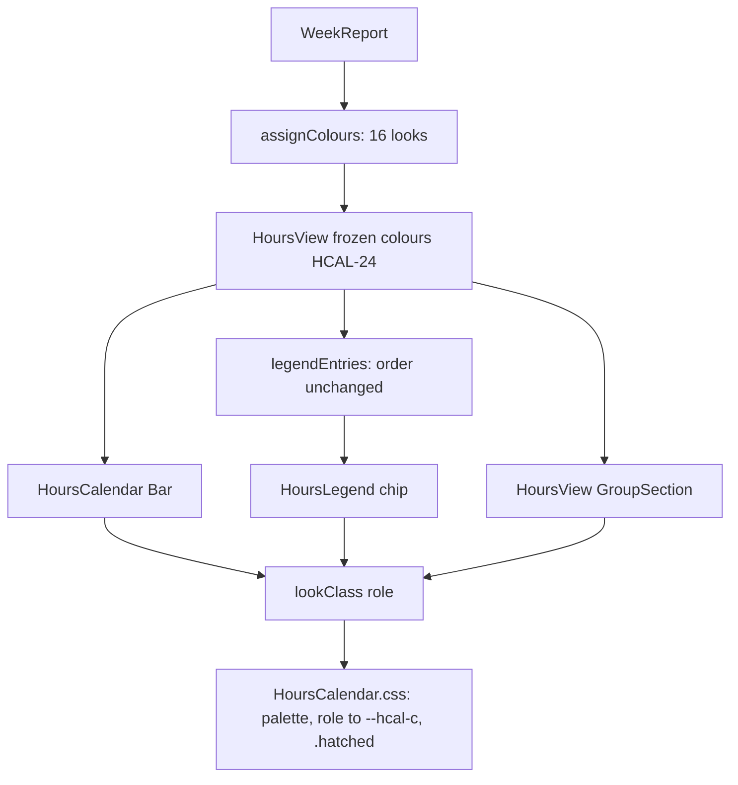

# Hours Hatching Design

**Spec**: `.specs/features/hours-hatching/spec.md`
**Status**: Approved (owner, 2026-10-01)

Line numbers below were read on `feature/hours-hatching` at `60ff148` (= `origin/main`).

---

## Architecture Overview

The colour role stays a string, and the week's roles stay one `Map<string, ColourRole>` computed once
per shown week by a pure function (`assignColours`, `hours-calendar.ts:202-218`) and frozen by
`HoursView` (`HoursView.tsx:125-136`, HCAL-24). Three things change:

1. **The role grows.** `ColourRole` gains `slot1-hatched` .. `slot8-hatched`. Every consumer that
   only passes the role around (`roleOf`, `legendEntries`, `dimmedGroups`, the freeze) compiles and
   behaves unchanged.
2. **The assignment spreads looks across the week.** `assignColours` keeps its walk over
   `weekGroups` (week total, then first start) and picks each task's look by one sort key.
3. **One look, three surfaces, one stylesheet.** A pure `lookClass(role)` turns a role into its
   class names (`role-slot3 hatched`). The slot-to-colour rules move out of the three stylesheets
   into one shared block in `HoursCalendar.css`, beside the palette, and one `.hatched` rule draws
   the stripes for bars, legend swatches and drawer swatches alike.



### Approaches considered

| Approach | Shape | Verdict |
| -------- | ----- | ------- |
| **A. String roles, one class helper, shared rules** | `ColourRole` gains `slotN-hatched`; `lookClass` emits `role-slotN` plus `hatched`; the eight `role-slotN` rules and one `.hatched` rule are shared by the three surfaces | **Chosen.** Smallest change to types and tests (roles stay strings, `Map` and `toBe('slot1')` assertions keep working); the stripes are defined once, so the three surfaces cannot drift |
| B. Structured role `{ slot, hatched }` | Roles become objects or a tagged union; components read two fields and render `data-slot` / `data-fill` | Every comparison, test and the smoke's `role-*` probes change for no behavioural gain |
| C. Sixteen role classes per surface | `role-slot3-hatched` styled separately in each of the three stylesheets | 48 colour rules where 24 already drift-prone ones exist; the stripe would be written three times |

---

## Code Reuse Analysis

### Existing Components to Leverage

| Component | Location | How to Use |
| --------- | -------- | ---------- |
| `weekGroups` | `src/renderer/src/lib/hours-calendar.ts:176-195` | Unchanged walk order: week total desc, then first start (HHAT-02) |
| `assignColours` same-day scan | `hours-calendar.ts:204-214` | The `dayKeys` scan that finds same-day roles stays; only the pick changes |
| `legendEntries` | `hours-calendar.ts:230-246` | Unchanged. Coloured chips keep colouring order, so "the previous chip" is the task assigned just before (HHAT-08) |
| `roleOf`, `visibleColumns`, `dimmedGroups` | `hours-calendar.ts:221-223, 252-284` | Unchanged; they pass roles through or ignore them |
| The freeze | `src/renderer/src/components/HoursView.tsx:125-136` | Unchanged (HHAT-23) |
| Palette block | `src/renderer/src/components/HoursCalendar.css:8-29` | New hex values; stays the one place the hues live |
| Bar role rules | `HoursCalendar.css:158-188` | Become the shared `role-slotN` block for all three surfaces |
| `--hcal-c` on the bar | `HoursCalendar.css:141`, tooltip key `:322-329` | The hatch reads the same variable; the tooltip key keeps it solid (spec, Tooltip key) |
| `.hcal-bar.dimmed` | `HoursCalendar.css:147-149` | Opacity dims stripes and fill alike; nothing to add (HHAT-24) |
| Swatch rules | `HoursLegend.css:81-128`, `HoursView.css:251-300` | Size to 14 px; the per-slot rules are deleted in favour of the shared block |
| `crowdedDay` / `work` test helpers | `src/renderer/src/lib/hours-calendar.test.ts:269-282` | Fixtures for the rewritten and new assignment tests |
| Section 11's probes and `PALETTE` | `scripts/smoke-hours-calendar.mjs:810-867` | Rewritten to sixteen looks and the new hex values |
| Section 12's `bars()` and `sameColours` | `smoke-hours-calendar.mjs:883-885, 906-908, 1052-1058` | The colour signature gains `backgroundImage` |
| The seed | `smoke-hours-calendar.mjs:238-345, 363-371` | Gains the spread week, five weeks back |

### Integration Points

| System | Integration Method |
| ------ | ------------------ |
| `HoursCalendar.tsx` `Bar` | `className` uses `lookClass(role)` instead of `` `role-${role}` `` (`HoursCalendar.tsx:190-197`) |
| `HoursLegend.tsx` chip | Swatch `className` uses `lookClass(e.role)` (`HoursLegend.tsx:52`) |
| `HoursView.tsx` `GroupSection` | Swatch `className` uses `lookClass(role)` (`HoursView.tsx:485`) |
| `.specs/STATE.md` | New AD row superseding AD-045; AD-045 marked |
| `.specs/features/hours-task-focus/spec.md` | Supersession notes on the Out of Scope row, HTF-01, HTF-02, HTF-04, HTF-16 |

---

## Components

### `hours-calendar.ts` (modified, pure)

- **Purpose**: Assign each task of a week one of sixteen looks, and name a look's classes.
- **Location**: `src/renderer/src/lib/hours-calendar.ts`
- **Interfaces**:
  - `type Slot = 'slot1' | … | 'slot8'`
  - `type ColourRole = Slot | `${Slot}-hatched` | 'other' | 'no-task'`
  - `assignColours(report: WeekReport): Map<string, ColourRole>`: same signature, new rule
  - `lookClass(role: ColourRole): string`: `'slot3'` → `'role-slot3'`, `'slot3-hatched'` →
    `'role-slot3 hatched'`, `'other'` → `'role-other'`, `'no-task'` → `'role-no-task'`
- **Dependencies**: `WeekReport` (`hours-report.ts`)
- **Reuses**: `weekGroups`, `isFolder`, the same-day scan

### `HoursCalendar.css` (modified)

- **Purpose**: Hold the palette, the slot-to-colour rules for every surface, and the hatch.
- **Location**: `src/renderer/src/components/HoursCalendar.css`
- **Interfaces**: `--hcal-slot1..8` (new values, both themes); `:is(.hcal-bar, .hleg-swatch,
  .hours-group-swatch).role-slotN { --hcal-c: var(--hcal-slotN) }`; `:is(…).hatched` (below)
- **Reuses**: the current palette block and bar rules; the header comment points at the new AD

### `HoursLegend.css`, `HoursView.css` (modified)

- **Purpose**: Swatches 14 × 14 px that paint `var(--hcal-c)`; Other and No task rules unchanged.
- **Interfaces**: `.hleg-swatch` and `.hours-group-swatch` gain `background: var(--hcal-c)` and
  `width / height: 14px`; their eight `role-slotN` rules are deleted.

### `HoursCalendar.tsx`, `HoursLegend.tsx`, `HoursView.tsx` (modified)

- **Purpose**: Render a role through `lookClass`. No prop, state or handler changes.

### `scripts/smoke-hours-calendar.mjs` (modified)

- **Purpose**: Seed a spread week; check sixteen looks, the new palette, adjacency, the hatch and
  focus on a hatched task.
- **Interfaces**: `--seed` writes ten more periods (ids `hours-smoke-spread-01..10`, tasks
  #9301..#9310, fictitious titles) on Monday to Friday five weeks back, two tasks a day, task *k* on
  weekday `(k - 1) mod 5`, lasting `(11 - k) × 10` minutes; the seeded-data guard requires them.
  Section 11 is rewritten, section 12's colour signature extended, and a new section 16 (`looks`)
  added. `SMOKE_ONLY=looks` runs section 16 alone, from a fresh seed and launch, for iterating; the
  full drive still runs once before the Verifier and the PR.

---

## Data Models

```typescript
const SLOTS: Slot[] = ['slot1', 'slot2', 'slot3', 'slot4', 'slot5', 'slot6', 'slot7', 'slot8']
/** Palette order, solid first: the last tie-break (HHAT-07). */
const LOOKS: ColourRole[] = [...SLOTS, ...SLOTS.map((s) => `${s}-hatched` as const)]
```

The assignment, in pseudo-code:

```text
assignColours(report):
  colours = new Map
  uses    = { look: 0 for look in LOOKS }
  prev    = null                       # look of the last task given one of the sixteen
  for group in weekGroups(report):     # week total desc, then first start (HHAT-02)
    if folder(group): colours[group] = 'no-task'; continue
    sameDay    = looks already given to groups sharing a day with group (Other excluded)
    sameHues   = { hue(l) for l in sameDay }
    allowed    = [l in LOOKS if l not in sameDay and l != prev]          # HHAT-03, 11
    if allowed is empty: colours[group] = 'other'; continue              # HHAT-12, 13
    pick = min(allowed, by key:
             uses[l],                                                    # HHAT-04
             hatched(l) ? 1 : 0,                                         # HHAT-05
             (hue(l) in sameHues or hue(l) == hue(prev)) ? 1 : 0,        # HHAT-06
             index of l in LOOKS)                                        # HHAT-07
    colours[group] = pick; uses[pick] += 1; prev = pick
  return colours
```

`hue('slot3-hatched')` is `slot3`. Checked on a prototype before planning: 20 000 random weeks of 1
to 24 tasks on 1 to 3 days each gave no neighbour repeat, no same-day share, every task its own
solid up to eight tasks and its own look up to sixteen. The seeded Sunday gives slots 1 to 8 solid
then hatched 1 to 6; the spread week gives slots 1 to 8 solid then hatched 1 and 2; seventeen tasks on
one day make the seventeenth Other.

---

## Palette

The validator outputs are in the spec. The values were found by a search that keeps each slot's hue
family (OKLCH hue within 10° of today's, lightness within 0.08, chroma at least 80% of today's) and
minimises the total move, under the validator's own functions; the passes were then re-run through
`<dataviz-skill-dir>/scripts/validate_palette.js` itself.

| Slot | Light today → proposed (ΔE moved) | Dark today → proposed (ΔE moved) |
| ---- | --------------------------------- | -------------------------------- |
| 1 blue | `#2a78d6` → `#2f76e8` (2.9) | `#3987e5` → `#2790da` (3.3) |
| 2 orange | `#eb6834` → `#eb6623` (1.1) | `#d95926` → `#b64906` (8.1) |
| 3 aqua | `#1baf7a` → `#28ae76` (0.6) | `#199e70` → `#14a889` (3.9) |
| 4 yellow | `#eda100` → `#dbab37` (3.4) | `#c98500` → `#bc8b03` (2.6) |
| 5 magenta | `#e87ba4` → `#e984b7` (2.9) | `#d55181` → `#c90982` (9.5) |
| 6 green | `#008300` → `#0f6f19` (6.5) | `#008300` → `#117a2c` (4.2) |
| 7 violet | `#4a3aa7` → `#4e3ca6` (0.9) | `#9085e9` → `#8c63f5` (8.5) |
| 8 red | `#e34948` → `#d10b47` (8.5) | `#e66767` → `#f45468` (4.0) |

At Execute, T3 re-runs the validator on these exact values in both themes before writing them; a
non-zero exit is the spec's stop rule.

---

## The Hatch

```css
/* A hatched look: stripes of the hue, half the pattern, over a light tint of it (AD-055). */
:is(.hcal-bar, .hleg-swatch, .hours-group-swatch).hatched {
  background-color: color-mix(in oklab, var(--hcal-c) 5%, #fff);
  background-image: repeating-linear-gradient(45deg, var(--hcal-c) 0 3px, transparent 3px 6px);
}
```

Owner decision 2026-10-03, after validation: the first recipe, 2 px of hue in every 6 px over a 20%
tint, read as mostly white, so the stripes widened to half the pattern and the ground fell to 5% to
keep the twin rule (H2) passing. The tables below are for this recipe.

- The ground is `background-color` and the stripes are `background-image`, so a computed style tells
  a hatched look from its solid twin by either property, and a missing rule shows in both.
- `:is(…).hatched` has specificity (0,2,0) and beats the bar's and swatches' `background` shorthand
  (0,1,0). `.role-other` and `.role-no-task` never carry `hatched` (`lookClass` cannot emit it).
- Dimming is `opacity` (`HoursCalendar.css:147-149`) and applies to fill and stripes alike. The
  ongoing bar's dashed bottom and pulse are unaffected.
- `#fff` is a literal on purpose: the ground is a white tint in both themes (spec, Hatch ground).

### Hatch legibility

A hatched look must read as its hue and stay apart from its solid twin. With `dE` the dataviz
validator's OKLab ΔE ×100 (`deltaE`, unsimulated):

- `ground = mix_oklab(hue, #ffffff, 0.05)`, CSS `color-mix(in oklab, …)`, rounded to 8-bit hex as
  painted
- `mean = linear-RGB blend of hue and ground, stripe share 1/2`, what the eye averages on a small mark
- **H1 stripes visible**: `dE(hue, ground) >= 15`, the normal-vision floor between stripe and ground
- **H2 twin apart**: `dE(mean, hue) >= 15`, so a hatched look and its solid twin differ even where a
  6 px bar blurs the stripes
- **H3 ground is the hue**: the ground's OKLCH hue is within 12° of the stripe's, and nearer its own
  slot's hue than any other slot's

How the design checks it:

1. **At Execute (T9)**: the same computation is re-run on the final hex values in both themes and its
   table recorded in the new AD and in `validation.md`. Every slot must pass H1 to H3; a failure stops
   the palette task like a validator failure. The procedure is the formulas above over the
   validator's own `deltaE`, `lin` and OKLab functions; no script enters the repository.
2. **In the smoke (T14)**: the running app must apply exactly that recipe. A hatched bar, its legend
   swatch and its drawer swatch must have `background-image` `repeating-linear-gradient(45deg, <hue>
   0px, <hue> 3px, transparent 3px, transparent 6px)` and a `background-color` equal to a probe
   element's computed `color-mix(in oklab, <hue> 5%, #fff)`; their solid twin must have
   `background-image: none`.
3. **By hand**: the header's verify-by-hand list gains "the stripes at 14 px and on a 6 px bar, in
   both themes".

Measured 2026-10-03 on the final hex values, ground 5%, stripe share 1/2, all pass:

| Slot | Light: ground, mean, H1, H2, H3 | Dark: ground, mean, H1, H2, H3 |
| ---- | ------------------------------- | ------------------------------ |
| blue | `#f4f8ff` `#b6c5f4` 43.1 27.2 2.1° | `#f5fafe` `#b6ceed` 37.7 23.3 3.4° |
| orange | `#fff8f5` `#f5c1b6` 36.1 22.3 1.7° | `#fcf6f3` `#ddbbb3` 45.8 29.9 4.7° |
| aqua | `#f6fbf8` `#b7d9c5` 34.3 21.0 0.1° | `#f5fbf9` `#b5d7cb` 34.9 21.4 1.5° |
| yellow | `#fdfbf6` `#edd8b8` 25.9 15.5 3.5° | `#fcf9f4` `#dfccb3` 34.2 21.2 2.6° |
| magenta | `#fff9fb` `#f4cadc` 28.2 16.6 5.4° | `#fef5f8` `#e6b4c9` 47.7 31.4 3.9° |
| green | `#f3f8f3` `#b3c3b3` 52.0 34.8 1.7° | `#f4f8f4` `#b4c6b5` 48.8 32.2 1.1° |
| violet | `#f5f5fb` `#bbb8d6` 55.5 37.6 1.0° | `#f9f8ff` `#ccc1fa` 41.7 25.8 0.7° |
| red | `#fff5f5` `#e9b4b9` 47.5 31.0 2.4° | `#fff7f7` `#fabdc1` 36.6 22.5 0.3° |

Every ground's nearest slot hue is its own. The worst slots are light yellow (H1 25.9, H2 15.5) and
light magenta (H3 5.4°). The first recipe, ground 20% and stripe share 1/3, also passed every slot
(worst H2 16.0, light yellow) but read as mostly white.

Rejected at planning: a ground mixed toward the dark panel (`#221f1b`) fails H2 in every dark slot
(9.1 to 15.3); a 30% white ground or a stripe share of 0.4 or more over a 20% ground fails H2 on light
yellow and magenta. Rejected on 2026-10-03: the full inversion, stripes 4 px in every 6 px, fails H2
whatever the ground (8 of 16 slots over a 20% ground, light yellow 9.2; light yellow 11.9 over pure
white); stripes 3 px in every 6 px over a 20% ground fail H2 on light yellow (12.8) and light magenta
(13.7); the same stripes over pure white pass H2 (light yellow 16.4) but the ground stops being a
tint of the hue (H3).

---

## Error Handling Strategy

| Error Scenario | Handling | User Impact |
| -------------- | -------- | ----------- |
| A day holds all sixteen looks | The task is Other (HHAT-12) | A neutral bar, named by its label, tooltip and chip |
| Only the previous chip's look is free | The task is Other (HHAT-13, owner confirmed 2026-10-01) | As above; needs more than sixteen tasks |
| A task appears while the week is shown | `roleOf` returns Other (unchanged, HCAL-24) | Neutral until the week is reopened |
| `color-mix` unsupported | Not handled: Electron's Chromium supports it and the app already uses it (`HoursLegend.css:31`) | None |

---

## Risks & Concerns

| Concern | Location (file:line) | Impact | Mitigation |
| ------- | -------------------- | ------ | ---------- |
| The swatch colour checks compare `backgroundColor` only | `scripts/smoke-hours-calendar.mjs:817-819, 833-837` | A hatched swatch that lost its stripes would still match its bar | T12 compares a look signature, `backgroundColor` plus `backgroundImage` |
| Section 12's "no bar changes colour" reads `backgroundColor` only | `smoke-hours-calendar.mjs:883-885, 906-908, 1052-1058` | A hover that strips the hatch would pass | T13 adds `backgroundImage` to the signature, seen failing on a mutant first |
| Section 11 pins "six Other bars" | `smoke-hours-calendar.mjs:820-832` | Fails by design once nine or more same-day tasks get hatched looks | T12 rewrites it to fourteen looks and no Other; the rewrite is named in the commit body |
| Legend and drawer swatches lose their own slot rules | `HoursLegend.css:89-119`, `HoursView.css:259-289` | They then depend on `HoursCalendar.css` | They already depend on it for `--hcal-slotN`; the shared block's comment names all three surfaces |
| A 14 px swatch could grow the chip | `HoursLegend.css:13-22, 35-46` | The legend row grows and HCAL-26's no-scroll fit breaks | 14 px sits inside the 12 px font's line box; section 7's no-scroll checks at 1100 × 640 run in the full drive |
| Hard gradient stops alias at 45° | `HoursCalendar.css` (new rule) | Jagged stripes on a low-DPI screen | Hand-verify item in the smoke header, both themes |
| The tooltip key stays solid | `HoursCalendar.css:322-329` | A hatched task's tooltip key matches its solid twin's | The tooltip names the task; owner confirmed 2026-10-01 |
| Dark CVD worst pair in the WARN band | spec, validator output | Red and yellow close for deutan readers | The relief AD-045 requires stays: labels, tooltips, legend, hover and filter |
| `hours-calendar/spec.md` HCAL-11 still says three colours | `.specs/features/hours-calendar/spec.md:76` | A merged spec describes a superseded rule | Pre-existing since AD-045; not this feature's change. Reported to the owner, not edited |
| The unit tests pin the old rule in three places | `hours-calendar.test.ts:300-305, 345-349, 367-392` | They fail by design | T2 rewrites them to the new rule, each named in the commit body (the spec supersedes them) |

---

## Tech Decisions (only non-obvious ones)

| Decision | Choice | Rationale |
| -------- | ------ | --------- |
| Rule order | One sort key: uses, fill, hue preference, palette order | The only reading that keeps the issue's guarantees (spec, Reading of the rule order) |
| Texture use vs the dataviz texture rule | Hatching is on by default and carries identity | dataviz reserves its texture for accessibility and print; here it is composite encoding (hue × fill), which dataviz allows for a ninth series and beyond. Owner decision, issue #152 |
| Ground colour | White-based tint in both themes | Passes H1 to H3 in both themes; a panel-based wash fails H2 in dark |
| Stripes as `background-image`, ground as `background-color` | Two longhands, not one shorthand gradient | The smoke tells hatched from solid by either property |
| Swatch rules shared | One `role-slotN` block for three surfaces | The stripe is defined once and cannot drift between bars and swatches |

### AD-055 (planned as AD-TBD when main held up to AD-051; numbered at Execute)

**The Hours calendar gives tasks sixteen looks, the eight hues solid and hatched, spread across the
week, superseding AD-045's palette and assignment.** Light `#2f76e8 #eb6623 #28ae76 #dbab37 #e984b7
#0f6f19 #4e3ca6 #d10b47`, dark `#2790da #b64906 #14a889 #bc8b03 #c90982 #117a2c #8c63f5 #f45468`, in
the order blue, orange, aqua, yellow, magenta, green, violet, red. A hatched look is 45° stripes of
the hue, 3 px in every 6 px, over `color-mix(in oklab, <hue> 5%, #fff)` (owner decision 2026-10-03,
widened from 2 px over 20% after validation because the hatch read as mostly white). Per week, tasks
in order of week total (ties by first start) each take, among the looks no same-day task holds and
other than the
previous task's, the one used least so far; then solid before hatched, then a hue no same-day task
and not the previous task holds, then palette order. With none allowed the task is Other. Other and
No task are never hatched. Looks stay frozen while the week is shown (HCAL-24) and the legend keeps
colouring order. Every other chart keeps AD-030. **Rationale:** issue #152: within-day colouring
left repeats side by side in the legend, and red/orange, aqua/green, magenta/red and blue/violet were
hard to tell apart. With `--pairs all` on `#ffffff` / `#221f1b` both palettes exit 0: normal-vision
worst 15.6 light, 15.2 dark; CVD worst 8.5 light, 6.4 dark (WARN, legal with the relief AD-045
requires, which stays). The hatch legibility table (H1 to H3) passes every slot in both themes
(worst H1 25.9 and H2 15.5, light yellow; worst H3 5.4°, light magenta). The AD-018 / AD-029
pattern keeps `hours-task-focus`'s spec from describing the old rule. Spec / design / tasks:
`.specs/features/hours-hatching/` (HHAT-01..29).
