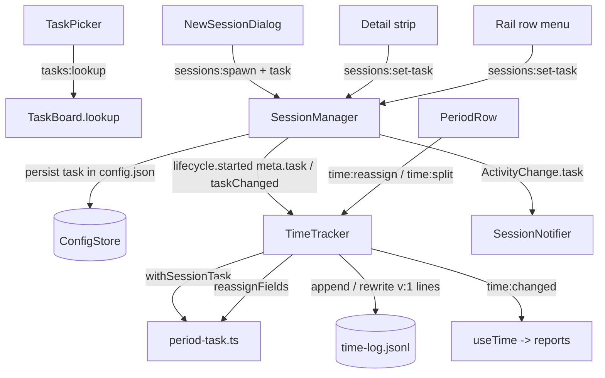

# Hours Task Assign Design

**Spec**: `.specs/features/hours-task-assign/spec.md`
**Status**: Draft

Line numbers below were read on `feature/hours-task-assign` at `5342e37` (= PR #129's head).

---

## Architecture Overview

The period keeps being the unit of truth, and its `taskId` / `taskTitle` stay the only fields any
report reads. A hand-set task **overwrites** them and adds one optional flag; the branch field is
never touched. That single choice makes HTSK-40 free: `taskTotalMs` (`time-totals.ts:50-52`),
`buildWeekReport`'s `groupKey` (`hours-report.ts:106-108`), the calendar colours and legend
(`hours-calendar.ts:202-250`) and `formatDayCopy` already group by `taskId`, and none of them change.

Main owns every write (AD-021). Two inputs set a task:

- **Live**: the session carries an optional link. `TimeTracker.#open` applies it over the branch
  snapshot each time it opens a period; changing the link closes the open period and opens another.
- **After the fact**: two new tracker edits, `reassignPeriod` and `splitPeriod`, in the pattern of
  `adjustPeriod` (validated, whole-log atomic rewrite, verdict returned as a value).



---

## Code Reuse Analysis

### Existing Components to Leverage

| Component | Location | How to Use |
| --------- | -------- | ---------- |
| `adjustPeriod` / `#editTarget` / `#rewritten` | `src/main/time-tracker.ts:159-178, 213-227` | Same shape for `reassignPeriod` and `splitPeriod`; `#editTarget` gives the open / stale rejections verbatim |
| `#close` + `MIN_PERIOD_MS` | `src/main/time-tracker.ts:11, 203-210` | `taskChanged` closes through it, so TIME-11 drops a sub-second part |
| `buildSnapshot` / `taskIdFromBranch` | `src/main/time-snapshot.ts:32-47`, `src/shared/tasks.ts:53-59` | The branch's task id is what the hand flag compares against, and what From branch restores |
| `isPeriodLine` | `src/main/time-log-store.ts:20-29` | One more optional-field check; `v` stays 1 |
| `parseTaskInput` + the pin fetch | `src/main/task-board.ts:34-70, 139-163` | `lookup` is `pin` without the duplicate check, the cache write and the persist |
| `SessionManager.rename` | `src/main/session-manager.ts:149-159` | Pattern for `setTask`: persist via `#persistUpsert`, patch the live meta, return the view |
| `SessionLifecycle` | `src/main/session-manager.ts:58-62` | Gains `taskChanged(id, task)`; the tracker already implements `started` / `ended` |
| `linkTask` | `src/main/activity-notification.ts:101-107` | Stays the branch fallback when a session has no link |
| `deriveAttribution` / `linkedPinFor` | `src/renderer/src/lib/session-attribution.ts:16-37` | Gains an optional link argument, so existing callers compile unchanged |
| `buildRailGroups` | `src/renderer/src/lib/rail-groups.ts:167-201` | Groups by the effective task; `TaskGroup` gains `title` |
| Sidebar / commit context menus | `src/renderer/src/components/Sidebar.tsx`, `CommitList.tsx:45-65, 121-150` | Pattern for the rail row menu: position at the pointer, close on any click or Escape |
| `PeriodRow` modes and local-time helpers | `src/renderer/src/components/PeriodRow.tsx:22-35, 51-64` | `Mode` grows `task` and `split`; `toLocalInput` / `fromLocalInput` feed the split field; `settle` shows main's verdict |
| `badgeTypeOf` / `typeClass` / `stateClass` | `src/renderer/src/lib/task-pills.ts` | Pills in the picker, the strip and the rail header |
| Seeded Hours smoke | `scripts/smoke-hours-calendar.mjs:200-253` | `--seed` grows a git repo, two pins and one `develop` period; sections 13–15 extend the run |

### Integration Points

| System | Integration Method |
| ------ | ------------------ |
| `config.json` | `PersistedSession.task?` rides the existing `sessions` array; `ConfigStore.merge` replaces arrays whole, so nothing else changes |
| `time-log.jsonl` | Optional `taskByHand: true` on a `v: 1` line; the previous build carries it through `{ v, ...period }` untouched |
| Azure DevOps | `tasks:lookup` reuses `AdoGateway.getWorkItems` through `WorkItemSource`; only on explicit submit |
| IPC | Three new invoke channels and one optional field on `sessions:spawn`, typed in `ipc-contract.ts` beside `time:adjust` |

---

## Components

### `period-task.ts` (new, pure)

- **Purpose**: Decide the task fields a period records, from a session link or a drawer choice, and the hand flag.
- **Location**: `src/main/period-task.ts`
- **Interfaces**:
  - `branchTaskId(branch: string | null): number | null` — `taskIdFromBranch(branch)`, null for a null branch.
  - `withSessionTask(snapshot: PeriodSnapshotFields, task: SessionTask | null, pinnedTitle: (id: number) => string | null): PeriodSnapshotFields` — no link, or a link equal to `snapshot.taskId`: the snapshot unchanged. Otherwise `taskId = task.id`, `taskTitle = task.title ?? pinnedTitle(task.id)`, `taskByHand: true`.
  - `reassignFields(period: TimePeriod, choice: PeriodTaskChoice, pinnedTitle): Pick<TimePeriod, 'taskId' | 'taskTitle' | 'taskByHand'>` — `branch`: the branch id, its pinned title, no flag. `none`: null / null, flag when the branch id is not null. `task`: the id and `title ?? pinnedTitle(id)`, flag when the id differs from the branch id.
- **Dependencies**: `taskIdFromBranch`.
- **Reuses**: the flag rule is stated once here and used by both paths (HTSK-36, HTSK-37).

"No flag" is the **absence** of the key, never `false`, so lines stay byte-identical to today's when nothing was set by hand (HTSK-42).

### `TimeTracker` (modified)

- **Location**: `src/main/time-tracker.ts`
- **Interfaces**:
  - `started(meta: { id; agent; cwd; task?: SessionTask })` — the run stores `task ?? null`.
  - `taskChanged(sessionId: string, task: SessionTask | null): void` — no run, or the same link (same id, or both null): nothing. Otherwise store it; when the run has an open period, `#close` it at now and open a new one at the same instant; `#changed()`.
  - `reassignPeriod(id: string, choice: PeriodTaskChoice): TimeEditResult` — `#editTarget`; map the period through `reassignFields`; `#rewritten()`. The choice comes from the picker's pins or a successful lookup, so it carries no further validation.
  - `splitPeriod(id: string, at: string): TimeEditResult` — `#editTarget`; NaN → `Split time must be a valid date.`; not strictly inside → `Split time must be inside the period.`; a part under `MIN_PERIOD_MS` → `Each part must last at least 1 second.`; replace the period by the two parts in place (first keeps the id, second `deps.newId()`); `#rewritten()`.
- **Dependencies**: new dep `pinnedTitle(id: number): string | null`.
- **Reuses**: `#open` becomes `withSessionTask(resolveSnapshot(cwd), run.task, pinnedTitle)`.

`resume`, `resumeFromSuspend` and `started` all open through `#open`, so HTSK-15 and HTSK-16 need no special code: the stored link is read at the next open.

### `TimeLogStore` (modified)

- **Location**: `src/main/time-log-store.ts:20-29`
- `isPeriodLine` adds `(p.taskByHand === undefined || typeof p.taskByHand === 'boolean')`. `VERSION` stays 1.

### `SessionManager` (modified)

- **Location**: `src/main/session-manager.ts`
- **Interfaces**:
  - `spawn(agentName, cwd, adhocCommand?, task?: SessionTask)` — `task` is written into the new meta (both branches of `:127-142`).
  - `duplicate(id)` — copies `src.task` like it copies `command` (`:172`).
  - `setTask(id: string, task: SessionTask | null): SessionView` — unknown id throws `Unknown session: {id}`; writes the meta with `task` (or without the key for null) through `#persistUpsert`; patches `live.meta`; calls `deps.lifecycle?.taskChanged(id, task)`; returns `#toView`.
  - `SessionLifecycle.taskChanged(id: string, task: SessionTask | null): void` — required; the test fake in `session-manager.test.ts:506` gains it.
  - `#setActivity` adds `task: session.meta.task ?? null` to the `ActivityChange` (`:419-427`).

### `SessionNotifier` / `ActivityChange` (modified)

- **Location**: `src/main/session-notifier.ts:42`, `src/main/activity-notification.ts:16-26`
- `ActivityChange.task: SessionTask | null`. `handle` uses `change.task` when set (`{ id, title }` as `LinkedTask`) and calls `deps.linkedTask(change.cwd)` only when it is null.

### `TaskBoard.lookup` (new method)

- **Location**: `src/main/task-board.ts`
- **Interface**: `lookup(input: string): Promise<LookupTaskResult>` — `parseTaskInput` → `source.getWorkItems([ref])` → `{ ok: true, item: { id, type, title } }`; `auth` updated as in `pin`; never writes `details`, never patches `pinnedTasks`.

### IPC and wiring

- **Location**: `src/shared/ipc-contract.ts`, `src/main/index.ts`
- `sessions:spawn` req gains `task?: SessionTask`.
- `sessions:set-task`: `{ id, task: SessionTask | null }` → `SessionView`.
- `tasks:lookup`: `{ input }` → `LookupTaskResult`.
- `time:reassign`: `{ id, choice: PeriodTaskChoice }` → `TimeEditResult`.
- `time:split`: `{ id, at }` (UTC ISO) → `TimeEditResult`.
- `index.ts:445-470`: the pinned-title map built inline in `resolveSnapshot` becomes a local `pinnedTitle(id)` helper used by both `resolveSnapshot` and the new tracker dep; handlers registered beside `time:adjust` and `sessions:rename`.

### Renderer pure seams

- `session-attribution.ts` — `deriveAttribution(tree, cwd, link?: SessionTask | null)` returns `{ branch, taskId, detached, linked, linkTitle }`; `taskId` is the link's when set (HTSK-11).
- `rail-groups.ts` — calls it with `session.task`; `TaskGroup.title: string | null` = the first linked session's `linkTitle` (HTSK-20). RAIL-09/10 orphan rules apply only when the effective task is null.
- `task-picker.ts` (new) — `pickerEntries(tasks, { fromBranch, noTask })`: specials first (`From branch`, `No task`, as enabled), then the pinned tasks, first pin of an id only; each entry `{ key, label, badgeType, choice }`. `lookupEntry(item)` → the `{type} #{id} {title}` row (HTSK-01, HTSK-02).
- `period-edit.ts` (new) — `handMarkTitle(branch)` (HTSK-38 literals) and `splitDefault(start, end)` → the midpoint floored to the second as a `datetime-local` value (HTSK-33). The local-time helpers move here from `PeriodRow.tsx:15-33` so both forms share them.

### Renderer surfaces

- `TaskPicker.tsx` (new) — a popover: the entries, a field with `Look up`, the lookup row, the error line. It calls `tasks:lookup` only on submit (HTSK-03) and reports a `PeriodTaskChoice`; hosts decide what the choice means.
- `NewSessionDialog.tsx` — `tasks` prop; a Task row (`From branch` or `#id title`, and a `Change` button opening the picker); initial value from `source.taskId` and the pin's title (HTSK-07, HTSK-08); `onSpawn` gains `task`.
- `AgentsView.tsx` — the strip's task becomes a button (`#{id}` + pills + title, or `No task`), shown for detached sessions too, tooltip `Task from the branch · click to change` or `Task set by hand · click to change`; it opens the picker without `No task` (HTSK-18). New `onSetTask` prop, last in `SessionDetail`'s list.
- `SessionRail.tsx` — `onContextMenu` on the row opens a menu at the pointer with `Change task…`, which opens the picker for that session (HTSK-19); the header falls back to `group.title` before `group.branch` (HTSK-20).
- `PeriodRow.tsx` — closed rows gain `Change task` (tag icon) and `Split at` (scissors icon) beside Edit and Delete; the hand mark (hand icon) with `handMarkTitle` as its tooltip (HTSK-23..38).
- `HoursView.tsx` / `App.tsx` — thread `tasks`, `onReassign`, `onSplit` down to `PeriodRow`; App passes `session.task`-aware spawn and `setSessionTask`.
- `Icon.tsx` — three glyphs appended at the end of the union and of `PATHS`: `tag`, `scissors`, `hand`.

---

## Data Models

```typescript
// src/shared/tasks.ts
/** A task chosen by hand: its id and, when known, its title (HTSK-06). */
export interface SessionTask {
  id: number
  title: string | null
}

/** Result of tasks:lookup — failures are returned, never thrown (HTSK-05). */
export type LookupTaskResult =
  | { ok: true; item: { id: number; type: string; title: string } }
  | { ok: false; error: string }

// src/shared/config.ts — PersistedSession
  /** Task chosen by hand; absent = From branch (HTSK-10, HTSK-17). */
  task?: SessionTask

// src/shared/time.ts — PeriodSnapshotFields
  /** Present and true only when the task was set by hand and differs from the
   *  branch's (HTSK-36, HTSK-37); absent on every line written before the feature. */
  taskByHand?: boolean

/** What the drawer or a session picker chose (HTSK-24..27). */
export type PeriodTaskChoice =
  | { kind: 'task'; id: number; title: string | null }
  | { kind: 'none' }
  | { kind: 'branch' }
```

A session link is `SessionTask | null` in every API; `From branch` in a session picker maps to `null`.

---

## Error Handling Strategy

| Error Scenario | Handling | User Impact |
| -------------- | -------- | ----------- |
| Lookup input does not parse | `parseTaskInput` error returned | Picker shows the text; nothing chosen |
| Azure DevOps unreachable | `auth = 'failed'`, error returned | `Could not reach Azure DevOps — run az login and try again.`; the top bar's sync state turns failed, as after a failed pin |
| Work item not found | error returned | `Work item #{id} not found in {org}/{project}.` |
| Reassign / split on an open or deleted period | `#editTarget` verdict | Inline drawer error, TIME-47/49 wording |
| Split outside, too short, invalid | verdict, log untouched | Inline drawer error (HTSK-29..31) |
| Log rewrite fails | existing `TimeLogStore` retry (TIME-14) | None on screen; in-memory state stays authoritative |
| `sessions:set-task` on an unknown id | throws, like `rename` | Logged to the console; the rail refetch shows the truth |

---

## Risks & Concerns

| Concern | Location (file:line) | Impact | Mitigation |
| ------- | -------------------- | ------ | ---------- |
| Version bump temptation | `src/main/time-log-store.ts:13, 24` | A `v: 2` line is skipped by the previous build and lost on its next rewrite | Keep `v: 1` and an optional field (HTSK-42); a store test round-trips a flagged line and one without the key |
| The flag drifting from the branch rule | `src/shared/tasks.ts:53-59` | If the branch rule changes, a derived mark would appear on old periods | The flag is **stored** at write time, not derived at read time |
| Colour freeze hides a reassigned task | `src/renderer/src/lib/hours-calendar.ts:221-223`, `HoursView.tsx:118-125` | A task new to the week wears Other until the week is reopened | Spec edge case and an `owner confirmed 2026-09-26` row; the smoke asserts the legend chip by label, not its colour |
| `deriveAttribution` has no tests today | `src/renderer/src/lib/session-attribution.ts` | The link-over-branch rule would land untested | T11 creates `session-attribution.test.ts` |
| Renderer components have no unit tests (AD-004) | `src/renderer/src/components/*` | Picker and drawer decisions regress silently (L-012, L-018) | Decisions live in `task-picker.ts` and `period-edit.ts`, unit-tested; components only render and call |
| Main-process mutants in the smoke | `npm run dev` does not restart main on `src/main` edits | A mutant would be silently absent | Every main mutant is followed by a relaunch of the dev app (noted per smoke task) |
| Smoke reaching Azure DevOps | seeded pins in `acme/platform` | A real fetch would leak nothing but would fail | The smoke never uses the typed lookup; pins are chosen from the list with no details. The lookup's UI is in the hand-verify header, its logic unit-tested |
| PR #98 rebase | `AgentsView.tsx:128-285`, `Icon.tsx`, two test files | Conflicts on rebase | Changes placed off #98's hunks (see spec Assumptions); resolve by keeping both sides |

---

## Tech Decisions (only non-obvious ones)

| Decision | Choice | Rationale |
| -------- | ------ | --------- |
| Where a hand-set task lives on the period | Overwrite `taskId` / `taskTitle`, add `taskByHand` | Every report already groups by `taskId`; a separate `assignedTask` field would need an effective-task helper in every reader, and the previous build would ignore it |
| When the flag is written | Only when the hand-set task differs from the branch's | Keeps a task-card session in its own worktree unmarked (owner confirmed 2026-09-26) |
| Session link storage | `PersistedSession.task`, owned by `SessionManager` | The session already persists there; the tracker learns it through the lifecycle it already observes |
| Link change seam | `SessionLifecycle.taskChanged`, not a second IPC to the tracker | One handler, one ordering: persist, then close/open; the renderer cannot update one without the other |
| Picker lookup channel | `tasks:lookup` on `TaskBoard` | Reuses the pin fetch and its error texts; keeps Azure DevOps calls in one module |
| Rail row gesture | Context menu | RAIL-12 forbids new controls on the row (owner confirmed 2026-09-26) |

### AD-048

**A period's task can be set by hand, live through its session or afterwards in the Hours drawer; a hand-set task overwrites the period's `taskId` and `taskTitle` and records `taskByHand: true` only when it differs from the task its branch names.** `PersistedSession.task` holds the session's link (id and title); `TimeTracker` applies it over the branch snapshot at every period open, and `SessionLifecycle.taskChanged` closes the open period and opens a new one at the same instant. `reassignPeriod` and `splitPeriod` join `adjustPeriod` and `deletePeriod`. Log lines keep `v: 1`; the branch field is never rewritten. **Supersedes** the time-tracking Out of Scope row "Editing the snapshot fields (task, worktree) of a period" for the task field; **amends** TIME-03 (a session link comes before the branch) and RAIL-08 (a linked task without pinned details shows the link's title). Spec / design / tasks: `.specs/features/hours-task-assign/` (HTSK-01..43).
