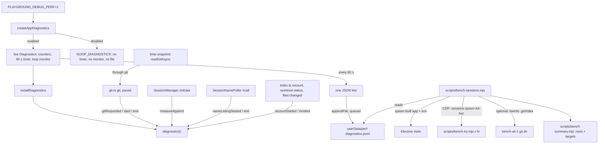

# Performance Diagnostics Design

**Spec**: `.specs/features/perf-diagnostics/spec.md`
**Status**: Approved (planned 2026-10-01, approved by the owner 2026-10-01; reconciled with `main` `6d96ae4` and re-approved 2026-10-03: the switch is `PLAYGROUND_DEBUG_PERF`, git counts at the paced start with its queue wait, and the time tracker's async read goes through `git()`). T17's baseline can stop the fix issues (#148-#151) and send them back to the owner.

---

## Architecture Overview

One module in main, `src/main/diagnostics.ts`, owns every counter and the minute flush. The code that
does the work calls a probe on it at the moment the work starts or ends. The probes go through one
module-level accessor, `diagnostics()`, which answers a shared no-op object until `index.ts` installs a
live one. A free function such as `git()` has no constructor to take a dependency through, and several
dozen call sites import it, so an accessor is the only seam that reaches all of them without changing
every signature. The bench is three scripts: a fake TUI each session runs, a pure summary reader, and
the harness that seeds, launches, drives and cleans up.



**Approaches considered** (same scope each; the issue settles the shape, so this only records why the
seam is an accessor):

1. **Module accessor plus call-site probes (chosen).** One `installDiagnostics` at startup; every probe
   is one line at an existing call site. Tests install a recording fake and restore the no-op after.
2. **Constructor injection everywhere.** Clean for the classes, but `git()` and `readGit()` are free
   functions imported by eight modules; each would grow a parameter only diagnostics uses.
3. **Sampling from outside (process lists, ETW).** Needs no code, but cannot attribute a git process to
   a worktree or a chunk to a session, and cannot see the event loop. Rejected.

---

## Code Reuse Analysis

### Existing Components to Leverage

| Component | Location | How to Use |
| --------- | -------- | ---------- |
| The single git runner | `src/main/git.ts:19-43` (`git`, paced by `spawn-pacer.ts`, PERF-22) | `gitRequested` before `pace(...)`; inside the paced start, the returned `start()` and `run(...).finally(end)`; nothing else changes (AD-023) |
| Git runner tests | `src/main/git.test.ts` | Real `git` in `tmpdir()`, as `isTimeout`'s tests already do; the reporting test sits beside them |
| The workflow fetch and the branch read | `src/main/index.ts:90-97` (`gitFetch`), `:105-117` (`readBranch`) | Rewritten as `git(cwd, args)` and `git(cwd, args, { timeoutMs: 2000 })`; `git()` sets the same `windowsHide` and `GIT_TERMINAL_PROMPT=0` |
| The time tracker's async read | `src/main/time-snapshot.ts:75-91` (`readGitAsync`, PERF-21) | Rewritten as `git(cwd, ARGS, { timeoutMs: 2000 })` with nulls on any rejection; the unused synchronous `readGit` stays untouched |
| The PTY data path | `src/main/session-manager.ts:400-403` (`handle.onData`, fed by the PTY host since #157) | `buffer.append(data)` becomes `diagnostics().measureAppend(meta.id, data, () => buffer.append(data))` |
| Session manager tests | `src/main/session-manager.test.ts:38`, `:59` (`fakePort`, its `onData`) | Drive a chunk through the fake handle and read what the recording fake got |
| The name poller's one call | `src/main/session-name-poller.ts:106-163` (`#call`, `settle`) | `nameListingStarted()` after the spawn succeeds; its end inside `settle` |
| Name poller tests | `src/main/session-name-poller.test.ts` | Their fake spawn and fake child settle a call on demand |
| Recount and emits | `src/main/index.ts:169-175` (`recountWorktree`), `:366-371` (git-state `onSettled`), `:418-420` (`fileWatcher` `emit`) | One probe line each |
| Quit hooks | `src/main/index.ts:287` (`onWillQuit`) | One more `onWillQuit(() => diagnostics().stop())` |
| The env opt-in precedent | `src/main/index.ts:315-318` (`startLoopDelayLog({ enabled: process.env.PLAYGROUND_DEBUG_PERF === '1' })`, PERF-16) | The same variable and value; that call switches to `diagnosticsEnabled(process.env)` so both read one rule |
| The loop resolution | `src/main/perf-monitor.ts` (`LOOP_RESOLUTION_MS = 10`, pinned by `perf-monitor.test.ts`) | Imported, not redefined |
| Launching the built app | `scripts/smoke-quit.mjs:65-81` | `spawn(electron, ['.', --user-data-dir, --remote-debugging-port, three anti-throttling flags], { cwd: ROOT, env })` with `ELECTRON_RUN_AS_NODE` removed; `taskkill /T /F` on a hung exit (`:107-111`) |
| CDP helpers | `scripts/smoke-quit.mjs:35-63` (`pageTarget`, `evaluate`) | Copied into the bench, as every smoke copies them |
| Seeding a workspace into a config | `scripts/smoke-files-diff.mjs:205-211` | Writes `{ workspaces: [{ id, path, displayName }] }` into the throwaway `config.json` before launch |
| Raw-command sessions | `scripts/smoke-files-diff.mjs:2649-2653`; `src/main/session-manager.ts:138-162`; `src/main/spawn-plan.ts:90-95` | `sessions:spawn { agentName: 'Ad-hoc', cwd, adhocCommand }` runs the command in the default shell (`pwsh -NoExit -Command`), never a registry agent |
| Pure helpers under `scripts/` with a co-located test | `scripts/release-version.ts` + `release-version.test.ts`; `vitest.config.ts` includes `scripts/**/*.test.ts` | `bench-summary.mjs` is tested the same way |

### Integration Points

| System | Integration Method |
| ------ | ------------------ |
| Every git process | `git.ts` reports to `diagnostics()`; every other git spawn in main is routed through it |
| Main's event loop | `perf_hooks.monitorEventLoopDelay({ resolution: 10 })`, created only when enabled |
| The user data folder | `app.getPath('userData')` joined with `perf-diagnostics.jsonl`; `fs/promises.appendFile` |
| The bench and the app | Process env (`PLAYGROUND_DEBUG_PERF=1`), CDP `Runtime.evaluate` over `window.api.invoke`, and the log file |

---

## Components

### Diagnostics module (`src/main/diagnostics.ts`)

- **Purpose**: count the work main does and write it as one JSON line a minute, or do nothing at all.
- **Location**: `src/main/diagnostics.ts`, tested by `src/main/diagnostics.test.ts`
- **Constants** (exported, each pinned by a literal assertion, L-009):
  - `DIAGNOSTICS_ENV = 'PLAYGROUND_DEBUG_PERF'`
  - `DIAGNOSTICS_LOG_FILE = 'perf-diagnostics.jsonl'`
  - `FLUSH_INTERVAL_MS = 60_000`
  - `LOOP_RESOLUTION_MS` is imported from `./perf-monitor` (10), not redefined
  - `PER_SECOND_SPAN_MS = 1_000`
- **The probe surface** (what the rest of main calls):

  ```typescript
  export interface Diagnostics {
    readonly enabled: boolean
    /**
     * A git call was requested. Call the returned `start` when the spawn queue lets the process
     * run; call the `end` that `start` returns once the process has ended (any outcome).
     */
    gitRequested(cwd: string, args: readonly string[]): () => () => void
    /** Runs `append`, timing it, and records the chunk for `sessionId`. Disabled: just runs `append`. */
    measureAppend(sessionId: string, chunk: string, append: () => void): void
    /** Main sent this event for this worktree. */
    emitted(channel: 'worktree:status' | 'files:changed', worktreePath: string): void
    /** Main started a recount of this worktree (`recountWorktree`). */
    recountStarted(worktreePath: string): void
    /** `claude agents --json` is starting; call the returned function once it has settled. */
    nameListingStarted(): () => void
    /** Cancel the timer, disable the monitor; later probes are ignored. Idempotent. */
    stop(): void
  }
  ```

- **Construction and installation**:

  ```typescript
  export interface DiagnosticsClock {
    /** Monotonic milliseconds (`performance.now()`), for durations and spans. */
    now(): number
    /** Epoch milliseconds (`Date.now()`), for the line's `t`. */
    wallNow(): number
    /** Calls `fn` every `ms`; returns the cancel. */
    every(ms: number, fn: () => void): () => void
  }

  /** The slice of Node's `IntervalHistogram` the module reads; values in nanoseconds. */
  export interface LoopDelayMonitor {
    percentile(p: number): number
    readonly max: number
    readonly count: number
    reset(): void
    disable(): void
  }

  export type LogWriter = (line: string) => Promise<void>

  export interface DiagnosticsDeps {
    clock: DiagnosticsClock
    writer: LogWriter
    /** Creates and enables the monitor; called once, only by an enabled module. */
    startLoopMonitor: () => LoopDelayMonitor
    meta: { pid: number; version: string }
    /** Where a failed write is reported; `console.error` in the app. */
    log: (msg: string) => void
    intervalMs?: number // default FLUSH_INTERVAL_MS; tests pass their own
  }

  export const NOOP_DIAGNOSTICS: Diagnostics            // frozen; gitRequested/nameListingStarted return shared no-ops
  export function diagnosticsEnabled(env: NodeJS.ProcessEnv): boolean  // env[DIAGNOSTICS_ENV] === '1'
  export function createDiagnostics(deps: DiagnosticsDeps): Diagnostics // always live; calls startLoopMonitor and clock.every once
  export function createAppDiagnostics(opts: {
    env: NodeJS.ProcessEnv
    userDataPath: string
    version: string
    intervalMs?: number // tests only; the app never passes it
  }): Diagnostics // NOOP_DIAGNOSTICS when disabled, without touching a port; else createDiagnostics with the real ports
  export function installDiagnostics(d: Diagnostics | null): void // null restores NOOP_DIAGNOSTICS
  export function diagnostics(): Diagnostics
  ```

- **Pure helpers** (exported for tests):
  - `gitSubcommand(args: readonly string[]): string`: the first argument not starting with `-`, skipping the value after `-c` or `-C`; `'(none)'` when none qualifies. `['-C', 'x', '--no-optional-locks', 'status']` gives `'status'`.
  - `folderOf(path: string): string`: the last non-empty segment after splitting on `/` and `\`; `'(none)'` when there is none.
- **Real ports** (in the same file, thin, hand-verified by T11 and T16; the writer is unit-tested in T5): `realClock` (`performance.now`, `Date.now`, `setInterval` / `clearInterval`); `nodeLoopMonitor()` (`monitorEventLoopDelay({ resolution: LOOP_RESOLUTION_MS })`, `enable()`); `appendWriter(path)` (`appendFile(path, line, 'utf8')`).
- **Behaviour**:
  - `createDiagnostics` starts the monitor and one `clock.every(intervalMs, flush)`. Nothing else schedules work.
  - `gitRequested`: subcommand, worktree key and the request time are taken at once; nothing is counted yet. `start()` adds `clock.now()` minus the request time to `git.wait` (`totalMs`, `maxMs`); then `count` of the total, the subcommand and the worktree go up; in-flight counts (total, per worktree) go up and raise the peaks; the start time joins the worktree-and-subcommand list of starts inside the last `PER_SECOND_SPAN_MS`, whose length raises `maxPerSecond`. The returned end runs once: in-flight goes down, the duration (`clock.now()` difference) goes into `totalMs` and `maxMs` of the total, and the subcommand. A second call of `start` or `end` does nothing (PDIAG-16).
  - `measureAppend`: reads the clock, runs `append` in a `try / finally`, reads the clock again, and records `chunks + 1`, `bytes + Buffer.byteLength(chunk, 'utf8')`, `appendMs`, `appendMaxMs` for the session. An error thrown by `append` passes through.
  - `flush` (every `intervalMs`): builds the line (data model below), resets the counters, sets each peak to the current in-flight count, resets the monitor, queues the write. Writes run one after the other on one promise chain, so lines land in order. A rejected write is reported through `log` once per failure streak (`[diagnostics] could not write perf-diagnostics.jsonl: EACCES`), the line is dropped, and the next success ends the streak.
  - `stop`: cancels the timer, disables the monitor, marks the module stopped; probes after it are ignored. No partial line.
  - Disabled (`NOOP_DIAGNOSTICS`): every method returns at once; `measureAppend` calls `append()` and nothing else.
- **Dependencies**: `node:perf_hooks`, `node:fs/promises`, `node:path` (`join` only, for the log path).
- **Reuses**: the injected-fake pattern of `TaskBoard` / `UpdateService` (TESTING.md, pattern 3).

### Probes at the call sites

| File | Change |
| ---- | ------ |
| `src/main/git.ts` | `const start = diagnostics().gitRequested(cwd, args)`; `pace(() => { const end = start(); return run(...).finally(end) })` |
| `src/main/index.ts` `gitFetch` | `await git(cwd, args)` in place of `execFileAsync('git', ...)` |
| `src/main/index.ts` `readBranch` | `git(cwd, ['symbolic-ref', '--short', 'HEAD'], { timeoutMs: 2000 })`; the `catch` returning `null` stays |
| `src/main/time-snapshot.ts` `readGitAsync` | `git(cwd, ARGS, { timeoutMs: 2000 })`; split stdout as today; nulls on any rejection |
| `src/main/session-manager.ts` `#start` | `diagnostics().measureAppend(meta.id, data, () => buffer.append(data))` |
| `src/main/session-name-poller.ts` `#call` | `const end = diagnostics().nameListingStarted()` after a successful spawn; `end()` first thing in `settle` |
| `src/main/index.ts` `recountWorktree` | `diagnostics().recountStarted(worktreePath)` before `worktreeStatus` |
| `src/main/index.ts` git-state `onSettled` | `diagnostics().emitted('worktree:status', worktreePath)` next to the `emit` |
| `src/main/index.ts` `fileWatcher` `emit` | `diagnostics().emitted('files:changed', event.worktreePath)` next to the `emit` |
| `src/main/index.ts` start of `whenReady` | `installDiagnostics(createAppDiagnostics({ env: process.env, userDataPath: app.getPath('userData'), version: app.getVersion() }))`, before any handler can run git |
| `src/main/index.ts` quit | `onWillQuit(() => diagnostics().stop())` |
| `src/main/index.ts` loop log | `startLoopDelayLog({ enabled: diagnosticsEnabled(process.env) })` |

`gitFetch` and `readBranch` stop using `execFileAsync`; it stays for `readFileDropList` and the
`assoc` probe. `git()` adds a 64 MiB `maxBuffer` the three did not have, which only raises a ceiling, and `GIT_TERMINAL_PROMPT=0`, which `readGitAsync` did not set and which only stops a prompt `rev-parse` never shows. All three now wait in the spawn queue like every other git call.

### Fake TUI (`scripts/bench-tui.mjs`)

- **Purpose**: print what an Ink app prints, at a fixed rate, until killed.
- **CLI**: `node scripts/bench-tui.mjs [--fps 20] [--rows 30] [--seed <n>]`
- **Output**: at start, `ESC[?1049h` (alternate screen), `ESC[?2004h` (bracketed paste), `ESC[?25l`
  (hide cursor). Then every `1000 / fps` ms, one write: for every line of the previous frame
  `ESC[2K ESC[1A`, then `ESC[2K\r`, then `rows` lines each `ESC[38;5;<c>m` + a 100-column text with the
  frame counter, a spinner glyph and the line number + `ESC[0m\n`. The colour index and the text shift
  with the frame counter, so no two consecutive frames are equal. About 4 KB a frame at 30 lines.
- **Exit**: on SIGINT, SIGTERM or a closed stdout it restores `ESC[?1049l`, `ESC[?2004l`, `ESC[?25h` and exits 0.
- ConPTY re-encodes what a child prints before node-pty hands it to main, so chunk counts and bytes in
  the log are ConPTY's, not the script's. That is the same path a real agent's output takes.

### Bench summary (`scripts/bench-summary.mjs`)

- **Purpose**: turn the log's lines into rows and judge the targets; pure, no I/O.
- **Location**: `scripts/bench-summary.mjs`, tested by `scripts/bench-summary.test.ts`
- **Interfaces**:
  - `parseLines(text: string): DiagnosticsLine[]`: one object per non-empty line; a line that does not parse throws with its line number.
  - `phaseRows(lines, { minutes }): Row[]`: line 1 is `startup`, line 2 `spawn`, lines 3 to `minutes + 2` are `steady 1` to `steady m`; later lines are ignored.
  - `rowOf(line): Row`: `{ label, loopP50, loopP99, loopMax, gitCount, gitWaitMaxMs, gitPeak, worktreePeak, statusMaxPerSecond, statusEmits, recounts, ptyChunks, ptyKBps, appendMeanMs, appendMaxMs, names }`. `worktreePeak` and `statusMaxPerSecond` are the largest over worktrees; `appendMeanMs` is the sum of `appendMs` over the sum of `chunks` (0 when no chunk); `ptyKBps` is bytes over `windowMs`.
  - `worstRow(rows): Row`: the largest value of every column over the steady rows (`appendMeanMs` from the totals of the steady rows, not the largest row mean).
  - `judgeTargets(rows, { sessions, indexIntervalMs, targets }): TargetResult[]`, with `DEFAULT_TARGETS = { loopP99Ms: 30, appendMeanMs: 0.1, statusPerSecond: 1, worktreePeak: 1 }`. Each result is `{ name, value, limit, verdict: 'PASS' | 'FAIL' | 'n/a' }`. The loop target is `n/a` unless `sessions` is 6; the status target is `n/a` without an index loop; the append target is `n/a` with no chunk.
  - `formatSummary(options, rows, worst, targets, spawnMs): string`: the text below.
- **Text** (fixed columns, one row per line):

  ```
  bench-sessions  sessions=6  fps=20  rows=30  files=500  index=100ms  minutes=3  commit=<short sha>
  phase      loop p50/p99/max ms   git n  wait  peak  wt peak  status/s  wt:status  recounts  chunks  KB/s  append mean/max ms  names
  startup     10.1 /  12.0 /  40.2     14     0     3        1         1          0         0       0     0  0.000 / 0.000          0
  spawn       10.6 /  48.3 / 161.0     40     6     4        2         2          6         6   21000   340  1.210 / 3.400          0
  steady 1    ...
  steady 2    ...
  steady 3    ...
  worst       ...
  spawn: longest sessions:spawn round trip 412 ms
  targets
    loop p99 < 30 ms with 6 sessions        48.3   FAIL
    append mean < 0.1 ms per chunk           1.290  FAIL
    git status <= 1 per worktree per s       4      FAIL
    no overlapping git on one worktree       2      FAIL
  ```

### Bench harness (`scripts/bench-sessions.mjs`)

- **Purpose**: one command, one load, one summary.
- **CLI**:

  | Flag | Default | Meaning |
  | ---- | ------- | ------- |
  | `--sessions <n>` | 3 | Fake sessions, one per worktree; 0 is allowed |
  | `--minutes <m>` | 3 | Steady lines measured after the spawn line |
  | `--fps <f>` | 20 | Frames a second per fake session |
  | `--rows <r>` | 30 | Lines per frame |
  | `--files <n>` | 500 | Tracked files in the seeded repository |
  | `--index-interval <ms>` | 0 (off) | Rewrite `bench-wt-1`'s git-dir `index` every that many ms |
  | `--port <p>` | 9334 | CDP port (the smokes use 9222 and 9333) |
  | `--json <file>` | none | Also write `{ options, lines, rows, worst, targets, spawnMs }` as JSON |
  | `--keep` | off | Keep the temporary folders and print where they are |

  The options are one table (`OPTIONS`) of `{ flag, default, parse }`, so #150 adds its build-folder
  write loop as one more row and one more loop, without restructuring.
- **Flow**:
  1. Refuse with exit 2 if `out/main/index.js` is missing (PDIAG-28).
  2. `mkdtempSync(join(tmpdir(), 'pg-bench-'))` holds `user-data/` and `ws/`. Seed `ws/app`: `git init -b main`, `--files` files `src/f0000.ts`... of 20 lines each, one commit, then `git worktree add ../bench-wt-<i> -b bench/<i>` for i = 1..max(N, 1). Write `user-data/config.json` with the one workspace (`ws`).
  3. Launch as `smoke-quit.mjs` does, with `env.PLAYGROUND_DEBUG_PERF = '1'`; register SIGINT and exit cleanups first (PDIAG-48).
  4. Wait for the page target and `window.api`, then for line 1 of `user-data/perf-diagnostics.jsonl` (poll every 500 ms).
  5. Spawn N sessions: `sessions:spawn { agentName: 'Ad-hoc', cwd: <bench-wt-i>, adhocCommand: '"<process.execPath>" "<ROOT>/scripts/bench-tui.mjs" --fps <f> --rows <r> --seed <i>' }`, timing each round trip; then `sessions:attach` on the first. Start the index loop.
  6. Wait for line `minutes + 2`, with a deadline of `minutes + 3` minutes after line 1 (PDIAG-50).
  7. Stop the index loop, `sessions:stop` each session, `window.close()` through CDP, wait for exit up to 30 s, then `taskkill /pid <pid> /T /F` (PDIAG-49).
  8. Read the log, print `formatSummary`, write `--json`, remove the temporary folder (retrying, as the smokes' `rmTree` does) unless `--keep`, exit 0.

---

## Data Models

### One log line (`v: 1`)

```typescript
interface DiagnosticsLine {
  v: 1
  /** The window's end, ISO 8601 UTC (from clock.wallNow). */
  t: string
  /** The window's measured length (clock.now difference), rounded to 1 ms. */
  windowMs: number
  pid: number
  version: string
  loop: { p50Ms: number; p99Ms: number; maxMs: number; resolutionMs: 10 }
  git: {
    count: number
    totalMs: number
    maxMs: number
    peakConcurrent: number
    /** Time between a call's request and its start in the spawn queue (PERF-22). */
    wait: { totalMs: number; maxMs: number }
    bySubcommand: Record<string, { count: number; totalMs: number; maxMs: number }>
    byWorktree: Record<
      string, // folderOf(cwd)
      {
        count: number
        peakConcurrent: number
        bySubcommand: Record<string, { count: number; maxPerSecond: number }>
      }
    >
  }
  /** Keyed by session id; only sessions with a chunk in the window. */
  pty: Record<string, { chunks: number; bytes: number; appendMs: number; appendMaxMs: number }>
  emits: {
    'worktree:status': Record<string, number> // folderOf(worktreePath)
    'files:changed': Record<string, number>
  }
  recounts: Record<string, number>
  names: { count: number; totalMs: number; maxMs: number }
}
```

Every millisecond value is rounded to 3 decimals except `windowMs`. A count starts at the event's start;
a duration lands in the window where the process ended. A worktree or subcommand with nothing in the
window is absent from its record; the six sections and `git.wait` are always present.

Example (one worktree, abridged):

```json
{"v":1,"t":"2026-10-01T12:01:00.000Z","windowMs":60000,"pid":4242,"version":"0.1.0","loop":{"p50Ms":10.12,"p99Ms":24.3,"maxMs":61.2,"resolutionMs":10},"git":{"count":64,"totalMs":2210.5,"maxMs":88.1,"peakConcurrent":3,"wait":{"totalMs":96.4,"maxMs":12.1},"bySubcommand":{"status":{"count":60,"totalMs":2100.4,"maxMs":88.1},"rev-parse":{"count":4,"totalMs":110.1,"maxMs":31}},"byWorktree":{"bench-wt-1":{"count":64,"peakConcurrent":2,"bySubcommand":{"status":{"count":60,"maxPerSecond":4},"rev-parse":{"count":4,"maxPerSecond":2}}}}},"pty":{"6f1c...":{"chunks":1200,"bytes":4100000,"appendMs":1500.25,"appendMaxMs":3.2}},"emits":{"worktree:status":{"bench-wt-1":60},"files:changed":{}},"recounts":{"bench-wt-1":60},"names":{"count":0,"totalMs":0,"maxMs":0}}
```

### Bench row

```typescript
interface Row {
  label: string // 'startup' | 'spawn' | `steady ${n}` | 'worst'
  loopP50: number; loopP99: number; loopMax: number
  gitCount: number; gitWaitMaxMs: number; gitPeak: number
  worktreePeak: number; statusMaxPerSecond: number
  statusEmits: number; recounts: number
  ptyChunks: number; ptyKBps: number
  appendMeanMs: number; appendMaxMs: number
  names: number
}
```

---

## What the fix issues read

| Issue | Target | Where it reads it |
| ----- | ------ | ----------------- |
| #148 scrollback (closed by #154; regression guard) | append under 0.1 ms per chunk; loop p99 under 30 ms at 6 sessions | `pty.*.appendMs / chunks`, `pty.*.appendMaxMs`, `loop.p99Ms`; summary columns `append mean/max` and `loop` |
| #149 recount coalescing | at most one `git status` per worktree per second under continuous index writes; no two git processes overlapping on one worktree | `git.byWorktree.*.bySubcommand.status.maxPerSecond`, `git.byWorktree.*.peakConcurrent`, `recounts`, `emits["worktree:status"]`; run with `--index-interval 100` |
| #150 Files watcher | no git process from writes to ignored folders; no overlapping refreshes | `git.byWorktree`, `emits["files:changed"]`; #150 adds a build-folder write loop to `OPTIONS` and opens the Files view through CDP |
| #151 async git, name backoff (the async read shipped in #154) | no main stall over 50 ms when 6 sessions open or the machine wakes; no back-to-back name listings | `loop.maxMs` in the `spawn` row; `names.count` per minute |

---

## Error Handling Strategy

| Error Scenario | Handling | User Impact |
| -------------- | -------- | ----------- |
| The log cannot be written (permissions, disk full, folder gone) | Line dropped; one console error per failure streak; counting goes on | None; the next minute tries again |
| A probe's end is called twice | Ignored after the first | None |
| A probe arrives after `stop()` | Ignored | None |
| `append` throws inside `measureAppend` | Recorded, then rethrown to the session manager exactly as today | Same as today |
| The bench finds no built app | Exit 2, message names `npx electron-vite build` | Nothing starts |
| The app hangs on close | `taskkill /T /F` after 30 s | Bench still prints and cleans |
| Lines never arrive (diagnostics broken, app crashed) | Prints the lines it has, cleans up, exit 1 | A clear failure, not a hang |
| The index rewrite collides with git's own write (`EBUSY`, `EPERM`) | Counted as a skipped write, loop goes on; the count is printed under the summary | None |

---

## Risks & Concerns

| Concern | Location (file:line) | Impact | Mitigation |
| ------- | -------------------- | ------ | ---------- |
| Node's histogram records the whole interval between its timer runs, so an idle loop may read about the 10 ms resolution, not 0 (from memory of Node's `ELDHistogram`; not verified against the docs) | `src/main/diagnostics.ts` (new) | The 30 ms target would include a 10 ms floor | **Uncertain, verify in T17**: the N = 0 run reads the floor; PDIAG-42 recalibrates the target when the floor is 20 ms or more |
| `monitorEventLoopDelay` inside Electron's main process: Electron drives libuv from its own message loop | `src/main/diagnostics.ts` (new) | The monitor might not see a busy main | T16's falsification: a throwaway 2 ms busy-wait in `SessionRingBuffer.append` must raise `loop.p99Ms` and `appendMeanMs` |
| A global accessor is mutable state shared by every test in a file | `src/main/diagnostics.ts` (new) | A test that forgets to restore leaks a fake into the next one | Every test file that installs a fake restores in `afterEach(() => installDiagnostics(null))`; Vitest isolates files in their own workers |
| Real-git tests near the per-test timeout (L-005) | `src/main/git.test.ts`, `src/main/time-snapshot.test.ts` | The new real-process tests could push a slow suite over | The new tests run one fast git command each (`rev-parse` in a non-repo folder); T1 records the suite's duration; `vitest.config.ts` already allows 30 s |
| `readBranch`, `gitFetch` and `readGitAsync` moved onto `git()` | `src/main/index.ts:90-117`, `src/main/time-snapshot.ts:75-91` | A changed option could change behaviour | Same args, same timeout, same env; `git()` only adds `maxBuffer`. T7 and T8 read the calls against the old ones line by line; each now waits in the spawn queue (at most 4 running), as PERF-22 intends; the bench (T15) runs on the rewired build |
| Two loop monitors when the switch is on (PERF-16's and the log's) | `src/main/perf-monitor.ts`, `src/main/diagnostics.ts` (new) | Two 10 ms timers while debugging | Accepted: each resets on its own cadence (10 s, 60 s); sharing one histogram would make one window read the other's reset. Off by default |
| Counting inside the paced start | `src/main/git.ts` | A call whose start never runs (app quitting) is never counted | Accepted: it never spawned a process |
| Folder-name keys merge two worktrees with the same folder name | `src/main/diagnostics.ts` (new) | A false overlap on a real machine | Recorded as a limitation (spec assumptions); the bench names its worktrees uniquely |
| ConPTY rewrites the fake TUI's output | `src/main/pty-port.ts:28-40` | Bytes and chunk sizes differ from the script's own | Accepted: the same happens to a real agent; the baseline records what main actually receives |
| Rewriting `.git/index` while the app's `git status` holds the lock | `scripts/bench-sessions.mjs` (new) | A write fails now and then | Same bytes, so the repository stays valid; failures counted and printed |
| `scripts/*.mjs` imported by a `.test.ts` is outside `tsc` (`tsconfig.node.json` includes `src/` only) | `scripts/bench-summary.test.ts` (new) | No type check on the summary | Vitest runs it; the module carries JSDoc types; ESLint lints both |
| The smokes copy `pageTarget` and `evaluate` instead of sharing them | `scripts/smoke-*.mjs` | A fourth copy | Kept: every smoke is standalone by convention; a shared helper is out of scope |

---

## Tech Decisions (only non-obvious ones)

| Decision | Choice | Rationale |
| -------- | ------ | --------- |
| How probes reach the module | Module accessor `diagnostics()` with `installDiagnostics()` | `git()` and `readGit()` are free functions; the classes use the same accessor so there is one way |
| The disabled path | A frozen shared `NOOP_DIAGNOSTICS`, chosen before any port is touched | "Adds no timers" is then true by construction, and a test can assert the ports were never called |
| Timing the append | `measureAppend(id, chunk, fn)` wraps the call | One call site, no clock read when disabled, and an exception passes through untouched |
| Durations | `performance.now()`; timestamps `Date.now()` | A wall clock can jump; a monotonic one cannot |
| `maxPerSecond` | Sliding 1,000 ms span of start times per worktree and subcommand | A fixed bucket hides two starts 100 ms apart across its edge |
| Event-loop resolution | 10 ms | Node's default; a 1 ms timer would wake main 1,000 times a second while measuring it |
| Write path | `fs/promises.appendFile` on one promise chain | Async (issue), ordered, no stream left open across a quit |
| Where the spawn timing comes from | The bench times each `sessions:spawn` round trip | "A new session takes long to start" is a renderer-to-main round trip; the log cannot see it |
| The bench's steady window | Full minutes after a `startup` and a `spawn` minute | The fixed 60 s flush is aligned to app start, not to the bench |

> **AD-057 (main holds up to AD-053; PR #158 holds AD-054, PR #160 holds AD-055, PR #161 holds AD-056): performance figures come from one
> opt-in diagnostics module.** `src/main/diagnostics.ts` owns every performance counter in main and is
> reached through `diagnostics()`; it is live only when `PLAYGROUND_DEBUG_PERF=1`, and otherwise a
> no-op that starts no timer and no monitor. Every git process main starts reports to it (the runner,
> counted when the spawn queue starts the process, with its queue wait); a log line names worktrees by folder only and never carries a
> path, a git argument beyond the subcommand, or terminal content. Performance fixes measure with
> `scripts/bench-sessions.mjs` and quote its summary before and after.
