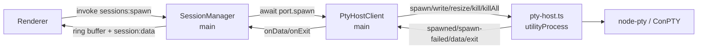

# PTY Host Design

**Spec**: `.specs/features/pty-host/spec.md`
**Context**: `.specs/features/pty-host/context.md`
**Status**: Draft

---

## Architecture Overview

One Electron `utilityProcess` (the **PTY host**) owns every node-pty instance. Main keeps
`SessionManager`, the scrollback (`SessionRingBuffer`), persistence, activity hooks and the renderer
routing; it reaches the PTYs only through `PtyPort`, now an interface served by `PtyHostClient`. The
client speaks a small typed message protocol over `child.postMessage` / `process.parentPort`, and
every message carries a per-PTY id (`pid` is not known until spawn, and a respawn reuses the session
id, so neither can key the protocol).

ConPTY creation is still synchronous, but it now blocks the host's loop, not main's (PTYH-01..04).



### Protocol (`src/shared/pty-host-protocol.ts`)

```typescript
type ToHost =
  | { type: 'spawn'; ptyId: number; file: string; args: string[]; cwd: string; env: Record<string, string> }
  | { type: 'write'; ptyId: number; data: string }
  | { type: 'resize'; ptyId: number; cols: number; rows: number }
  | { type: 'kill'; ptyId: number }
  | { type: 'killAll' } // kill every PTY, then process.exit(0)

type FromHost =
  | { type: 'spawned'; ptyId: number; pid: number }
  | { type: 'spawn-failed'; ptyId: number; message: string }
  | { type: 'data'; ptyId: number; data: string }
  | { type: 'exit'; ptyId: number; exitCode: number }
```

The host handles messages one at a time in arrival order, and `pty.spawn` is synchronous inside it.
So a `write`/`kill`/`killAll` posted after a `spawn` always finds that PTY created (PTYH-08, PTYH-19),
and `data`/`exit` leave the host in node-pty's event order (PTYH-06, PTYH-07).

### Sequences

**Spawn (happy path):** `SessionManager.spawn` → `#start` registers the token → `await
port.spawn(plan, env)` → client assigns `ptyId`, computes `buildPtyEnv({...process.env, ...env})`
**in main** (parity, PTYH-09), posts `spawn` → host `pty.spawn(...)` → posts `spawned{pid}` → the
client resolves a `PtyHandle` → `#start` wires `onData`/`onExit`, registers the Map entry →
`spawn` persists and returns the view.

**Spawn failure:** the host catches the throw and posts `spawn-failed{message}` → the client logs the
`Failed to spawn PTY: file=… args=… cwd=…` line (PTYH-15) and rejects with `new Error(message)` →
`#start` revokes the token (PTYH-16) and rethrows → nothing is persisted (PTYH-14) → `ipcMain.handle`
rejects the invoke → the toast (PTYH-13).

**Host crash:** the `UtilityProcess` emits `exit(code)` while the client is not shutting down → the
client logs `[pty-host] exited unexpectedly (code N)` (PTYH-27), rejects every pending spawn
(PTYH-26), fires `onExit({ exitCode: -1, hostExited: true })` on every live handle (PTYH-22), and
drops its transport. The next `spawn` forks a new host (PTYH-24). Nothing respawns sessions (PTYH-25).
`SessionManager.#finalize` carries `hostExited` into `session:exit`, and `TerminalPane` prints
`[PTY host exited unexpectedly]` instead of `[shell exited with code …]` (PTYH-23).

**Quit:** `window-all-closed` runs `killAll()` as today (each `kill` posted, statuses finalized
synchronously), then `await ptyHost.shutdown(3000)`: post `killAll`, wait for the host's `exit`, and
`child.kill()` at the deadline (PTYH-17, PTYH-18). Then `app.quit()`. A `will-quit` guard does the
same for quit paths that skip `window-all-closed` (`app.quit()` from the updater): if the host is
alive, `preventDefault()`, `await shutdown`, `app.quit()` again. The host runs node-pty's own
`kill()` for each PTY, which enumerates and kills the console process list
(`windowsPtyAgent.js:133`). That is why the host must outlive the kills instead of being torn down
with main.

---

## Code Reuse Analysis

### Existing Components to Leverage

| Component | Location | How to Use |
| --------- | -------- | ---------- |
| `PtyHandle` | `src/main/pty-port.ts:9` | Unchanged contract; `onExit` payload widened with an optional `hostExited` |
| `PtyPort` adapter body | `src/main/pty-port.ts:28` | The `pty.spawn` options and `useConpty: true` move verbatim into the host |
| `buildPtyEnv` | `src/main/terminal-env.ts` | Stays in main, applied by the client before posting `spawn` |
| `SessionManager` | `src/main/session-manager.ts` | `spawn`/`respawn`/`duplicate`/`#start` become `async`; the rest is unchanged |
| `SessionRingBuffer` | `src/main/session-ring-buffer.ts` | Unchanged, stays in main |
| `fakePort` / `makeFakeHandle` | `src/main/session-manager.test.ts:59` | `spawn` returns `Promise.resolve(h)`; add a rejecting variant |
| `?modulePath` import | electron-vite 5 | `import ptyHostPath from './pty-host?modulePath'` bundles the host entry next to main |
| `PLAYGROUND_DEBUG_PERF` loop log | `src/main/perf-monitor.ts` | The measurement for PTYH-02 (manual) |

### Integration Points

| System | Integration Method |
| ------ | ------------------ |
| `ipcMain.handle('sessions:spawn' / ':respawn' / ':duplicate')` | Already return what the manager returns; a promise is awaited by `handle` (`index.ts:655-667`) |
| `IpcEvents['session:exit']` | Gains optional `hostExited?: true` (`src/shared/ipc-contract.ts:247`) |
| `TerminalPane` exit notice | Branches on `payload.hostExited` (`TerminalPane.tsx:452-455`) |
| App lifecycle | `whenReady` forks the host eagerly; `window-all-closed` / `will-quit` await `shutdown` |
| Packaging | `electron-builder.yml` unchanged if `out/main/pty-host*.js` lands in `out/` (validated in T1) |

---

## Components

### `pty-host-core.ts` (host logic, testable)

- **Purpose**: Handle `ToHost` messages against a node-pty-shaped factory and post `FromHost`.
- **Location**: `src/main/pty-host-core.ts`
- **Interfaces**:
  - `createPtyHost(deps: { spawn: (file, args, opts) => IPtyLike; post: (m: FromHost) => void; exit: (code: number) => void }): { handle(m: ToHost): void }`
- **Dependencies**: none at runtime (node-pty is injected)
- **Reuses**: the spawn options from today's `PtyPort.spawn`
- **Notes**: write/resize/kill on an unknown or exited `ptyId` are dropped silently (PTYH-11);
  `killAll` kills every live PTY, then calls `exit(0)`.

### `pty-host.ts` (host entry, thin)

- **Purpose**: Wire `process.parentPort` and the real `node-pty` to `createPtyHost`.
- **Location**: `src/main/pty-host.ts`
- **Interfaces**: none; it runs as the utility process entry.
- **Dependencies**: `node-pty`, `process.parentPort`
- **Notes**: the only file that imports `node-pty` (PTYH-01). Hand-verified boundary, like today's adapter.

### `PtyHostClient` (main-side proxy)

- **Purpose**: Implement `PtyPort` over a host transport; own the host's lifecycle.
- **Location**: `src/main/pty-host-client.ts`
- **Interfaces**:
  - `spawn(plan: SpawnPlan, env?: NodeJS.ProcessEnv): Promise<PtyHandle>`
  - `start(): void`: fork eagerly (app ready)
  - `shutdown(timeoutMs: number): Promise<void>`: `killAll`, await exit, force at the deadline
  - `get alive(): boolean`
- **Dependencies**: `fork: () => HostTransport` (injected), `log: (line: string) => void`
- **Reuses**: `buildPtyEnv`, the #89 log line
- **Notes**: buffers `data`/`exit` that arrive before the handle's listeners are attached, and flushes
  them on `onData`/`onExit` registration in order. This keeps PTYH-06/07 independent of microtask
  timing in `SessionManager`.

### `HostTransport` + `forkPtyHost` (Electron adapter, thin)

- **Purpose**: Narrow seam over `UtilityProcess` so the client is unit-testable with a fake.
- **Location**: `src/main/pty-host-client.ts` (interface) / `src/main/pty-host-fork.ts` (adapter)
- **Interfaces**: `post(m: ToHost)`, `onMessage(cb)`, `onExit(cb: (code: number) => void)`, `kill()`
- **Notes**: `utilityProcess.fork(ptyHostPath, [], { serviceName: 'Playground PTY host', stdio: 'pipe' })`;
  stdout/stderr lines go to `console.error('[pty-host] …')` (spec edge case).

### `PtyPort` (now an interface)

- **Location**: `src/main/pty-port.ts`. It keeps `PtyHandle` and becomes
  `interface PtyPort { spawn(plan, env?): Promise<PtyHandle> }`, with no node-pty import.

### `SessionManager` changes

- `spawn`, `respawn`, `duplicate` → `async`, `await this.#start(meta)` before persisting.
- `#start` → `async`; wraps `await port.spawn` in try/catch: on failure, revoke the token, rethrow.
- `#starting: Set<string>`: `respawn` returns the current view while the id is starting (PTYH-28).
- `#disposed` flag set by `killAll`: a handle that resolves after it is killed on arrival and not
  registered (belt and braces for PTYH-19; the host's FIFO already covers quit).
- `#finalize(id, exitCode?, hostExited?)` forwards `hostExited` into `session:exit`.

---

## Data Models

`IpcEvents['session:exit']`: `{ id: string; exitCode: number; hostExited?: true }`.
`PtyHandle.onExit` callback payload: `{ exitCode: number; hostExited?: true }`.
No persisted model changes.

---

## Error Handling Strategy

| Error Scenario | Handling | User Impact |
| -------------- | -------- | ----------- |
| Bad cwd / shell / agent | Host posts `spawn-failed`; client logs plan and rejects; manager revokes token | Toast with the error; no session added (as today) |
| Host crashes with sessions running | Client finalizes every handle with `hostExited`; next spawn forks a new host | Each terminal prints `[PTY host exited unexpectedly]`; sessions `stopped`, respawnable |
| Host crashes during a spawn | The pending spawn rejects with `PTY host exited unexpectedly` | Toast; no session added |
| Host fails to fork | `spawn` rejects with the fork error | Toast; next spawn retries the fork |
| Host does not exit within 3 s on quit | `child.kill()` | None visible; app quits |
| `write`/`resize`/`kill` after exit | Dropped in client and host | None |

---

## Risks & Concerns

| Concern | Location (file:line) | Impact | Mitigation |
| ------- | -------------------- | ------ | ---------- |
| node-pty's `kill()` forks `conpty_console_list_agent` with `child_process.fork`; not known to work from a utility process | `node_modules/node-pty/lib/windowsPtyAgent.js:184` | Ctrl+C/stop leave child processes alive | T1 spike on `build:win`: stop a session running `node -e "setInterval(()=>{},1e3)"`, check Task Manager |
| Native module + asar loading from the utility process is unverified | `electron-builder.yml:13` (only `resources/**` unpacked) | Sessions fail only in the installed app (cf. #68) | T1 spike validates on `build:win` before the refactor lands |
| `will-quit` re-entry runs every `will-quit` handler twice | `src/main/index.ts:279,401,771` | Double `resultServer.stop()` / loop-log stop | Guard re-entry with a `quitting` flag; `resultServer.stop()` is already idempotent (`mcp-result-server.ts:195` returns when not listening) |
| Pre-existing: `#start` registers the activity token before spawn and never revokes it on failure | `src/main/session-manager.ts:355-362` | Leaked token accepted by the hook server | PTYH-16 fixes it in the new try/catch |
| Pre-existing: `app.quit()` paths skip `window-all-closed`, so `killAll` never runs there | `src/main/index.ts:798` | Sessions not finalized on updater quit | `will-quit` guard calls `killAll` + `shutdown` when the host is alive |
| Every `SessionManager` spawn call site in tests becomes `await` | `src/main/session-manager.test.ts` | Large mechanical diff | One task, mechanical; PTYH-12 allows it |
| Orphans after a host crash | n/a | A detached agent survives | Accepted risk (spec Assumptions, 2026-10-02) |

---

## Tech Decisions

| Decision | Choice | Rationale |
| -------- | ------ | --------- |
| Topology | One utility process for all PTYs | Owner choice (2026-10-02); one process to manage, ~30–40 MB |
| Channel | `child.postMessage` / `parentPort`, no extra `MessageChannelMain` | One ordered channel is all the protocol needs; fewer moving parts |
| Protocol key | Client-assigned numeric `ptyId` | Session id is reused by respawn; `pid` is unknown until spawned |
| Env computation | `buildPtyEnv` in main | Byte-identical env to today (PTYH-09); host stays logic-free |
| Early-message buffering | In the client handle | Removes dependence on microtask ordering in `SessionManager` |
| Crash exit code | `-1` with `hostExited: true` | Keeps `exitCode: number`; the flag drives the notice |
| Quit | Host exits itself after `killAll`; 3 s force-kill | Lets node-pty's own kill path run (console process list) |

**Project-level decision:** AD-053, node-pty runs only in the PTY host utility process (recorded in
`STATE.md` on approval).

---

## Spike Results

Run 2026-10-02 (T1) from a scratch worktree, packaged with `electron-builder --dir`
(`dist/win-unpacked/playground.exe`, `app.isPackaged === true`). Throwaway code, not committed.

| Check | Result |
| ----- | ------ |
| `node-pty` loads in the utility process from the package | **Yes.** `require('node-pty')` resolves inside `app.asar`; the native binaries are smart-unpacked to `app.asar.unpacked/node_modules/node-pty/` with no `electron-builder.yml` change |
| Host bundle path from `?modulePath` | `resources/app.asar/out/main/pty-spike-host-<hash>.js`. `utilityProcess.fork` runs it from inside the asar |
| Main-process cost | `utilityProcess.fork` call 11.8 ms; host ready 541 ms after fork (off main). Spawn round trip 177 ms, of which 173 ms is `pty.spawn` in the host. **Main loop delay max during the spawn: 16.8 ms** (5 ms resolution), against 313–339 ms blocked today |
| `kill()` of a PTY whose shell runs `node -e "setInterval(()=>{},1e3)"` | Grandchild `node.exe` and the shell are gone 4 s after `kill()`; exit code `-1073741510` (`0xC000013A`, as in-process) |
| node-pty's console-list agent | Forks from the utility process but throws `AttachConsole failed`. **Same in-process**: plain Node running node-pty 1.1.0 prints the identical error, since `kill()` closes the pseudoconsole before the forked agent attaches. Closing the pseudoconsole is what kills the tree in both cases. Parity, not a regression |
| Bad cwd | `pty.spawn` throws `Cannot create process, error code: 267` and the host reports it (PTYH-13 path works) |
| Host exit | `process.exit(0)` in the host → `exit` event with code `0` in main |

**Verdict:** no design change. Phase 2 proceeds as designed.

---

## Packaged Validation

Run 2026-10-02 (T14) with `scripts/smoke-pty-host.mjs` against `npm run build:unpack`
(`dist/win-unpacked/playground.exe`, asar-packed like the installer, built after T15):
`SMOKE_EXE=dist/win-unpacked/playground.exe SMOKE_PERF=1 RUN2_ITER=10` → **39/39 checks passed**.

| Check | Result |
| ----- | ------ |
| Spawn, attach with replay, typing, resize, Ctrl+C, stop, normal `session:exit` without `hostExited` | Pass |
| Kill the PTY host (`taskkill /F`) | Both sessions get `session:exit {exitCode:-1, hostExited:true}`, turn `stopped`; app stays up; `[pty-host] exited unexpectedly (code …)` logged; respawn forks a new host and runs |
| Quit with 3 sessions running (each with a `node` grandchild) | App exits 0; no marked process left; no unhandled rejection |
| Quit right after requesting a spawn, 10 runs | 10/10 exit 0 with no process left (failed 1 in 12 before T15) |
| Main CPU profile, 1 ms sampling (inspector) | Time in node-pty frames: **0.0 ms** for spawn, respawn and duplicate (was 246–281 ms in `WindowsPtyAgent`) |
| Longest main busy stretch | idle 3.4 ms; spawn 64.9 ms, respawn 42.0 ms, duplicate 55.7 ms (was 313–339 ms). Hottest frame in each: `readGitAsync` → `execFile('git rev-parse')` from the time tracker's snapshot on `lifecycle.started` (25–40 ms of synchronous process creation). Pre-existing, #151's scope |

**Earlier attempt, superseded:** the `PLAYGROUND_DEBUG_PERF` loop-delay log cannot measure PTYH-02
on this machine, since an idle 10 s window already shows `max=49.8–60.2 ms`. The smoke uses the CPU
profile instead.

**Finding that changed the spec:** the PTY host handles one message at a time, so typing into or
reading from another session waits inside the host while it creates a ConPTY. PTYH-03/04 were
narrowed to main's side, and a host per session is a follow-up (spec Assumptions, 2026-10-02).

**Not covered by the smoke (owner check):** the `[PTY host exited unexpectedly]` line as drawn by
xterm (canvas; the payload is asserted), and a session with real Claude Code agents. The smoke uses
ad-hoc `pwsh`/`node` sessions.
