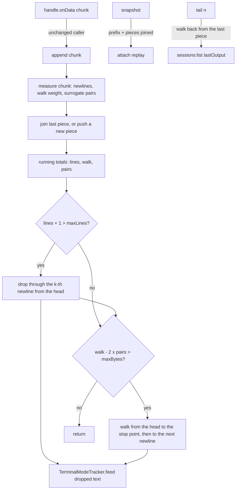

# Scrollback Append Design

**Spec**: `.specs/features/scrollback-append/spec.md`
**Status**: Draft (planned 2026-10-01). Executes after #147; T1 can stop the work on #147's baseline.

---

## Architecture Overview

`SessionRingBuffer` keeps its class, its constructor and its three methods. Inside, the single
`#buf` string becomes a list of **pieces** with running totals. A chunk is counted once when it
arrives and joins the last piece (or starts a new one). A cap check reads only the totals. A trim
walks forward from the head of the list, dropping whole pieces by their stored counts and scanning
only inside the piece where the cut lands; everything it scans is dropped, and everything dropped goes
to the mode tracker at once. `tail(n)` walks back from the last piece. Nothing in `append` touches
content it does not drop, so the cost of an append, amortised over a session's life, is proportional
to the chunk.



**Approaches considered** (same scope each):

1. **Piece list with running totals, a head index and an offset into the head piece (chosen).**
   Appends count only the chunk; trims skip whole pieces by their counts; small chunks are joined into
   the last piece so the list stays short. Exact cut points are reproducible because the walk weight
   and the true byte count are both kept.
2. **One string with a head offset, compacted when the offset passes half the length.** `+=` builds a
   V8 cons string, and the first `indexOf` or `charCodeAt` on it flattens the whole rope, so every
   append that trims pays O(buffer) again. Rejected. (V8 behaviour from general knowledge, not
   measured here; approach 1 never searches a string longer than one piece.)
3. **One string per line, with per-line byte counts.** `tail` and the line cap become trivial, but a
   30-line TUI frame allocates 30 strings per chunk, a chunk without newlines grows the last line by
   concatenation (the same flattening as approach 2), and a line longer than `maxBytes` still needs the
   mid-line walk. Rejected.

---

## Code Reuse Analysis

### Existing Components to Leverage

| Component | Location | How to Use |
| --------- | -------- | ---------- |
| Today's buffer | `src/main/session-ring-buffer.ts:31-93` | Copied verbatim into the reference fixture (T2) before it is rewritten (T4); the class name, options, defaults and doc comment stay |
| Mode tracker | `src/main/terminal-mode-tracker.ts:41-88` | Reused unchanged; `feed` already carries a sequence split across feeds (`:51-62`, TSP-09), so feeding the dropped text in several segments leaves the same state as one feed |
| Existing buffer tests | `src/main/session-ring-buffer.test.ts` | Unchanged; they run against the new buffer as the first contract |
| Tracker tests | `src/main/terminal-mode-tracker.test.ts:79-90` | TSP-09's split-feed tests are the premise for feeding segments |
| Test-only fixture module | `src/main/activity-sequences.fixture.ts` (imported only by tests) | Same `*.fixture.ts` naming for the reference copy |
| The bench | `scripts/bench-sessions.mjs`, `scripts/bench-summary.mjs` (#147, `.specs/features/perf-diagnostics/design.md`) | `--sessions 6 --json <file>`; the `append mean/max ms` and `loop p50/p99/max ms` columns and the target lines |
| Per-append timing | `Diagnostics.measureAppend` at `src/main/session-manager.ts:369-371` (#147 T9) | Times every append into `pty.<sessionId>.appendMs` / `appendMaxMs` in `perf-diagnostics.jsonl` (`PLAYGROUND_DIAGNOSTICS=1`) |
| The baseline | `.specs/features/perf-diagnostics/validation.md`, `## Baseline` (#147 T17) | T1 reads the `--sessions 6` run and the loop target in force |
| Mutation procedure | `.specs/features/perf-diagnostics/tasks.md`, "Mutating for a falsification" | Copy to `.orig`, write the mutant, restore in `finally`, compare `git status --porcelain` |

### Integration Points

| System | Integration Method |
| ------ | ------------------ |
| PTY data path | `src/main/session-manager.ts:368-372`: `buffer.append(data)` (inside #147's `measureAppend`), unchanged |
| Attach replay | `src/main/session-manager.ts:272-276`: `session.buffer.snapshot()`, unchanged |
| Session list preview | `src/main/session-manager.ts:492-493`: `tail(2)` for every `sessions:list`, unchanged |

---

## Components

### `SessionRingBuffer` (`src/main/session-ring-buffer.ts`, rewritten inside)

- **Purpose**: the same bounded scrollback, with appends that cost the chunk.
- **Public surface** (unchanged, plus the two test seams, pending owner):

  ```typescript
  export interface SessionRingBufferOptions {
    maxBytes?: number // default 1_000_000
    maxLines?: number // default 5_000
    /** Test seam: a chunk joins the last piece while it holds fewer code units. Default 16_384. */
    pieceUnits?: number
  }

  export const DEFAULT_PIECE_UNITS = 16_384

  export class SessionRingBuffer {
    readonly maxBytes: number
    readonly maxLines: number
    constructor(opts?: SessionRingBufferOptions)
    append(chunk: string): void
    snapshot(): string
    tail(lines: number): string
    /** Test seam: live pieces held now. */
    get pieceCount(): number
  }
  ```

- **Private state**:

  ```typescript
  interface Piece {
    text: string  // one chunk, or several small chunks joined
    nl: number    // '\n' in the live part (from #offset for the head piece)
    walk: number  // sum of each live code unit's own UTF-8 length: 1, 2 or 3 (a surrogate half is 3)
    pairs: number // valid surrogate pairs inside the live part
  }
  #pieces: Piece[] = []
  #head = 0    // index of the first live piece
  #offset = 0  // code units of #pieces[#head].text already dropped
  #lines = 0   // sum of nl over live pieces
  #walk = 0    // sum of walk
  #pairs = 0   // sum of pairs
  ```

  **Invariants**: every live piece has a non-empty live part; no surrogate pair straddles two pieces;
  `#walk - 2 * #pairs === Buffer.byteLength(retained, 'utf8')` (a pair is 3 + 3 - 2 = 4, a lone
  surrogate 3, as Node encodes it); `#lines` is the retained newline count.

- **`measure(text, from, to)`** (module function): one `charCodeAt` loop returning `{ nl, walk, pairs }`
  for `[from, to)`; a pair counts when a high surrogate at `i` is followed by a low one at `i + 1 < to`.

- **`append(chunk)`**:
  1. `''` returns at once (SBAP-12).
  2. `measure(chunk, 0, chunk.length)`. `bridge` is true when the last live piece ends with a high
     surrogate and the chunk starts with a low one.
  3. If there is a last live piece and (its `text.length < pieceUnits` or `bridge`), the chunk joins it
     (`text += chunk`, counts added, `pairs + 1` for the bridge); otherwise it is pushed as a new piece.
     Joining on a bridge keeps the no-straddle invariant.
  4. Totals added; then `#trimToLines()`, then `#trimToBytes()` (SBAP-11).

- **Dropping** (the only way content leaves):
  - `#dropHeadTo(p)`: drops `[#offset, p)` of the head piece. It measures that range, detects whether
    `p` splits a surrogate pair inside the piece (then the piece and the totals lose that pair too),
    feeds `text.slice(#offset, p)` to the tracker, subtracts the counts, and sets `#offset = p`. When
    `p === text.length` it calls `#dropWholeHead`'s advance instead.
  - `#dropWholeHead()`: feeds the live part, subtracts the piece's stored counts, advances `#head`,
    resets `#offset`. When the dropped pieces reach half the array, `#pieces = #pieces.slice(#head)`
    and `#head = 0`; an empty list resets to `[]`.
  - Every drop feeds the tracker before `append` returns, in order, each character once (SBAP-13, 14).

- **`#trimToLines()`** (SBAP-08): if `#lines + 1 <= maxLines` it returns. Otherwise
  `k = #lines - maxLines + 1`. While the head piece's `nl < k`, drop it whole and `k -= nl`. In the
  piece that holds the k-th newline, `indexOf('\n')` k times from `#offset`, then `#dropHeadTo` just
  after it. This is today's `parts.slice(-maxLines)`: it keeps exactly `maxLines - 1` newlines.

- **`#trimToBytes()`** (SBAP-09, 10): `excess = #walk - 2 * #pairs - maxBytes`; nothing when `<= 0`.
  1. Walk: `removed = 0`. While a head piece exists and `removed + piece.walk < excess`, add its walk
     and drop it whole (all walked content is dropped, since the cut is never before the stop point).
     In the next piece, step code units from `#offset`, adding each one's weight and counting
     newlines, while `removed < excess` and units remain. The stop point is that index `i`. If no
     piece remains, the buffer is empty and the trim ends.
  2. Cut: newlines at or after `i` are `#lines` minus those counted inside the piece's walked range.
     None: `#dropHeadTo(i)` (mid-line; may split a pair, SBAP-30). Some: `indexOf('\n', i)` in the
     piece; when found, `#dropHeadTo(found + 1)`; otherwise drop the piece whole, then drop whole every
     following piece with `nl === 0`, and cut just after the first newline of the next one.
  This reproduces today's walk (`Buffer.byteLength(this.#buf[i])` per code unit) and today's
  `indexOf('\n', i)` / `cut = nl >= 0 ? nl + 1 : i`, without reading content it keeps.

- **`snapshot()`** (SBAP-15): `modes.prefix()` + the head piece's live part + the other pieces' text,
  joined once. O(retained) as today's IPC payload is; called on attach only.

- **`tail(n)`** (SBAP-16, 17): `''` for `n <= 0` or an empty buffer. Walk back from the last piece with
  `need = n`: a piece with `nl < need` is taken whole (`need -= nl`); in the first piece with
  `nl >= need`, `lastIndexOf('\n')` `need` times from its end (never below `#offset` for the head
  piece), take what follows. Running out of pieces returns the whole retained content. This is
  today's `split('\n').slice(-n).join('\n')`: the text after the n-th newline from the end, or all of
  it when fewer than n newlines are retained.

- **`pieceCount`**: `#pieces.length - #head`.

- **Cost per append, amortised**: the chunk is read once by `measure` (and once more if a later
  search flattens the joined piece). Every dropped code unit is read a bounded number of times: by the
  walk or `indexOf`, by `measure` in `#dropHeadTo`, and by the tracker's regex. Whole pieces are
  skipped by their counts. Compaction is O(pieces) once per half-array of dropped pieces. Nothing is
  proportional to what stays.

### Reference fixture (`src/main/session-ring-buffer-reference.fixture.ts`)

- **Purpose**: today's algorithm, frozen, as the oracle.
- **Content**: `export class ReferenceSessionRingBuffer`, the body of `SessionRingBuffer` exactly as it
  stands at T2's start (`src/main/session-ring-buffer.ts:31-93`, blob `d1b06c34`), class name changed,
  importing the real `TerminalModeTracker` from `./terminal-mode-tracker`. A header says: test-only,
  imported by `session-ring-buffer.equivalence.test.ts` only, never edited; changing it is changing
  the contract.
- **Guard**: `grep -rn "session-ring-buffer-reference" src --include=*.ts` lists test files only.

### Equivalence test (`src/main/session-ring-buffer.equivalence.test.ts`)

- **Defaults** (L-009, L-019): `new SessionRingBuffer()` has `maxBytes` `1000000` and `maxLines`
  `5000`; `DEFAULT_PIECE_UNITS` is `16384`; the reference's defaults are the same literals.
- **Named cases** (T2): the spec's edge-case table as `it.each`, each case run on both classes, asserting
  the literal `snapshot()` and the listed `tail(n)` values.
- **Random sequences** (T3):
  - PRNG: `mulberry32` in the file, seeds `1..200`.
  - Per seed: `maxBytes` in 1-512, `maxLines` in 1-40. From T4 on, each seed also draws `pieceUnits`
    from `[1, 2, 3, 7, 64, 16384]` for the class under test (T3 runs before the option exists).
  - Stream: tokens drawn with weights from ASCII words (1-20 letters), `\n`, `\r\n`, `\r`, `é`, `€`,
    `漢`, `😀`, `𝄞`, `ESC[?1049h`, `ESC[?1003h`, `ESC[?1006h`, `ESC[?2004h`, `ESC[?25l`, their `l`
    forms, `ESC[?1049;2004h`, `ESC[38;5;123m`, `ESC[2K`, `ESC[1A`, and a run of `maxBytes`-to-3x
    `maxBytes` letters with no newline.
  - Chunks: the stream is cut at random code-unit offsets into 300 chunks of 0 to `2 * maxBytes` units,
    so chunks split surrogate pairs and escape sequences, some are empty, some hold no newline, some
    exceed the cap.
  - After every append: `snapshot()` and `tail(n)` for n = 0, 1, 2, 3, `maxLines + 1`, compared with a
    reference fed the same chunks; on a difference the message names seed, index, caps, `pieceUnits`
    and the chunk as JSON (SBAP-22).
  - Default caps: one sequence of 600 frames shaped like `scripts/bench-tui.mjs` output (about 4 KB, 30
    lines, SGR colours, erase-and-up redraw), with an astral character every 50th frame and every
    frame cut at a random offset into two chunks; `tail(2)` after every append, `snapshot()` every 25
    appends and at the end.
  - Pieces (T4): 50,000 one-character chunks at default caps give `pieceCount <= 4`; 2,000,000 ASCII
    characters in 4,096-character chunks without newlines give `pieceCount <= 64` (SBAP-03).
- **Sensitivity** (T3, SBAP-23): three throwaway mutants of the class under test, while it is still
  today's code: (1) walk by code point (`for (const ch of buf)`, so a pair weighs 4); (2) `cut = i`
  always; (3) `#trimToBytes` drops without feeding the tracker. Each must fail at least one random
  sequence; restored from `.orig`; porcelain equals the baseline.

---

## Data Models

The pieces above are private. No persisted or IPC shape changes.

---

## Error Handling Strategy

| Error Scenario | Handling | User Impact |
| -------------- | -------- | ----------- |
| A chunk splits a surrogate pair | The chunk joins the piece the pair started in; the pair counts 4 bytes | None (same as today) |
| A cut splits a surrogate pair | The lone low surrogate stays as the first retained unit and counts 3 bytes | Same as today: one replacement cell at the head of the replay |
| A cut empties the buffer | The piece list resets; the next append starts it again | None |
| A mode sequence is split by a cut | The tracker carries its partial tail to the next feed (TSP-09) | None |

---

## Risks & Concerns

| Concern | Location (file:line) | Impact | Mitigation |
| ------- | -------------------- | ------ | ---------- |
| Today's byte cap overcounts astral characters in the walk and can leave the buffer over `maxBytes` | `src/main/session-ring-buffer.ts:80-91` | Exactness keeps a quirk | Kept on purpose (spec Assumptions); named cases SBAP-29/30 pin it; fixing it is a follow-up for the owner |
| The equivalence rests on the tracker giving one state for any split of the same text | `src/main/terminal-mode-tracker.ts:51-62` | A wrong premise changes the prefix | TSP-09 tests the split; the random sequences compare `snapshot()`, prefix included, and split mode sequences across cuts; mutant 3 shows a missed feed is caught |
| A joined piece is a cons string; the first search in it flattens it | `src/main/session-ring-buffer.ts` (new) | One extra O(piece) read per piece, plus one per `tail` call on the growing last piece | Bounded by `pieceUnits` plus a chunk (about 20 K units); `tail(2)` runs per `sessions:list`, not per chunk |
| The head piece keeps its dropped prefix in memory until the whole piece is dropped | `src/main/session-ring-buffer.ts` (new) | Up to one piece beyond the caps per session | A piece is at most `pieceUnits` plus one chunk; a PTY chunk is tens of KB at most; today's `slice` keeps a V8 sliced string over its parent too |
| A walk or measure loop in JS is slower per character than `Buffer.byteLength` | `src/main/session-ring-buffer.ts` (new) | A slower constant | It runs over the chunk and the dropped text only; about 4 KB per TUI frame is microseconds; the bench judges it |
| No unit test can see the cost (no timing, by decision) | `src/main/session-ring-buffer.equivalence.test.ts` (new) | A rewrite that is correct but still O(n) passes the unit gate | The bench (T6) is the evidence; the Verifier reads the trims against SBAP-01/17; T6's before run shows the bench sees today's cost |
| The random sequences need the reference's O(n) appends | `src/main/session-ring-buffer.equivalence.test.ts` (new) | Suite time grows (L-005) | Small caps for the 200 sequences; one default-cap sequence of 600 appends; T3 records the file's time and keeps it under 5 s |
| #149-#151 may keep the loop p99 over its target with this fix in | `src/main/index.ts` (git cascade, synchronous git) | SBAP-05 fails for reasons outside this change | The default bench run has no index loop; if the loop still fails, T6 stops and reports (spec Assumptions) |

---

## Tech Decisions (only non-obvious ones)

| Decision | Choice | Rationale |
| -------- | ------ | --------- |
| Byte accounting | Two totals: the walk weight (each code unit 1, 2 or 3) and the pair count; bytes = walk - 2 x pairs | The cap check needs today's true UTF-8 length and the walk needs today's per-unit weights; both fall out of one loop |
| Pairs never straddle pieces | A chunk that completes a pair joins the last piece regardless of size | Per-piece counts then add up to the totals with no boundary terms |
| When to scan | Only where the cut lands; whole pieces dropped by their counts | Everything scanned is dropped, which is what makes the cost amortised |
| Feeding the tracker | Each dropped segment, in order, at the time it is dropped | Same text in the same order as today; TSP-09 makes the split irrelevant |
| Compaction | `slice` the array when dropped pieces reach half of it | O(1) amortised per piece, no `shift` on every drop |
| The oracle | A frozen copy of today's class in a `*.fixture.ts` | The rewrite cannot change the contract by editing the code the test compares against |

No project-level decision: the change conforms to AD-018 (the preview is not rendered, but
`SessionView.lastOutput` keeps `tail(2)`) and to #147's AD-TBD (performance fixes quote the bench before
and after).
