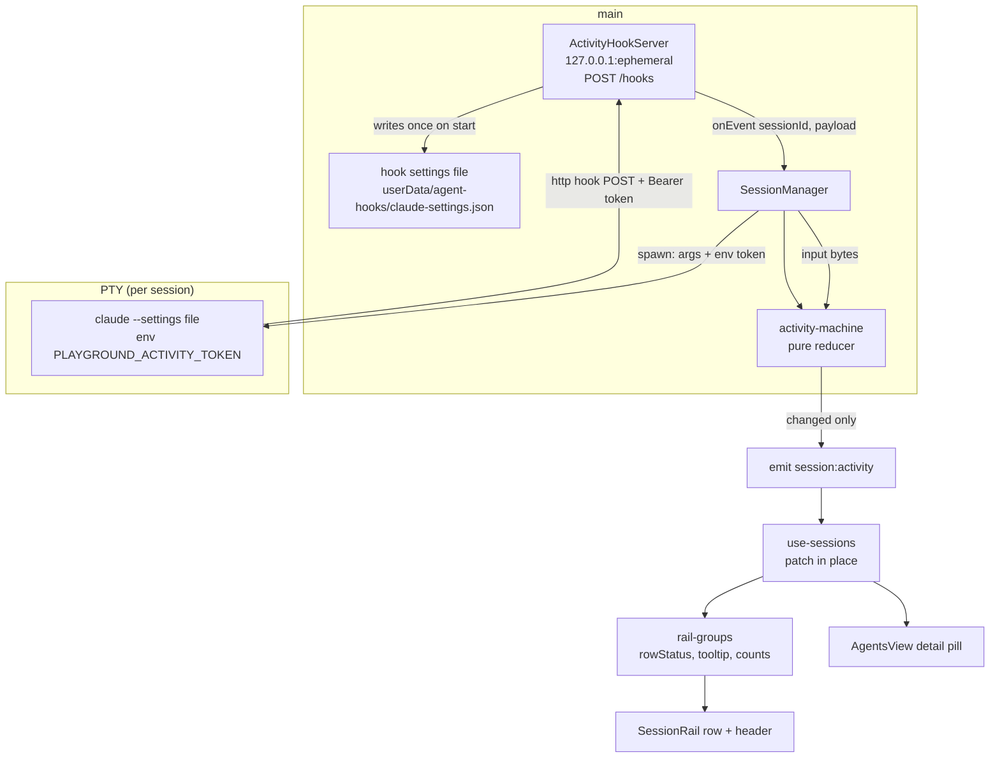

# Session Activity Status Design

**Spec**: `.specs/features/session-activity-status/spec.md`
**Status**: Draft (rev. 2, 2026-09-15) — rebuilt on Claude Code hooks after the owner rejected
screen scraping as too fragile against Claude Code's release cadence. Awaiting approval.

---

## Verdict

Claude Code tells the app what it is doing, and the app never has to guess. For each Claude
session the app appends `--settings <file>` to the launch. That file holds `http` hooks that
POST every relevant lifecycle event to a loopback endpoint in main. A per-session bearer
token, passed through an environment variable, both authenticates and routes each request. A
pure state machine folds the events into an activity (state plus detail), `SessionManager`
emits `session:activity` on change, and the rail renders it. Nothing reads the screen,
nothing is recorded, and no test spends a token.

---

## Rejected Approaches (evidence from rev. 1)

Rev. 1 was built on a headless terminal emulator and was measured against three real Claude
Code recordings. It is kept here only as the reason not to return to it.

| Approach | Why rejected |
| -------- | ------------ |
| Regex over the ring buffer's raw tail | ConPTY forwards a **cell diff**, not the agent's bytes. It sends `ESC[1C` in place of single spaces, so stripped text glues words together (`Accessingworkspace:`). The busy hint is painted once and stays in the tail after it leaves the screen |
| Headless emulator + screen markers (rev. 1 design) | Worked on the recordings, but every marker (`esc to interrupt`, the spinner glyphs, `❯`) is undocumented UI that Claude Code can change in any release. That leaves the owner with a re-recording treadmill and a false `waiting` whenever both busy markers are renamed |
| Terminal title (OSC 0 `✳` / `◐◑`) | Observed in the recordings: `✳` when idle and on a permission prompt, `◐`/`◑` alternating while working. Undocumented, so it has the same fragility as screen markers |
| Foreground child process | node-pty's `WindowsTerminal.process` returns the static terminal name (`node_modules/node-pty/lib/windowsTerminal.js:181-184`). The only introspection, `getConsoleProcessList`, needs a forked helper per call and returns unordered PIDs. The agent is one process in both states, so even perfect data cannot tell thinking from waiting |

---

## Verified Facts This Design Stands On

From the Claude Code docs (`code.claude.com/docs/en/hooks.md`, `settings.md`, fetched
2026-09-15), plus two zero-token launches of the installed CLI (2.1.273).

| Fact | Source |
| ---- | ------ |
| `--settings <file-or-json>` applies above user/project/local settings for one session and writes no file | `settings.md` §Change a setting for one session; CLI `--help` |
| Hook entries **merge** across levels, so the user's own hooks keep running beside ours | `hooks.md`: "Hook entries merge across settings levels rather than replacing each other" |
| `type: "http"` hook: POST of the event JSON; `headers` interpolate env vars listed in `allowedEnvVars` | `hooks.md` §HTTP hook fields |
| A 2xx with an empty body is success with no decision; non-2xx and connection failure are non-blocking errors and execution continues; a timeout cancels the hook | `hooks.md` §HTTP response handling |
| Hooks block Claude until they answer (`async` exists for `command` hooks only), and a timed-out `PreToolUse` does not block the tool | `hooks.md` §Run hooks in the background, §Timeouts |
| Hooks inherit the parent environment | `hooks.md`; **verified**: an env var set by the launcher reached the injected `SessionStart` and `SessionEnd` hooks |
| `PermissionRequest` runs "only when Claude Code is about to ask you for permission", never for a call auto mode approves; `permission_prompt` notifications arrive only after ~6 s | `hooks.md` §PermissionRequest |
| `Stop` "does not run if the stoppage occurred due to a user interrupt"; API errors fire `StopFailure` with `error` ∈ `rate_limit`, `overloaded`, `authentication_failed`, … | `hooks.md` §Stop, §StopFailure |
| `SessionEnd.reason` ∈ `clear`, `resume`, `logout`, `prompt_input_exit`, `other`; `SessionStart.source` ∈ `startup`, `resume`, `clear`, `compact`, `fork` | `hooks.md` §SessionEnd, §SessionStart |
| `PreToolUse`/`PermissionRequest` carry `tool_name`; `SubagentStart`/`SubagentStop` carry `agent_id`; `PreCompact`/`PostCompact` carry `trigger` | `hooks.md` per-event input sections |
| `allowedHttpHookUrls` / `httpHookAllowedEnvVars`, when set anywhere, restrict HTTP hooks; they are lists, so our `--settings` entries merge in. `disableAllHooks` / org `allowManagedHooksOnly` switch ours off | `hooks.md` §Hook locations, `settings-reference.md`. None is set in the owner's user settings (checked) |
| Claude Code enables mouse reporting (`ESC[?1000h`…`ESC[?1003h`), so pointer movement over the terminal arrives as `session:input` bytes | Rev. 1 recordings (the disable sequence `ESC[?1003l` at exit) |

---

## Architecture Overview



Only sessions whose registry command normalizes to `claude` get a token, the `--settings`
argument and the env var. Ad-hoc sessions and other agents get none of it, so ACTV-02 holds by
construction: no injection, no state, and today's rendering.

---

## Code Reuse Analysis

### Existing Components to Leverage

| Component | Location | How to Use |
| --------- | -------- | ---------- |
| `commandKey()` | `src/renderer/src/lib/terminal-keys.ts:72-75` | **Move** to `src/shared/command-key.ts`, export it, and import it from both `terminal-keys.ts` and `SessionManager` |
| Loopback server + bearer-token-as-routing | `src/main/mcp-result-server.ts:60-68, 118-146` (`bearerToken`, `127.0.0.1` ephemeral `listen`, 401 on unknown token, `revoke`) | Same shape for `ActivityHookServer`, but on plain `node:http` because there is no MCP transport. A separate module keeps the two contracts from coupling |
| `buildSpawnPlan` | `src/main/spawn-plan.ts:70-82` | Reused **unchanged**. `SessionManager` passes `{ ...agent, args: [...agent.args, '--settings', path] }`, and the existing per-shell quoting handles a path with spaces |
| `PtyPort.spawn(plan, env?)` | `src/main/pty-port.ts:28-34` | The `env` overrides parameter already exists; the token rides it |
| `SessionManager.#start` / `#finalize` / `input` | `src/main/session-manager.ts:229-262, 198-200` | Mint and revoke the token, feed hook events and keystrokes to the machine, and drop state on finalize |
| `EmitFn` + `IpcEvents` | `session-manager.ts:11`, `src/shared/ipc-contract.ts:131-135` | Add `session:activity` beside `session:status` (AD-004 push channel) |
| `buildRailGroups` / `rowStatus` / `rowActions` / `statusClass` | `src/renderer/src/lib/rail-groups.ts:57-82, 205-218` | `RowStatus` grows by the activity labels; the comment at `:6-7` anticipates exactly this. The tooltip gains the P3 detail |
| Status colour map + `pulse` keyframes | `src/renderer/src/components/SessionRail.css:102-110, 301-315` | Extended with one class per new status; `shell` uses the handoff's `--amber` |
| Detail pill | `src/renderer/src/components/AgentsView.tsx:124, 174-175` | Shows the activity label and detail when present (ACTV-27) |

### Integration Points

| System | Integration Method |
| ------ | ------------------ |
| Claude Code | `claude … --settings <file>`, launched inside the existing pwsh/cmd host. Env `PLAYGROUND_ACTIVITY_TOKEN=<uuid>` |
| App lifecycle | `index.ts` starts `ActivityHookServer` before constructing `SessionManager` and hands it the settings-file path. A session spawned while the server is not listening gets no injection and degrades to ACTV-02 behaviour |
| Renderer | `session:activity` is applied in place (ACTV-07). `list()` also carries `activity`, so a refresh from `session:status` stays consistent |
| Config | None. `activity` lives only on `SessionView`, never on `PersistedSession` (ACTV-09) |

---

## Components

### `command-key` (moved)

- **Purpose**: Normalize an agent command to its bare, lowercased name.
- **Location**: `src/shared/command-key.ts`
- **Interfaces**: `commandKey(command: string): string`. The body is unchanged, and it gets its
  own co-located test.

### `claude-hook-settings`

- **Purpose**: Build the `--settings` JSON that wires every consumed event to the endpoint.
  It is pure.
- **Location**: `src/main/claude-hook-settings.ts`
- **Interfaces**:
  - `HOOKED_EVENTS`: the event names in the Transition Table (`SessionStart`,
    `UserPromptSubmit`, `PreToolUse`, `PostToolUse`, `PostToolUseFailure`, `PermissionRequest`,
    `Notification`, `Elicitation`, `ElicitationResult`, `Stop`, `StopFailure`, `PreCompact`,
    `PostCompact`, `SubagentStart`, `SubagentStop`, `SessionEnd`)
  - `ACTIVITY_TOKEN_ENV = 'PLAYGROUND_ACTIVITY_TOKEN'`
  - `buildClaudeHookSettings(url: string): object` returns
    `{ hooks: { <Event>: [{ hooks: [{ type: 'http', url, timeout: 5, headers: { Authorization: 'Bearer $PLAYGROUND_ACTIVITY_TOKEN' }, allowedEnvVars: ['PLAYGROUND_ACTIVITY_TOKEN'] }] }] }, allowedHttpHookUrls: [url], httpHookAllowedEnvVars: ['PLAYGROUND_ACTIVITY_TOKEN'] }`.
    There are no matchers, so every occurrence of each event is sent. The two allowlist keys
    are lists and merge, which keeps ours working if the user ever sets them.
- **Covers**: ACTV-01, ACTV-11 (timeout 5), and the header/allowlist parts of ACTV-04.

### `ActivityHookServer`

- **Purpose**: Receive hook POSTs, authenticate them, hand them off, and answer immediately
  with no decision.
- **Location**: `src/main/activity-hook-server.ts`
- **Interfaces**:
  - `start(): Promise<{ url: string }>` listens on `127.0.0.1`, ephemeral port; the url ends in `/hooks`
  - `register(token: string, sessionId: string): void` and `revoke(token: string): void`
  - `onEvent(cb: (sessionId: string, payload: Record<string, unknown>) => void): void`
  - `stop(): Promise<void>`
- **Rules**:
  - A known token with a JSON-object body gets `204` (a 2xx with an empty body) and a dispatch.
  - A missing or unknown token gets `401` and no dispatch (ACTV-04, ACTV-32).
  - A non-object or unparseable body gets `204` with no dispatch plus one `console.warn` per
    token. Claude's view stays "success", and the log explains the gap.
  - The body is capped at 8 MB. `PostToolUse` carries `tool_response`, which can be large; past
    the cap the request is drained and answered `204` with no dispatch.
  - **Never** writes a JSON body (ACTV-10), so a hook cannot allow, deny or block anything.
- **Dependencies**: `node:http` only.

### `activity-machine`

- **Purpose**: Fold hook events and keystrokes into a session's activity. It is pure and holds
  the whole Transition Table.
- **Location**: `src/main/activity-machine.ts`
- **Interfaces**:
  - `interface MachineState { view: SessionActivity; subagentIds: string[]; beforeCompact?: ActivityState }`
  - `applyHookEvent(state: MachineState | null, payload: Record<string, unknown>): MachineState | null`
    reads `hook_event_name` and the discriminators (`source`, `notification_type`, `reason`,
    `tool_name`, `agent_id`, `error`). Unknown events and unknown notification types return the
    input unchanged. The state is `null` until the first event that sets one (ACTV-13).
  - `applyKeystroke(state: MachineState | null): MachineState | null` moves `needs-approval` or
    `needs-input` to `working` and leaves every other state alone (ACTV-12).
  - `sameView(a, b): boolean`, the equality behind ACTV-06.
- **Why pure**: the table is the product. Every row is one unit test fed a payload copied from
  the documentation's examples, so the tests cost no tokens and need no Claude.

### `keystroke`

- **Purpose**: Decide whether `session:input` bytes are the user typing.
- **Location**: `src/main/keystroke.ts`
- **Interfaces**: `isKeystroke(data: string): boolean` returns false when the data consists
  **only** of terminal mouse reports (SGR `ESC[<b;x;yM`/`m`, X10 `ESC[M` + 3 bytes, urxvt
  `ESC[b;x;yM`) and/or focus reports (`ESC[I`, `ESC[O`), and true otherwise (ACTV-33).

### `SessionManager` (grown)

- `SessionManagerDeps` gains `hooks: { settingsPath: string | null; register(token, id): void; revoke(token): void }`.
  `settingsPath === null` means the server is not up, so no injection happens.
- `RunningSession` gains `token: string | null` and `activity: MachineState | null`.
- `#start` injects when `commandKey(agent.command) === 'claude'` and `settingsPath` is set: it
  mints a `randomUUID()` token, registers it, appends `--settings <path>` to the agent args, and
  passes `{ PLAYGROUND_ACTIVITY_TOKEN: token }` as spawn env. The decision is made from the agent
  as it is at start (ACTV-30); a respawn goes through `#start` again and gets a fresh token
  (ACTV-13).
- `handleHookEvent(sessionId, payload)` is called by the server callback. It ignores ids that
  are not running (ACTV-32), applies `applyHookEvent`, and emits
  `session:activity { id, activity: view | null }` only when `!sameView` (ACTV-05, ACTV-06).
- `input(id, data)` keeps writing to the PTY and, when `isKeystroke(data)`, also applies
  `applyKeystroke` and emits on change.
- `#finalize` revokes the token and drops the activity before emitting `stopped` (ACTV-08,
  ACTV-31).
- `#toView` adds `activity` for a running session with a non-null view.

### `ActivityHookServer` wiring (`index.ts`)

- On app ready: `const { url } = await hookServer.start()`, then write
  `buildClaudeHookSettings(url)` to `app.getPath('userData')/agent-hooks/claude-settings.json`.
  The file is rewritten on every launch because the port changes.
- Construct `SessionManager` with `hooks: { settingsPath, register, revoke }` and
  `hookServer.onEvent(sessionManager.handleHookEvent)`. The server stops on
  `window-all-closed`.
- This is hand-verified per `TESTING.md` (thin wiring).

### Renderer

- `use-sessions.ts`: subscribes to `session:activity` and runs
  `setSessions(prev => prev.map(s => s.id === id ? withActivity(s, activity) : s))`. It does not
  call `refreshSessions` (ACTV-07).
- `rail-groups.ts`:
  - `RowStatus` becomes `'working' | 'compacting' | 'waiting' | 'approval' | 'input' | 'error' | 'shell' | 'running' | 'path missing' | 'stopped'`.
  - `rowStatus` maps a running session's activity to its label and returns `'running'` when
    there is no activity (ACTV-19). Every running label gets `['stop']`.
  - The tooltip appends the P3 detail: ` · <tool>`, ` · N subagent(s)`, ` · <error>`
    (ACTV-24..26). This extends RAIL-15's format, and the existing RAIL-15 assertions keep
    passing for sessions with no activity.
  - New `headerCounts(sessions): { running; working; needYou }` (ACTV-22, ACTV-23).
  - Status still never sorts rows, so RAIL-04/05 hold.
- `SessionRail.tsx`: the status slot renders the loader for `working`/`compacting` and a dot for
  every other label. The label element gets `aria-label` (ACTV-21). The header reads
  `N running`, then ` · M working` when M > 0, then ` · K need you` when K > 0.
- `AgentsView.tsx`: the pill shows the activity label plus detail when present, and today's
  `running`/`stopped` otherwise (ACTV-27).
- `Icon.tsx`: new `loader` glyph (circle arc).
- `SessionRail.css`: `@keyframes spin` and one colour class per label (table below), plus
  `@media (prefers-reduced-motion: reduce) { .rail-row-loader { animation: none } }`
  (ACTV-20). This is the app's first reduced-motion rule. Its scope is the loader, as the AC
  asks.

| Label | Indicator | Token | Rationale |
| ----- | --------- | ----- | --------- |
| `working`, `compacting` | spinning loader | `--green` | The old `running`, made precise, keeps its colour |
| `waiting` | steady dot | `--blue` | Your turn, not urgent |
| `approval`, `input` | steady dot + 3px halo | `--pink` | Blocked on you, the most urgent. Must differ from `shell`'s handoff amber |
| `error` | steady dot | `--red` | Turn failed |
| `shell` | steady dot | `--amber` | Handoff (`DESIGN_HANDOFF_AGENTS_RAIL_V2.md:31,109`) |
| `running` (no activity), `stopped`, `path missing` | unchanged | unchanged | ACTV-19 |

---

## Data Models

```typescript
// src/shared/config.ts
export type ActivityState =
  | 'working' | 'waiting' | 'needs-approval' | 'needs-input' | 'error' | 'compacting' | 'exited'

export interface SessionActivity {
  state: ActivityState
  /** Tool currently running (PreToolUse → Post*) or awaiting approval. */
  tool?: string
  /** Active subagents (SubagentStart − SubagentStop, by agent_id). */
  subagents: number
  /** StopFailure `error` type, present only in `error`. */
  error?: string
}

export interface SessionView extends PersistedSession {
  pathMissing: boolean
  lastOutput?: string
  /** Derived in main from Claude Code hooks; absent for ad-hoc and non-Claude sessions,
   *  stopped sessions, and before the first hook event. Never persisted. */
  activity?: SessionActivity
}

// src/shared/ipc-contract.ts — IpcEvents
'session:activity': { id: string; activity: SessionActivity | null }
```

`PersistedSession` is untouched, so ACTV-09 holds by type.

---

## Error Handling Strategy

| Error Scenario | Handling | User Impact |
| -------------- | -------- | ----------- |
| Hook server fails to bind | `settingsPath` stays `null`; sessions launch without injection; one `console.error` | Rows show `running` as today |
| App busy or wedged when a hook fires | The hook's 5 s timeout cancels it; Claude continues | At most a 5 s pause on that event, never a hang |
| Unknown or revoked token (late POST after stop) | `401`, no dispatch | None |
| Malformed or oversized body | `204`, no dispatch, one warning per token | That event is missed; the next event corrects the state |
| Hooks disabled by user or org policy, or `--bare` in the agent's args | No events arrive | Row stays `running` (ACTV-29) |
| Esc interrupt | No event (documented) | Stale `working` until the next prompt, or `waiting` after `idle_prompt` (~60 s) (ACTV-28) |
| Agent dies without `SessionEnd` | Last state kept | Stale until stop/respawn (ACTV-35) |

---

## Risks & Concerns

| Concern | Location (file:line) | Impact | Mitigation |
| ------- | -------------------- | ------ | ---------- |
| Hooks are synchronous, so every `PreToolUse`/`PostToolUse` waits on our reply | `activity-hook-server.ts` (new) | Latency added to each tool call | The handler parses, dispatches synchronously and answers before any I/O. The loopback round trip is milliseconds. The 5 s timeout caps the worst case, and a timed-out `PreToolUse` does not block the tool (documented) |
| Returning JSON could make a decision for the user (auto-approve a permission) | `activity-hook-server.ts` (new) | Security: the app would silently grant permissions | The server has no code path that writes a body. ACTV-10 is asserted by a test that inspects every response (status 2xx, zero-length body) |
| A loopback port is reachable by any local process | `activity-hook-server.ts` (new) | A local process could forge state | It needs a live 122-bit session token, and the endpoint only changes display state; it cannot act on the agent. This is the same posture as the workflows `emit_result` server (AD-008) |
| The token env var leaks to children the agent spawns | `pty-port.ts:32` | A nested `claude` inside a tool inherits the token but not `--settings`, so it sends nothing. Anything else that reads it can only forge display state | Accepted. Documented in AD-019 |
| The user runs `claude` again by hand in the same PTY after `/exit` | `session-manager.ts` | The new process has no `--settings` and sends nothing; the row keeps `shell` | Accepted edge; respawn restores full state |
| The user's agent args already contain `--settings` | `session-manager.ts` #start | Two `--settings` flags; precedence between them is undocumented | Detected with `args.includes('--settings')`: skip injection and log once, so the row degrades to `running` |
| The hook schema evolves | `activity-machine.ts` (new) | A renamed field or event would stop one transition | The API is documented and versioned. Unknown events and types are ignored, never throwing. The owner-run smoke re-checks the live payloads in one command |
| RAIL-15 tooltip format extended | `rail-groups.ts:215` | Existing tooltip assertions | Detail is appended only when activity exists, so every existing assertion holds unchanged |
| Lesson L-005 (parallel-load timeouts) | `vitest.config.ts` | Real-loopback server tests add load | They are few, fast and in-process, with no git and no child process |

---

## Tech Decisions

| Decision | Choice | Rationale |
| -------- | ------ | --------- |
| Signal source | Documented Claude Code hooks | Owner decision after the rev. 1 fragility review |
| Hook type | `http` | No process per event (a `command` hook on Windows spawns Git Bash every time); documented non-blocking failure modes |
| Injection | `--settings <file>`, regenerated per app launch | One session only; writes nothing of the user's; merges with the user's hooks |
| Identity | Per-session token in an env var → `Authorization` header | Hooks inherit env (verified). The token is auth and routing at once, as AD-008 does it |
| Leaving `needs approval` | Next real keystroke to that session | The only signal that exists between `PermissionRequest` and the approved tool's `PostToolUse` |
| Row label vs detail | Row shows the state; tool, subagents and error go in the tooltip and detail pane | Owner decision: per-tool labels flicker |
| Test data | Payloads copied from the documentation's examples | Zero tokens, no Claude in CI; the owner smoke checks them against the live CLI |

---

## Tasks Outline (for the Tasks phase)

This is a Large feature, estimated at 11 tasks, so it will carry a sub-agent offer.

1. Move `commandKey` to `src/shared/command-key.ts` + test.
2. Shared types: `ActivityState`, `SessionActivity`, `SessionView.activity`, `session:activity`.
3. `activity-machine` + table tests (every Transition Table row, ACTV-03/06/12/13, edges 33–34).
4. `keystroke` + tests (mouse SGR/X10/urxvt, focus, mixed data, plain keys).
5. `claude-hook-settings` + tests (shape, timeout ≤ 5, allowlists, env header).
6. `ActivityHookServer` + real-loopback tests (204 + empty body, 401, malformed, oversized, revoke).
7. `SessionManager` injection, token lifecycle, event/keystroke routing + tests (fake port and fake hooks).
8. `index.ts` wiring: server start, settings file, `onEvent`, stop on quit. Hand-verified.
9. Renderer model: `use-sessions` in-place patch; `rail-groups` status, tooltip and `headerCounts` + tests.
10. Renderer view: `SessionRail`, `AgentsView` pill, `Icon`, CSS (P2/P3). Hand-verified.
11. Owner-run smoke `scripts/smoke-activity.mjs`: one real Claude session and **one** trivial
    prompt that needs approval, driving waiting → working → approval → working → waiting →
    shell and logging every live hook payload next to the documented shape. It is the only
    token spend in the feature.
