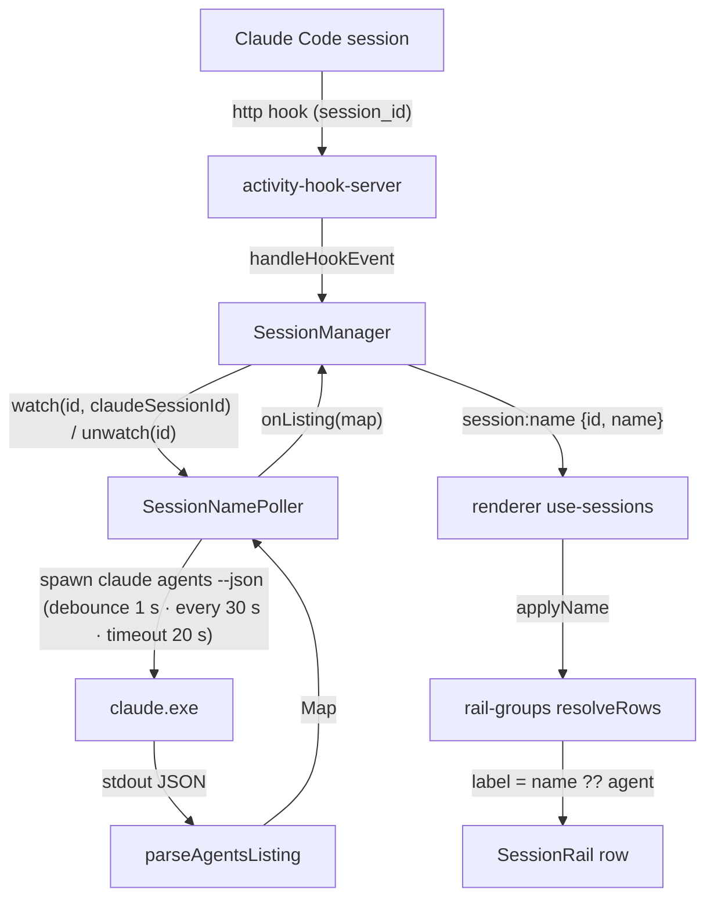

# Session Name Design

**Spec**: `.specs/features/session-name/spec.md`
**Context**: `.specs/features/session-name/context.md`
**Status**: Draft

---

## Architecture Overview

Approach A (owner-confirmed 2026-09-18): a **name poller** in main owns the calls to the
documented listing and hands a `Map<claudeSessionId, name>` to the `SessionManager`, which is
the only writer of per-session state and the only emitter to the renderer. The manager learns each
session's Claude `session_id` from the hook payloads it already receives (AD-019 plumbing) and
tells the poller which ids to watch. The renderer applies `session:name` in place, exactly as it
applies `session:activity`, and the rail derives the row label from the name when there is one.



Two things never happen: the renderer never spawns anything, and the poller never touches a
session — it only reports what the listing said.

---

## Code Reuse Analysis

### Existing Components to Leverage

| Component | Location | How to Use |
| --------- | -------- | ---------- |
| `AgentSpawn` / `AgentChild` seam + `spawnAgent` real impl | `src/main/agent-step-runner.ts:60-73`, `src/main/index.ts:93-107` | The poller takes an `AgentSpawn`; production passes the same `spawnAgent` (`shell:false`, stdin ignored, `windowsHide`) — AD-007 direct spawn, no new process code |
| `resolveClaude` | `src/main/index.ts:323-337` | Locates the binary (`where claude`, then `agent.claudePath`). Passed to the poller as `resolveBin`; the poller caches the result (see Risks) |
| `handleHookEvent` + `ActivityHooks` dep pattern | `src/main/session-manager.ts:29-37, 232-236` | The payload already reaches the manager per app session; `names?: SessionNames` joins `hooks?: ActivityHooks` as an optional dep — absent means no names, pre-feature rendering |
| `#setActivity` change-only emit | `src/main/session-manager.ts:340-346` | `#setName` mirrors it: emit only when the value changed |
| `#finalize` cleanup | `src/main/session-manager.ts:321-336` | Clears the name and unwatches, next to the token revoke |
| `session:activity` event + `applyActivity` | `src/shared/ipc-contract.ts:138`, `src/renderer/src/lib/session-activity.ts`, `use-sessions.ts:51-53` | `session:name` + `applyName` follow the same shape and the same subscription block |
| `resolveRows` RAIL-13 numbering | `src/renderer/src/lib/rail-groups.ts:257-280` | Count and number by a `rowLabel(session)` instead of `session.agent` |
| `commandKey` | `src/shared/command-key.ts` | Already decides hookability; nothing new — a session without a token never gets a `session_id` |
| Fake-deps test style (`fakePort`, `ConfigStore` in a tmp dir, `EmitFn` recorder) | `src/main/session-manager.test.ts:1-70` | Manager tests add a `FakeNames` recorder; poller tests use a fake `AgentSpawn` and `vi.useFakeTimers()` |

### Integration Points

| System | Integration Method |
| ------ | ------------------ |
| Hook server → manager | Unchanged. The manager reads `payload.session_id` (string) inside `handleHookEvent` |
| Manager → poller | `SessionNames` interface: `watch(id, claudeSessionId)`, `unwatch(id)`, `nudge(id)`; the poller calls back with `onListing(map)` |
| Main → renderer | New `IpcEvents['session:name']`; `SessionView.name?: string` |
| App lifecycle | `poller.dispose()` in `window-all-closed` next to `sessionManager.killAll()` (SNAME-14) |
| Rail v2 spec | RAIL-12/13 amended in `.specs/features/agents-rail-v2/spec.md` (label may be the session name) — the AD-018 precedent |

---

## Components

### `parseAgentsListing` (pure)

- **Purpose**: Turn the listing's stdout into `Map<sessionId, name>` without trusting its shape (SNAME-13).
- **Location**: `src/main/agents-listing.ts`
- **Interfaces**:
  - `parseAgentsListing(stdout: string): Map<string, string> | null` — `null` when stdout is not a JSON array; otherwise one entry per element whose `sessionId` is a non-empty string and whose trimmed `name` is a non-empty string; the **first** such entry per `sessionId` wins (edge case: duplicate ids); every other field is ignored.
- **Dependencies**: none.
- **Reuses**: nothing — 20 lines, fully unit-tested (empty array, non-array, missing/non-string fields, whitespace name, duplicates, extra fields).

### `SessionNamePoller`

- **Purpose**: Decide *when* to call the listing, run it with a timeout, and report the parsed map (SNAME-09..12, SNAME-14).
- **Location**: `src/main/session-name-poller.ts`
- **Interfaces**:
  - `constructor(deps: { spawn: AgentSpawn; resolveBin: () => string; cwd: string; env: NodeJS.ProcessEnv; log: (msg: string) => void; timers?: { setTimeout; clearTimeout; setInterval; clearInterval }; debounceMs?: 1000; intervalMs?: 30000; timeoutMs?: 20000 })`
  - `watch(id: string, claudeSessionId: string): void` — records the pair; a first `watch` for an `id` schedules a debounced call; the first watched id starts the 30 s interval.
  - `nudge(id: string): void` — a hook event for a watched session that still has no name; schedules a debounced call.
  - `unwatch(id: string): void` — forgets the id; when none remain, stops the interval and cancels any pending debounce (SNAME-10).
  - `onListing(listener: (names: Map<string, string>) => void): void` — called once per **successful** call with the full parsed map (the manager does the per-session matching).
  - `dispose(): void` — unwatches everything, kills an in-flight child, and guarantees no listener fires afterwards (SNAME-14).
- **Behaviour**:
  - One call at a time: a tick or a nudge that lands while a child is running sets a `pendingRerun` flag instead of overlapping; when the child closes, a rerun is scheduled if the flag is set (edge case "skip the tick" — refined to "coalesce", so a rename during a slow call is not lost for 30 s).
  - A call = `resolveBin()` (cached after the first success; the cache is dropped on a spawn error so a moved binary is re-resolved next time) → `spawn(bin, ['agents', '--json'], { cwd, env })` → collect stdout → on `close`: code `0` and `parseAgentsListing(stdout) !== null` → `onListing(map)` and, if a failure streak was open, `log('[session-name] listing recovered')`; anything else → failure.
  - Failure: keep silent to listeners; `log` once with the reason (`spawn ENOENT` / `exit <code>` / `timeout` / `not a JSON array`, plus the first 200 chars of stderr) and open the streak; later failures in the same streak do not log (SNAME-12).
  - Timeout: `timeoutMs` after spawn → `child.kill()`, counted as a failure.
  - `resolveBin` throwing counts as a failure (no spawn), same log rule.
- **Dependencies**: injected spawn, resolver, timers, log.
- **Reuses**: `AgentSpawn`/`AgentChild` types; `spawnAgent` and `resolveClaude` in production.

### `SessionManager` (extended)

- **Purpose**: Own the per-session `claudeSessionId` and `name`, match listings to sessions, emit on change, clear on stop (SNAME-01..04 data side, SNAME-08, SNAME-11, SNAME-15).
- **Location**: `src/main/session-manager.ts`
- **Interfaces** (additions):
  - `SessionManagerDeps.names?: SessionNames` where `interface SessionNames { watch(id: string, claudeSessionId: string): void; unwatch(id: string): void; nudge(id: string): void }`.
  - `handleHookEvent(sessionId, payload)`: after folding activity, `const claudeId = payload.session_id; if (typeof claudeId === 'string' && claudeId !== '')` → if it differs from `session.claudeSessionId`, store it and `names.watch(id, claudeId)` (covers first event and `/clear`/`/resume` id changes — SNAME-08/09, edge case); else if `session.name === null` → `names.nudge(id)` (SNAME-09).
  - `applyNames(names: Map<string, string>): void` — for every running session with a `claudeSessionId`: `next = names.get(claudeSessionId) ?? null`; `#setName(session, next)` (SNAME-11). Sessions without a `claudeSessionId` are skipped.
  - `#setName(session, next: string | null)`: no-op when equal; otherwise store and `emit('session:name', { id, name: next })`.
  - `#finalize`: `session.name = null; session.claudeSessionId = null; names?.unwatch(id)` next to the token revoke (SNAME-04). No emit needed: the row falls back through `session:status` → refetch, and `#toView` of a stopped session carries no name.
  - `#toView`: adds `name` when the running session has one (`SessionView.name`).
- **Reuses**: `#setActivity` shape; `RunningSession` gains `claudeSessionId: string | null` and `name: string | null` (both `null` at `#start`).

### Renderer: `applyName`, `rowLabel`, `use-sessions`

- **Purpose**: Apply the push in place and render the label (SNAME-01..03, SNAME-05..07).
- **Location**: `src/renderer/src/lib/session-name.ts` (new, pure), `src/renderer/src/lib/rail-groups.ts`, `src/renderer/src/lib/use-sessions.ts`
- **Interfaces**:
  - `applyName(sessions: SessionView[], id: string, name: string | null): SessionView[]` — returns the same array when nothing changes (referential stability, like `applyActivity`); sets or deletes `name` on the one session.
  - `rowLabel(session: SessionView): string` — `session.name ?? session.agent`. `resolveRows` counts and numbers by `rowLabel` (SNAME-06); tooltip becomes `` `${session.name ? `${session.agent} · ${session.name}` : session.title} · ${branchOrCwd}${activityDetail}` `` (SNAME-05 — the row's `title` attribute and the action buttons' `aria-label`, which already interpolate `row.label`, follow).
  - `use-sessions.ts`: `api.on('session:name', ({ id, name }) => setSessions((prev) => applyName(prev, id, name)))` in the existing effect, unsubscribed with the others (SNAME-02).
- **Dependencies**: `SessionView.name`.
- **Reuses**: `applyActivity` pattern; `SessionRail.tsx` is untouched (it renders `row.label`/`row.tooltip`; the tile keeps `row.session.agent`).

### Wiring (`src/main/index.ts`)

```ts
const namePoller = new SessionNamePoller({
  spawn: spawnAgent,
  resolveBin: resolveClaude,
  cwd: app.getPath('userData'),
  env: scrubAuthEnv(process.env),   // same env posture as the headless runner
  log: (msg) => console.error(msg)
})
sessionManager = new SessionManager({ ..., hooks: activityHooks, names: namePoller })
namePoller.onListing((names) => sessions.applyNames(names))
// window-all-closed: namePoller.dispose() next to sessionManager?.killAll()
```

`cwd` is `userData` only because `spawn` needs one; the listing is machine-wide.

---

## Data Models

### Shared (`src/shared/config.ts`, `src/shared/ipc-contract.ts`)

```ts
export interface SessionView extends PersistedSession {
  pathMissing: boolean
  lastOutput?: string
  activity?: SessionActivity
  /** The name Claude Code gives this session, read from `claude agents --json`
   *  and matched by the `session_id` its hooks report. Absent until the first
   *  successful listing after the first hook event, for ad-hoc and non-Claude
   *  sessions, and for stopped sessions. Never persisted (SNAME-15). */
  name?: string
}

export interface IpcEvents {
  // …
  /** The agent's own session name changed; `null` clears it back to the agent
   *  display name (SNAME-02, SNAME-04). */
  'session:name': { id: string; name: string | null }
}
```

`PersistedSession` is unchanged — the guard is a test asserting `config.json` never carries a
`name` after `applyNames` (SNAME-15).

### Main-only

```ts
interface RunningSession {
  // …
  /** Claude's `session_id`, from the latest hook payload; `null` until one arrives. */
  claudeSessionId: string | null
  /** Last name the listing reported for `claudeSessionId`; `null` when none. */
  name: string | null
}

export interface SessionNames {
  watch(id: string, claudeSessionId: string): void
  unwatch(id: string): void
  nudge(id: string): void
}
```

---

## Error Handling Strategy

| Error Scenario | Handling | User Impact |
| -------------- | -------- | ----------- |
| `claude` not resolvable (`resolveClaude` throws) | Failure streak, one log line; retried each tick; cache never populated | Rows keep the agent name — same as today |
| Spawn error (`ENOENT`, `EACCES`) | Failure; resolver cache dropped so the next call re-resolves | Same as above |
| Non-zero exit / stderr only | Failure; stderr head in the single log line | Names already shown stay |
| Hung binary | Killed at 20 s; failure | Names stay; next tick retries |
| stdout not a JSON array (banner, partial write) | Failure (`not a JSON array`) | Names stay |
| Entry missing `sessionId`/`name`, wrong types, whitespace name | Entry skipped; the session is treated as unnamed in this listing | That row shows the agent name |
| Known `session_id` absent from a **successful** listing | Name cleared (`session:name` with `null`) | Row returns to the agent name — Claude is no longer live in that PTY |
| `/clear` / `/resume` mid-session | Old id vanishes (cleared on next listing); the next hook event brings the new id → `watch` → debounced call | Up to 1 s + one call after the next turn; unnamed meanwhile |
| App quit during a call | `dispose()` kills the child; listeners never fire | None |
| Listener throws | The poller does not catch: `applyNames` is total (Map lookups and emits) and a throw would be a bug worth seeing | — |

---

## Risks & Concerns

| Concern | Location (file:line) | Impact | Mitigation |
| ------- | -------------------- | ------ | ---------- |
| `resolveClaude` runs `execFileSync('where', …)` — a synchronous process spawn on the main thread — every time it is called | `src/main/index.ts:323-337` | A 30 s poll would block main ~50–150 ms per tick; the workflows runner only pays it per step | The poller caches the resolved path after the first successful call and drops the cache only on a spawn error |
| `where claude` returns the first PATH hit, which may differ from the registry agent's `command` (a full path, a different install) | `src/main/index.ts:325` | Listing from one install while sessions run on another → no entries match → rows unnamed | Accepted for v1 (the same resolver already drives workflow steps); the failure mode is "no name", never a wrong name. Logged in the design, not a task |
| Hook payloads are `Record<string, unknown>`; nothing validates `session_id` | `src/main/session-manager.ts:232-236`, `src/main/activity-hook-server.ts:116` | A malformed payload could store a non-string id | `handleHookEvent` accepts only a non-empty string; anything else is ignored (unit-tested) |
| Real-process/git suites already sit near the per-test timeout (L-005) | `src/main/worktree-manager.test.ts`, `dir-remover.test.ts` | Adding a real spawn would push the parallel suite over | No real spawn anywhere in this feature's tests: fake `AgentSpawn`, `vi.useFakeTimers()`. The Verifier's smoke is owner-run, off the suite |
| `resolveRows` tooltip already concatenates `title · branch · activity`; adding the name lengthens it | `src/renderer/src/lib/rail-groups.ts:275` | Tooltip verbosity | The name **replaces** the `title` segment when present (`agent · name`), so the tooltip does not grow |
| Coupling the listing cadence to hook events means a user-launched agent with its own `--settings` (not hookable, ACTV rule) never gets a name | `src/main/session-manager.ts:308-315` | Silent no-name for that agent | Documented degrade (spec Out of Scope); consistent with activity |
| Test gap: `index.ts` wiring is hand-verified by convention (no unit tests) | `src/main/index.ts` | A missed `dispose()` or `onListing` hookup would ship green | Tasks include a dev hand-check with the CDP smoke pattern (`memory: playground-smoke-via-cdp`) and the owner smoke in validation |

---

## Tech Decisions (only non-obvious ones)

| Decision | Choice | Rationale |
| -------- | ------ | --------- |
| Who matches listing entries to sessions | The manager (`applyNames`), not the poller | The poller would need the id→session map the manager already owns; the manager is the single writer of session state |
| Overlapping calls | Coalesce (one in flight + a rerun flag) rather than skip | A `/rename` during a slow call would otherwise wait a full interval; costs one boolean |
| Clearing on absence | Only after a **successful** listing | Failure must never remove a name (SNAME-12); a successful listing is the source of truth for "live" |
| Resolver cache | Cached after first success, invalidated on spawn error | Turns a per-tick synchronous `where` into a one-off; a moved binary heals on the next call |
| `env` for the child | `scrubAuthEnv(process.env)` | Same posture as the headless runner; the listing needs no auth vars |
| Where numbering applies | To the rendered label (`name ?? agent`) | RAIL-13's purpose is unique labels within a group; the label is what the user reads |
| No `session:name` on stop | Rely on the existing `session:status` refetch | `#toView` omits `name` for stopped sessions, so the refetch already clears it; one fewer event to reason about |
| Decision number | **AD-040** in `STATE.md` | `AD-021` is claimed by two open branches (`time-tracking` #93, `terminal-links`); a third claimant would only add to the renumbering |

> **Project-level decision recorded:** AD-040 — *A session's name comes from `claude agents --json`, matched by the hook-reported `session_id`; the terminal title and the transcript are not sources* — appended to `.specs/STATE.md`.
