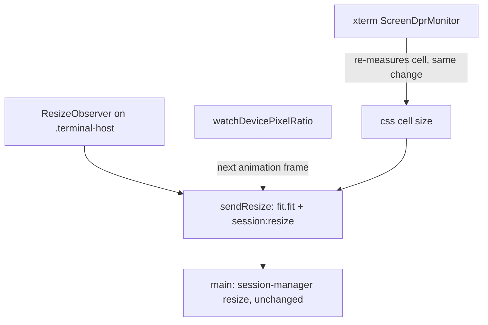

# Terminal Last Row Design

**Spec**: `.specs/features/terminal-last-row/spec.md` (TROW-01..11)
**Status**: Approved (owner, 2026-10-01)

---

## Verdict

1. **Measure first.** T1 builds the smoke in report mode and runs it on the current build. It must reproduce the predicted model below at every probe. If it does not, the plan stops and goes back to the owner before any fix.
2. **Split the padding by axis.** `.terminal-pane` stays the outer element and keeps the copy chip and every mouse and drop listener. Its padding becomes `8px 0`. A new `.terminal-host` inside it is what `term.open` and the ResizeObserver get. The host is `border-box` with `padding: 0 10px` and no vertical padding. The fit addon then reads the height that is really there, so rows are exact. It also reads the same width as today, so columns do not change (owner decision 2026-10-01: keep today's columns).
3. **Refit on a display scale change.** A pure helper watches a `matchMedia` resolution query and re-arms it with the new ratio after each change. The pane refits on the next animation frame, after xterm's own re-measure, and sends `session:resize`.
4. **Prove it in the real app.** `scripts/smoke-terminal-rows.mjs` sweeps heights and display scales over CDP. Every check is seen failing on a broken build first: the current build for the rows checks, the post-split build for the scale checks, and scripted mutants after each fix.

Main, preload and the IPC contract do not change.

---

## Renderer Amendment (2026-10-03, owner: measure on WebGL)

The plan was written against the DOM renderer. Before Execute, `origin/main` (PERF-04, merged with #157) loads `@xterm/addon-webgl` after `term.open` (`TerminalPane.tsx`, `attachGpuRenderer`), with the DOM renderer as the fallback. The fix does not change; the smoke's way of reading the terminal does.

| Fact | Evidence |
| ---- | -------- |
| Under WebGL there is no `.xterm-rows`; `.xterm-screen` holds the link-layer canvas and one unclassed WebGL canvas, both styled to the CSS canvas size | Spike on the dev app, 2026-10-03 |
| WebGL cell: device height `ceil(charH × dpr)`, device width `floor(charW × dpr)`; CSS canvas `round(rows × device height / dpr)` by `round(cols × device width / dpr)`, set on `.xterm-screen` style | `node_modules/@xterm/addon-webgl/src/WebglRenderer.ts:566-607`, `:191-192` |
| The DOM renderer's height is the same (`ceil(charH × dpr)`); its width is not floored (`charW × dpr`), so **columns depend on the renderer** and the column baseline must be taken on WebGL | `DomRenderer.ts:114-127` |
| xterm measures the char with `OffscreenCanvas.measureText('W')` at `${fontSize}px ${fontFamily}`, height = `fontBoundingBoxAscent + fontBoundingBoxDescent` | `node_modules/@xterm/xterm/src/browser/services/CharSizeService.ts:104-125` |
| The spike read charW 7.617, charH 15 at DPR 1.5: device cell 11 × 23, canvas 1353 × 782 = 123 cols × 34 rows exactly; pane content height 514.7 px, so 33 rows fit and the terminal had 34 | Spike, 2026-10-03 |

**What the smoke reads instead** (replaces the DOM reads in §`scripts/smoke-terminal-rows.mjs`):

- `h`, `w`: the page measures `'W'` with an `OffscreenCanvas` at the pane's font (`13px 'Cascadia Mono', Consolas, 'JetBrains Mono', monospace`, pinned as a literal), then `h = ceil(charH × dpr) / dpr` and `w = floor(charW × dpr) / dpr`.
- `rows` = round(`.xterm-screen` style height / h), `cols` = round(style width / w).
- New guard, at every probe: the renderer is WebGL (no `.xterm-rows`, a WebGL canvas present), and the screen's style height and width equal `round(rows × h)` and `round(cols × w)` exactly. A wrong cell model, a font change or a DOM fallback fails it.
- `lastBottom` = screen top + rows × h; `lastRight` = screen left + cols × w.
- `ptyRows`, `ptyCols`: the last `ROWS=<n> COLS=<m>` in the session's `session:data` stream, captured in the page from before the session is selected. The canvas text cannot be read from the DOM, so the "last DOM row contains the marker" check goes; TROW-05 rests on `ptyRows` equalling the rows that fit and `ptyCols` equalling `cols`, with the last row's bottom inside the visible box (TROW-03).
- Each DPR sweep starts with one discarded warm-up probe at another height, so the first kept probe does not depend on the order of xterm's re-measure and the observer.

Spec ACs, mutants and stop rule are unchanged. The `cols` baseline is recorded on WebGL.

---

## Verified Facts This Design Stands On

| Fact | Evidence |
| ---- | -------- |
| The terminal opens into the padded element: `term.open(container)` on `<div ref={containerRef} className="terminal-pane" />`, then `fit.fit()` | `src/renderer/src/components/TerminalPane.tsx:171-172`, `:593` |
| `.terminal-pane` is `padding: 8px 10px; box-sizing: border-box; overflow: hidden; position: relative; height: 100%` | `src/renderer/src/components/TerminalPane.css:4-14` |
| In the Agents view it is a flex child: `.agents-detail .terminal-pane { flex: 1; min-height: 0 }` inside the `.agents-detail` column | `src/renderer/src/components/AgentsView.css:10-16`, `:267-270` |
| The fit reads `getComputedStyle(term.element.parentElement).height` (padding included under `border-box`), truncates it with `parseInt`, and subtracts only the padding of `term.element` (`.xterm`, zero) | `node_modules/@xterm/addon-fit/src/FitAddon.ts:73`, `:84` |
| Columns subtract a 14 px scrollbar lane whenever scrollback is on (default 1000) | `FitAddon.ts:68-70`; `node_modules/@xterm/xterm/src/browser/shared/Constants.ts:7` |
| The fit reads the parent's width the same way as its height: `parseInt(getComputedStyle(parent).width)`, which under `border-box` is the border-box width with the horizontal padding included, minus only `.xterm`'s own padding and the scrollbar lane. A `border-box` host with `padding: 0 10px` that fills a pane with no horizontal padding therefore reads exactly the width today's pane reads, and gets today's columns | `FitAddon.ts:72-85` |
| The addon's floors are 2 columns and 1 row | `FitAddon.ts:23-24`, `:87-88` |
| `sendResize` is `fit.fit()` then `session:resize` with `term.cols` / `term.rows`; one ResizeObserver on the container is the only refit trigger | `TerminalPane.tsx:453-459` |
| The copy chip is appended to the container before `term.open` and positioned against it (`right: 14px; top: 10px; z-index: 20`) | `TerminalPane.tsx:134-137`; `TerminalPane.css:30-49` |
| Every mouse and drop listener is on the container: link gesture (capture) `:346-347`, right-click copy/paste and context menu (capture) `:554-555`, drag/drop `:556-557` | `TerminalPane.tsx` |
| xterm already watches the display scale: `ScreenDprMonitor` re-arms `screen and (resolution: <dpr>dppx)` after each change and also checks on window `resize`; on a change `RenderService` re-measures the cell synchronously. Nothing refits the terminal's rows and columns | `node_modules/@xterm/xterm/src/browser/services/CoreBrowserService.ts:73-136`; `RenderService.ts:266-276` |
| The DOM renderer's CSS cell height is `round(device cell height × rows / dpr) / rows`, so at a non-integer ratio it is fractional and the canvas can be up to 0.5 px off a whole multiple | `node_modules/@xterm/xterm/src/browser/renderer/dom/DomRenderer.ts:114-127` |
| Main resizes only positive sizes; the PTY is spawned without cols/rows and gets them from the first `session:resize` | `src/main/session-manager.ts:324-326`; `src/main/pty-port.ts:31-36` |
| An ad-hoc session runs its command as `pwsh.exe -NoExit -Command <command>` | `src/main/spawn-plan.ts:90-95` |
| Only the selected running session mounts a `TerminalPane`, keyed by session id; views swap by conditional rendering | `src/renderer/src/components/AgentsView.tsx:334-341` |
| The only other user of `.terminal-pane` is the agent smoke, through descendant selectors (`.terminal-pane .xterm-rows`), which still match after the split | `scripts/smoke-agent.mjs` |

---

## Predicted Model (T1 confirms it or stops the plan)

On the current build, with vertical padding P = 16 (top 8, bottom 8), content height c = pane height − 16, CSS cell height h:

| Quantity | Predicted value |
| -------- | --------------- |
| Rows the terminal gets | ⌊(⌊c⌋ + 16) / h⌋, the addon reading the padded height |
| Rows that fit | ⌊⌊c⌋ / h⌋ |
| Extra row | whenever (c mod h) ≥ h − 16, so at every remainder from 1 px up for h ≈ 17 |
| Clipped part of the last row | max(0, rows × h − c − 8) px: an extra row is cut when (c mod h) ≤ h − 9 (1-8 px at h = 17) and drawn whole inside the bottom padding when (c mod h) ≥ h − 8 |
| PTY rows | equal to the terminal's rows (same wrong count) |
| Columns | ⌊(⌊B⌋ − 14) / w⌋, B the pane's border-box width (content width + 20): 6 px of overestimate that lands in the 10 px right padding, so the last column is drawn whole. The fix keeps this formula and its result |

This refines the issue's wording ("whenever the leftover height is 1-8 px the fit asks for one row too many"): the extra row is asked for at more remainders than that, and 1-8 px is where part of it is hidden. The cause and the fix are the same.

**Stop rule.** T1 stops the plan, with no fix task started, and reports to the owner if any of these holds at any probe:

- the element `.xterm` opens into is not `.terminal-pane`;
- the terminal's rows differ from ⌊(⌊c⌋ + 16) / h⌋;
- the clipped amount differs from max(0, rows × h − c − 8) by more than 0.5 px;
- no probe clips the last row at all;
- the last column's right edge is outside the visible box at any probe (keeping today's columns would then keep a clipped column).

T1 appends the measured table to this file under `## Measured (T1)`.

## Measured (T1)

Run on 2026-10-03 on the build before the fix (`origin/main` `6d96ae4` plus the plan commits), WebGL renderer, on this machine (real display scale 150%), with `SMOKE_ONLY=rows SMOKE_REPORT=1` and `SMOKE_ONLY=cols SMOKE_BASELINE=write`. Viewport width 1200 px for `rows`; height 640 px for `cols`. CDP hands the page a float32 of the ratio asked for, so "DPR 1" is 1.0000000298 in the page, and xterm sizes its cell from it: the device cell height is `ceil(15 × 1.0000000298)` = 16, not 15. The probes are labelled with the ratio asked for.

### Rows

| DPR | vh | c | ⌊c⌋ mod h | h | rows | fit | program rows | cols | last row bottom − visible bottom | last column right − visible right | parent | addon model | clip model | clip |
| --- | -- | - | --------- | - | ---- | --- | ------------ | ---- | -------------------------------- | --------------------------------- | ------ | ----------- | ---------- | ---- |
| 1 | 600 | 399.3 | 15 | 16.000 | 25 | 24 | 25 | 120 | -7.3 | -6.0 | terminal-pane | 25 | 0.0 | 0.0 |
| 1 | 601 | 400.7 | 0 | 16.000 | 26 | 25 | 26 | 120 | 7.3 | -6.0 | terminal-pane | 26 | 7.3 | 7.3 |
| 1 | 602 | 401.3 | 1 | 16.000 | 26 | 25 | 26 | 120 | 6.7 | -6.0 | terminal-pane | 26 | 6.7 | 6.7 |
| 1 | 603 | 402.7 | 2 | 16.000 | 26 | 25 | 26 | 120 | 5.3 | -6.0 | terminal-pane | 26 | 5.3 | 5.3 |
| 1 | 604 | 403.3 | 3 | 16.000 | 26 | 25 | 26 | 120 | 4.7 | -6.0 | terminal-pane | 26 | 4.7 | 4.7 |
| 1 | 605 | 404.7 | 4 | 16.000 | 26 | 25 | 26 | 120 | 3.3 | -6.0 | terminal-pane | 26 | 3.3 | 3.3 |
| 1 | 606 | 405.3 | 5 | 16.000 | 26 | 25 | 26 | 120 | 2.7 | -6.0 | terminal-pane | 26 | 2.7 | 2.7 |
| 1 | 607 | 406.7 | 6 | 16.000 | 26 | 25 | 26 | 120 | 1.3 | -6.0 | terminal-pane | 26 | 1.3 | 1.3 |
| 1 | 608 | 407.3 | 7 | 16.000 | 26 | 25 | 26 | 120 | 0.7 | -6.0 | terminal-pane | 26 | 0.7 | 0.7 |
| 1 | 609 | 408.7 | 8 | 16.000 | 26 | 25 | 26 | 120 | -0.7 | -6.0 | terminal-pane | 26 | 0.0 | 0.0 |
| 1 | 610 | 409.3 | 9 | 16.000 | 26 | 25 | 26 | 120 | -1.3 | -6.0 | terminal-pane | 26 | 0.0 | 0.0 |
| 1 | 611 | 410.7 | 10 | 16.000 | 26 | 25 | 26 | 120 | -2.7 | -6.0 | terminal-pane | 26 | 0.0 | 0.0 |
| 1 | 612 | 411.3 | 11 | 16.000 | 26 | 25 | 26 | 120 | -3.3 | -6.0 | terminal-pane | 26 | 0.0 | 0.0 |
| 1 | 613 | 412.7 | 12 | 16.000 | 26 | 25 | 26 | 120 | -4.7 | -6.0 | terminal-pane | 26 | 0.0 | 0.0 |
| 1 | 614 | 413.3 | 13 | 16.000 | 26 | 25 | 26 | 120 | -5.3 | -6.0 | terminal-pane | 26 | 0.0 | 0.0 |
| 1 | 615 | 414.7 | 14 | 16.000 | 26 | 25 | 26 | 120 | -6.7 | -6.0 | terminal-pane | 26 | 0.0 | 0.0 |
| 1 | 616 | 415.3 | 15 | 16.000 | 26 | 25 | 26 | 120 | -7.3 | -6.0 | terminal-pane | 26 | 0.0 | 0.0 |
| 1 | 617 | 416.7 | 0 | 16.000 | 27 | 26 | 27 | 120 | 7.3 | -6.0 | terminal-pane | 27 | 7.3 | 7.3 |
| 1 | 618 | 417.3 | 1 | 16.000 | 27 | 26 | 27 | 120 | 6.7 | -6.0 | terminal-pane | 27 | 6.7 | 6.7 |
| 1 | 619 | 418.7 | 2 | 16.000 | 27 | 26 | 27 | 120 | 5.3 | -6.0 | terminal-pane | 27 | 5.3 | 5.3 |
| 1.25 | 600 | 399.3 | 15 | 15.200 | 27 | 26 | 27 | 116 | 3.1 | -10.8 | terminal-pane | 27 | 3.1 | 3.1 |
| 1.25 | 601 | 400.7 | 0 | 15.200 | 27 | 26 | 27 | 116 | 1.7 | -10.8 | terminal-pane | 27 | 1.7 | 1.7 |
| 1.25 | 602 | 401.3 | 1 | 15.200 | 27 | 26 | 27 | 116 | 1.1 | -10.8 | terminal-pane | 27 | 1.1 | 1.1 |
| 1.25 | 603 | 402.7 | 2 | 15.200 | 27 | 26 | 27 | 116 | -0.3 | -10.8 | terminal-pane | 27 | 0.0 | 0.0 |
| 1.25 | 604 | 403.3 | 3 | 15.200 | 27 | 26 | 27 | 116 | -0.9 | -10.8 | terminal-pane | 27 | 0.0 | 0.0 |
| 1.25 | 605 | 404.7 | 4 | 15.200 | 27 | 26 | 27 | 116 | -2.3 | -10.8 | terminal-pane | 27 | 0.0 | 0.0 |
| 1.25 | 606 | 405.3 | 5 | 15.200 | 27 | 26 | 27 | 116 | -2.9 | -10.8 | terminal-pane | 27 | 0.0 | 0.0 |
| 1.25 | 607 | 406.7 | 6 | 15.200 | 27 | 26 | 27 | 116 | -4.3 | -10.8 | terminal-pane | 27 | 0.0 | 0.0 |
| 1.25 | 608 | 407.3 | 7 | 15.200 | 27 | 26 | 27 | 116 | -4.9 | -10.8 | terminal-pane | 27 | 0.0 | 0.0 |
| 1.25 | 609 | 408.7 | 8 | 15.200 | 27 | 26 | 27 | 116 | -6.3 | -10.8 | terminal-pane | 27 | 0.0 | 0.0 |
| 1.25 | 610 | 409.3 | 9 | 15.200 | 27 | 26 | 27 | 116 | -6.9 | -10.8 | terminal-pane | 27 | 0.0 | 0.0 |
| 1.25 | 611 | 410.7 | 10 | 15.200 | 28 | 26 | 28 | 116 | 6.9 | -10.8 | terminal-pane | 28 | 6.9 | 6.9 |
| 1.25 | 612 | 411.3 | 11 | 15.200 | 28 | 27 | 28 | 116 | 6.3 | -10.8 | terminal-pane | 28 | 6.3 | 6.3 |
| 1.25 | 613 | 412.7 | 12 | 15.200 | 28 | 27 | 28 | 116 | 4.9 | -10.8 | terminal-pane | 28 | 4.9 | 4.9 |
| 1.25 | 614 | 413.3 | 13 | 15.200 | 28 | 27 | 28 | 116 | 4.3 | -10.8 | terminal-pane | 28 | 4.3 | 4.3 |
| 1.25 | 615 | 414.7 | 14 | 15.200 | 28 | 27 | 28 | 116 | 2.9 | -10.8 | terminal-pane | 28 | 2.9 | 2.9 |
| 1.25 | 616 | 415.3 | 15 | 15.200 | 28 | 27 | 28 | 116 | 2.3 | -10.8 | terminal-pane | 28 | 2.3 | 2.3 |
| 1.25 | 617 | 416.7 | 0 | 15.200 | 28 | 27 | 28 | 116 | 0.9 | -10.8 | terminal-pane | 28 | 0.9 | 0.9 |
| 1.25 | 618 | 417.3 | 1 | 15.200 | 28 | 27 | 28 | 116 | 0.3 | -10.8 | terminal-pane | 28 | 0.3 | 0.3 |
| 1.25 | 619 | 418.7 | 2 | 15.200 | 28 | 27 | 28 | 116 | -1.1 | -10.8 | terminal-pane | 28 | 0.0 | 0.0 |
| 1.5 | 600 | 399.3 | 15 | 15.333 | 27 | 26 | 27 | 114 | 6.7 | -10.0 | terminal-pane | 27 | 6.7 | 6.7 |
| 1.5 | 601 | 400.7 | 0 | 15.333 | 27 | 26 | 27 | 114 | 5.3 | -10.0 | terminal-pane | 27 | 5.3 | 5.3 |
| 1.5 | 602 | 401.3 | 1 | 15.333 | 27 | 26 | 27 | 114 | 4.7 | -10.0 | terminal-pane | 27 | 4.7 | 4.7 |
| 1.5 | 603 | 402.7 | 2 | 15.333 | 27 | 26 | 27 | 114 | 3.3 | -10.0 | terminal-pane | 27 | 3.3 | 3.3 |
| 1.5 | 604 | 403.3 | 3 | 15.333 | 27 | 26 | 27 | 114 | 2.7 | -10.0 | terminal-pane | 27 | 2.7 | 2.7 |
| 1.5 | 605 | 404.7 | 4 | 15.333 | 27 | 26 | 27 | 114 | 1.3 | -10.0 | terminal-pane | 27 | 1.3 | 1.3 |
| 1.5 | 606 | 405.3 | 5 | 15.333 | 27 | 26 | 27 | 114 | 0.7 | -10.0 | terminal-pane | 27 | 0.7 | 0.7 |
| 1.5 | 607 | 406.7 | 6 | 15.333 | 27 | 26 | 27 | 114 | -0.7 | -10.0 | terminal-pane | 27 | 0.0 | 0.0 |
| 1.5 | 608 | 407.3 | 7 | 15.333 | 27 | 26 | 27 | 114 | -1.3 | -10.0 | terminal-pane | 27 | 0.0 | 0.0 |
| 1.5 | 609 | 408.7 | 8 | 15.333 | 27 | 26 | 27 | 114 | -2.7 | -10.0 | terminal-pane | 27 | 0.0 | 0.0 |
| 1.5 | 610 | 409.3 | 9 | 15.333 | 27 | 26 | 27 | 114 | -3.3 | -10.0 | terminal-pane | 27 | 0.0 | 0.0 |
| 1.5 | 611 | 410.7 | 10 | 15.333 | 27 | 26 | 27 | 114 | -4.7 | -10.0 | terminal-pane | 27 | 0.0 | 0.0 |
| 1.5 | 612 | 411.3 | 11 | 15.333 | 27 | 26 | 27 | 114 | -5.3 | -10.0 | terminal-pane | 27 | 0.0 | 0.0 |
| 1.5 | 613 | 412.7 | 12 | 15.333 | 27 | 26 | 27 | 114 | -6.7 | -10.0 | terminal-pane | 27 | 0.0 | 0.0 |
| 1.5 | 614 | 413.3 | 13 | 15.333 | 27 | 26 | 27 | 114 | -7.3 | -10.0 | terminal-pane | 27 | 0.0 | 0.0 |
| 1.5 | 615 | 414.7 | 14 | 15.333 | 28 | 27 | 28 | 114 | 6.7 | -10.0 | terminal-pane | 28 | 6.7 | 6.7 |
| 1.5 | 616 | 415.3 | 15 | 15.333 | 28 | 27 | 28 | 114 | 6.0 | -10.0 | terminal-pane | 28 | 6.0 | 6.0 |
| 1.5 | 617 | 416.7 | 0 | 15.333 | 28 | 27 | 28 | 114 | 4.7 | -10.0 | terminal-pane | 28 | 4.7 | 4.7 |
| 1.5 | 618 | 417.3 | 1 | 15.333 | 28 | 27 | 28 | 114 | 4.0 | -10.0 | terminal-pane | 28 | 4.0 | 4.0 |
| 1.5 | 619 | 418.7 | 2 | 15.333 | 28 | 27 | 28 | 114 | 2.7 | -10.0 | terminal-pane | 28 | 2.7 | 2.7 |

Checks on this build, as the model predicts:

- PASS guard (rows): WebGL renderer, screen an exact multiple of the measured cell, settled — 60 probes
- PASS guard: at DPR 1 the probed heights cover every remainder of the cell height — 16/16 remainders
- PASS guard: each probe grows the content height by 1 px (DPR 1: exactly; scaled: within 0.5 px) — 57 probes
- PASS guard: the rows change across the DPR 1 sweep, and the program follows them — rows 25,26,27; program 25,26,27
- FAIL TROW-02: the terminal has the rows that fit in its content height — 60/60 fail
- FAIL TROW-03: the last row's bottom is inside the pane's visible box — 33/60 fail
- PASS TROW-04: the last column's right edge is inside the pane's visible box — 60 probes
- FAIL TROW-05: the program reads the rows that fit and the terminal's columns — 60/60 fail

### Stop rule verdict

- parent is .terminal-pane at every probe: true
- rows = ⌊parseInt(height) / h⌋ at every probe: true
- |clip − clipModel| ≤ 0.5 at every probe: true
- some probe clips the last row: true
- the last row fails exactly where clipModel > 0.5: true
- the rows fit fails exactly where ⌊c⌋ mod h ≥ h − 16: true
- last column inside at every probe: true

No stop condition holds. The parent is `.terminal-pane` at every probe, the rows equal the addon model ⌊parseInt(height) / h⌋ at every probe, the measured clip equals the clip model within 0.5 px at every probe, 33 of 60 probes clip the last row, and the last column is inside the visible box at every probe. The rows-fit check fails at all 60 probes (h ≤ 16, so every remainder is ≥ h − 16), the last-row check fails at exactly the 33 probes whose clip model exceeds 0.5 px, and the program check fails wherever the rows check does. The plan continues to T2.

### Columns (baseline, `playground-smoke-rows-cols.json`)

| DPR | vw | cols | program cols | w | last column right − visible right |
| --- | -- | ---- | ------------ | - | --------------------------------- |
| 1 | 1189 | 118 | 118 | 7.000 | -9.0 |
| 1 | 1190 | 118 | 118 | 7.000 | -10.0 |
| 1 | 1191 | 119 | 119 | 7.000 | -4.0 |
| 1 | 1192 | 119 | 119 | 7.000 | -5.0 |
| 1 | 1193 | 119 | 119 | 7.000 | -6.0 |
| 1 | 1194 | 119 | 119 | 7.000 | -7.0 |
| 1 | 1195 | 119 | 119 | 7.000 | -8.0 |
| 1 | 1196 | 119 | 119 | 7.000 | -9.0 |
| 1 | 1197 | 119 | 119 | 7.000 | -10.0 |
| 1 | 1198 | 120 | 120 | 7.000 | -4.0 |
| 1 | 1199 | 120 | 120 | 7.000 | -5.0 |
| 1 | 1200 | 120 | 120 | 7.000 | -6.0 |
| 1.25 | 1189 | 115 | 115 | 7.200 | -7.0 |
| 1.25 | 1190 | 115 | 115 | 7.200 | -8.0 |
| 1.25 | 1191 | 115 | 115 | 7.200 | -9.0 |
| 1.25 | 1192 | 115 | 115 | 7.200 | -10.0 |
| 1.25 | 1193 | 115 | 115 | 7.200 | -11.0 |
| 1.25 | 1194 | 116 | 116 | 7.200 | -4.8 |
| 1.25 | 1195 | 116 | 116 | 7.200 | -5.8 |
| 1.25 | 1196 | 116 | 116 | 7.200 | -6.8 |
| 1.25 | 1197 | 116 | 116 | 7.200 | -7.8 |
| 1.25 | 1198 | 116 | 116 | 7.200 | -8.8 |
| 1.25 | 1199 | 116 | 116 | 7.200 | -9.8 |
| 1.25 | 1200 | 116 | 116 | 7.200 | -10.8 |
| 1.5 | 1189 | 113 | 113 | 7.333 | -6.3 |
| 1.5 | 1190 | 113 | 113 | 7.333 | -7.3 |
| 1.5 | 1191 | 113 | 113 | 7.333 | -8.3 |
| 1.5 | 1192 | 113 | 113 | 7.333 | -9.3 |
| 1.5 | 1193 | 113 | 113 | 7.333 | -10.3 |
| 1.5 | 1194 | 114 | 114 | 7.333 | -4.0 |
| 1.5 | 1195 | 114 | 114 | 7.333 | -5.0 |
| 1.5 | 1196 | 114 | 114 | 7.333 | -6.0 |
| 1.5 | 1197 | 114 | 114 | 7.333 | -7.0 |
| 1.5 | 1198 | 114 | 114 | 7.333 | -8.0 |
| 1.5 | 1199 | 114 | 114 | 7.333 | -9.0 |
| 1.5 | 1200 | 114 | 114 | 7.333 | -10.0 |

The last column is inside the visible box at every `rows` and `cols` probe (4 to 11 px of the right padding left), and the column count changes in each DPR sweep.

### Other T1 readings

- `look` passes on this build at vh 600, 617 and 640: inset 8/10/8/10, origin (10, 8), chip right 14 / top 10. M2 (chip appended to `.xterm`) fails only the chip check (right 24, top 18); M3 (pane `padding: 6px 10px`) fails only the inset and origin checks (6/10/6/10, origin (10, 6)). Both through the mutant runner: anchor count 1, `.orig` restored, porcelain unchanged.
- `Browser.setWindowBounds` cannot be tried: Electron rejects `Browser.getWindowForTarget` with `-32601 'Browser.getWindowForTarget' wasn't found`, so there is no window id to resize. Viewport emulation stands.
- The fill script needed `process.stdout._refreshSize()`: node caches the console size, and under ConPTY no resize signal reaches it, so `getWindowSize()` stayed at 80 × 24.
- A session spawned over IPC appears in the rail only after a reload. The drive reloads into Tree, starts the stream capture, then opens Agents, so the replay on attach is captured.

## Display scale route (T3)

**Route A.** Every `dpr` guard passes on T2's build: the page reports each requested ratio (float32, within 1e-6) and `matchMedia('(resolution: <page ratio>dppx)')` matches it at all 40 probes; the cell height takes four values (16, 15.2, 15.333, 15.5 at DPR 1, 1.25, 1.5, 2); the rows that fit change between scales at all 8 heights; the geometry guard holds. With the CSS height held, xterm re-measures its cell and redraws, but nothing refits: the rows stay at the DPR 1 count. TROW-09 fails at 8 of 8 first steps (for example vh 600: 24 rows where 26 fit after 1 → 1.25), and TROW-10 fails at 14 of 24 later steps (the steps back to DPR 1 pass, since the old count fits that cell again). The stale count here leaves rows unused instead of clipping, because every emulated scale has a smaller cell than emulated DPR 1 (the float32 ratio makes its device cell 16 px); the check is the same either way.

---

## Architecture

```
Current                                   After
.terminal-pane  (padding 8/10, border-box, .terminal-pane  (padding 8px 0, border-box,
  overflow hidden, position relative)       overflow hidden, position relative)
  ├─ .terminal-copied (chip)                ├─ .terminal-copied (chip)
  └─ .xterm  ◄─ term.open, observed         └─ .terminal-host (padding 0 10px, border-box,
                                                 no border, fills the content box)
                                                 ◄─ term.open, observed
                                                 └─ .xterm
listeners: on .terminal-pane                listeners: on .terminal-pane (unchanged)
```



---

## Code Reuse Analysis

### Existing Components to Leverage

| Component | Location | How to Use |
| --------- | -------- | ---------- |
| `sendResize` | `TerminalPane.tsx:453-459` | Unchanged; called by the observer and by the display scale refit |
| `.terminal-pane` rules | `TerminalPane.css:4-14`, `AgentsView.css:267-270` | Stay on the outer element, so the background, flex sizing and the chip's containing block are unchanged; only `padding` becomes `8px 0`, and the host takes `0 10px` |
| CDP helpers (`pageTarget`, `send`, `evaluate`, `check`) | `scripts/smoke-agent.mjs` | Copied into the new smoke, as every smoke does |
| `--seed` throwaway userData, pointer file, refusal on other data, launch line with the anti-occlusion flags | `scripts/smoke-hours-calendar.mjs:79-95`, `:238-346` | Same pattern for the new smoke |
| Ad-hoc `sessions:spawn`, `sessions:rename`, `sessions:stop`, `sessions:remove`, `Emulation.setDeviceMetricsOverride` / `clearDeviceMetricsOverride`, direction switch | `scripts/smoke-status-bar.mjs:559-570`, `:642-650`, `:1332-1370`, `:330` | Spawn and clean up the fill session, change the viewport |
| `SMOKE_ONLY=<section>` focused mode | `scripts/smoke-files-diff.mjs:517-550` | `SMOKE_ONLY=rows`, `look`, `dpr` |
| Pure-helper + injected-fake test pattern | `.specs/codebase/TESTING.md` (patterns 1 and 3) | The display scale watcher takes a window-like object |

### Integration Points

| System | Integration Method |
| ------ | ------------------ |
| `session:resize` IPC | Same message, sent from the same `sendResize` |
| xterm `ScreenDprMonitor` | Not called; the app's own query observes the same change, and the refit is deferred one frame past it |

---

## Components

### `TerminalPane` (modified)

- **Purpose**: Open the terminal into a host with no vertical padding inside the pane, keep today's width for the fit, and refit on a display scale change.
- **Location**: `src/renderer/src/components/TerminalPane.tsx`, `TerminalPane.css`
- **Interfaces**: props unchanged. Markup becomes `<div ref={paneRef} className="terminal-pane"><div ref={hostRef} className="terminal-host" /></div>`.
- **Changes**:
  - `term.open(host)` and `observer.observe(host)`. Everything else that used `container` stays on the pane: the chip, both capture `mousedown` listeners, `mouseup`, `contextmenu`, `dragover`, `drop`, and their removal.
  - `.terminal-pane`: `padding: 8px 10px` becomes `padding: 8px 0`; every other declaration stays.
  - `.terminal-host`: `padding: 0 10px`, `box-sizing: border-box`, no border, fills the pane's content box (so its border-box width is the pane's full width, as the pane's own was), and its height never depends on its content (for example `height: 100%` with `min-height: 0`, or the pane as a flex column and the host `flex: 1; min-height: 0`). `overflow: hidden`, no `z-index`, so the chip (z-index 20) stays above every xterm layer.
  - After `observer.observe(host)`: `const stopDpr = watchDevicePixelRatio(window, () => { cancelAnimationFrame(dprFrame); dprFrame = requestAnimationFrame(sendResize) })`. The cleanup calls `stopDpr()` and `cancelAnimationFrame(dprFrame)` beside `observer.disconnect()`.
- **Dependencies**: `watchDevicePixelRatio`.
- **Reuses**: `sendResize`, the existing cleanup block.

### `watchDevicePixelRatio` (new)

- **Purpose**: Call back on every `devicePixelRatio` change, re-arming the query each time.
- **Location**: `src/renderer/src/lib/device-pixel-ratio.ts` (+ `device-pixel-ratio.test.ts`)
- **Interfaces**:
  - `type DprWindow = Pick<Window, 'devicePixelRatio' | 'matchMedia'>`
  - `watchDevicePixelRatio(win: DprWindow, onChange: (dpr: number) => void): () => void`: arms `(resolution: <win.devicePixelRatio>dppx)` with a `change` listener. On a change it removes that listener, arms a new query for the new ratio, then calls `onChange(newRatio)`. The returned function removes the current listener; no call happens after it.
- **Dependencies**: none (no DOM import; the window is injected).
- **Reuses**: the re-arm technique of xterm's `ScreenDprMonitor` (`CoreBrowserService.ts:115-127`).

### `scripts/smoke-terminal-rows.mjs` (new)

- **Purpose**: Measure and check the terminal's rows, columns and last row against the pane over CDP, at many heights and display scales.
- **Modes**:
  1. `--seed` (app not running): creates a throwaway userData directory under the OS temp folder, with a config that registers one fictional workspace folder `rows-smoke` (the refusal marker) and the fill script `fill-rows.mjs`. It writes a pointer file and prints the launch line: `npm run dev -- -- "--user-data-dir=<dir>" --remote-debugging-port=9222 --disable-renderer-backgrounding --disable-backgrounding-occluded-windows --disable-background-timer-throttling`.
  2. Drive (default): refuses with `not running on the seeded data` unless `config:get` shows exactly the seeded workspace. It switches to Agents, spawns one Ad-hoc session (`node '<dir>/fill-rows.mjs'`, cwd `<dir>`, never a registry agent), selects it and waits for the fill marker. Then it runs the sections, prints one table row per probe and the checks. In a `finally` it clears the metrics override and stops and removes its session. On a full pass it deletes the directory; on a failure it keeps it and prints it.
  3. `SMOKE_ONLY=rows | cols | look | dpr` runs one section after the same setup.
  4. Column baseline: `SMOKE_ONLY=cols SMOKE_BASELINE=write`, run on the current build in T1, writes the column count per probed viewport (width, height, DPR) and the measured cell width per DPR to `playground-smoke-rows-cols.json` in the OS temp folder, outside the seed directory so a passing run does not delete it. Every later `cols` run compares against it. It refuses with `no column baseline` when the file is missing, or when a cell width differs by more than 0.01 px (another font or machine). Then the baseline is rebuilt by running the same command with `TerminalPane.tsx` and `TerminalPane.css` restored from `origin/main` through the mutant runner. If T3 drops `dpr` (Route B), `SMOKE_ONLY=probe` replaces it: one reading at the app's real size and scale, no override, with the `rows` checks.
- **Fill script** (written by `--seed`, never committed): hides the cursor and draws `row <i>` on rows 1..n−1 and `ROWS=<n> COLS=<m> LAST` on row n, with no trailing newline. It reads `process.stdout.getWindowSize()`, redraws on `resize` and also polls every 100 ms, so it does not depend on libuv's resize event under ConPTY.
- **Probe(height, dpr)**: `Emulation.setDeviceMetricsOverride({ width: <launch width>, height, deviceScaleFactor: dpr, mobile: false })`. It then waits until the DOM row count is stable across two animation frames and the fill marker's `ROWS` equals it, with a 3 s timeout that fails the probe. It reads:
  - `parent`: the element `.xterm` opens into (`.xterm`.parentElement), its class, and its content box (border box minus padding and border);
  - `h`, `w`: the first `.xterm-rows > div` height and the CSS cell width (`.xterm-screen` width / cols);
  - `rows` (count of `.xterm-rows > div`), `cols`, `ptyRows`, `ptyCols` (from the marker), the text of the last DOM row;
  - `lastBottom` (last row's bottom), `lastRight` (`.xterm-screen` right);
  - `visible`: the viewport intersected with the padding box of every ancestor of the last row whose `overflow-y` (or `overflow-x` for the right edge) is not `visible`;
  - `addonModel` = ⌊parseInt(computed height of parent) / h⌋ and `clipModel` = max(0, rows × h − c − padBottom(parent)), for T1's stop rule;
  - offsets: the parent's content box against the `.terminal-pane` border box, the first row's top-left against it, and the chip's right/top against it.
- **Sections and checks**:

| Section | Probes | Checks (each aggregated over its probes, failing probes listed) |
| ------- | ------ | ---------------------------------------------------------------- |
| `rows` | DPR 1: max(20, ⌈h⌉ + 3) consecutive heights in 1 px steps from 600 px. DPR 1.25 and 1.5: 20 heights each | rows = ⌊⌊c⌋ / h⌋ (0.5 px tolerance at non-integer DPR) (TROW-02); lastBottom ≤ visible bottom + 0.5 (TROW-03); lastRight ≤ visible right + 0.5 (TROW-04); ptyRows = rows, ptyCols = cols, and the last DOM row contains the marker (TROW-05) |
| `cols` | At a fixed height, max(12, ⌈w⌉ + 4) consecutive widths in 1 px steps ending at the launch width, at DPR 1, 1.25 and 1.5 | cols equals the baseline's count for the same width, height and DPR (TROW-11); ptyCols = cols; lastRight ≤ visible right + 0.5 (TROW-04). Guard: the cols count changes at least once across each DPR's sweep |
| `look` | 3 heights at DPR 1 | parent content box inset (8, 10, 8, 10) from the pane (TROW-07 AC 1); first row's text origin (10, 8) (AC 2); chip at right 14, top 10 (AC 3) |
| `dpr` (added by T3) | 8 fixed heights; at each, DPR 1 → 1.25 → 1.5 → 2 → 1 with the CSS height unchanged | after each step, the `rows` checks hold with the new h (TROW-09); the second and later steps hold too (TROW-10, re-arm) |

- **Guards against checks that cannot fail** (each a check of its own):
  - at DPR 1 the probes' ⌊c⌋ mod h covers every integer remainder 0..⌈h⌉−1;
  - consecutive probes differ in ⌊c⌋ by exactly 1 px (the override really resized the pane);
  - `rows` changes at least once across the DPR 1 sweep, and the marker's `ROWS` follows it;
  - in `dpr`: `window.devicePixelRatio` equals the requested factor, `matchMedia('(resolution: <dpr>dppx)').matches` is true, h differs between at least two factors, and at least one probe's expected rows change between factors.

  A failed guard fails the run. It is never reported as a pass.

### Mutant runner (scratch, never committed)

A throwaway node script in the OS temp folder, outside the repository. For one mutant it:

1. reads the target file and asserts the anchor text occurs exactly once (anchored on the prettier-formatted text);
2. copies the file to `<file>.orig`, then writes the mutated text;
3. relaunches the dev app on a fresh `--seed` (renderer edits hot-reload, but a fresh launch removes doubt), then runs the section with `SMOKE_ONLY`;
4. in a `finally`, kills the app, restores the file from `.orig` and deletes `.orig`;
5. then requires `git status --porcelain` to equal its value before step 1.

| Mutant | Target and change | Must fail |
| ------ | ----------------- | --------- |
| M1 vertical padding back | `.terminal-host` `padding: 0 10px` becomes `padding: 8px 10px` | `rows`: TROW-02, 03, 05 |
| M7 host not border-box | `.terminal-host` `box-sizing: border-box` becomes `box-sizing: content-box` (the addon then reads a width 20 px narrower) | `cols`: TROW-11 |
| M8 last column pushed right | `.terminal-host` `padding: 0 10px` becomes `padding: 0 10px 0 30px` | `cols`: TROW-04 |
| M2 chip on the host | the chip is appended to the host instead of the pane | `look`: chip check |
| M3 pane padding | the pane's top padding becomes 6 px (`8px 10px` → `6px 10px` on the current build, `8px 0` → `6px 0 8px` after the split) | `look`: inset and origin checks |
| M4 no scale refit | the `watchDevicePixelRatio(...)` call is replaced by a no-op | `dpr`: TROW-09 |
| M5 no re-arm | `watchDevicePixelRatio` keeps the first query after a change | unit test (TROW-10) and `dpr` second step |
| M6 no dispose | the returned function does not remove the listener | unit test (TROW-10) |

M2 and M3 run on the current build in T1, where the pane is also the parent. M2 there appends the chip to `.xterm` instead.

---

## Error Handling Strategy

| Error Scenario | Handling | User Impact |
| -------------- | -------- | ----------- |
| The addon proposes no size (cell not measured yet, element detached) | Unchanged: `fit()` does nothing, and the send carries the unchanged size | None, as today |
| A zero size reaches main | Unchanged: `resize` skips it (`session-manager.ts:325-326`) | None |
| A display scale change fires after unmount | The listener is removed and the pending frame cancelled in cleanup | None |
| Scale change and resize in the same frame | Both refits run, and the frame-deferred one runs last with the final cell size | One extra `session:resize` with the same size |
| The smoke's probe never settles | The probe fails after 3 s with its last reading | Smoke FAIL, never a silent pass |

---

## Risks & Concerns

| Concern | Location (file:line) | Impact | Mitigation |
| ------- | -------------------- | ------ | ---------- |
| Moving `term.open` could carry the listeners and chip along with it | `TerminalPane.tsx:137`, `:346-347`, `:554-557` | Right-click, link and drop in the padding would stop working, and the chip would shift 8 px down | Only `term.open` and `observer.observe` move. TROW-07 offsets are smoke-checked with M2 and M3. TROW-08 gestures are a hand check in T2 |
| The host's height could follow its content | `TerminalPane.css` (new rule) | The observer would never see the host grow, and rows would freeze | The host's height must come from the pane, never from its content. T2's sweep grows and shrinks the pane, and the rows-change guard catches a frozen host |
| Ordering against xterm's own re-measure | `CoreBrowserService.ts:125`; `RenderService.ts:266-276` | A refit before the re-measure would size rows from the old cell | Refit on the next animation frame (Tech Decisions). T3/T5 check rows against the new h |
| CDP scale emulation might not reach xterm | `scripts/smoke-terminal-rows.mjs` `dpr` section | A scale check that cannot fail | The `dpr` guards. If any fails in T3, the section is dropped and the route is the unit tests plus a hand check (spec Assumptions) |
| Columns hinge on the host staying `border-box` and filling the pane's full width | `FitAddon.ts:74`, `:85`; `TerminalPane.css` (new rule) | A `content-box` host, or horizontal padding left on the pane, gives 2-3 fewer columns, which the owner refused | The `cols` section compares every probe with the current build's baseline; M7 proves it catches the slip |
| The fit addon reads private xterm state (`_core._renderService.dimensions`) | `FitAddon.ts:60-61` | An xterm upgrade can break the fit | Pre-existing and unchanged; the smoke catches a regression on upgrade |
| `.terminal-pane .xterm-viewport::-webkit-scrollbar` rules likely style nothing under xterm 6's overlay scrollbar | `TerminalPane.css:17-24`; `xterm.css:224-235` | Dead CSS | Out of scope; mentioned, not deleted |

---

## Tech Decisions

| Decision | Choice | Rationale |
| -------- | ------ | --------- |
| What stays on the outer element | The chip and every listener stay on `.terminal-pane`; only `term.open` and the observer move to the host | Behaviour in the padding and the chip's position stay identical with no CSS change to either |
| Where each padding goes | Vertical `8px` on the pane, horizontal `10px` on a `border-box` host | Rows come from the unpadded height and columns from today's width (owner: keep today's columns). The other shapes fail one axis: an unpadded host loses 2-3 columns, and padding on `.xterm` (which the addon does subtract) would change today's horizontal formula as well |
| When the scale refit runs | `requestAnimationFrame` after the query's `change`, with a pending frame cancelled and replaced | It does not depend on listener order across `MediaQueryList` objects, and it coalesces with a same-frame observer delivery |
| How the smoke changes the height | Viewport emulation in 1 px steps; real `Browser.setWindowBounds` cross-check at 3 heights in T1 if Electron accepts it | Prior art, deterministic; layout, `ResizeObserver` and `getComputedStyle` see the emulated viewport as a real one |
| How the smoke reads the PTY's size | The fill script's last line | End to end, with no new IPC; it also proves the TUI's last line is on screen |
| Smoke tolerance | 0.5 px | xterm rounds its canvas to whole device pixels (`DomRenderer.ts:124-127`) |

### Project-level decision to record

**AD-054 (recorded in `.specs/STATE.md` in T2).** The element an xterm terminal opens into carries no vertical padding and no border, and is `border-box`. Vertical spacing around a terminal belongs to a wrapper. Horizontal padding may stay on the host, because the fit addon reads the host's border-box width and that width sets the columns. The wrapper also owns the pane's mouse and drop listeners and any overlay. A terminal refits (`fit()` + `session:resize`) on a ResizeObserver of that host and on every `devicePixelRatio` change, through a `matchMedia` resolution query that is re-armed after each change. Rationale: the fit addon subtracts only the padding of xterm's own element, so a padded host makes it ask for rows that do not fit (#146). Recorded in `.specs/STATE.md` at Execute, in T2's commit.
