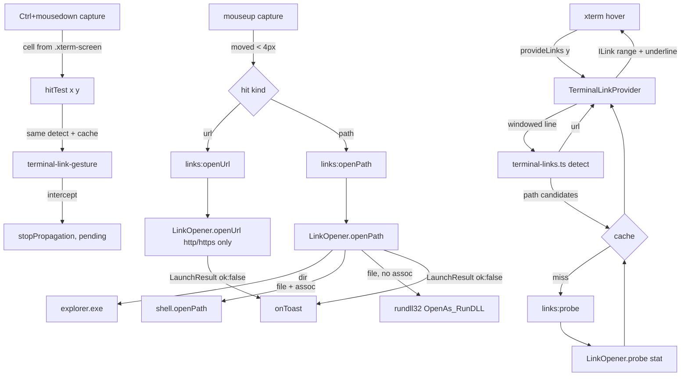

# Terminal Links Design

**Spec**: `.specs/features/terminal-links/spec.md`
**Context**: `.specs/features/terminal-links/context.md`
**Status**: Approved

---

## Architecture Overview

Approach **B** (owner-confirmed 2026-09-18): xterm.js is used for what it does well — it asks a
registered `ILinkProvider` for the links on a row and underlines them on hover — and for nothing
else. Detection lives in pure renderer libs; **activation is entirely ours**, decided at the
capture-phase `mousedown`/`mouseup` on the pane container with a synchronous hit test, so a
Ctrl+click over a link never reaches xterm (no mouse report to the agent, LINK-14) and the first
click works even when the pointer never moved (LINK-19). Everything that leaves the app — a URL,
a file — is validated and launched in **main**; the renderer only ever sends text.

Two things the design deliberately does **not** do: it does not add `@xterm/addon-web-links`
(its URL regex and soft-wrap windowing are ported, MIT, ~150 lines, so the hit test and the
provider share one code path), and it does not touch xterm private API (`_core.*`) — Orca's
linkifier priming and `mouseEventsRequireAlt` are both replaced by the capture-phase
interception the pane already uses for right-click (TCU-10..14).



---

## Code Reuse Analysis

### Existing Components to Leverage

| Component | Location | How to Use |
| --------- | -------- | ---------- |
| Capture-phase container listeners + `classifyTerminalMouse` | `src/renderer/src/components/TerminalPane.tsx:253-302` | Same pattern for the Ctrl gesture: listeners on `container` in capture, decision by a pure classifier |
| Pure classifier convention | `src/renderer/src/lib/terminal-keys.ts` | `terminal-link-gesture.ts` mirrors it: `(event, state) → action`, constants exported for tests |
| Typed IPC (`handle`, contract) | `src/main/ipc.ts`, `src/shared/ipc-contract.ts` | Three new channels under `links:*` |
| `LaunchResult` | `src/shared/shortcuts.ts` | Return type of both open channels; the toast reads `.error` |
| `spawnDetached` | `src/main/shortcut-launcher.ts:191` | Export it; `explorer.exe` and `rundll32` go through it |
| Toast plumbing | `App.tsx:66` `setToast` → `WorktreeDetail.launch` pattern | New `onToast` prop threaded App → AgentsView → TerminalPane |
| `session.cwd` | `SessionView` (`src/shared/config.ts:43`) | New `cwd` prop on TerminalPane, from `AgentsView` |
| Buffer position from a mouse event | Orca `terminal-mouse-buffer-position.ts` (public API only) | Port as `bufferPositionForMouseEvent` |
| URL regex + soft-wrap windowing + index→cell mapping | `@xterm/addon-web-links@0.12.0` `WebLinksAddon.ts:21`, `WebLinkProvider.ts:112-198` (MIT) | Port into `terminal-links.ts` / `terminal-buffer-lines.ts` with attribution |
| Path regex shape | Orca `lib/terminal-links.ts:36` (itself ported from VS Code, MIT) | Simplified port: separator paths + `:line[:col]`; spaced candidates |

### Integration Points

| System | Integration Method |
| ------ | ------------------ |
| xterm 6.0.0 | `term.registerLinkProvider(provider)` (1-based `y`; `buffer.active.getLine(y-1)`); `term.options.linkHandler` with a no-op `activate` (today xterm opens OSC 8 `http` links itself on a plain click via `window.open` → `setWindowOpenHandler` → `shell.openExternal`; the no-op is what makes LINK-16 true) |
| Electron main | `shell.openExternal` (URL), `shell.openPath` (file with association), `spawn` for `explorer.exe` / `rundll32.exe` / `cmd.exe /c assoc` |
| Renderer ↔ main | `links:probe`, `links:openUrl`, `links:openPath` on the typed contract |

---

## Components

### `terminal-links.ts` — detection (pure)

- **Purpose**: Turn one logical line of text into link candidates with string ranges.
- **Location**: `src/renderer/src/lib/terminal-links.ts` (+ `.test.ts`)
- **Interfaces**:
  - `URL_REGEX: RegExp` — ported from addon-web-links (`strictUrlRegex`), plus its `isUrl()` guard
  - `detectLinkCandidates(lineText: string): LinkCandidate[]` — URLs first (they claim their range), then path candidates outside URL ranges; sorted by `start`; at most `MAX_CANDIDATES_PER_LINE = 32`
  - `parsePathSuffix(text): { pathText, line, col }` — strips `:12` / `:12:3`
- **Dependencies**: none
- **Reuses**: addon regex; Orca's path regex shape
- **Rules** (LINK-06/08/23): a path candidate needs ≥1 separator and starts at `X:\`, `\`, `/`,
  `./`, `../`, `~/` or a word; a spaced candidate is produced only when the text from a path
  start contains whitespace and ends in an extension-terminated token; it carries
  `alternatives` (every extension-terminated prefix, longest first) so the provider can probe
  them in order and keep the longest that exists.

### `terminal-buffer-lines.ts` — buffer geometry (pure over an interface)

- **Purpose**: Join soft-wrapped rows into one string and map string indexes back to cells.
- **Location**: `src/renderer/src/lib/terminal-buffer-lines.ts` (+ `.test.ts` with fake lines)
- **Interfaces**:
  - `type BufferLike = { getLine(y0: number): BufferLineLike | undefined; getNullCell(): CellLike }` — the subset of `IBuffer` used, so tests pass fakes
  - `windowedLine(buffer, y0): { text: string; topRow: number; fingerprint: string }` — port of `_getWindowedLineStrings` (stops at whitespace / 2048 chars); `fingerprint` = the joined rows' text, used for LINK-25
  - `rangeForStringSpan(buffer, topRow, start, end): IBufferRange | null` — port of `_mapStrIdx`, 1-based output
  - `rangeContains(range, x1, y1, cols): boolean`
  - `bufferPositionForMouseEvent(term, event): { x: number; y: number } | null` — Orca's `.xterm-screen` geometry, 1-based
- **Dependencies**: xterm types only
- **Reuses**: addon-web-links windowing (MIT)

### `terminal-link-gesture.ts` — gesture classifier (pure)

- **Purpose**: Decide, without DOM, whether a mouse event starts/completes a link gesture.
- **Location**: `src/renderer/src/lib/terminal-link-gesture.ts` (+ `.test.ts`)
- **Interfaces**:
  - `DRAG_THRESHOLD_PX = 4`
  - `linkGestureOnMouseDown(event: LinkMouseEvent, hit: LinkHit | null): 'intercept' | 'pass'` — intercept iff `button === 0 && ctrlKey && !altKey && !shiftKey && !metaKey && hit !== null` (LINK-14/15/16/17)
  - `linkGestureOnMouseUp(pending: { x, y }, event): 'open' | 'ignore'` — open iff `hypot(dx, dy) < DRAG_THRESHOLD_PX` (LINK-17/30)
- **Dependencies**: none
- **Reuses**: `terminal-keys.ts` shape

### `terminal-link-provider.ts` — provider + hit test (pure over deps)

- **Purpose**: The one place that knows a row's links: serves xterm's `provideLinks` and the
  pane's synchronous `hitTest`.
- **Location**: `src/renderer/src/lib/terminal-link-provider.ts` (+ `.test.ts` with fake buffer and fake probe)
- **Interfaces**:
  - `createTerminalLinkProvider(deps): TerminalLinkProvider`
  - `deps = { buffer: BufferLike; getCols(): number; probe(paths: string[]): Promise<ProbeResult[]>; onActivate?: never }`
  - `provideLinks(y1: number, cb: (links: ILink[] | undefined) => void): void` — windowed line → candidates → URL links now; path candidates: cached → immediate, uncached → one batched `probe` per row; on settle, recompute the fingerprint and `cb(undefined)` if it changed (LINK-25); links carry `decorations: { underline: true, pointerCursor: true }` and a no-op `activate` (xterm never opens anything)
  - `hitTest(x1: number, y1: number): LinkHit | null` — synchronous: windowed line → candidates → the one whose range contains the cell → `{ kind: 'url', url }` | `{ kind: 'path', pathText, state: 'file' | 'dir' }` | `{ kind: 'path', pathText, state: 'unprobed', settled: Promise<KnownLinkHit | null> }` (kicks off the probe; `settled` carries the existing hit, which for a spaced path may be an alternative). A cached `'missing'` yields `null` (LINK-07)
  - `dispose()` — clears the cache (LINK-27)
- **Cache**: `Map<string, ProbeResult>` keyed by `pathText` as written (main resolves against the
  session cwd, which is constant for the pane), per provider instance (LINK-26)
- **Dependencies**: `terminal-links.ts`, `terminal-buffer-lines.ts`
- **Reuses**: —

### `TerminalPane.tsx` — wiring (hand-verified)

- **Purpose**: Mount the provider, own the gesture state, call IPC, surface toasts.
- **Location**: `src/renderer/src/components/TerminalPane.tsx`
- **New props**: `cwd: string`, `onToast: (message: string) => void`
- **Wiring** (inside the existing `useEffect`, disposed in its cleanup):
  1. `const links = createTerminalLinkProvider({ buffer: activeBufferOf(term), getCols: () => term.cols, probe: (paths) => api.invoke('links:probe', { cwd, paths }) })`; `term.registerLinkProvider(links)` — `activeBufferOf` (amendment 2026-09-19) resolves `term.buffer.active` on every `getLine`/`getNullCell`; the first delivery passed `term.buffer.active` itself, a getter evaluated once, and a TUI in the alternate screen left the provider reading the empty normal buffer (LINK-32)
  2. `term.options.linkHandler = { allowNonHttpProtocols: true, activate: () => {}, hover: (_e, text, range) => { osc = { text, range } }, leave: () => { osc = null } }` — the option is all-or-nothing in 6.0.0, so every OSC 8 target is provided (hover underline + pointer) and the **pane** decides what opens (amendment 2026-09-19; LINK-21 reinstated, LINK-22 amended)
  3. `onLinkMouseDown` (capture): `pos = bufferPositionForMouseEvent(term, e)`; `hit = osc && rangeContains(osc.range, pos) ? hitForOscTarget(osc.text) : links.hitTest(pos)` where `hitForOscTarget` (pure, `terminal-link-provider.ts`) yields `{ kind: 'url', url }` for `http(s)`, `{ kind: 'fileUrl', url }` for `file`, `null` otherwise (pass-through, LINK-22); if `linkGestureOnMouseDown(e, hit) === 'intercept'` → `preventDefault`, `stopPropagation`, `pending = { x, y, hit }`
  4. `onLinkMouseUp` (capture): if no `pending` → return; `stopPropagation`; if `'open'` → `activate(pending.hit)`; `pending = null`
  5. `activate(hit)`: url → `api.invoke('links:openUrl', { url })`; fileUrl → `api.invoke('links:openFileUrl', { url })`; path → `state === 'unprobed' ? await hit.settled : state` → `'missing'` → nothing; else `api.invoke('links:openPath', { cwd, pathText })`; any `{ ok: false, error }` or rejection → `onToast(error)` (LINK-05/13/24)
  6. `window` `blur` → `pending = null` (LINK-18)
- **Ordering**: the new listeners are separate capture listeners on the same `container`;
  `onRightMouseDown` keeps running (it returns early for button 0 after forgetting the
  remembered selection — TCU-26 — which is harmless for a link click). `stopPropagation`, not
  `stopImmediatePropagation`, so nothing on the container is skipped

### `AgentsView.tsx` / `App.tsx` — plumbing

- `AgentsView` gains `onToast: (message: string) => void`; passes `cwd={session.cwd}` and
  `onToast={onToast}` to `TerminalPane`; `App` passes `setToast`.

### `LinkOpener` — main-side probe and launch (unit-tested with fakes)

- **Purpose**: Resolve, stat and open link targets; the only place that validates schemes and
  touches the OS.
- **Location**: `src/main/link-opener.ts` (+ `.test.ts`)
- **Interfaces**:
  - `constructor(deps: LinkOpenerDeps)` where
    `LinkOpenerDeps = { stat(path): Promise<{ isDirectory(): boolean }>; openPath(path): Promise<string>; openExternal(url): Promise<void>; spawnDetached(cmd, args): Promise<boolean>; hasAssociation(ext): Promise<boolean>; homedir(): string }` — production values: `fs.promises.stat`, `shell.openPath`, `shell.openExternal`, the exported `spawnDetached`, `assoc` via `execFile('cmd.exe', ['/c', 'assoc', ext])` (exit 0 = associated), `os.homedir`
  - `resolveCandidate(cwd, pathText): string | null` — `~/` → homedir; `path.win32.resolve(cwd, pathText)`; `null` unless `path.win32.isAbsolute` (LINK-12/29)
  - `probe(cwd, paths: string[]): Promise<ProbeResult[]>` — `{ pathText, absolutePath, kind: 'file' | 'dir' | 'missing' }`; stat errors and unresolvable paths → `'missing'`; caps the batch at 32
  - `openUrl(url): Promise<LaunchResult>` — `new URL`; protocol ∈ {`http:`, `https:`} else `{ ok: false, error: "Only http and https links open here — <url>" }`; `openExternal` rejection → `{ ok: false, error }` (LINK-04/05)
  - `openPath(cwd, pathText): Promise<LaunchResult>` — resolve → stat (`missing` → `"<path> no longer exists"`); dir → `spawnDetached('explorer.exe', [abs])` (LINK-11); file → `hasAssociation(ext)` ? `openPath(abs)` (non-empty string → chooser) : chooser; chooser = `spawnDetached('rundll32.exe', ['shell32.dll,OpenAs_RunDLL', abs])` (LINK-09/10); spawn `false` → `{ ok: false, error: "Couldn't open <path>" }` (LINK-13)
  - `openFileUrl(url): Promise<LaunchResult>` (amendment 2026-09-19, LINK-21) — `new URL`; protocol must be `file:` and host empty or `localhost` (else `{ ok: false, error: "Only local file links open here — <url>" }`); `fileURLToPath` after dropping hash/search — a URL that parses but has no local drive path (`file:////server/share/…`, `file:///tmp/…`) makes it throw and gets the same refusal (F3, 2026-09-24) — then the `openPath` body on the absolute path (stat, dir/file/chooser). The `#L10C5` / `:line:col` forms are dropped like LINK-09 does
- **Dependencies**: `path`, `fs`, `os`, `child_process`, `url`, Electron `shell` (injected)
- **Reuses**: `spawnDetached`, `LaunchResult`

### IPC contract additions

- **Location**: `src/shared/ipc-contract.ts`, types in `src/shared/links.ts`
- `'links:probe': { req: { cwd: string; paths: string[] }; res: ProbeResult[] }`
- `'links:openUrl': { req: { url: string }; res: LaunchResult }`
- `'links:openPath': { req: { cwd: string; pathText: string }; res: LaunchResult }`
- `'links:openFileUrl': { req: { url: string }; res: LaunchResult }` (amendment 2026-09-19)
- Registered in `src/main/index.ts` next to `shortcuts:launch`.

### `terminal-env.ts` — `FORCE_HYPERLINK` (amendment 2026-09-19, LINK-33)

- `PTY_ENV_FORCED` gains `FORCE_HYPERLINK: '1'`. Claude Code's binary inlines the
  `supports-hyperlinks` check and tests this variable **before** `TERM_PROGRAM`, so the
  CSI-u reason for leaving `TERM_PROGRAM` unclaimed is untouched. With it set, every path in a
  tool header and every markdown link is an OSC 8 hyperlink (`file:///C:/…`, `https://…`),
  and the markdown link text is `blueBright`; xterm draws its dashed underline on those cells.
  This — not a link provider — is what produces the look the owner saw in Orca, which forces
  the same variable.

---

## Data Models

```typescript
// src/shared/links.ts
export type PathKind = 'file' | 'dir' | 'missing'
export interface ProbeResult {
  /** The candidate exactly as it appeared in the terminal (cache key). */
  pathText: string
  absolutePath: string | null
  kind: PathKind
}

// src/renderer/src/lib/terminal-links.ts
export type LinkCandidate =
  | { kind: 'url'; text: string; start: number; end: number }
  | {
      kind: 'path'
      text: string          // display text incl. :line:col
      pathText: string      // without the suffix
      line: number | null
      col: number | null
      start: number
      end: number
      /** Spaced paths only: extension-terminated prefixes, longest first. */
      alternatives?: { pathText: string; end: number }[]
    }

// src/renderer/src/lib/terminal-link-provider.ts
export type LinkHit =
  | { kind: 'url'; url: string }
  | { kind: 'path'; pathText: string; state: 'file' | 'dir' }
  | { kind: 'path'; pathText: string; state: 'unprobed'; settled: Promise<KnownLinkHit | null> }
// `settled` resolves to the hit that exists (for a spaced path that may be an alternative, not the
// primary text), or null — so the pane can open it without re-deriving the text.
```

---

## Error Handling Strategy

| Error Scenario | Handling | User Impact |
| -------------- | -------- | ----------- |
| URL scheme not http/https reaches main | `openUrl` returns `{ ok: false }`; never calls `openExternal` | Toast "Only http and https links open here — …" (renderer never sends one; defense in depth) |
| `shell.openExternal` rejects | caught → `{ ok: false, error }` | Toast with the URL |
| Probe IPC rejects / stat throws | provider treats the row's candidates as `'missing'`, no throw | No underline; Ctrl+click passes through next time |
| Row changed while probing | fingerprint mismatch → `cb(undefined)`, cache still filled | No stale underline |
| Path vanished between hover and click | `openPath` stats again → `"… no longer exists"` | Toast |
| File with no association (Win11 `openPath` no-ops, electron#36605) | `assoc` says none → `rundll32 OpenAs_RunDLL` directly | Windows "Open with" chooser |
| `openPath` returns an error string on an associated file | fall back to the chooser | Chooser |
| `explorer.exe` / `rundll32` spawn fails | `{ ok: false, error: "Couldn't open <path>" }` | Toast |
| Unprobed candidate at Ctrl+mousedown turns out missing | click already swallowed; nothing opens; result cached | One swallowed Ctrl+click (owner-accepted) |

---

## Risks & Concerns

| Concern | Location (file:line) | Impact | Mitigation |
| ------- | -------------------- | ------ | ---------- |
| `TerminalPane.tsx` is the single wiring file for every terminal feature (326 lines; upstream PR #95 adds ~215 more) | `src/renderer/src/components/TerminalPane.tsx:79-323` | Merge conflicts; the hand-verified surface keeps growing | Keep the pane additions to listener registration + `activate()`; all logic in the four libs. Rebase on `main` if #95 lands first |
| xterm opens OSC 8 `http` links on a plain click today (default handler → `window.open`) | `src/main/index.ts:132` `setWindowOpenHandler` | Plain click on an OSC 8 link already leaves the app — undiscovered because no agent emits OSC 8 | The no-op `linkHandler.activate` closes it (LINK-16) |
| `shell.openPath` silently no-ops for unassociated files on Windows 11 | electron#36605 (closed, not planned) | The "Open with" chooser would never appear if we relied on it | Explicit `assoc` pre-check + `rundll32 shell32.dll,OpenAs_RunDLL`. **Verify on this machine at implementation** (the chooser command is well-known but not measured here yet) |
| Owner-accepted: executables open through their OS association | `LinkOpener.openPath` | A Ctrl+click on a `.ps1`/`.cmd` the agent printed runs it | Recorded as AD-041 (below) so the posture is explicit and revisitable; a block list is a one-line follow-up in `openPath` |
| Hit-test geometry assumes uniform cell size | `bufferPositionForMouseEvent` | Off-by-one column at fractional DPI scales | Same assumption Orca ships; xterm sizes `.xterm-screen` to `cols × cellWidth`, so the division is exact at integer device pixels |
| Existence probes on busy TUI rows (a `git status` listing has dozens of paths) | provider `provideLinks` | IPC payload and stat storm on every hover | One batched probe per row, `MAX_CANDIDATES_PER_LINE = 32`, per-pane cache; probes only on hover, never on output |
| `cmd.exe /c assoc` spawn on every file click | `LinkOpener.openPath` | ~50 ms before the app opens | Accepted; no cache (associations change) |
| Soft-wrap windowing stops at whitespace (addon rule) | `windowedLine` | A spaced path broken across rows is not joined | Documented; matches upstream addon behavior |
| Renderer components carry no unit tests (convention) | `TerminalPane.tsx` | The gesture wiring is verified only by hand | Every decision is in a pure lib with tests; the pane is a thin adapter; smoke list in `validation.md` |
| L-005: real-process tests near the timeout ceiling | `src/main/*.test.ts` | A real `cmd.exe`/`rundll32` test could push the suite over | `LinkOpener` tests use injected fakes only; no real spawn |

---

## Tech Decisions (only non-obvious ones)

| Decision | Choice | Rationale |
| -------- | ------ | --------- |
| Port addon-web-links instead of depending on it | Copy `strictUrlRegex`, `isUrl`, windowing and index mapping (MIT, attributed) | The hit test needs the same detection synchronously; the addon is opaque and its `activate` is click-unconditional |
| No xterm private API | Public `.xterm-screen` geometry + own gesture | Orca's `_core.linkifier` priming and `mouseEventsRequireAlt` are 6.1-era; 6.0.0 stays (spec Out of Scope) |
| Path resolution in main, not the renderer | `path.win32.resolve` + `os.homedir` in `LinkOpener` | The renderer has no Node; a hand-rolled Windows resolver is more code than the IPC round-trip it would save. Cache keyed by the text as written, since `cwd` is constant per pane |
| Probe on hover only | `provideLinks` triggers probes; output never does | Bounded by what the user points at |
| `linkHandler.activate` is a no-op | All activation via the capture gesture | One code path for URL, path and OSC 8; plain click can never open (LINK-16) |
| ~~OSC 8 scheme filter left to xterm~~ **Reversed 2026-09-19:** every OSC 8 scheme is provided, the pane filters | `allowNonHttpProtocols: true` + `hitForOscTarget` | Claude Code emits `file://` OSC 8 for every path once `FORCE_HYPERLINK` is set (LINK-33); the all-or-nothing gate costs only a hover underline on schemes that already carry xterm's dashed one. LINK-21 reinstated, LINK-22 narrowed to opening |
| The provider follows `term.buffer.active` per call | `activeBufferOf(term)` | A TUI's alternate screen (`?1049h`) swaps the active buffer after the pane is created; capturing the getter's value once blinded hover and Ctrl+click in every Claude Code session (LINK-32, found 2026-09-19) |
| `FORCE_HYPERLINK=1` in the PTY env | `PTY_ENV_FORCED` | The `supports-hyperlinks` convention; checked before `TERM_PROGRAM` by Claude Code, so LINK-33 does not reopen the CSI-u finding (INPUT-12) |
| Chooser via `rundll32 shell32.dll,OpenAs_RunDLL` after an `assoc` check | explicit, not `shell.openPath` | electron#36605 |
| Unprobed candidate at Ctrl+mousedown is intercepted | swallow-once | First-click reliability (LINK-19) beats one lost Ctrl+click on prose |

> **Project-level decision to append on approval — AD-041:** *Terminal file links open through the
> Windows file association with no executable block list.* Owner decision 2026-09-18 with the risk
> stated; Orca behaves the same. A block list, if ever wanted, is a single guard in
> `LinkOpener.openPath`.

> **Project-level decisions appended with the 2026-09-19 amendment — AD-042, AD-043:** every
> agent session runs with `FORCE_HYPERLINK=1` (the app claims hyperlink support for the whole
> PTY, not per agent), and OSC 8 `file://` targets open through the same file rules as a
> printed path, with every other non-http scheme left to the agent. See `.specs/STATE.md`.
