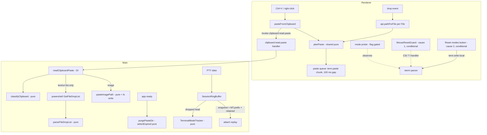

# Terminal Scroll & Paste Design

**Spec**: `.specs/features/terminal-scroll-paste/spec.md`
**Status**: Draft

---

## Verdict

Three independent tracks share one pane:

1. **Diagnose, then fix the dead scroll.**
   - A flag-gated probe logs every DEC private mode change the pane parses (TSP-01..05).
   - Replay always restores the modes the ring buffer trimmed. This is cause 3, fixed unconditionally (TSP-06..11).
   - ~~Exactly one of two conditional fixes follows the probe's verdict: a deferred-reset guard for cause 1 (TSP-29..32) or a local reset button for cause 2 (TSP-33..34).~~
   - **Withdrawn 2026-09-17.** The owner UAT answered Q2 as **cause 3 only**, so neither
     conditional fix was built: TSP-29..34 are `Withdrawn` and every section below marked
     *conditional* describes a design that was never implemented. Kept as the record of what
     would be built if the dead scroll returns and the probe names cause 1 or cause 2.
2. **Rich paste.**
   - Main reads the clipboard: text, then files, then image.
   - Main writes images to a temp PNG.
   - Main answers with a `ClipboardPaste` value.
   - A shared pure planner turns that value into quoted paste chunks, which the pane sends 100 ms apart (TSP-12..24).
3. **Drop.** The preload exposes `webUtils.getPathForFile`. Dropped paths go through the same planner and queue as Ctrl+V (TSP-25..28).

Everything with a decision in it is a pure seam with unit tests. The Electron shells (`clipboard`,
`powershell.exe`, `fs`, `webUtils`, xterm wiring) stay thin and are hand-verified, per TESTING.md.

---

## Verified Facts This Design Stands On

| Fact | Evidence |
| ---- | -------- |
| The pane never handles wheel events or mouse modes; its only mouse listener is a right-button capture on `mousedown` | `src/renderer/src/components/TerminalPane.tsx:246-301` |
| Ctrl+V is classified `paste` and reads only `navigator.clipboard.readText()` | `src/renderer/src/lib/terminal-keys.ts:112`, `TerminalPane.tsx:188-195` |
| Right-click paste reads only `readText()` and skips an empty clipboard (TCU-18) | `TerminalPane.tsx:287-295` |
| Alt+V never reaches the classifier's `paste` branch (it requires `ctrl`); xterm encodes Alt+letter as `ESC` + letter on non-mac | `terminal-keys.ts:112`; `node_modules/@xterm/xterm/src/common/input/Keyboard.ts:325-337` |
| The ring buffer trims the oldest content by lines, then by bytes (advancing to the next `\n`); `snapshot()` returns the retained string verbatim | `src/main/session-ring-buffer.ts:34-77` |
| `attach` replays `buffer.snapshot()` as one `session:data` chunk into a freshly constructed `Terminal` | `src/main/session-manager.ts:210-214`, `TerminalPane.tsx:108`, `:200-206` |
| The retained buffer also backs the stopped-card 2-line preview via `tail(2)` | `session-manager.ts:367` |
| xterm 6 exposes `term.parser.registerCsiHandler({prefix, final}, cb)`: return `true` = handled, `false` = fall through to earlier handlers (the built-in one); the newest handler runs first | `node_modules/@xterm/xterm/typings/xterm.d.ts:1805-1817` |
| xterm 6 exposes `term.modes.mouseTrackingMode` (`none/x10/vt200/drag/any`), `bracketedPasteMode`, `sendFocusMode` | `xterm.d.ts:1919-1944` |
| Electron 39.8.10: `clipboard.availableFormats()`, `clipboard.readImage()`, `webUtils.getPathForFile(file)` exist | `node_modules/electron/electron.d.ts:6804`, `:6859`, `:18754`; `node_modules/electron/package.json:3` |
| Explorer file copy shows `text/uri-list`; `readBuffer('FileNameW')` returns only the first file | Research run on Electron 39.8.10 in this conversation |
| The window runs with `sandbox: false` and a preload, so `webUtils` is reachable from the preload | `src/main/index.ts:126-129` |
| The IPC contract is the single typed channel map; the preload bridge is an untyped pass-through typed by `RendererApi` | `src/shared/ipc-contract.ts:27`, `:167-176`; `src/preload/index.ts:9-20` |
| `src/renderer/src/lib/*.ts` is unit-tested by convention; vitest includes `src/**/*.test.ts` | `vitest.config.ts:5`; existing `terminal-keys.test.ts` |

---

## Architecture Overview



---

## Code Reuse Analysis

### Existing Components to Leverage

| Component | Location | How to Use |
| --------- | -------- | ---------- |
| `classifyTerminalKey` | `src/renderer/src/lib/terminal-keys.ts:94-115` | Unchanged; its `paste` action now calls `pasteFromClipboard`. A new test pins Alt+V → `pass` (TSP-17) |
| `classifyTerminalMouse` / `selectionForRightClick` | `terminal-keys.ts:155-186` | Unchanged; the paste branch swaps `readText` for `pasteFromClipboard` (TSP-20, TCU-27 preserved) |
| "Copiado" chip + `COPIED_FEEDBACK_MS` | `TerminalPane.tsx:94-106`, `terminal-keys.ts:30` | Same element, second text "Não foi possível colar" for TSP-16 |
| `SessionRingBuffer` | `src/main/session-ring-buffer.ts` | Grows a composed `TerminalModeTracker`; public API unchanged, `snapshot()` gains the prefix |
| Typed `handle()` + `IpcContract` | `src/main/ipc.ts`, `src/shared/ipc-contract.ts` | New `clipboard:read-paste` request/response channel |
| Preload bridge | `src/preload/index.ts` | Adds `pathForFile` next to `invoke`/`on`/`send` |
| DI + hand-rolled fakes | TESTING.md pattern 3 (`task-board.test.ts`) | `readClipboardPaste(deps)` takes a clipboard port, a file-list runner and a writer |
| Real temp-dir tests | TESTING.md pattern 2 (`config-store.test.ts`) | `purgePasteDir` exercised against a `mkdtempSync` dir with `utimesSync` ages |
| `execFile` + promisify pattern | `src/main/index.ts:41`, `:63` | The shell side of the file-list runner (`powershell.exe`, `windowsHide`, 5 s `timeout`) |

### Integration Points

| System | Integration Method |
| ------ | ------------------ |
| OS clipboard | Electron `clipboard` in main only (renderer `clipboard` is deprecated from Electron 40) |
| Explorer file list | `powershell.exe -NoProfile -STA -Command` with `[Console]::OutputEncoding=[Text.Encoding]::UTF8; Add-Type -AssemblyName System.Windows.Forms; [System.Windows.Forms.Clipboard]::GetFileDropList()` |
| Temp storage | `join(os.tmpdir(), 'playground-paste')`, created on first write |
| xterm parser | `registerCsiHandler({ prefix: '?', final: 'h' / 'l' })` returning `false` (probe observes and never consumes); the guard returns `true` only for deferred params |

---

## Components

### `paste-plan` (shared, pure)

- **Purpose**: Turn a clipboard or drop result into the exact list of strings to `term.paste`.
- **Location**: `src/shared/paste.ts`
- **Interfaces**:
  - `type ClipboardPaste = { kind: 'text'; text: string } | { kind: 'paths'; paths: string[] } | { kind: 'empty' } | { kind: 'error'; message: string }`
  - `quotePath(path: string): string`: returns `"<path>"` (TSP-21)
  - `planPaste(paste: ClipboardPaste): string[]`: text becomes `[text]`, paths become the quoted paths with empty ones skipped, `empty` and `error` become `[]` (TSP-12, 15, 21, 27, 34)
  - `PASTE_GAP_MS = 100` (TSP-22)
- **Dependencies**: none
- **Reuses**: n/a

### `clipboard-reader` (main, DI)

- **Purpose**: Decide what the clipboard holds and produce a `ClipboardPaste`.
- **Location**: `src/main/clipboard-reader.ts`
- **Interfaces**:
  - `classifyClipboard(s: { text: string; formats: string[]; imageEmpty: boolean }): 'text' | 'files' | 'image' | 'empty'`: precedence text (non-empty) > files (`text/uri-list` in formats) > image (`!imageEmpty`) > empty (TSP-12, 13, 14, 15)
  - `parseFileDropList(stdout: string): string[]`: split on CRLF/LF, trim, drop blanks (TSP-36, 37)
  - `pasteImageName(now: Date, rand: string): string`: `paste-yyyyMMdd-HHmmss-<rand>.png` (TSP-14, 35)
  - `readClipboardPaste(deps: ClipboardReaderDeps): Promise<ClipboardPaste>`: runs the classifier, then the file-list runner or the PNG writer; any thrown error or timeout becomes `{ kind: 'error' }` (TSP-16)
  - `interface ClipboardReaderDeps { readText(): string; formats(): string[]; readImagePng(): Buffer | null; readFileDropList(): Promise<string>; writeFile(path: string, data: Buffer): Promise<void>; pasteDir: string; now(): Date; rand(): string }`
- **Dependencies**: none at module level; Electron and `child_process` are injected from `index.ts`
- **Reuses**: DI pattern from `TaskBoard`

### `paste-temp` (main)

- **Purpose**: Purge old pasted images at startup.
- **Location**: `src/main/paste-temp.ts`
- **Interfaces**:
  - `PASTE_MAX_AGE_MS = 7 * 24 * 60 * 60 * 1000`
  - `selectExpired(entries: { name: string; mtimeMs: number }[], nowMs: number, maxAgeMs: number): string[]`: strictly older than `maxAgeMs` (TSP-18, 36)
  - `purgePasteDir(dir: string, nowMs: number): void`: missing dir is a no-op, and each `rmSync` failure is swallowed and the loop continues (TSP-19)
- **Dependencies**: `node:fs`
- **Reuses**: real-temp-dir test pattern

### `TerminalModeTracker` (main, pure)

- **Purpose**: Fold DEC private mode transitions from a byte stream into a mode state and encode that state as a prefix.
- **Location**: `src/main/terminal-mode-tracker.ts`
- **Interfaces**:
  - `feed(text: string): void`: scans for `ESC [ ? <params> h|l`, carrying an incomplete trailing sequence across calls (TSP-06, 09)
  - `prefix(): string`: `ESC[?<n>h`/`l` for each tracked mode that differs from a fresh xterm, in the order alt-screen, tracking, encoding, focus, bracketed paste, cursor (TSP-07, 08)
- **State**: `{ alt: boolean; tracking: 0 | 9 | 1000 | 1002 | 1003; encoding: 0 | 1005 | 1006 | 1015 | 1016; focus: boolean; bracketedPaste: boolean; cursorVisible: boolean }`
- **Dependencies**: none
- **Reuses**: n/a

### `SessionRingBuffer` (grown)

- **Purpose**: Unchanged caps and trimming. Everything trimmed is fed to a private tracker, and the tracker's prefix is prepended in `snapshot()` (TSP-06, 07, 10, 11).
- **Location**: `src/main/session-ring-buffer.ts` (modify)
- **Interfaces**: `append`, `snapshot`, `tail` keep their signatures. `#trimToLines`/`#trimToBytes` pass the dropped head to the tracker. `tail()` reads only the retained string.
- **Dependencies**: `TerminalModeTracker`
- **Reuses**: existing trim logic

### `terminal-modes` (renderer lib, pure)

- **Purpose**: Mode names for the probe, the cause-1 guard state machine and the cause-2 reset sequence.
- **Location**: `src/renderer/src/lib/terminal-modes.ts`
- **Interfaces**:
  - `modeName(param: number): string` (TSP-05)
  - `formatModeLog(e: { sessionId: string; final: 'h' | 'l'; params: number[]; tracking: string; buffer: string }): string` (TSP-01)
  - `isProbeEnabled(read: () => string | null): boolean` (TSP-04)
  - *(conditional, cause 1)* `class MouseResetGuard { onReset(params: number[], altActive: boolean): { consume: boolean; passThrough: number[] }; onAltExit(): number[] }` (TSP-29..32)
  - *(conditional, cause 2)* `MODE_RESET_SEQUENCE: string` (TSP-33)
- **Dependencies**: none
- **Reuses**: the `terminal-keys.ts` convention that every value an AC constrains lives in the tested lib

### Main wiring (`index.ts`)

- **Purpose**: Register `clipboard:read-paste` with real deps (`clipboard`, `execFile('powershell.exe', …, { timeout: 5000, windowsHide: true })`, `fs/promises.writeFile` after `mkdir -p`); call `purgePasteDir` once in `whenReady`, wrapped so it never throws.
- **Location**: `src/main/index.ts` (modify)

### Preload bridge

- **Purpose**: `pathForFile: (file: File) => webUtils.getPathForFile(file)` on the exposed `api`; `RendererApi` gains `pathForFile(file: File): string`.
- **Location**: `src/preload/index.ts` (modify), `src/shared/ipc-contract.ts` (type)

### `TerminalPane` (grown)

- **Purpose**:
  1. **Probe:** when `isProbeEnabled`, register two observing CSI handlers, log the Ctrl+C action, and log the replay line after the first `session:data` write callback.
  2. **`pasteFromClipboard()`:** invoke the IPC, `planPaste`, then enqueue.
  3. **Paste queue:** a promise chain with a disposed flag checked before each `term.paste` and after each gap timer, cleared on effect cleanup.
  4. **Drop:** `dragover`/`drop` listeners on the container that `preventDefault`, map `dataTransfer.files` through `api.pathForFile`, enqueue `planPaste({kind:'paths'})` and focus.
  5. **Failure chip:** reuse the copied chip element with the failure text.
  6. *(conditional)* Register the guard as a `?l` handler, or accept a `resetNonce` prop that writes `MODE_RESET_SEQUENCE`.
- **Location**: `src/renderer/src/components/TerminalPane.tsx` (modify)

### Session detail bar *(conditional, cause 2)*

- **Purpose**: A "Reset terminal modes" icon button that bumps a `resetNonce` passed to `TerminalPane`.
- **Location**: `src/renderer/src/components/AgentsView.tsx` (modify, `SessionDetail` at `:109`, bar at `:145`, pane at `:248`)

---

## Data Models

```typescript
// src/shared/paste.ts
export type ClipboardPaste =
  | { kind: 'text'; text: string }
  | { kind: 'paths'; paths: string[] }
  | { kind: 'empty' }
  | { kind: 'error'; message: string }

// src/shared/ipc-contract.ts — IpcContract
'clipboard:read-paste': { req: void; res: ClipboardPaste }

// RendererApi
pathForFile(file: File): string
```

Image pastes come back as `{ kind: 'paths', paths: [pngPath] }`, so the renderer has one path-paste code path.

---

## Error Handling Strategy

| Error Scenario | Handling | User Impact |
| -------------- | -------- | ----------- |
| `powershell.exe` fails, exits non-zero or exceeds 5 s | Runner rejects → `{ kind: 'error' }` | "Não foi possível colar" chip, nothing sent (TSP-16) |
| PNG `mkdir`/`writeFile` fails (disk full, permissions) | Caught → `{ kind: 'error' }` | Same chip (TSP-16) |
| IPC invoke rejects | Caught in pane → same as error | Same chip |
| File list contains a path that no longer exists | Pasted anyway; the agent reports it | Agent-level message |
| Dropped item has no path (browser image, text) | Skipped (TSP-27) | Nothing happens |
| Purge dir missing / file locked | Skipped, loop continues (TSP-19) | None; startup unaffected |
| Pane unmounts mid-sequence | Disposed flag stops the queue (TSP-24) | Remaining paths not sent |
| Mode sequence split across trims | Tracker carries partial bytes (TSP-09) | None |

---

## Risks & Concerns

| Concern | Location (file:line) | Impact | Mitigation |
| ------- | -------------------- | ------ | ---------- |
| The tracker only sees the **dropped head**; a sequence partially dropped and partially retained is seen incomplete by the tracker, and whole by xterm in the replay | `session-ring-buffer.ts:66-77` (cut advances to `\n`; escape sequences contain no `\n`, so a cut never splits one) | A double-applied or missed mode | The line-boundary cut guarantees the split never happens; TSP-09's carry covers the unusual case of a line-cap cut inside a CSI with no newline. Unit test pins both |
| Cause-1 guard mis-models a TUI that turns its mouse off for good while staying on the alternate screen | `terminal-modes.ts` guard (new) | Mouse stays reported to an app that no longer wants it until it leaves the alt screen | Only built if the probe confirms cause 1; opencode and Claude Code never do this; the deferred resets apply on alt-exit, so the shell is always clean |
| A mixed `CSI ? 1049;1003 l` consumed by the guard would also swallow the 1049 | guard `passThrough` | Alt screen not exited | The guard never consumes a sequence with an alt-screen param. When it consumes a mixed sequence, the non-mouse params are re-written as their own `CSI ? … l` via `term.write` (TSP-31). That write lands after the current chunk, a reorder by at most one chunk, accepted |
| Probe handlers on the hot parse path | `TerminalPane.tsx` (new) | CPU per mode change | Registered only when the flag is on at mount (TSP-04); DEC mode changes are rare compared with SGR |
| `powershell.exe` startup cost (~300 ms) on every file paste | `clipboard-reader.ts` | Visible delay | Spawned only when `text/uri-list` is present; text and image pastes never spawn it |
| Clipboard image readers on the agent side read the file the instant the path lands; the temp file must exist before `term.paste` | main writes before answering IPC | Race | `writeFile` is awaited before the IPC resolves |
| Renderer `TerminalPane.tsx` is already ~330 lines of dense handler wiring | `TerminalPane.tsx:74-326` | Harder review | Every decision lives in `terminal-keys.ts` / `terminal-modes.ts` / `paste.ts`; the pane only wires. Split pane concerns into a hook only if Execute pushes it past ~450 lines |
| Right-click paste used the renderer `navigator.clipboard.readText()`; switching to IPC changes TCU-18's mechanism | `TerminalPane.tsx:287-295` | Empty clipboard regression | `planPaste({kind:'empty'})` returns `[]`, and a unit test pins it (TSP-15) |

---

## Tech Decisions

| Decision | Choice | Rationale |
| -------- | ------ | --------- |
| Image as path, not raw key forwarding | Temp PNG + quoted path | Q14; one mechanism for both agents |
| Tracker composed inside `SessionRingBuffer` rather than in `SessionManager` | Inside the buffer | Only the buffer knows what it trims; keeps `SessionManager.attach` unchanged |
| Prefix computed from the **head** state, not the current state | Head state | Emitting current state before the retained content would, for example, enter the alt screen before content that was drawn on the normal screen, and the replay would show a blank screen |
| Image kind folded into `paths` over IPC | `{ kind: 'paths', paths: [png] }` | One renderer path; the renderer never needs to know a path came from an image |
| Probe gated by `localStorage`, not config | `localStorage` | Debug aid, per-machine, no schema change; wrapped in try/catch like any storage read |
| Conditional fixes as separate phases | Phase 6 (cause 1) / Phase 7 (cause 2) | The probe verdict withdraws one whole phase without touching the rest |

No project-level AD entry is required by this design. See the report for an optional proposal.
