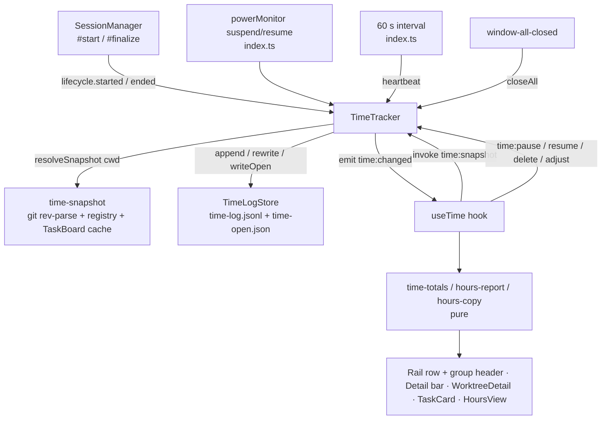

# Time Tracking Design

**Spec**: `.specs/features/time-tracking/spec.md`
**Status**: Draft — approach A recommended, awaiting owner confirmation at review

Line references are to `origin/main` (`fa78f78`), the base of `feature/time-tracking`.
`develop` carries the unmerged `session-activity-status` work, which moves some of these lines
and also edits the rail row — see Risks.

---

## Verdict

A main-process **`TimeTracker`** observes session PTY lifecycle through a new optional
`lifecycle` dependency of `SessionManager`, owns the only copy of the open/paused state, and
persists closed periods to an append-only `time-log.jsonl` plus a 60 s heartbeated
`time-open.json` sidecar. The renderer receives a snapshot (`time:snapshot`) and a change
ping (`time:changed`) and computes every total and the weekly report with **pure, unit-tested
functions** against a local `now`. No per-second IPC exists.

---

## Approaches Considered

| | A. Main tracker + closed log + open sidecar **(recommended)** | B. Renderer-driven tracking | C. Event-sourced log |
|---|---|---|---|
| Who decides open/close | `TimeTracker` in main, fed by `SessionManager` lifecycle and `powerMonitor` | Renderer, from `session:status` pushes, persisting through IPC | Main, as in A |
| Persistence | `time-log.jsonl` (one closed period per line, append) + `time-open.json` (open periods, rewritten every 60 s); delete/adjust rewrite the log atomically (tmp + rename) | Same files, written on renderer request | One append-only file of `open`/`beat`/`close`/`edit`/`delete` events, replayed on load, compacted periodically |
| Crash loss | ≤ 60 s (sidecar last-seen) | Anything since the renderer's last write; a reload or hidden window stops tracking | ≤ 60 s |
| Quit / suspend | Closed synchronously in main (`window-all-closed`, `powerMonitor`) | Renderer is already gone at quit; `powerMonitor` is main-only | As A |
| Edit cost | Rewrite of a ~1–2 MB file per edit — edits are rare | As A | Append only, but replay must resolve edit-of-edit and delete-after-edit, and compaction is a second writer |
| Growth | ~20 lines/day | As A | +1 `beat` line per session per minute (≈ 480/day per session) or no crash safety |
| Why not | — | Loses time on reload/crash and cannot see quit or suspend; duplicates lifecycle knowledge main already owns | Heartbeats bloat the log; replay semantics and compaction add a state machine for a write path (edits) that happens a few times a week |

A also matches the project's DI-orchestrator convention (`SessionManager`, `TaskBoard`,
`WorkflowManager`) and TESTING.md pattern 3.

**Totals in renderer vs main:** computed in the renderer. Live counters need `now` every
second anyway; computing in main would mean a per-second push (rejected by AD-004's
"no chatty invoke" spirit) or stale totals.

---

## Architecture Overview



### Period lifecycle (per session)

```
             started(meta)                pause()                 resume()
  (no run) ───────────────► OPEN ───────────────────► PAUSED ───────────────► OPEN
                             │  ▲                        │
                    suspend  │  │ resume (not paused)    │ ended(id)
                             ▼  │                        ▼
                          SUSPENDED ──── ended(id) ──► (no run)
  OPEN ── ended(id) / closeAll ──► (no run)      every close appends one period (≥ 1 s)
```

A run exists from `started` to `ended`. `open` is non-null only in OPEN. `paused` and
`suspended` are flags on the run; resume-from-suspend opens a period only for runs that are
not paused (TIME-21). Double `started` for the same id closes the previous open period first
(defensive; `respawn` guards against it already, `session-manager.ts:164-167`).

---

## Code Reuse Analysis

### Existing Components to Leverage

| Component | Location | How to Use |
| --------- | -------- | ---------- |
| Atomic write (tmp + rename) | `src/main/config-store.ts:66-77`, `src/main/workflow-run-store.ts` | Same discipline for `rewrite` and `writeOpen` |
| Corrupt-file backup | `src/main/config-store.ts:34-50` | Same `.bak-<epoch>` rule for a corrupt `time-open.json` |
| Task id from branch | `src/shared/tasks.ts:53` `taskIdFromBranch` | Snapshot task id |
| DI orchestrator + fakes | `src/main/session-manager.ts:27-35`, `session-manager.test.ts` | `TimeTracker` deps (`clock`, `store`, `resolveSnapshot`, `emit`, `newId`) |
| Typed IPC | `src/main/ipc.ts` `handle`/`emit`; `src/shared/ipc-contract.ts:67`/`:172` | New `time:*` channels and the `time:changed` event |
| Change-ping + refetch pattern | `src/renderer/src/lib/use-sessions.ts` (`session:status` → `sessions:list`) | `useTime` refetches `time:snapshot` on `time:changed` |
| Rail grouping model | `src/renderer/src/lib/rail-groups.ts:16-55` | Group headers already know `taskId` (task group) and cwd (orphan group) |
| Transient copy confirmation | `TerminalPane.tsx` `COPIED_FEEDBACK_MS` (1 200 ms, `terminal-keys.ts`) | Same 1.2 s duration for TIME-41 |
| Workspace = `dirname(repoPath)` | AD-015, `src/main/repo-config.ts` | Lexical workspace resolution in the snapshot |

### Integration Points

| System | Integration Method |
| ------ | ------------------ |
| `SessionManager` | New optional dep `lifecycle?: SessionLifecycle` (`session-manager.ts:27-35`). `started(meta)` called at the end of `#start` after the Map insert (`:229-250`); `ended(id)` called in `#finalize` only when `wasRunning` (`:252-264`), so an explicit stop plus the later real exit reports once |
| `index.ts` app start | Construct `TimeLogStore(app.getPath('userData'))` and `TimeTracker` right after `TaskBoard` (`index.ts:215`), call `tracker.recover()` before `new SessionManager` (`:249`), pass `lifecycle: tracker` |
| `index.ts` IPC | `handle('time:snapshot' / 'time:pause' / 'time:resume' / 'time:delete' / 'time:adjust')` next to the sessions handlers (`:256`) |
| `index.ts` power + heartbeat | `powerMonitor.on('suspend' / 'resume')`; `setInterval(() => tracker.heartbeat(), 60_000).unref()`; `lock-screen`/`unlock-screen` deliberately not subscribed (TIME-08) |
| `index.ts` quit | In `window-all-closed` (`:383-386`): `sessionManager.killAll()` then `tracker.closeAll()` (synchronous writes) |
| `AppConfig.ui.direction` | Union gains `'hours'` (`src/shared/config.ts:37`) |
| TopBar | Fifth segment after Workflows (`TopBar.tsx:125-134`) |
| App routing | New `ui.direction === 'hours'` branch before the Board fallback (`App.tsx:334-357`) |
| Rail | Row counter beside the status (`SessionRail.tsx:283-285`); task-group total in the head row (`:168-182`); orphan-group total in its head row (`:191-194`) |
| Session detail bar | Counter + Pause/Resume time button in `agents-detail-bar` (`AgentsView.tsx:144-200`) |
| Worktree detail | Total beside the branch title (`WorktreeDetail.tsx:212`) |
| Pinned task card | Total in `task-card-footer` (`TasksPane.tsx:181-189`) |

---

## Components

### `src/shared/time.ts` (types)

- **Purpose**: Shared period and snapshot types for main and renderer.
- **Interfaces**: `TimePeriod`, `OpenPeriod`, `TimeSnapshot`, `PeriodSnapshotFields`, `TimeEditResult` (see Data Models).
- **Dependencies**: none. **Reuses**: —

### `src/shared/time-intervals.ts` (pure)

- **Purpose**: Interval arithmetic every total and report depends on.
- **Interfaces**:
  - `unionMs(intervals: Interval[]): number` — length of the union (TIME-25..28, TIME-34)
  - `mergeIntervals(intervals: Interval[], gapMs: number): Interval[]` — sorted, merged when overlapping or `gap ≤ gapMs` (TIME-36)
  - `clip(interval: Interval, range: Interval): Interval | null`
  - `splitAtLocalMidnight(interval: Interval): Interval[]` — local-time day pieces (TIME-37)
- `Interval = { start: number; end: number }` in epoch ms.
- **Dependencies**: none.

### `src/main/time-snapshot.ts`

- **Purpose**: Resolve the snapshot fields for a cwd at period open (TIME-03, TIME-12).
- **Interfaces**:
  - `buildSnapshot(input: { cwd; gitCommonDir: string | null; branch: string | null; workspacePaths: string[]; pinnedTitles: Map<number, string> }): PeriodSnapshotFields` — **pure**: repo = `dirname(gitCommonDir)`, repoName = its basename, workspace = `dirname(repo)` only when registered (AD-015, case-insensitive), `taskId = taskIdFromBranch(branch)`, `taskTitle = pinnedTitles.get(taskId) ?? null`; detached HEAD (`HEAD`) → branch null.
  - `readGit(cwd): { gitCommonDir: string | null; branch: string | null }` — **shell**: one `execFileSync('git', ['rev-parse', '--path-format=absolute', '--git-common-dir', '--abbrev-ref', 'HEAD'], { cwd, timeout: 2000, windowsHide: true })`; any throw → both null.
- **Dependencies**: `taskIdFromBranch`; registry list and `TaskBoard.list()` supplied by `index.ts`.
- **Why synchronous**: `SessionManager.#start` and quit are synchronous; a sync resolver keeps "period opens at spawn with its snapshot" a single atomic step. Cost ≈ one git exec per open, the same order as the PTY spawn itself.

### `src/main/time-log-store.ts`

- **Purpose**: The only file I/O for time data. Directory injected (temp dir in tests).
- **Interfaces**:
  - `readPeriods(): { periods: TimePeriod[]; skipped: number }` — skips and logs invalid lines once (TIME-13)
  - `append(period: TimePeriod): void` — `appendFileSync` one line; on failure queues it and retries the queue before the next write (TIME-14)
  - `rewrite(periods: TimePeriod[]): void` — full rewrite via tmp + rename (TIME-48)
  - `readOpen(): OpenPeriod[]` — corrupt sidecar → `.bak-<epoch>` + `[]`
  - `writeOpen(open: OpenPeriod[]): void` — tmp + rename; `[]` writes an empty array
- **Line format**: `{"v":1, ...TimePeriod}`; unknown `v` is skipped like an invalid line.
- **Reuses**: `ConfigStore` persistence and backup patterns.

### `src/main/time-tracker.ts` (DI orchestrator)

- **Purpose**: Owns runs, open periods, pause/suspend flags and every mutation of the log.
- **Interfaces**:
  - `recover(): void` — sidecar periods closed at `lastSeen`, appended, sidecar emptied (TIME-05)
  - `started(meta: { id; agent; cwd }): void` / `ended(id: string): void` — `SessionLifecycle` (TIME-01, TIME-02)
  - `pause(sessionId): void` / `resume(sessionId): void` (TIME-16, TIME-18, TIME-21)
  - `suspend(): void` / `resumeFromSuspend(): void` (TIME-06, TIME-07)
  - `heartbeat(): void` — sets `lastSeen = now` on every open period and writes the sidecar (TIME-04)
  - `closeAll(): void` (TIME-09)
  - `snapshot(): TimeSnapshot`
  - `deletePeriod(id): TimeEditResult` / `adjustPeriod(id, start, end): TimeEditResult` (TIME-44..49)
- **Rules**: close discards length < 1 s or `end < start` (TIME-11); every state change writes the sidecar and emits `time:changed`; edits validate against `now` and reject ids not in the log (stale) or ids that are open.
- **Dependencies (injected)**: `store: TimeLogStore`, `now: () => number`, `newId: () => string`, `resolveSnapshot: (cwd) => PeriodSnapshotFields`, `emit: () => void`.

### `SessionManager` (grown)

- **Purpose unchanged**. New optional dep `lifecycle?: SessionLifecycle { started(meta: PersistedSession): void; ended(id: string): void }`. Absent = today's behaviour; every existing test constructs without it.

### `index.ts` wiring (shell, hand-verified)

Construction order, IPC handlers, heartbeat interval, `powerMonitor` subscription and quit
ordering as listed in Integration Points.

### Renderer — pure libs (unit-tested, like `rail-groups.ts`)

- `src/renderer/src/lib/time-format.ts` — `formatHms(ms)` → `hh:mm:ss`; `formatHm(ms)` → `hh:mm`; `formatHmCompact(ms)` → `XhMM` (`2h28`, `0h05`); `formatDayHeader(date)` → `16/09/2026 (qua)`; all floor to the unit.
- `src/renderer/src/lib/time-totals.ts` — `intervalsOf(snapshot, now)` (open periods end at `now`); `sessionTotalMs`, `currentRunMs`, `worktreeTotalMs(cwd)`, `taskTotalMs(taskId)`; cwd comparison case-insensitive.
- `src/renderer/src/lib/hours-report.ts` — `weekRange(date)` (Monday 00:00 local → next Monday); `buildWeekReport(snapshot, now, weekStart, liveTitles)` → `WeekReport { total; days: DayReport[] }`, newest day first; `DayReport { date; totalMs; groups: GroupReport[] }`; `GroupReport { key; label; taskId; cwd; totalMs; blocks: Block[] }`; `Block { start; end; durationMs; periods: RawPeriodRow[] }`. Uses `splitAtLocalMidnight`, `mergeIntervals(…, 60_000)`, `unionMs`.
- `src/renderer/src/lib/hours-copy.ts` — `formatDayCopy(day: DayReport): string`, exact TIME-39/40 text.

### Renderer — hook and components (hand-verified)

- `use-time.ts` — `useTime()`: holds `TimeSnapshot`, refetches on `time:changed`, exposes `pause/resume/deletePeriod/adjustPeriod`; `useNow(intervalMs)` for components that tick, so App does not re-render every second.
- `SessionRail.tsx` — row `hh:mm:ss`; task-group and orphan-group `hh:mm`.
- `AgentsView.tsx` — detail-bar counter (tooltip with current run) and **Pause time / Resume time**.
- `WorktreeDetail.tsx`, `TasksPane.tsx` — `hh:mm` totals.
- `Icon.tsx` — `clock`, `pause` glyphs.
- `TopBar.tsx` — `Hours` segment.
- `HoursView.tsx` (+ `HoursView.css`) — week header, ◀ ▶ This week, days, groups, block lines, expander, per-day Copy, empty state.
- `PeriodRow.tsx` — raw period row with inline edit (two `datetime-local` inputs) and delete confirm.
- `App.tsx` — mounts `useTime`, threads snapshot to the surfaces, routes `hours`.

---

## Data Models

```typescript
/** Resolved once when a period opens (TIME-03). */
interface PeriodSnapshotFields {
  workspacePath: string | null
  repoName: string | null
  branch: string | null
  taskId: number | null
  /** Pinned task title from the TaskBoard cache at open time; null when unknown. */
  taskTitle: string | null
}

interface TimePeriod extends PeriodSnapshotFields {
  id: string          // randomUUID
  sessionId: string
  agent: string
  cwd: string
  start: string       // UTC ISO 8601
  end: string         // UTC ISO 8601
}

/** Lives in time-open.json and in the snapshot; never in the log. */
interface OpenPeriod extends Omit<TimePeriod, 'end'> {
  lastSeen: string    // UTC ISO, advanced by heartbeat
}

interface TimeSnapshot {
  periods: TimePeriod[]   // closed, from the log (after edits)
  open: OpenPeriod[]
  paused: string[]        // session ids
}

type TimeEditResult = { ok: true } | { ok: false; error: string }
```

**IPC additions** (`src/shared/ipc-contract.ts`):

| Channel | Kind | Shape |
| ------- | ---- | ----- |
| `time:snapshot` | invoke | `req: void; res: TimeSnapshot` |
| `time:pause` | invoke | `req: { sessionId: string }; res: void` |
| `time:resume` | invoke | `req: { sessionId: string }; res: void` |
| `time:delete` | invoke | `req: { id: string }; res: TimeEditResult` |
| `time:adjust` | invoke | `req: { id: string; start: string; end: string }; res: TimeEditResult` |
| `time:changed` | event | `{ at: string }` |

**File example** (`time-log.jsonl`, placeholders only):

```json
{"v":1,"id":"5f0c…","sessionId":"a1b2…","agent":"Claude","cwd":"D:\\acme\\app-12345","workspacePath":"D:\\acme","repoName":"app","branch":"feature/12345-fix-login-redirect","taskId":12345,"taskTitle":"Fix login redirect","start":"2026-09-16T12:12:00.000Z","end":"2026-09-16T14:40:00.000Z"}
```

---

## Error Handling Strategy

| Error Scenario | Handling | User Impact |
| -------------- | -------- | ----------- |
| git missing / cwd not a repo / timeout | `readGit` returns nulls (TIME-12) | Period lands under **No task · <folder>** |
| Invalid log line | Skipped, counted, logged once (TIME-13) | That period is absent; the rest load |
| Corrupt sidecar | Backed up `.bak-<epoch>`, treated as empty | At most one crash window of time lost |
| Append / rewrite / sidecar write fails | Logged; append queued and retried; in-memory state stays authoritative (TIME-14) | None until the app quits with the disk still failing |
| Edit invalid (order, future, < 1 s) | `{ ok: false, error }` (TIME-46) | Inline message under the inputs |
| Edit/delete target gone or open | `{ ok: false, error }`, renderer refetches (TIME-47, TIME-49) | Message + refreshed list |
| `powerMonitor` never fires (driver quirk) | Counting simply continues | Sleep time over-counted; correctable by adjust |
| Clipboard write rejects | `console.error`, no `Copied` confirmation | Owner retries |
| Clock moved backwards | Close with `end < start` discarded (TIME-11) | That fragment is lost |

---

## Risks & Concerns

| Concern | Location (file:line) | Impact | Mitigation |
| ------- | -------------------- | ------ | ---------- |
| RAIL-12 forbids anything on a row beyond tile, name, status, dot and actions | `.specs/features/agents-rail-v2/spec.md:126`; `SessionRail.tsx:280-299` | The row counter (TIME-22) contradicts a shipped requirement | Proposed **AD-021** amends RAIL-12 to allow the time counter; recorded before T17 |
| `session-activity-status` (on `develop`, not on `main`) rewrites the rail row and `SessionManager.#start/#finalize` | `develop:src/main/session-manager.ts`, `develop:SessionRail.tsx` | Merge conflicts when both land | Keep the `SessionManager` change to two one-line calls; row counter as its own `<span>` after the status; whoever merges second rebases |
| Sync git exec on the main thread at every period open | `time-snapshot.ts` `readGit` | A slow repo stalls the UI up to the 2 s timeout | Timeout 2 s; resume-from-suspend opens N sessions → N execs, acceptable for ≤ ~8 sessions (rail warns at 4, `SessionRail.tsx:22`) |
| `killAll` is fire-and-forget; `#finalize` runs synchronously before it awaits | `session-manager.ts:208-221`, `:138-162` | If that changed, `ended` might fire after `closeAll` | `closeAll()` runs after `killAll()` and closes whatever is still open, so ordering changes cannot lose a period; `ended` for an already-closed run is a no-op |
| Snapshot size grows forever | `time:snapshot` | ~5 000 periods/year ≈ 1.5 MB per refetch | Acceptable for v1 (retention assumption); a `from/to` filter is a later change if needed |
| Renderer unit-test convention covers only `lib/` | `.specs/codebase/TESTING.md` | Components unverified by tests | All decision logic lives in the four pure libs; components only render; smoke script T26 |
| Local-time tests depend on the runner's TZ/DST | `hours-report.test.ts` | Flaky day splits around DST | Tests build dates with the local `Date(y, m, d, h, mi)` constructor and avoid DST dates |

---

## Tech Decisions

| Decision | Choice | Rationale |
| -------- | ------ | --------- |
| Snapshot vs derived attribution | Snapshot stored per period; `deriveAttribution` not used for totals | History must survive worktree removal and branch renames (Q8); the rail's derived link is for live state only |
| Where open state lives | Main only; renderer holds a read snapshot | Quit and suspend are main events; one writer |
| Heartbeat target | Sidecar rewrite, not log append | Keeps the log to closed periods only |
| Adjacent-merge gap | 60 s | Equal to the heartbeat, absorbs a pause/resume click; real breaks stay separate |
| Copy language | pt-BR date/weekday in the copied text only; UI strings English | Owner-selected preview; app UI is English |
| Pause surface | Detail bar only, not the rail row | RAIL-12 row actions stay stop/respawn/remove; fewer amendments |
| Time source | `Date.now()` injected as `now` | Deterministic tests without fake timers (TESTING.md pattern 3) |

### Proposed project decisions (for `.specs/STATE.md`, recorded at approval)

- **AD-021** — Agent-session time tracking is owned by a main-process `TimeTracker` fed by a `SessionManager` lifecycle observer and `powerMonitor`; closed periods live in `userData/time-log.jsonl`, open ones in a 60 s heartbeated `time-open.json`; renderer totals are pure functions over a snapshot. Amends **RAIL-12** to allow a time counter on the session row.
